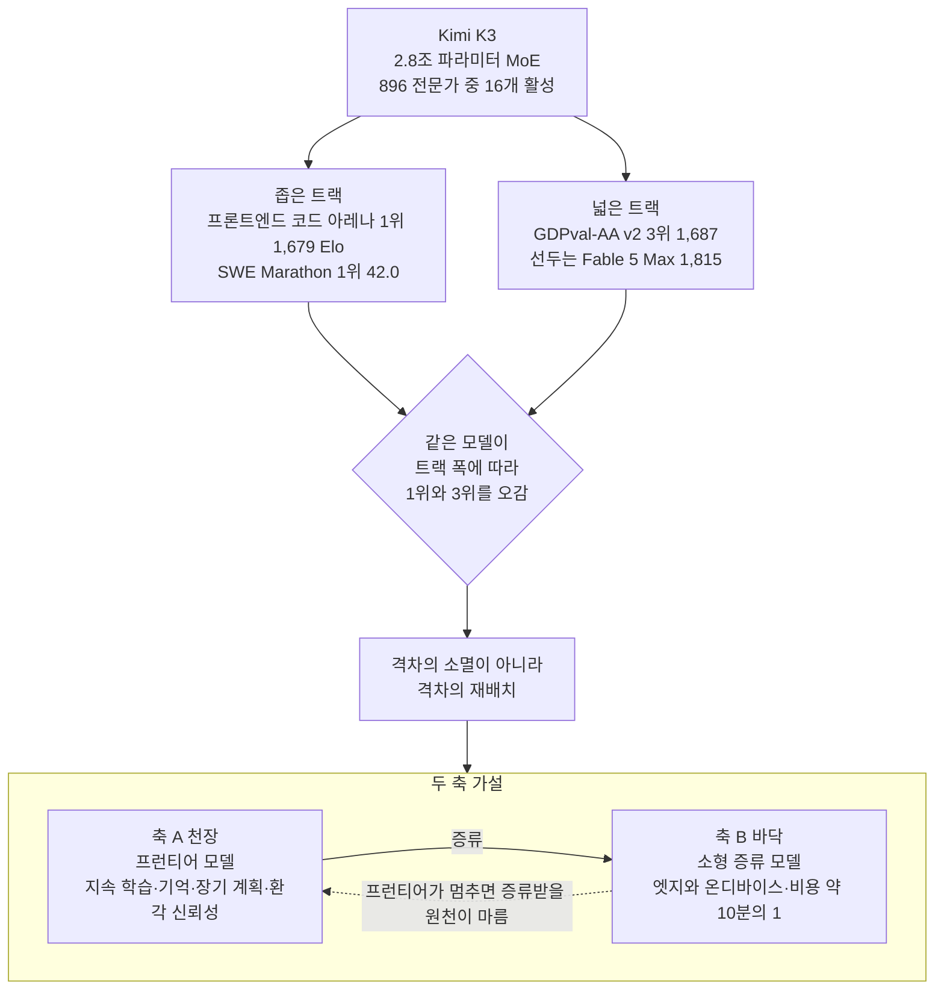

*글의 핵심 개념을 형상화했습니다.*

## 이 글을 누가 읽어야 하나

이 글은 모델 하나의 벤치마크 순위에 일희일비하지 않고, 어떤 모델을 실제로 배포하고 서빙할지 결정해야 하는 플랫폼 엔지니어와 기술 의사결정자를 위해 썼습니다. Kimi K3 발표(2026년 7월 16일)를 둘러싼 "격차가 사라졌다"는 서사는 절반만 맞습니다. 나머지 절반이 앞으로 2년간 우리가 무엇을 만들어야 하는지를 정확히 가리킵니다.

## 무슨 일이 있었나

Moonshot AI가 Kimi K3를 공개했습니다. 2.8조 파라미터 MoE로, 896개 전문가 중 16개를 활성화하고 100만 토큰 컨텍스트를 지원합니다. 가중치 전체 공개는 7월 27일로 예고됐습니다. 커뮤니티는 이를 과거 딥시크가 준 충격에 빗대며 오픈웨이트가 폐쇄형을 따라잡았다고 평가합니다.

절반은 사실입니다. K3는 Arena.AI 프론트엔드 코드 아레나에서 1,679 Elo로 1위에 올라 Claude Fable 5와 GPT-5.6 Sol을 제쳤습니다. 7개 프론트엔드 도메인 중 6개에서 선두였고, SWE Marathon(42.0)과 Program Bench(77.8)에서도 전 모델을 앞섰습니다. GPQA Diamond 93.5%는 발표 시점 오픈웨이트 최고 기록이었습니다.

여기까지만 보면 패권의 종말처럼 읽힙니다. 그런데 한 칸만 옆을 보면 그림이 달라집니다.

## 하이프가 빠뜨린 네 가지

바이럴 요약글들이 공통으로 지운 사실이 넷 있습니다. 넷 다 이번 사건의 진짜 의미를 결정합니다.

첫째, 코딩도 전 영역 1위는 아닙니다. Terminal-Bench 2.1에서 K3는 88.3점을 받았지만 GPT-5.6 Sol에 0.5점 뒤진 2위였습니다. "정상 등극"으로 소개된 항목이 실제로는 준우승입니다.

둘째, 넓은 실무 과제에서는 3위입니다. 이 지점이 가장 중요합니다. GDPval-AA v2는 44개 직종과 9개 주요 산업에 걸친 실제 업무 과제를 측정합니다. 여기서 K3는 1,687점으로 3위에 그쳤습니다. Claude Fable 5 Max(1,815)와 GPT-5.6 Sol Max(1,747.8)가 각각 128점, 61점 앞섭니다. 좁게 정의된 코드 생성 트랙에서는 이기지만, 산업 전반의 실무 가치로 넓히면 최상위 폐쇄형 모델이 아직 유의미한 거리를 두고 앞섭니다.

셋째, 오픈웨이트인데 싸지 않습니다. K3 가격은 입력 100만 토큰당 3달러, 출력 15달러로 Anthropic Sonnet 계열과 같은 수준입니다. 중국 랩이 내놓은 모델 중 역대 최고가입니다. "고가 구독제에 의존하지 않아도 된다"는 서사와 정면으로 어긋납니다.

넷째, 로컬에서 못 돌립니다. 2.8조 파라미터를 서빙하려면 대규모 GPU 클러스터가 필요합니다. 가중치가 공개돼도 개인 워크스테이션에서 구동하는 것은 사실상 불가능합니다. 오픈웨이트는 누구나 손안에서 돌린다는 뜻이 아니라, 자체 서빙 인프라를 가진 조직만의 것이라는 뜻입니다.

결국 K3가 증명한 것은 격차의 소멸이 아니라 격차의 재배치입니다. 좁은 트랙에서는 오픈이 프런티어를 추월했고, 넓은 트랙과 배포 경제성에서는 아직 벽이 있습니다.

## 벤치마크 한 장으로 보기

| 항목 | 성격 | Kimi K3 | 최상위 | 해석 |
|---|---|---|---|---|
| 프론트엔드 코드 아레나 | 좁음 | **1위 (1,679)** | K3 | 오픈이 프런티어 추월 |
| SWE Marathon | 좁음 | **1위 (42.0)** | K3 | 에이전트 코딩 선두 |
| Terminal-Bench 2.1 | 좁음 | 2위 (88.3) | GPT-5.6 Sol | 0.5점 차 준우승 |
| GDPval-AA v2 | 넓음 | 3위 (1,687) | Fable 5 Max (1,815) | 실무 천장은 폐쇄형 |

같은 모델이 트랙의 폭에 따라 1위와 3위를 오갑니다. 이 분산 자체가 결론입니다. 우리는 가장 똑똑한 모델의 시대가 아니라 과제에 맞는 모델의 시대에 들어와 있습니다.

## 그래서 다음은 무엇인가: 두 축 가설

미국 모델이 무의미해졌다는 주장은 틀렸습니다. 진보는 오히려 두 축에서 동시에, 서로를 필요로 하며 일어납니다.

두 축은 경쟁이 아니라 파이프라인입니다. 아래 본문은 이 그림의 각 축을 차례로 풉니다.

축 A는 천장입니다. 넓은 실무 과제, 장기 에이전트 워크플로, 과학적 난제처럼 아직 풀리지 않은 영역에서는 최상위 프런티어 모델이 계속 앞서 나가야 합니다. 2026년 현재 AI가 실제로 막혀 있는 곳은 벤치마크 점수가 아닙니다. 지속 학습이고, 기억 아키텍처이고, 월드 모델과 장기 계획이며, 무엇보다 환각의 신뢰성입니다. GDPval 같은 넓은 벤치마크에서 아직 폐쇄형이 앞서는 이유가 여기 있습니다. 코드 한 조각을 잘 짜는 일과 44개 직종의 실무를 신뢰성 있게 처리하는 일은 다릅니다. 천장을 올리는 작업은 끝나지 않았습니다.

축 B는 바닥입니다. 동시에, 실제로 배포하고 실행할 수 있는 작은 모델이 절실합니다. 2026년의 분명한 흐름은 대형에서 소형·과제특화 모델로의 이동입니다. 증류를 거친 모델은 크기를 절반으로 줄여도 원본 성능의 90%를 유지하고, 한때 7B가 최소선으로 여겨지던 자리를 이제 10억 파라미터 미만 모델이 실무 과제에서 채웁니다. 비용은 약 10분의 1입니다. K3가 2.8조 파라미터로 서버룸을 요구하는 동안, 진짜 확산은 엣지와 온디바이스에서 일어납니다.

두 축은 경쟁 관계가 아닙니다. 파이프라인입니다. 천장을 올린 프런티어 모델이 교사가 되어 소형 모델로 증류되고, 그 소형 모델이 엣지로 퍼집니다. 프런티어가 멈추면 증류받을 원천이 마릅니다. 그래서 K3의 등장은 미국 모델을 무의미하게 만든 사건이 아니라, 증류 사슬의 상단을 다극화한 사건입니다. 다극화는 진보의 종말이 아니라 병렬화입니다.

### 이 프레임이 틀릴 수 있는 지점

두 축 가설을 스스로 반박해 보겠습니다. 가장 강한 반론은 두 축이 하나로 수렴할 가능성입니다. K3는 2.8조 파라미터를 쓰고도 GDPval에서 1위가 아니었습니다. 이것을 천장이 아직 멀었다는 신호가 아니라 스케일이 더는 병목이 아니라는 신호로 읽으면 결론이 뒤집힙니다. 실무 천장을 가른 변수가 파라미터 수가 아니라 데이터 품질과 강화학습 레시피라면, 굳이 조 단위 교사가 없어도 30억에서 1천억 파라미터 구간의 중형 모델이 좋은 데이터와 정교한 후처리만으로 상단 성능의 대부분을 흡수할 수 있습니다. 그러면 거대 교사에서 소형 학생으로 이어지는 증류 사슬 자체가 헐거워지고, 산업은 두 개의 봉우리가 아니라 실용성과 성능이 겹치는 하나의 중형 봉우리로 몰립니다. 이 시나리오에서는 초대형 프런티어에 대한 투자 수익이 빠르게 꺾이고, ThakiCloud 같은 서빙 플랫폼의 최적 타깃도 2.8조 모델이 아니라 중형 모델 군집이 됩니다. 우리가 두 축 스택을 설계하되 중형 구간에 대한 대비를 함께 세워야 하는 이유입니다. 어느 쪽이 맞는지는 다음 두세 세대의 넓은 벤치마크 곡선이 스케일과 함께 계속 오르는지, 아니면 평평해지는지를 보면 판별됩니다.

## ThakiCloud 전략 관점

오픈웨이트 프런티어(K3, GLM-5.2, DeepSeek V4 Pro)의 진짜 의미는 벤치마크 순위가 아닙니다. 자체 호스팅 가능한 프런티어급 모델이 처음으로 손에 들어왔다는 점입니다. 데이터 주권이 필요한 규제 산업, 온프렘 요구가 강한 공공과 금융에게 이것은 실질적 전환입니다.

그런데 바로 그 지점에서 우리 플랫폼의 가치가 생깁니다. 2.8조 파라미터 모델을 자체 서빙하는 것은 곧장 GPU 경제성과 스케줄링의 문제로 바뀝니다. 오픈웨이트가 공짜가 아니라 인프라 역량을 가진 조직만의 것이라면, 그 인프라 역량을 상품화하는 것이 핵심입니다. 프런티어 오픈웨이트를 실무 경제성으로 서빙하고, 소형 증류 모델과 라우팅으로 묶어, 두 축을 하나의 서빙 스택으로 통합하는 일입니다. Kueue 기반 GPU 스케줄링과 멀티테넌트 서빙이 겨냥하는 지점이 정확히 여기입니다.

## 마무리

Kimi K3는 대단한 성취입니다. 동시에 격차가 사라졌다는 결론은 데이터가 지지하지 않습니다. 좁은 트랙 1위와 넓은 트랙 3위가 같은 모델에서 나온다는 사실, 오픈웨이트가 역대 최고가로 책정됐다는 사실, 개인이 로컬에서 돌릴 수 없다는 사실이 함께 말하는 것은 하나입니다. 인류의 난제는 벤치마크 순위로 풀리지 않았고, 앞으로도 더 똑똑한 프런티어 모델과 더 작은 실행 가능한 모델이 둘 다 필요합니다. 그 두 축이 만나는 서빙 스택에서 다음 도약이 나옵니다.

## 참고 자료

- Moonshot AI, [Kimi-K3 모델 카드](https://huggingface.co/moonshotai/Kimi-K3): 2.8조 파라미터, 896개 전문가 중 16개 활성, 100만 토큰 컨텍스트
- MarkTechPost, [Moonshot AI Releases Kimi K3: A 2.8 Trillion Parameter Open MoE Model With Kimi Delta Attention and 1M Context](https://www.marktechpost.com/2026/07/16/moonshot-ai-releases-kimi-k3-a-2-8-trillion-parameter-open-moe-model-with-kimi-delta-attention-and-1m-context/)
- Fortune, [Moonshot's Kimi K3 pushes Chinese AI into Fable-level territory](https://fortune.com/2026/07/16/moonshots-kimi-k3-pushes-chinese-ai-into-fable-level-territory/)
- officechai, [Kimi K3 Beats Fable 5, GPT 5.6 On Some Benchmarks In Frontier-Level Performance](https://officechai.com/ai/kimi-k3-benchmarks/)
- Simon Willison, [Kimi K3, and what we can still learn from the pelican benchmark](https://simonwillison.net/2026/Jul/16/kimi-k3/)
- Dell, [The Power of Small: Edge AI Predictions for 2026](https://www.dell.com/en-us/blog/the-power-of-small-edge-ai-predictions-for-2026/)
- NextBigFuture, [2026 is Breakthrough Year for Reliable AI World Models and Continual Learning Prototypes](https://www.nextbigfuture.com/2026/04/2026-is-breakthrough-year-for-reliable-ai-world-models-and-continual-learning-prototypes.html)
- VentureBeat, "China's Moonshot AI releases Kimi K3, the largest open-source model ever" (링크 확인 불가)
