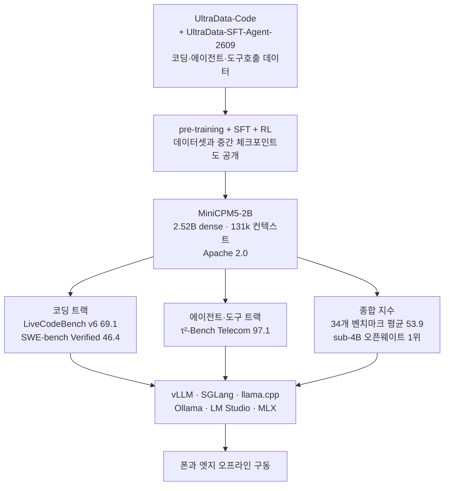

*글의 핵심 개념을 형상화했습니다. 엣지 끝단에서 부하가 하나의 작은 dense 모델로 모이는 모습.*

## 왜 읽어야 하나

엣지 노드와 온프레미스 환경에 실제로 모델을 배치해야 하는 플랫폼 엔지니어와 기술 의사결정자를 위한 글입니다. 2026년 9월 7일 OpenBMB가 공개한 MiniCPM5-2B는 "2B급 dense 모델이 34개 벤치마크 평균에서 4B급을 눌렀다"는 사건입니다. 결론부터 말하면, 전 영역 1위가 아니라 코딩과 에이전트, 도구 호출이라는 세 트랙에 집중 투자한 결과이며 그 세 트랙이 바로 온디바이스 에이전트가 실제로 하는 일입니다.

## 무슨 일이 있었나

MiniCPM5-2B가 공개된 날, 이 모델은 X에서 가장 빠르게 번진 오픈웨이트 소식이 되었습니다. 22만 팔로워의 AI 엔지니어 Paul Couvert가 "2B짜리 오픈소스 모델이 6배 큰 모델을 이긴다고?"라는 글을 올리자 하루 만에 8만 조회를 넘겼고 Artificial Analysis는 이 모델이 자사 지능 지수 v4.2에서 오픈웨이트 모델 중 가장 높은 15점을 기록했다고 평가했습니다.

수치는 모델카드와 다수의 2차 보도가 일치합니다. 34개 벤치마크 평균 53.9점으로 sub-4B 오픈웨이트 리더보드 1위이고 비교 대상인 Qwen3.5-4B의 평균은 51.1입니다. 2.8포인트 차이로 읽으면 작아 보이지만, 두 모델의 크기가 40%가량 벌어져 있는 점을 감안하면 이야기가 달라집니다.

## MiniCPM5-2B가 무엇인가

구조부터 보면 무난합니다. LlamaForCausalLM 기반의 dense 모델로, 총 2.52B 파라미터 중 임베딩을 제외한 것이 1.98B입니다. MoE가 아니라 dense라 활성 파라미터가 전부입니다. bf16로만 치면 가중치가 약 5GB[추정]로, GPU 한 장은커녕 메모리가 충분한 폰과 엣지 디바이스에도 들어가는 크기입니다. 네이티브 컨텍스트는 131,072토큰이고 라이선스는 Apache 2.0입니다.

진짜 이야기는 학습 데이터에서 시작합니다. OpenBMB는 이번 세대에서 pre-training과 SFT, RL 데이터셋과 중간 체크포인트까지 함께 공개했습니다. SFT 단계에는 UltraData-Code와 UltraData-SFT-Agent-2609라는 이름의 데이터가 쓰였고 코딩과 에이전트, 전화 통화 형태의 대화형 도구 호출에 특화되어 있습니다. 벤치마크 점수의 모양이 곧 데이터의 모양입니다.

## 벤치마크 한 장으로 읽기

| 항목 | 성격 | MiniCPM5-2B | Qwen3.5-4B | 해석 |
|---|---|---|---|---|
| 34개 벤치마크 평균 | 종합 | **53.9** | 51.1 | sub-4B 오픈웨이트 1위 |
| LiveCodeBench v6 | 코딩 | **69.1** | 56.4 | 12.7점 차, 가장 벌어진 트랙 |
| SWE-bench Verified | 코딩 에이전트 | **46.4** | 33.6 | 실리포 수정 과제에서 같은 양상 |
| τ²-Bench Telecom | 도구 호출 에이전트 | **97.1** | - | 정책 준수형 대화 에이전트 |

코딩 트랙에서 4B급보다 12~13점 앞섭니다. SWE-bench Verified는 실제 리포지토리에 들어가 버그를 고치는 에이전트형 코딩이라, 단순 코드 생성과 무게가 다릅니다. τ²-Bench Telecom 97.1은 전화번호 확인, API 호출, 도메인 정책 준수까지 요구하는 시뮬레이션 통화를 잰 것이고 이 숫자가 의미하는 것은 소형 모델이 "말을 잘하는 것"이 아니라 "도구를 올바르게 부르는 것"에서 이미 쓸 수 있다는 것입니다.

반대편도 봐야 합니다. 이번 모델카드가 강조하지 않는 넓은 실무 트랙, 예컨대 여러 산업의 실제 업무를 재현하는 벤치마크에서 2.5B가 4B를 앞선다는 보고는 없습니다. 집중이 있으면 이면이 있고 그 이면이 다음 섹션의 반론입니다.

## 실행과 배포

서빙 스택은 폭이 넓습니다. vLLM과 SGLang, llama.cpp, Ollama, LM Studio, MLX까지 공식 지원이고 vLLM 공식 레시피에도 올라 있습니다. 2.52B dense라면 quantized 서빙이 아니라 fp16/bf16 그대로도 엔트리급 GPU와 워크스테이션, 그리고 충분히 메모리가 있는 모바일 칩에서 돌아갑니다.

실전에서 중요한 변수는 세 가지입니다. 첫째, 131k 네이티브 컨텍스트의 품질입니다. 컨텍스트가 길다고 해서 끝까지 잘 기억하는 것은 아니므로, 긴 문서 작업을 실제로 거치는 환경에서는 자체 검증이 필요합니다. 둘째, 코딩 특화 데이터의 영향은 코딩 워크로드에서 복리로 작용하지만, 일반 대화나 한국어 같은 다른 언어 트랙에서는 데이터 구성에 따라 평탄해질 수 있습니다. 셋째, dense 구조는 매 토큰에 2.5B 전체를 돌립니다. MoE와 비교할 때 활성 비용이 크지만, 그 단순함이 오히려 엣지 스택과의 호환을 넓게 해 줍니다.

Apache 2.0 라이선스와 공개된 학습 데이터는 상업 활용의 문턱을 한 단계 낮춥니다. 모델 자체를 바꾸는 것보다, 공개된 데이터를 가져와 자기 도메인에 SFT를 얹는 것이 더 싼 경로가 됩니다.

## ThakiCloud 제품 적용 시사점

이 모델이 가리키는 방향은 ThakiCloud의 세 제품이 동시에 놓인 자리와 맞물립니다.

Aegis 관점에서 보면, 폐쇄망과 소버린 환경의 가장 바깥 끝인 엣지 노드에 에이전트를 앉히는 계산이 바뀝니다. 이전에는 온프레미스 엣지에서 "최소 7B급"을 전제로 예산을 잡았지만, 코딩과 도구 호출 트랙에서는 2B급이 그 역할을 맡을 수 있다는 것이 모델카드와 벤치마크의 한 줄입니다. 현장 장비의 메모리와 전력 한계 안에서 에이전트를 돌리는 설계가 실효성 있게 여닫힙니다.

Paxis 관점에서는 샌드박스 내 코드 에이전트 로컬 실행기가 그 후보가 됩니다. Paxis는 에이전트의 실행 환경을 일급 리소스로 다루는데, 그 실행 환경 안에 모델도 들어갑니다. 코드 작성과 테스트, 도구 호출에 특화된 소형 모델을 샌드박스 로컬에 두면 클라우드 왕복이 사라지고 지연과 토큰 비용이 함께 줄어듭니다. 코딩 트랙 점수가 높을수록 이 조합의 실효성이 커지는 구조입니다.

Metis 관점에서는 하이브리드 라우팅의 경계선이 내려갑니다. 서빙 라우팅에서 소형 모델이 담당하는 구간은 "모델이 할 수 있는 것"의 하한에 의해 결정됩니다. 2B급이 코딩과 에이전트 트랙에서 4B급을 넘었다는 것은, 그 하한이 내려간다는 뜻입니다. 짧은 임무와 반복작업은 로컬에서 끝나고 클라우드가 처리해야 하는 구간이 줄어드는 것은 scale-to-zero와 토큰 단가의 직접적 변수입니다.

## 한계 및 반론

가장 큰 반론은 벤치마크의 성질입니다. 53.9와 69.1, 97.1은 모두 모델카드와 2차 보도가 재확인한 수치지만, OpenBMB가 자사 데이터로 자사 모델을 학습해 자사 벤치마크 구성에 반영한 결과입니다. 독립 재현 수치는 아직 없습니다. 코딩과 에이전트 트랙에 집중했으니 그 트랙에서 강하고 그 밖에서는 모르겠다. 이것이 반론의 전부입니다.

두 번째는 dense의 비용 구조입니다. 활성 파라미터 1.98B는 MoE의 동급과 비교하면 매 토큰마다 전체를 돌리는 구조입니다. 처리량 계산에서 이 모델이 이득을 보는 구간은 모델 크기가 병목인 엣지와 로컬이요, 대규모 배치가 병목인 서빙에서는 다른 계산을 해야 합니다.

세 번째는 "1위"의 범위입니다. sub-4B 오픈웨이트 1위이지, 4B 이상 모델과의 비교는 아닙니다. Artificial Analysis 지수에서 15점은 오픈웨이트 최상위권이고 프런티어 폐쇄형과의 격차는 여전합니다.

## 정리

MiniCPM5-2B는 격차 소멸의 증거가 아니라 격차 재배치의 증거입니다. 2B급이 4B급을 이긴 주(主)는 코딩과 에이전트, 도구 호출의 세 트랙입니다. 그리고 그 세 트랙은 온디바이스 에이전트가 실제로 하는 일과 정확히 겹칩니다.

모델 선정 회의에 한 문장을 더 넣을 차례입니다. "경계선 아래 구간을 2B급이 책임질 수 있는가." Apache 2.0과 공개 학습 데이터, 폭넓은 서빙 스택이 그 질문에 답을 실험하게 해 줍니다. 우리 스택에서 53.9와 69.1, 97.1이 어떻게 재확인될지는 아직 검증 전입니다. 그 검증 자체가 다음 단계의 일입니다.

## 출처

- [Hugging Face 모델카드: openbmb/MiniCPM5-2B](https://huggingface.co/openbmb/MiniCPM5-2B)
- [GitHub: openbmb/minicpm](https://github.com/openbmb/minicpm)
- [MarkTechPost: OpenBMB releases MiniCPM5-2B (2026-09-07)](https://www.marktechpost.com/2026/09/07/openbmb-releases-minicpm5-2b-a-2-52b-dense-model-averaging-53-9-across-34-benchmarks-and-built-to-run-on-device/)
- [vLLM Recipes: MiniCPM5-2B](https://recipes.vllm.ai/openbmb/MiniCPM5-2B)
- 원출 트윗: [@itsPaulAi](https://x.com/hjguyhan/status/2097082706744246751) · [@ArtificialAnlys](https://x.com/hjguyhan/status/2097082776684204206) · [@OpenBMB](https://x.com/hjguyhan/status/2097076471819059250)
