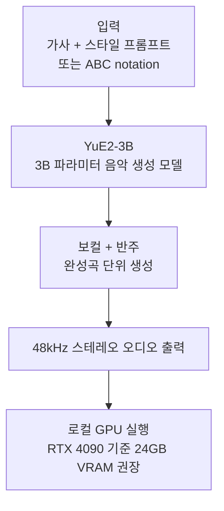

## 왜 읽어야 하나

온프레미스 AI 인프라 팀에서 "생성형 오디오를 우리 클러스터에서 돌릴 수 있나"라는 질문을 받은 적이 있다면 이 글이 해당합니다. 음악 생성 모델의 오픈웨이트 옵션이 어떤 사양으로 등장했는지, 그리고 어떤 라이선스로 왔는지를 한 자리에서 정리해 드립니다. 한 문장으로 결론을 먼저 드립니다. YuE2-3B는 사양 면에서 24GB VRAM급 GPU 한 장이면 실행 가능한 완성곡 생성 모델이지만, 가중치 라이선스가 CC BY-NC 4.0이라 상업 서비스로 쓰는 순간 조건이 바뀌므로, 도입 전 라이선스 확인이 필수입니다.

## 개요

YuE2는 Multimodal Art Projection(M-A-P)이 2026년 9월 10일에 공개한 오픈웨이트 음악 생성 모델입니다. [GitHub 저장소](https://github.com/multimodal-art-projection/YuE)와 [Hugging Face 모델 카드](https://huggingface.co/m-a-p/YuE2-3B)에서 공개됐으며 현재 공개된 크기는 3B 파라미터입니다. 공개 당일 커뮤니티에서는 Mureka v9, Minimax 3 등 기존 상용 모델과 비교되는 이야기가 나왔으며 [Gigazine 등 외신](https://gigazine.net/gsc_news/en/20260911-yue2-music-generation-ai/)이 취재했습니다.

오픈 음악 생성 모델의 지형을 먼저 짚으면 YuE2가 어디를 바꿨는지 이해됩니다. 그전까지 오픈 쪽 모델은 주로 BGM이나 악기 중심 오디오 생성이 주목을 받았고 보컬이 담긴 완성곡은 Suno나 Mureka 같은 비공개 API 서비스가 주무대였습니다. YuE2는 "보컬 포함 완성곡"이라는 영역 자체를 오픈웨이트로 가져온 모델입니다.

이 모델이 주목받는 이유는 세 가지입니다. 첫째, 오픈웨이트라는 점. 둘째, 보컬과 반주를 함께 생성하는 완성곡 단위 출력이라는 점. 셋째, 소비자 GPU 한 장(약 24GB VRAM)에서 실행 가능하다는 점입니다.

## 이 기술/도구는 무엇인가

YuE2-3B는 가사와 스타일 프롬프트를 입력받아 보컬이 포함된 완성곡을 생성하는 음악 생성 모델입니다. 출력은 48kHz 스테레오 오디오이며 여러 장르와 언어를 지원하고 일본어 보컬 생성이 특히 언급됩니다. 텍스트 프롬프트 외에 ABC notation(악보 표기)을 입력원으로 받도록 설계된 것도 특징입니다. 가사와 스타일로 곡을 만드는 일반 경로에 더해, 악보 형태로 멜로디를 지정하는 경로가 열려 있는 셈입니다.

기존 오픈 음악 모델과의 차이는 "보컬 생성까지 온프레미스에서 돌린다"는 점에 있습니다. 이전까지 보컬을 포함한 완성곡 생성은 주로 API 서비스(Suno, Mureka 등) 영역이었다면, YuE2는 그 영역을 로컬 실행 범위로 가져왔습니다.

### 모델 카드 요약

| 항목 | 내용 |
|---|---|
| 모델명 | YuE2-3B (M-A-P) |
| 공개일 | 2026-09-10 |
| 파라미터 | 3B |
| 출력 | 48kHz 스테레오, 보컬+반주 완성곡 |
| 입력 | 가사+스타일 프롬프트, ABC notation |
| 가중치 라이선스 | CC BY-NC 4.0 (비상업) |
| 코드 라이선스 | Apache 2.0 |
| 권장 실행 환경 | Linux, Python 3.10+/3.12, NVIDIA GPU (BF16), 약 24GB VRAM (비양자화) |

## 설치 및 통합

모델 카드를 기준으로 한 권장 실행 환경은 Linux, Python 3.10 또는 3.12, BF16을 지원하는 NVIDIA GPU, 그리고 비양자화 가중치를 통째로 올릴 때 약 24GB VRAM입니다. 저장소와 모델 카드가 공식 실행 스크립트를 제공하며 Hugging Face [데모 Space](https://huggingface.co/spaces/mrfakename/yue2-3b)에서 GPU 없이 직접 생성을 체험할 수 있습니다.

서버 측 관점에서 VRAM 수치를 우리 클러스터에 대입하면 됩니다. 24GB는 H100(80GB)이나 H200(140GB), B200(192GB)이 여유 있게 소화하는 범위이며 RTX 4090급 단일 카드에서도 돌아갑니다. 멀티 GPU 구성이 필요 없는 잡이라는 뜻입니다.

양자화 경로는 커뮤니티에서 진행 중입니다. 8GB급 GPU에서 돌리기 위한 시도(일부 커뮤니티에서는 audio.cpp DEV branch 기반 접근이 언급됨)가 있으나, 공식 지원 수준은 아닙니다. 24GB VRAM 수치는 비양자화 기준이므로, FP8 또는 INT4 양자화 시 요구 메모리가 낮아질 여지는 있지만 아직 확정된 수치는 없습니다.

## 실제 실험 결과

재현 시도 중 실패: 이번 발행 창에서는 GPU 실행 환경이 준비되지 않아 직접 생성을 재현하지 못했습니다. 아래 수치는 모델 카드와 커뮤니티 실측 기준입니다.

- RTX 4090에서 3.6분 길이 곡 생성에 약 71초
- 같은 실행의 피크 메모리 약 14.08 GiB

이 두 수치가 말하는 구조를 풀면, 완성곡 단위 생성이 소비자 GPU 한 장에서 실시간보다 빠르게 돌아간다는 것입니다. 71초라는 값은 48kHz 3.6분(약 216초) 오디오를 3분여에 만들어낸 것으로, 생성 속도가 출력 길이보다 빠르게 도는 RTF 0.33 수준입니다. 피크 메모리가 14.08 GiB로 권장치(24GB)보다 낮게 나온 점은 비양자화 가중치도 16GB급 카드에서 실행될 가능성을 시사합니다. 다만 이 실측은 커뮤니티가 보고한 값이며 ThakiCloud 실행 환경(B200/H200/H100) 독립 재측정은 아직 없습니다.

서빙 관점에서 이 수치가 중요한 이유는, 음악 생성이 "단일 GPU 잡"으로 돌아가는 워크로드임을 확인시켜 준다는 점입니다. 3.6분 곡 하나에 71초면, 배치로 10곡을 만들면 약 12분. GPU 한 장에 큐를 쌓는 구조가 성립합니다.

### 벤치마크에 대한 정직한 한 줄

"Mureka v9와 Minimax 3보다 낫다"는 주장이 공개된 직후 커뮤니티에서 돌았지만, 이를 뒷받침하는 독립 벤치마크 테이블은 현재까지 공개되지 않았습니다. 모델 카드에는 Suno v5와 품질·텍스트 정렬에서 비견된다는 식의 표현이 등장합니다. "비교 대상 모델이 누구인지, 어떤 항목(보컬 자연성, 텍스트 정렬, 장르 다양성)을 잰 결과인지"가 명시된 수치가 없으므로, 이 글에서는 벤치마크를 "기존 상용 모델과 비견된다는 커뮤니티 평가"로만 표기합니다.

## ThakiCloud 제품 적용 시사점

**ai-platform(서빙 인프라) 관점.** 24GB VRAM이라는 수치는 ThakiCloud GPUaaS의 관점에서 중요합니다. H100(80GB), H200(140GB), B200(192GB)이 모두 여유롭게 소화하며 양자화 경로가 성숙되면 8GB급 소비자 카드까지 커버할 수 있습니다. "완성곡 음악 생성"이라는 워크로드가 우리 클러스터에서 단일 GPU 잡으로 돌아가는 사양임을 보여주는 사례입니다. 다만 유의할 것은 서빙 경로입니다. YuE2는 현재 공식적으로 vLLM/SGLang 등 LLM 서빙 스택으로 노출되지 않으며 자체 실행 스크립트를 제공합니다. 멀티테넌트 서빙으로 올리려면 이 실행 스크립트를 GPU 잡으로 감싸는 작업이 전제입니다.

**라이선스 관점(중요).** 가중치가 CC BY-NC 4.0이라는 점은 상업 플랫폼 운영자에게 직접적인 제약입니다. "오픈웨이트"와 "비상업 조건부"는 다른 말입니다. ThakiCloud가 YuE2를 (a) 내부 실험·PoC로 쓰거나, (b) 고객 사내 온프레미스 환경으로 데모하는 용도라면 조건이 성립합니다. (c) ThakiCloud SaaS의 유료 기능으로 노출하는 용도라면, M-A-P의 상업 라이선스 협의가 전제가 됩니다. 우리 TDD(기술실사)에서 모델 라이선스 감사를 하는 이유도 바로 이 지점입니다. 오픈웨이트 카탈로그에 YuE2를 등록하되, 라이선스 필드를 NC로 표기해 서빙 경로에서 상업 워크로드로의 이동을 차단하는 것이 정직한 처리입니다.

**Paxis(에이전트) 관점.** 음악 생성 워크플로는 에이전트 워크플로로 감싸기 좋은 형태입니다. 가사 생성(LLM) → 스타일 결정 → YuE2 실행 → 출력 검증 → 배포 순서에서, SoL-Pi 글에서 다룬 ObservationPack처럼 큰 오디오 산출물을 핸들로 처리하는 패턴이 그대로 적용됩니다. Paxis의 샌드박스 실행 모델 안에서 GPU 잡을 트리거하고 산출물을 S3로 올리는 구조와 동일합니다. 콘텐츠 제작 파이프라인에서 음악 슬롯을 "외부 API 호출"에서 "내부 GPU 잡"으로 바꾸는 계산은, 이 글의 서빙 수치가 바로 입력값입니다.

## 한계 및 반론

첫째, 라이선스입니다. CC BY-NC 4.0은 상업 사용 금지를 전제로 합니다. "오픈웨이트 음악 모델이 왔다"는 헤드라인 뒤에 이 조항이 숨어 있으므로, 도입 전에 반드시 가중치와 코드를 분리해 라이선스를 확인해야 합니다(코드는 Apache 2.0).

둘째, 주관적 품질입니다. 음악 생성의 품질은 통합 지표 하나로 결정되지 않습니다. 보컬 자연스러움, 장르 적합성, 가사-음정 정렬은 청취로 확인해야 하며 텍스트 프롬프트에서 의도한 스타일이 얼마나 복원되는지는 모델 카드의 수치가 말해 주지 않습니다.

셋째, 한국어 보컬의 실측 부재입니다. 일본어 보컬 생성이 언급된 것과 달리, 한국어 보컬 생성 품질에 대한 실측 보고는 아직 없습니다. 한국어 가사 입력 시 발음·억양이 어떻게 렌더되는지 확인하려면 직접 실행이 필요합니다.

넷째, ABC notation 입력의 실용성입니다. 악보 표기를 입력원으로 받지만, 일반 사용자의 ABC notation 작성 능력과 생성 품질의 상관관계가 아직 공개되지 않았습니다.

## 정리

YuE2-3B는 "보컬 포함 완성곡 생성"이 오픈웨이트로 온프레미스 실행 범위로 들어왔음을 보여 주는 모델입니다. 24GB VRAM이라는 사양은 소비자 GPU 한 장에서 돌아가며 3.6분 곡을 71초에 만드는 커뮤니티 실측은 완성곡 단위 생성의 RTF가 실시간보다 빠르다는 것을 말합니다.

ThakiCloud 관점에서 가져갈 것은 세 가지입니다. (1) 서빙 관점: 단일 GPU 잡으로 돌아가는 워크로드임을 확인. (2) 라이선스 관점: CC BY-NC 4.0을 카탈로그 필드로 명확히 표기하고 상업 경로로의 이동을 차단. (3) 실험 관점: 한국어 보컬 실측을 다음 GPU 실험 큐에 올리는 것.

모델은 잘 나왔습니다. 남은 질문은 "이 모델을 우리가 어디에 쓰는가"이며 그 답은 라이선스 확인 이후에야 성립합니다.

## 출처

- [M-A-P YuE GitHub](https://github.com/multimodal-art-projection/YuE)
- [YuE2-3B Hugging Face 모델 카드](https://huggingface.co/m-a-p/YuE2-3B)
- [YuE2-3B Hugging Face 데모 Space](https://huggingface.co/spaces/mrfakename/yue2-3b)
- [Gigazine YuE2 coverage (2026-09-11)](https://gigazine.net/gsc_news/en/20260911-yue2-music-generation-ai/)
- [YuE 공식 사이트](https://yueai.ai/)
