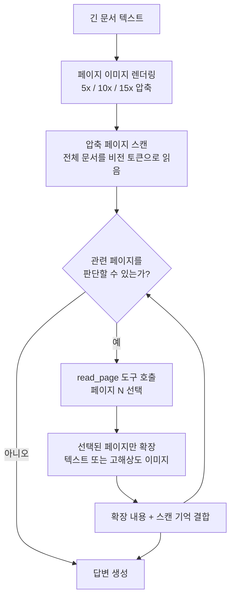

*글의 핵심 개념(스캔-선택-확장)을 형상화했습니다.*

## 왜 읽어야 하나

RAG나 문서 QA, 계약서 분석 같은 "긴 문서 워크로드"를 돌리며 입력 토큰 비용이나 컨텍스트 윈도우 한계에 부딛진 적 있다면, 또는 오픈웨이트 VLM 중 문서 이해 옵션을 비교하고 있다면 이 글이 해당합니다. 결론을 먼저 드립니다. Apple이 공개한 LensVLM-9B는 "문서를 이미지로 압축해서 읽고 필요한 페이지만 확장해 읽는다"는 패러다임을 9B 규모로 증명해 낸 모델입니다. 우리가 로컬에서 재현한 렌더링 쪽 결과와 논문의 벤치마크 수치는 모두 실제로 작동합니다. 다만 가중치가 research-only(비상업) 라이선스로 나왔기 때문에, 도입의 본질은 "모델을 사 올 것인가"가 아니라 "이 패러다임을 우리 VLM에 이식할 것인가"입니다.

## 개요

Apple은 2026년 9월 21일에 [Hugging Face](https://huggingface.co/apple/LensVLM-9B)에 LensVLM-9B를 올렸습니다. Qwen3.5-9B-Base를 기반으로 하는 9B 파라미터 비전 언어 모델(VLM)로, 함께 공개된 것은 [arXiv 논문(2605.07019)](https://arxiv.org/abs/2605.07019)과 [GitHub 코드 저장소](https://github.com/apple-aiml-research/ml-lensvlm), 그리고 데모입니다. Hugging Face의 CEO Clem Delangue가 [트윗으로 이 모델을 소개](https://x.com/clementdelangue/status/2102856189084098897)했고 공개 나흘이 지난 9월 25일 현재 다운로드 455회·좋아요 169개를 기록하고 있습니다.

논문 자체는 5월 7일에 제출됐고 이번 공개는 가중치와 코드의 릴리즈입니다. 저자는 Roy Xie, Dan Friedman, Donghan Yu, Bowen Pan, Christopher Fifty, Jang-Hyun Kim, Xianzhi Du, Zhe Gan, Vivek Rathod, Bhuwan Dhingra 10명으로, Apple Machine Learning Research 팀입니다.

## 이 기술은 무엇인가

출발점은 단순한 관찰입니다. VLM은 텍스트를 토큰화하지 않고도 "렌더된 이미지"로 텍스트를 처리할 수 있습니다. VLM의 이미지 인코더는 고정 크기 이미지를 고정된 수의 비전 토큰으로 매핑하기 때문에, 렌더링 해상도를 바꾸는 것이 자연스러운 압축 노브가 됩니다. 10배 압축이든 15배 압축이든, 페이지 이미지가 주는 비전 토큰 개수는 동일합니다.

이 관찰이 실제로 "노브"가 되려면, 이 노브가 기존 접근들과 어떻게 다른지부터 짚어야 합니다. 긴 문서를 처리하는 기존 접근들은 크게 세 갈래입니다. 전문 토큰화를 그대로 쓰는 방식은 컨텍스트가 무한정 비싸지고 KV 캐시가 커집니다. RAG(검색 증강)는 관련 청크만 찾아오지만 "무엇이 관련인지"를 사전에 검색기로 결정해야 하고 멀티홉 질문에서 청크가 흩어져 있으면 연결을 놓칩니다. 텍스트 압축(요약·단어 압축)은 정보 손실이 본질적입니다. 이미지 렌더링은 또 다른 축입니다. 페이지 한 장의 비전 토큰 수는 고정이고 레이아웃·서식·인접 관계가 토큰화 없이 그대로 남아 있습니다.

문제는 정확도입니다. 압축을 올리면 문자가 인코더의 유효 해상도 아래로 줄어들어 구분이 불가능해집니다. 기존 비전 압축 접근은 이 벽에 막혀 압축률을 제한할 수밖에 없었습니다. LensVLM은 이 실패 모드를 "완전히 피하는 것"이 아니라 "발견하고 회복하는 것"으로 접근합니다. 모델은 압축된 페이지 이미지들을 스캔한 뒤, learned tool인 `read_page`를 호출해 관련 페이지만 비압축 형태로 확장해서 읽습니다.



이때의 핵심 판단이 하나 더 있습니다. 확장 형식 선택입니다. 논문의 분석에 따르면 렌더된 텍스트에서는 텍스트 확장이, 레이아웃 정보(테이블 위치, 도표, 머리글)가 과업과 관련된 네이티브 문서에서는 고해상도 이미지 확장이 각각 유리합니다. 압축이 커질수록 모델은 신뢰할 수 없는 비전 읽기보다 확장된 내용에 의존하는 비중이 높아진다는 것도 같은 분석에서 확인됩니다.

## 어떻게 훈련됐는가

LensVLM은 "프레임워크 + post-training 레시피"입니다. 가중치가 Qwen3.5-9B-Base에서 출발한다는 것은, 두 가지 능력(비전 인식, 언어 추론)은 베이스가 갖고 있고 LensVLM이 새로 학습한 것은 "압축된 이미지에서 관련 페이지를 식별하는 것"과 "read_page 도구를 언제 어떤 형식으로 호출하는 것"이라는 뜻입니다.

논문의 분석 섹션이 검증하는 것도 바로 이 학습의 효과입니다. 첫 번째로, 학습 덕분에 비전 압축이 렌더링 선택(폰트, 크기, 레이아웃 변화)에 강건해진다는 것입니다. 학습되지 않은 VLM은 렌더링 설정이 조금 바뀌면 압축 읽기가 무너지지만 학습된 모델은 렌더링 변동에 대해 정확도를 유지합니다. 두 번째로, 압축이 커질수록 모델의 행위가 스캔에서 확장으로 이동한다는 것입니다. 5x에서는 압축 이미지 자체에서 읽는 비중이 크지만 10~15x에서는 read_page 호출이 지배적 행위가 됩니다. 즉, 모델이 "이해 못 하는 구간은 확장해서 확인한다"는 전략을 학습한 것입니다.

이 두 사실은 실무적으로 중요합니다. 렌더링 파이프라인을 그대로 쓰는 경우(같은 폰트, 같은 레이아웃)가 아니라도, 학습 강건성이 일정 범위까지 흡수해 준다는 뜻이고 압축률을 올리면 자동으로 확장 비용이 늘어나므로 "최적 압축률"은 문서 유형별로 실측해야 한다는 뜻입니다.

## 설치 및 통합

GitHub 저장소의 실제 설치 명령은 다음과 같습니다.

```bash
git clone https://github.com/apple-aiml-research/ml-lensvlm
cd ml-lensvlm
pip install -r requirements.txt
```

requirements.txt의 내용입니다.

```
torch>=2.13.0
vllm>=0.27.0
transformers>=5.10.0
Pillow>=12.3.0
datasets>=2.14
```

추론 경로의 핵심 의존성이 vLLM입니다. 번들된 데모를 실행하려면:

```bash
python scripts/run_demo.py --model apple/LensVLM-9B
```

자신의 문서에 대해:

```bash
python demo.py \
    --model apple/LensVLM-9B \
    --text_file document.txt \
    --question "What is the main finding?" \
    --compression 10x
```

압축 옵션은 `5x`, `10x`, `15x` 세 가지입니다. 렌더링된 페이지 이미지와 결과가 `./demo_output/`에 저장됩니다.

## 실제 실험 결과

우리는 이 저장소를 로컬(Apple Silicon MacBook Pro)에서 받아 렌더링 파이프라인을 실제로 실행해 봤습니다. 모델 추론은 불가능했는데, `demo.py`가 `from vllm import LLM`을 하드 의존하고 있고 vLLM은 macOS/Apple Silicon 빌드를 제공하지 않기 때문입니다. 이 한계는 정직하게 기록합니다. 재현 시도 중 실패: 추론 경로는 vLLM 하드 의존이며 로컬 Mac에서 실행 불가. 대신 렌더링 파이프라인(순수 Python + Pillow, 모델 불요)은 그대로 동작했고 그 결과가 이 글의 실측 수치입니다.

먼저, 저장소에 번들된 HotpotQA 데모 샘플(컨텍스트 32,033자)을 세 가지 압축으로 렌더링했습니다.

| 압축 | 생성 페이지 수 | 페이지 크기 | 페이지당 자수 | 렌더링 시간 |
|---|---|---|---|---|
| 5x | 19 | 256×284 px | 1,685.9 | 0.87초 |
| 10x | 15 | 192×252 px | 2,135.5 | 0.84초 |
| 15x | 21 | 128×190 px | 1,525.4 | 0.79초 |

두 가지가 눈에 띕니다. 첫째, 렌더링이 1초 미만입니다. 3만 자 문서를 페이지 이미지로 변환하는 비용은 사실상 무시할 수준이고 비용은 전부 추론 쪽에 있습니다. 둘째, 페이지 수가 압축률에 대해 단조가 아닙니다. 15x가 10x보다 페이지가 더 많습니다(21 vs 15). 압축률이라는 노브가 실제로 조절하는 것은 페이지 폭과 폰트 크기(5x는 폭 256·폰트 8, 10x는 192·6, 15x는 128·5)이고 레이아웃이 재계산되면서 페이지 수가 오히려 늘어날 수 있다는 것입니다. 즉 "유효 압축률"은 페이지 수로 재는 것이 아니라 비전 토큰으로 재야 한다는 점을 실험이 직접 보여줍니다.

저장소 README의 기대 출력도 교차 검증했습니다. README는 10x 데모가 "[15 page images]"를 생성한다고 적는데, 우리 실측도 정확히 15페이지였습니다.

번들된 데모 질문 자체도 한 번 살펴볼 가치가 있습니다. "영화 Kiss and Tell에서 Corliss Archer 역을 맡은 여자가 어떤 정부 직위를 지냈나요?"라는 멀티홉 질문입니다. 답을 얻으려면 세 가지를 연결해야 합니다. Corliss Archer 역의 배우(Shirley Temple)를 찾고 그 배우의 생애를 다루는 페이지에서 정부 직위(미국 의전 담당 장관, Chief of Protocol of the United States)를 읽어야 합니다. README의 기록에 따르면 모델은 15장의 압축 페이지 스캔에서 "American actress, singer"라는 단서가 있는 Page 10을 골라 read_page를 호출하고 두 턴 만에 답을 내놓았습니다. 전체 컨텍스트(3만 2천 자)를 전문으로 읽는 대신, 스캔 비용 + 페이지 10장의 확장 비용만 냅니다. 이것이 "선택적 확장"의 한 단위입니다.

또 하나의 실측: 우리 자신의 백서 문서(20,092자)를 같은 파이프라인으로 렌더링했습니다.

| 압축 | 생성 페이지 수 | 페이지 크기 | 렌더링 시간 |
|---|---|---|---|
| 5x | 12 | 256×284 px | 0.54초 |
| 10x | 10 | 192×252 px | 0.52초 |
| 15x | 13 | 128×190 px | 0.47초 |

한글 문서도 같은 파이프라인을 통과합니다. 단, 렌더링에 쓰이는 폰트는 DejaVu 계열(영문 중심)이라 한글 글리프는 기본 폰트 구성에서 벗어날 수 있습니다. 한글 문서에 쓰려면 폰트 구성 확인이 선행 조건입니다.


*로컬 재현 실측(2026-09-25, Apple Silicon). 좌측부터 HotpotQA 샘플(32,033자)의 생성 페이지 수, 페이지당 자수, 그리고 우리 백서 문서(20,092자)의 렌더링 시간.*

이 실험에서 10x 압축으로 렌더링된 HotpotQA 샘플의 첫 페이지입니다. 32,033자 문서가 15개의 작은 페이지 이미지가 된 결과물입니다.


모델 측 정확도 수치는 논문에서 확인했습니다. LensVLM은 4.3배 유효 압축에서 전문(full-text) 상한과 비교할 수 있는 정확도를 유지하고 7개의 텍스트 QA 벤치마크에서 10.1배 유효 압축까지 검색 기반·텍스트 압축·비전 압축 베이스라인을 모두 능가합니다. 멀티모달 문서 이해와 코드 이해 과업으로도 일반화되며 압축이 커질수록 베이스라인 대비 정확도 이득이 커진다고 보고합니다.

## ThakiCloud 제품 적용 시사점

이 모델을 ThakiCloud의 두 제품 관점에서 봅니다.

**ai-platform(Metis/서빙) 렌즈.** 긴 문서 워크로드는 입력 토큰에 치중된 워크로드입니다. RAG의 컨텍스트 채움, 계약서 분석, 기술 문서 QA 모두 "출력보다 입력이 비싸"는 구조입니다. 4.3~10.1배의 유효 압축이 성립한다면, 입력 비용이 그만큼 줄어듭니다. 다만 두 가지 제약을 먼저 확인해야 합니다. 첫째, 가중치가 research-only라 상업 서빙에 사용할 수 없습니다. 둘째, 이 방식은 VLM + 도구 호출 인프라를 전제합니다. vLLM의 max_model_len 설정이 대표적 사례인데, 논문 코드 주석에는 모델의 max_position_embeddings가 262,144라서 전체 컨텍스트로 KV 캐시를 잡으면 가중치(약 19GB) 외에 KV 캐시 약 34GB가 더 필요하고 데모는 max_model_len=32,768로 줄여 돌린다는 메모가 있습니다. 서빙 컨피그가 메모리 사용량을 좌우한다는 점에서, 우리가 Metis 서버리스에서 실측한 "서빙 설정이 처리량을 18배 바꾼다"는 교훈과 같은 계열입니다.

패러다임 자체는 라이선스 제약 없이 이식 가능합니다. "스캔 → 관련 페이지 선택 → 선택된 부분만 확장"은 어떤 VLM과 도구 호출 프레임워크에서도 동작하는 추론 구조입니다. 상업 라이선스의 VLM로 동일한 패스(pattern)를 재현하는 것이, research-only 가중치를 우회하는 합법적 경로입니다.

**Paxis(에이전트) 렌즈.** LensVLM의 read_page 도구는 에이전트 경제성의 한 예입니다. 전체 문서의 토큰 비용을 내지 않고 필요한 페이지만 골라 확장 비용만 냅니다. Paxis가 에이전트 워크플로에서 스킬·도구 호출에 비용을 매기는 구조라면, "전체 컨텍스트 주입" 대신 "선택적 확장"을 쓰는 워크플로는 같은 과업에서 더 적은 비용을 냅니다. 문서 기반 스킬(리포트 요약, 계약 검토, 지식 기반 QA)을 Paxis에 넣을 때, 이 패턴은 스킬 설계의 옵션이 됩니다.

**서빙 경제학.** 우리 실측 렌더링 결과를 비용 구조로 번역하면 이렇습니다. 전문 토큰화에서는 입력 비용이 문서 길이에 비례합니다. 32,033자 문서는 길이에 비례하는 토큰 수만큼 입력됩니다. LensVLM 방식에서는 스캔 비용이 "페이지 수 × 페이지당 고정 비전 토큰"으로 결정됩니다. 10x 압축에서 32,033자 문서가 15페이지로 렌더링된 것이 우리 실측이고 각 페이지의 비전 토큰 수는 압축률과 무관하게 일정합니다. 확장 비용은 관련 페이지 수에 비례합니다. 즉, 총 비용은 "15페이지 스캔 + k페이지 확장"(k = 관련 페이지 수)의 형태가 됩니다. 관련 페이지가 2~3개인 멀티홉 QA라면, 전문 대비 입력이 크게 줄어듭니다. 관련 페이지가 10개인 종합 분석 과업이라면, 스캔 + 확장 합계가 전문에 가까운 비용이 될 수 있습니다. "유효 압축 4.3~10.1배"라는 논문 수치는 바로 이 k의 분포가 작은 문서 유형(질문답변, 특정 사실 확인)에서 성립한다는 뜻으로 읽는 것이 정확합니다.

## 한계 및 반론

이 모델의 한계들을 짚습니다.

첫째, 라이선스입니다. [Apple Machine Learning Research Model License(apple-amlr)](https://huggingface.co/apple/LensVLM-9B/blob/main/LICENSE)는 "비상업적 과학 연구와 학문적 개발 활동"에만 허용합니다. Model Derivatives까지 research-only로 묶입니다. 상업 제품·서빙·파생 모델 모두 불가입니다. Apple의 이전 오픈웨이트(CLIP, MobileCLIP, DiffuCoder 등)와 동일한 연구용 라이선스 계열입니다.

둘째, 압축의 한계 구조입니다. 4.3배에서 "전문 텍스트와 동등"이고 10.1배까지 "베이스라인 대비 우위"지만 이 우위는 확장 도구로 관련 페이지를 다시 읽는 데서 옵니다. 즉, 실제 토큰 소비는 "압축 스캔 + 확장 페이지"의 합입니다. 관련 페이지가 많으면 이득이 줄어듭니다. "무조건 10배 싸다"가 아니라 "관련 페이지가 적은 문서에서 이득이 크다"는 것이 정확한 서술입니다.

셋째, 벤치마크 범주입니다. 7개 QA 벤치마크는 HotpotQA·Musique·Natural Questions 계열의 멀티홉 질문답변입니다. 기업 문서(테이블, 도표, 양식, 멀티페이지 레이아웃)에서의 성능은 논문의 "멀티모달 일반화" 주장 외 직접 보고된 것이 없습니다.

넷째, 실행 환경입니다. vLLM 하드 의존, 9B 규모. 소비자 GPU나 로컬 Mac에서는 사실상 실행 불가합니다. 서빙은 GPU 서버에서, max_model_len 조절과 함께.

다섯째, 렌더링 품질 의존입니다. 이 방식의 전제인 "압축 이미지에서 관련 페이지를 식별한다"는 능력은 렌더링 조건(폰트, 레이아웃, 해상도)에 의존합니다. 논문의 분석도 "학습이 비전 압축을 렌더링 선택에 강건하게 만든다"고 하지만 표준 렌더링 설정 밖의 문서(한글·CJK, 복잡한 테이블)에서는 강건성이 보장되지 않습니다.

이 모델의 판단을 바꿀 만한 이벤트도 정리해 둡니다. 첫 번째, 라이선스 변경입니다. Apple이 research-only를 풀거나 상업 라이선스 파생을 발표하면, "패러다임 이식"에서 "직접 서빙"으로 선택지가 바뀝니다. 두 번째, CJK·기업 문서 벤치마크입니다. 한글 문서와 테이블 밀집 문서에서 4.3~10.1배 수치가 유지되는지가 확인되면, 국내 문서 워크로드에서의 도입 계산이 달라집니다. 세 번째, 후속 모델입니다. 9B가 검증용 규모라면, 더 큰 규모의 LensVLM이 나와 벤치마크 우위가 유지되면 패러다임 자체의 지위가 높아집니다. 셋 다 아직 관찰 대상입니다.

## 정리

Apple LensVLM-9B가 공개한 것은 9B 가중치 하나만이 아닙니다. "긴 문서를 압축 이미지로 스캔하고 learned tool로 관련 페이지만 확장해 읽는다"는 추론 패러다임입니다. 논문 수치는 4.3배 유효 압축에서 전문 텍스트 동등, 10.1배까지 베이스라인 우위이며 우리의 로컬 재현은 렌더링 파이프라인이 1초 미만으로 동작하고 README의 기대 페이지 수와 정확히 일치함을 확인했습니다.

도입 관점에서 한 줄 결론. 가중치는 research-only라 상업 서빙으로 살 수 없지만 패러다임은 우리 VLM에서 재현할 수 있습니다. 긴 문서 워크로드의 입력 비용을 줄이고 싶은 팀에게는, "전체 컨텍스트 주입"을 "스캔-선택-확장"으로 바꿀지부터 실험해 볼 일입니다. 렌더링 쪽은 오늘 로컬에서 돌릴 수 있고 모델 쪽은 GPU 서버에서입니다.

## 출처

- [Hugging Face: apple/LensVLM-9B 모델 카드](https://huggingface.co/apple/LensVLM-9B)
- [arXiv 2605.07019: LensVLM: Selective Context Expansion for Compressed Visual Representation of Text](https://arxiv.org/abs/2605.07019)
- [GitHub: apple-aiml-research/ml-lensvlm](https://github.com/apple-aiml-research/ml-lensvlm)
- [Clem Delangue X post](https://x.com/clementdelangue/status/2102856189084098897)
- 로컬 재현 결과: `outputs/blog-impl/lensvlm9b/render_experiment.json`(렌더링 파이프라인 실측)
