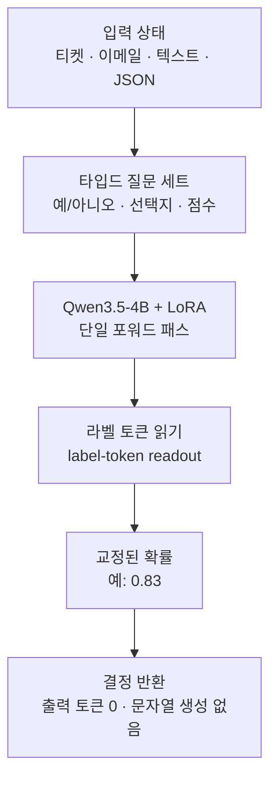

*Lev가 출력하는 "교정된 확률"이라는 System One의 본질을 추상적으로 형상화했습니다.*

## 왜 읽어야 하나

소프트웨어가 스스로 결정하는 지점을 만들며 "이 티켓은 에스컬레이션할까, 이 이메일은 스팸일까, 이 액션은 승인할까" 같은 질문을 LLM에 던지는 팀이라면 이 글이 해당합니다. 또는 오픈웨이트 모델 중, 답을 숫자로 받아야 하는 결정을 다루는 쪽이라면 이 글은 그 쪽입니다. 결론을 먼저 드립니다. Lev는 TypeSafe의 System One 결정 모델 Jev를 오픈웨이트로 가져온 4B 모델로, 프롬프트에 맞춘 타입드 질문에 무작위 텍스트를 생성하지 않고 교정된 확률 하나를 반환합니다. 그래서 출력 토큰이 0이고 같은 질문을 답하는 데 프론티어 LLM보다 한 두 자릿수 빠른 것이 이 아키텍처의 본질입니다. 다만 정확도 자체는 Jev보다 약간 낮고 "최상위"라는 주장은 S1Bench라는 특정 보드 안에서, 4B 이하 클래스 안에서만 성립합니다.

## 개요

Interfaze(YC P26)는 2026년 9월에 TypeSafe의 Jev를 오픈소스로 공개합니다. 공개한 모델의 이름은 Lev이고 [Hugging Face](https://huggingface.co/interfaze-ai/lev)에 가중치, [GitHub](https://github.com/InterfazeAI/lev)에 모델과 측정 하네스, [공식 블로그](https://interfaze.ai/blog/jev-now-open-source-lev)에 발표가 올라 있습니다.

Jev는 TypeSafe가 "System One"이라는 모델 계통의 첫 주자이자 플래그십으로 만든 모델입니다. [TypeSafe의 System One 문서](https://docs.typesafe.ai/concepts/system-one)에 따르면 System One 모델은 소프트웨어 내부의 결정을 빠르고 구조적으로 내는 모델이고 Jev가 그 계통의 원형입니다. Lev는 이 Jev의 오픈웨이트 버전으로, "같은 API를 쓰고 로컬에서 돌아간다"는 것이 공식 발표의 핵심 문장입니다.

모델 구성은 간명합니다. 베이스는 Qwen3.5-4B이고 그 위에 LoRA 어댑터를 얹은 형태이며 전체 파라미터는 4B입니다. [GitHub 저장소](https://github.com/InterfazeAI/lev)의 설명은 "Qwen3.5-4B + LoRA, H100 한 장으로 훈련"이라고 적혀 있습니다. 라이선스는 [Hugging Face 모델 카드](https://huggingface.co/interfaze-ai/lev) 기준 Apache-2.0이며, 모델 가중치와 LoRA 어댑터 양쪽에 적용됩니다. 4B 규모라 공식 발표에서는 "맥북이나 작은 GPU에서 충분히 돌 수 있다"고 합니다.

## System One 모델이란 무엇인가

여기서 "System One"이라는 말이 무엇을 뜻하는지부터 짚어야 합니다. 이름에서 알 수 있듯 Kahneman의 사고 체계에서 "빠르고 자동적인 System 1"을 모델링한 계통입니다. 중요한 것은 이 체계가 결정을 어떻게 표현하느냐입니다.

일반 LLM, 즉 이 글에서는 System Two로 부르는 모델은 질문을 받으면 텍스트를 생성합니다. "예"라고 답하라고 해도 실제로는 몇 개 토큰을 잇어서 "예, 이 티켓은 에스컬레이션해야 합니다" 같은 문장을 만들어 냅니다. 이 출력은 사람에게는 자연스럽지만 기계에는 불편합니다. 파싱해야 하고 형식이 매번 달라지며 그 자체가 매번 생성되는 문장이라 신뢰하기 어렵습니다. 결정에 쓰려면 이 문장에서 의미를 다시 뽑아야 합니다.

System One 모델은 이 생성을 통째로 버립니다. 대신 모델에 두 가지를 줍니다. 첫 번째는 상태, 즉 텍스트든 티켓이든 이메일이든 JSON이든 입력 자체. 두 번째는 타입드 질문의 세트, 즉 예/아니오, 여러 선택지 중 하나, 수치 점수처럼 답의 형태가 정해진 질문들입니다. 그러면 모델은 각 질문에 대해 확률로 답합니다. "이 티켓은 에스컬레이션할까"라는 예/아니오 질문에 0.83을 반환하는 식입니다.

*System Two(일반 생성 LLM)와 System One(Lev 결정 모델)의 작동 방식, 지연, 통합 난이도, 출력 예시를 나란히 비교했습니다.*

이 확률이 "교정된(calibrated)"이라는 것이 System One의 핵심입니다. 0.83이라는 값은 강한 확신을 넘어, 같은 조건의 질문 100개 중 실제로 83번 정도가 "예"일 것이라는 빈도와 대응합니다. 그래서 이 숫자를 임계값으로 삼아 "0.8이 넘으면 자동 승인, 그 이하에선 사람 검토" 같은 결정을 내릴 수 있습니다. 문장이라면 이런 게이트를 만들기가 어려웠을 것입니다.

출력 방식은 라벨 토큰 리드아웃(label-token readout)입니다. [GitHub 저장소의 hf 디렉터리](https://github.com/InterfazeAI/lev/tree/main/hf)가 강조하는 "출력 토큰 0"의 정체는 바로 이 방식입니다. 모델은 답을 토큰으로 잇어 생성하지 않습니다. 이미 학습된 라벨(예, 아니오, 각 선택지, 각 점수) 토큰의 로짓에서 확률을 읽습니다. 생성을 하지 않으므로 출력 길이가 0이며, 프론티어 LLM보다 40~200배 빠르다는 주장의 근거가 여기에 있습니다. [DataCamp의 Jev 해설](https://www.datacamp.com/blog/system-one-models-jev)이 System One 모델의 속도 우위를 이 범위로 소개합니다.

아키텍처를 도식으로 보면 다음과 같습니다.

한 포워드 패스로 질문 세트 전체에 확률로 답한다는 것이, "한 문장을 생성하는 데 수많은 디코드 스텝을 쓰는" 일반 LLM과 구조적으로 다른 지점입니다.

## Lev 모델 카드

Lev의 모델 카드는 "System One을 4B로, 오픈웨이트로, 로컬에서"라는 세 개의 제약 조건을 동시에 만족시키려는 설계입니다.

베이스가 Qwen3.5-4B라는 점은 중요합니다. 비전이나 생성 능력은 베이스가 이미 갖고 있고, Lev가 새로 학습한 것은 "타입드 질문에 라벨 토큰으로 교정된 확률을 매기는 것"입니다. LoRA가 그 이식을 담당합니다. 그래서 가중치 파일은 Qwen 베이스 + 작은 LoRA 어댑터의 형태이고, H100 한 장으로 훈련했다는 기록도 여기서 성립합니다.

GitHub 저장소는 모델과 측정 하네스를 함께 공개합니다. "Lev는 System One 결정 모델이자 그것을 측정하는 하네스"라는 저장소 설명이 이 뜻입니다. 하네스는 S1Bench라는 보드 위에서 모델의 정확도와 캘리브레이션을 재는 장치이고, Lev와 Jev를 같은 하네스로 통과시켜 수치를 고정합니다.

저장소의 [TRAINING 문서](https://github.com/InterfazeAI/lev/blob/main/docs/TRAINING.md)는 System One 설계의 본질을 잘 드러내는 인사이트를 줍니다. S1Bench에서 튜닝하지 않은 27B 모델도 라벨 토큰 리드아웃만 붙이면 Jev와 1점 차(0.7582)까지 정확도를 올린다는 것입니다. 그런데 문서가 "진짜 격차"라고 짚는 것은 정확도가 아니라 캘리브레이션입니다. 같은 S1Bench에서 정확도는 큰 모델이 쉽게 따라오지만, 확률이 실제 빈도와 얼마나 일치하는가, 즉 교정은 그 축에서 4B도 26~35B와 경쟁할 수 있다는 것이 Lev 설계의 핵심 주장입니다. 결정 모델은 "더 정확하게"보다 "어떤 확률을 내는가"가 중요하고, 그래서 교정이 설계 축으로 올라온 것입니다.

## 벤치마크: S1Bench에서 어디쯤인가

우리는 이 모델을 로컬에서 재현하지 않았습니다. 4B 가중치 다운로드와 추론을 이 환경에서 실행하지 못했기 때문에, 아래 수치는 전부 Interfaze가 자체 하네스로 S1Bench를 돌려 공개한 공식 값입니다. 재현을 주장하지 않는다고 명시합니다.

공식 [블로그](https://interfaze.ai/blog/jev-now-open-source-lev)와 [GitHub의 hf 디렉터리](https://github.com/InterfazeAI/lev/tree/main/hf)에 따르면 Lev는 공개 S1Bench 보드에서 모든 모델이 완료한 6개 서브셋에서 71.9%를 기록합니다. 이 구간에서 reflex-4b와 동률이고, 4B 이하 모델 중 더 높은 점수를 내는 모델은 없습니다. Jev와 26~35B 오픈 모델 3종이 그 위에 있습니다. 전체 13개 S1Bench 서브셋을 통틀면 68.9%입니다.

수치와 비교 대상은 정리하면 다음과 같습니다.

| 모델 | 파라미터 | S1Bench (공개 보드 6개 서브셋) | 비고 |
|---|---|---|---|
| Lev (Interfaze) | 4B (Qwen3.5-4B + LoRA) | 71.9% | reflex-4b와 동률, 4B 이하 최상위 |
| reflex-4b | 4B | 71.9% | Lev와 동률 |
| Jev (TypeSafe) | 비공개 | Lev보다 약간 높음 | System One 원형, 공개 보드 최상위권 |
| 26~35B 오픈 모델 3종 | 26~35B | Lev보다 높음 | 크기에서 우위 |

*S1Bench 6개 서브셋 기준 비교입니다. Lev(4B)는 71.9%로 reflex-4b와 동률, 4B 이하 최상위이고 Jev와 26~35B 오픈 모델 3종이 그 위에 있습니다. 우측은 "크기가 아니라 교정"이라는 Lev 설계의 핵심을 정리합니다.*

두 가지 검증 장치가 붙어 있습니다. 첫째, Lev와 TypeSafe의 Jev를 같은 하네스로 3,880개 항목 전체를 통과시켜 S1Bench 수치를 Nimble의 매니페스트로 고정했습니다. 둘째, Interfaze의 Jev 실행 값이 TypeSafe가 발표한 수치와 0.8점 이내로 일치한다는 기록이 있습니다. 즉 Lev의 수치는 Jev를 함께 재측정해 보드의 재현 가능성을 확인한 뒤 나온 값입니다.

## ThakiCloud 제품 적용 시사점

이 모델을 ThakiCloud의 두 제품 관점에서 봅니다.

*ThakiCloud의 두 제품 관점입니다. Metis(서빙 경제학 렌즈)는 디코딩 토큰 스트림이 소멸해 출력 비용이 고정(Flat-cost)되는 서빙 구조, Paxis(에이전트 렌즈)는 수치형 확률로 텍스트 파싱 없이 임계값 게이트를 걸 수 있는 구조를 보여줍니다.*

**ai-platform(Metis/서빙) 렌즈.** Lev가 보여주는 서빙 프로필은 일반 생성 LLM과 다른 축에 있습니다. 디코딩할 토큰 스트림이 없기 때문에, "출력 길이 × 디코드 스텝"으로 결정되는 생성 서빙의 비용 구조가 여기에 그대로 적용되지 않습니다. 같은 질문을 답하는 비용은 "한 포워드 패스 + 라벨 로짓 읽기"에 수렴합니다. 결과적으로 같은 결정 워크로드를 싼 GPU, 또는 클라이언트 쪽(맥북)에서 돌려도 되는 범위가 넓어집니다. 4B Apache-2.0이라는 조합은 폐쇄망(온프레미스, 소버린)에서 외부 API 없이 결정 엔드포인트를 세우는 선택지로도 성립합니다. Metis 서버리스 관점에서는 이 모델이 "규모가 작은 결정형 워크로드"를 어떻게 처리하는가, 즉 서브-비전 규모의 모델까지 서빙 계통으로 끌고 올 수 있는가의 실험 대상입니다.

**Paxis(에이전트) 렌즈.** System One의 출력 계약은 에이전트 하네스가 원하는 형태에 가깝습니다. 에이전트가 도구나 정책을 호출할 때, "예/아니오에 교정된 확률"은 파싱이 필요 없고 임계값으로 게이트를 걸 수 있으며 감사 로그에 숫자로 남습니다. "이 액션을 승인할 확률이 0.92"는 "승인해도 된다고 판단됩니다"라는 문장보다 정책 게이트와 감사에서 다루기 쉽습니다. Paxis가 스킬·도구·정책·감사 로그를 일급 리소스로 다루는 구조라면, 타입드 결정을 일급 출력으로 주는 모델은 그 계약과 자연스럽게 맞물립니다.

**서빙 경제학.** 40~200배라는 속도 주장은 TypeSafe의 System One 계통에 대한 것이고, Lev 개별의 정확한 처리량 수치는 [저장소의 Speed receipt](https://github.com/InterfazeAI/lev)에 있으며 이 글에서는 인용하지 않습니다. 단, 구조적 사실 하나는 분명합니다. 출력 토큰이 0이므로 생성 LLM의 "출력 토큰 단가"가 이 모델에는 존재하지 않습니다. 비용이 출력 길이에 비례하지 않는 결정은, 같은 하드웨어에서 처리 가능한 결정의 수가 생성 LLM에 비해 큰 폭으로 늘어날 여지가 있습니다. 이것이 System One이 "소프트웨어가 스스로 결정하는 지점"에 쓸 수 있는 이유입니다.

## 한계 및 반론

이 모델의 한계를 짚습니다.

첫째, 범주입니다. Lev는 결정 모델이지 일반 추론 모델이 아닙니다. 답의 형태를 타입드 질문으로 미리 정해야 하고 그 틀 안에서 확률을 반환합니다. 대화를 열고 새 정보를 만들어 내는 용도에는 부적합합니다. "이 티켓은 스팸인가"는 되지만 "이 티켓에 대해 어떻게 할지 생각해 봐"까지는 아닙니다. 질문을 제대로 프레이밍하는 비용이 모델 자체의 정확도와 별개의 축으로 남습니다.

둘째, "최상위" 주장의 범위입니다. 4B 이하 최상위는 S1Bench라는 특정 보드, 특정 클래스 안의 결과입니다. 독립 보드인 [JevBench](https://jev-ai.pro/jevbench)에서는 다른 오픈 4B 모델(decider-4b v2)이 Jev보다 0.8점 높은 복합 점수를 기록했다는 보도도 있습니다. 보드에 따라 순위가 바뀐다는 뜻이므로, "4B 결정 모델"이라는 범주 전체의 왕좌를 넘겨받은 것은 아닙니다.

셋째, 재현 범위입니다. 이 글의 수치는 Interfaze의 자체 하네스 실행값이고 S1Bench 수치는 Nimble 매니페스트로 고정된 것입니다. 재현이 하네스와 매니페스트에 의존한다는 뜻입니다. 우리가 로컬에서 재확인하지 못했다는 사실 자체도 한계로 기록합니다.

넷째, 캘리브레이션의 전제입니다. System One의 가치가 "교정된 확률"에서 온다면, 그 교정은 훈련과 평가가 같은 분포에서 성립할 때 유지됩니다. 실제 배포 환경의 질문 분포가 S1Bench와 다르면, 0.83이 "실제로 83번 중 83"을 보장하지는 않습니다. 임계값 게이트를 세우기 전, 우리 워크로드 분포에서 교정을 다시 확인하는 단계가 선행 조건입니다.

다섯째, 라이선스의 잔여 리스크입니다. 가중치와 LoRA는 Apache-2.0이지만, Hugging Face 모델 카드가 일부 학습 데이터셋에는 비상업 라이선스가 붙을 수 있다고 경고합니다. 상업 서빙에 쓰기 전 데이터셋 라이선스 검토가 필요합니다.

*도입 전 검토 사항입니다. 범위 및 엔지니어링 제약(타입드 질문 프레이밍 비용), 환경적 캘리브레이션 드리프트(독립 보드 순위 변동, 배포 분포 재검증), 데이터셋 라이선스(Apache-2.0 가중치 vs 비상업 데이터셋) 세 축으로 정리했습니다.*

이 모델의 판단을 바꿀 만한 이벤트도 정리해 둡니다. 첫째, S1Bench가 아닌 독립 보드에서 4B 이하 최상위가 재확인될 때. 둘째, 우리 결정 워크로드 분포에서 캘리브레이션이 S1Bench와 일정한 것으로 재측정될 때. 셋째, Apache-2.0 가중치와 데이터셋 라이선스의 충돌이 해소될 때. 셋 다 아직 관찰 대상입니다.

## 정리

Interfaze가 공개한 Lev는 4B 가중치 하나만이 아닙니다. "결정을 교정된 확률로 반환한다"는 System One의 출력 계약을 오픈웨이트로 가져온 것입니다. Qwen3.5-4B에 LoRA를 얹고 라벨 토큰 리드아웃으로 출력 토큰 0을 만들며 Apache-2.0으로 배포했습니다. 공식 S1Bench 수치에서 공개 보드 6개 서브셋 71.9%로 4B 이하 최상위이고 26~35B 모델 3종과 Jev는 그 위에 있습니다.

도입 관점에서 한 줄 결론. 소프트웨어가 스스로 결정하는 지점을 만들며 그 결정을 숫자로 받으려면, 이 모델이 그 계약을 어떻게 구현하는지부터 보는 것이 출발점입니다. 교정이 축이고 결정의 수가 비용 단위인 아키텍처입니다. 4B Apache-2.0이라는 점에서 폐쇄망이나 클라이언트 쪽 결정 엔드포인트의 후보로도 충분하고 실제로 쓰기 전에는 우리 분포에서 캘리브레이션을 재확인하고 데이터셋 라이선스를 점검하는 두 단계를 거쳐야 합니다.

## 출처

- [Interfaze: Jev, now open source: Lev (공식 발표)](https://interfaze.ai/blog/jev-now-open-source-lev)
- [Hugging Face: interfaze-ai/lev 모델 카드](https://huggingface.co/interfaze-ai/lev)
- [GitHub: InterfazeAI/lev (모델 + 측정 하네스)](https://github.com/InterfazeAI/lev)
- [GitHub: InterfazeAI/lev, hf 디렉터리 (S1Bench 수치)](https://github.com/InterfazeAI/lev/tree/main/hf)
- [GitHub: InterfazeAI/lev, TRAINING 문서 (캘리브레이션 인사이트)](https://github.com/InterfazeAI/lev/blob/main/docs/TRAINING.md)
- [TypeSafe: System One 개념 문서](https://docs.typesafe.ai/concepts/system-one)
- [DataCamp: Jev, TypeSafe의 System One 모델 해설](https://www.datacamp.com/blog/system-one-models-jev)
- [JevBench (독립 결정 모델 보드)](https://jev-ai.pro/jevbench)
- AGI Hunt: Interfaze, Jev를 Lev로 오픈소스 (2차 보도)
