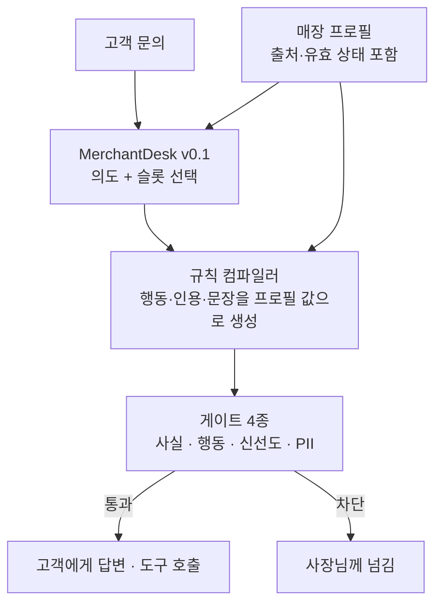

동네 가게의 고객 문의를 대신 받는 AI를 만들고 있다면, 이 글의 결론은 한 줄입니다. 모델에게 가게를 외우게 하지 말고 판단만 가르치고 사실은 코드가 매장 정보에서 직접 꺼내게 하면 됩니다. 다키클라우드는 이 방식으로 학습한 27B 모델 `Qwen3.8-27B-Human-KO-MerchantDesk-v0.1`을 허깅페이스에 공개했습니다. 우리나라 소상공인 사장님들을 위해 만든 모델입니다. 손님 문의에 일일이 답하느라 조리와 계산 사이를 오가는 사장님의 시간을 덜어 드리는 것이 이 모델의 목적입니다.

## 왜 읽어야 하나

소상공인 챗봇이 실패하는 지점은 대부분 말투가 아닙니다. 영업시간을 지어내고 메뉴에 없는 음식을 판다고 답하고 예약 가능한 시간인데도 "사장님께 확인해 보겠습니다"로 넘겨 버리는 쪽이 문제입니다. 앞의 두 가지는 신뢰를 깹니다. 마지막 하나는 사장님의 일을 덜어 주지 못합니다. 이번 모델은 이 세 가지를 동시에 줄이는 것을 목표로 학습했고 그 결과를 학습 없이 만들 수 있는 가장 강한 대조군과 나란히 비교했습니다.

## 모델이 하는 일

MerchantDesk는 요청마다 두 가지를 받습니다. 하나는 매장 프로필로, 요일별 영업시간, 메뉴와 가격, 예약 규정, 배달 가능 지역, 주차와 시설 정보가 각 필드의 출처와 유효 상태와 함께 들어 있습니다. 다른 하나는 고객의 말입니다. 모델은 이 둘을 읽고 JSON 한 개를 돌려줍니다.

```json
{"intent": "reservation.create",
 "slots": {"date": "2026-10-03", "time": "19:00", "party_size": 4},
 "action": "tool_call",
 "tool": {"name": "reservation.check_availability", "args": {}},
 "answer": "...", "cites": ["reservation.policy"]}
```

의도는 영업시간, 위치와 주차, 메뉴와 가격, 품절 여부, 추천, 예약 생성과 변경과 취소, 포장과 배달, 결제, 환불 규정, 대기 시간, 단체 수용, 시설, 쿠폰, 불만, 업무 밖 질문까지 25가지입니다. 행동은 네 가지뿐입니다. 바로 답하거나, 빠진 정보 하나를 되묻거나, 도구로 조회하거나, 사장님께 넘깁니다. 예를 들어 "토요일 저녁 7시에 4명 예약 되나요?"라는 질문이라면 예약 생성 의도에 날짜와 시간과 인원 슬롯을 채우고 자리가 있는지는 추측하지 않고 예약 조회 도구를 부르는 것이 정답입니다.

이 모델은 가게에 대해 아무것도 외우지 않습니다. 가격과 시간은 전부 요청에 같이 들어온 프로필에서만 옵니다. 학습으로 가르친 것은 "이 질문이 무슨 의도이고 지금 가진 정보로 답해도 되는가"라는 판단입니다. 그래서 한 번 학습한 모델을 수백 개 가게에 그대로 쓸 수 있고 가게 정보가 바뀌어도 다시 학습할 필요가 없습니다.

## 판단은 모델이, 문장은 코드가

실제 서비스에서는 모델의 JSON을 그대로 고객에게 보내지 않습니다. 모델이 고른 의도와 슬롯만 받아서 규칙 컴파일러가 행동과 인용과 문장을 프로필 값으로 채웁니다. 그리고 나가기 직전에 네 개의 게이트가 한 번 더 봅니다. 문장 속 가격과 시간이 프로필과 맞는지 보는 사실 게이트, 모델에게 허락된 도구만 불렀는지 보는 행동 게이트, 오래된 정보를 확정처럼 말하지 않았는지 보는 신선도 게이트, 개인정보가 새지 않는지 보는 PII 게이트입니다.



*모델은 판단만 하고 고객에게 나가는 값은 코드가 프로필에서 직접 꺼냅니다.*

이렇게 나눈 이유는 결과에서 분명하게 드러났습니다. 뒤에서 다시 다루겠지만, 전용 학습을 한 모델은 판단은 더 잘하면서도 스스로 쓴 문장에서는 프로필에 없는 사실을 더 자주 말했습니다. 판단과 문장을 한 모델에 맡기면 이 두 성질이 함께 따라옵니다. 떼어 놓으면 좋은 쪽만 가져올 수 있습니다.

## 무엇과 비교했나

비교 대상은 셋입니다. A는 학습하지 않은 기준 모델 `Qwen3.8-27B-Human-KO`에 같은 컴파일러와 게이트와 프롬프트를 붙인 것으로, 학습 없이 만들 수 있는 가장 강한 제품입니다. C는 기업 상담 정책을 학습한 범용 정책 모델 `Qwen3.8-27B-Human-KO-Enterprise-v0.2`입니다. B가 이번에 공개한 MerchantDesk입니다. 모든 비교는 같은 프로필 직렬화, 같은 컴파일러와 게이트, 같은 디코딩 설정 위에서 짝을 지어 했습니다. A와 B는 최종 프롬프트 v1.2로, A와 C는 그 직전 버전인 v1.1로 맞대어 봤습니다.

왜 C까지 넣었을까요. B가 A를 이기더라도, 그것이 소상공인 데이터 덕분인지 "정책을 읽고 행동을 고르는" 일반 능력 덕분인지는 A와 B만으로는 구분할 수 없습니다. 이미 그 일반 능력을 학습한 C가 B만큼 잘한다면, 업종마다 전용 모델을 만들 이유가 없습니다.

평가 셋은 두 개입니다. IID 셋은 합성 매장 300곳에 매장마다 고객 문의 20건씩, 모두 6,000건입니다. Hard 셋은 두 라벨러가 정답 행동을 다르게 매긴 까다로운 대화 600건을 따로 모았고 두 판단 중 하나라도 맞히면 정답으로 칩니다. 모든 차이는 매장 단위로 다시 뽑는 부트스트랩으로 95% 구간을 냈습니다. 같은 매장의 문의끼리는 서로 닮기 때문에, 문의 단위로 구간을 내면 실제보다 좁게 나옵니다.

## 결과

| 지표 | A 기준 모델 | B MerchantDesk | B − A (95% 구간) |
|---|---|---|---|
| 해결률, IID | 0.609 | **0.708** | +10.0%p (9.0 ~ 11.0) |
| 해결률, Hard | 0.473 | **0.557** | +8.3%p (4.1 ~ 12.7) |
| 의도 정확도, IID | 0.736 | **0.866** | +13.0%p (12.0 ~ 14.0) |
| 행동 정확도, IID | 0.817 | **0.881** | +6.4%p (5.5 ~ 7.4) |
| 불필요하게 사장님께 넘긴 비율, IID | 0.104 | **0.042** | −6.2%p |
| 근거 없는 사실 | 0 / 6,000 | 0 / 6,000 | 0 |


*해결률은 의도, 행동, 인용, 도구 호출이 모두 맞은 대화의 비율입니다. 프롬프트 v1.2 기준이며 두 벤치 모두에서 B가 A보다 높습니다.*

가장 크게 움직인 것은 의도 정확도입니다. 기준 모델은 메뉴에 없는 음식을 묻는 질문이나 프로필에 정보가 없는 질문을 "업무 밖"으로 분류하는 경향이 있었고 그 결과 멀쩡히 답할 수 있는 문의를 사장님께 넘겼습니다. 전용 학습 뒤에는 이 과잉 연결이 10.4%에서 4.2%로 줄었습니다. 사장님 입장에서는 하루 백 건의 문의 중 여섯 건을 덜 직접 받게 되는 셈입니다.

근거 없는 사실이 세 모델 모두 0건이라는 점도 중요합니다. 이것은 모델이 거짓말을 안 해서가 아니라, 컴파일러가 모델의 문장을 쓰지 않고 게이트가 한 번 더 걸러서 나온 숫자입니다. 6,000건에서 0건이면 매장 단위 상관을 고려해도 95% 상한이 0.1% 아래로 떨어집니다. 출시 기준으로 잡은 선을 두 모델 모두 넘었지만, 해결률 기준선 60% 대비 여유는 A가 0.9%p, B가 10.8%p였습니다.

C는 예상을 빗나갔습니다. 외부 리뷰에서는 범용 정책 모델이 전용 모델만큼 할 것이라는 의견이 있었는데, 실제로는 같은 v1.1 프롬프트에서 기준 모델보다 해결률이 IID에서 5.9%p(구간 5.2 ~ 6.7), Hard에서 2.8%p(구간 0.7 ~ 4.9) 낮았습니다. 기업 상담에서 배운 "확인하고 넘기는" 습관이 동네 가게 문의에서는 과잉 연결로 나타났습니다. 불필요하게 사장님께 넘긴 비율이 16.9%에서 21.6%로 올랐습니다. 적어도 이 과제에서는 정책 판단 능력이 업종을 건너 그대로 옮겨 오지 않았습니다.

## 모델 출력을 그대로 쓰면 안 되는 이유

같은 모델의 출력을 컴파일러 없이 채점하면 이야기가 달라집니다. Hard 셋에서 B가 직접 쓴 문장에 프로필에 없는 사실이 들어간 비율은 7.5%로, 기준 모델의 4.0%보다 3.5%p 높았습니다(구간 1.1 ~ 5.8). 전용 학습은 모델을 더 자신 있게 만들었고 그 자신감이 판단에서는 정확도로, 문장에서는 과감함으로 나타난 것입니다.

그래서 이 모델은 컴파일러와 게이트를 함께 쓰는 것을 전제로 공개합니다. 모델 카드에도 같은 경고를 적었습니다. 의도와 슬롯만 받아 쓰고 고객에게 나가는 문장은 프로필 값을 채우는 템플릿이나 규칙 엔진으로 만들고 가격과 시간과 금액이 프로필과 맞는지 확인하는 단계를 두시기 바랍니다.

## ThakiCloud 제품 적용 시사점

이 모델이 보여 주는 설계는 Paxis가 에이전트를 다루는 방식과 같습니다. Paxis는 스킬과 도구와 정책과 감사 로그를 일급 자원으로 두고 에이전트의 행동이 정책 게이트를 통과해야만 실행되게 합니다. MerchantDesk에서 모델이 고르고 컴파일러가 만들고 게이트가 막는 구조는 그 원칙을 매장 한 곳 크기로 줄인 것입니다. 판단을 모델에, 사실과 권한을 결정론 코드에 두면 모델을 바꾸거나 업종을 늘려도 안전 경계는 그대로 남습니다.

실행 비용 쪽에서는 Metis와 Maxis가 맞물립니다. 이번 모델은 27B 베이스 위에 LoRA r8 어댑터를 1에폭 학습해 병합한 것으로, 업종 하나를 위해 새 베이스 모델을 만들 필요가 없었습니다. 같은 방식으로 미용실이나 소매점용 어댑터를 Maxis에서 학습하고 Metis에서 하나의 베이스 위에 서빙하는 경로가 자연스럽게 이어집니다. 다만 vLLM에서 이 하이브리드 구조에 LoRA를 그대로 붙이면 어댑터가 조용히 적용되지 않는 문제가 있어서(vllm-project/vllm#38085), 지금은 병합한 가중치로 서빙합니다.

## 한계

확인이 끝나지 않은 부분도 남아 있습니다. 이번 결과는 시드 하나로 학습한 모델에서 나왔고 같은 설정으로 시드 두 개를 더 학습하는 중입니다. 결과가 나오면 분산을 모델 카드에 덧붙이겠습니다. 음식점 업종만 다루며 다른 업종은 의도 체계부터 새로 정해야 합니다. 평가는 BF16 병합본으로 했고 4비트 양자화본은 따로 검증 중입니다. 일반 지식과 코딩과 안전 벤치는 아직 재지 않았으므로, 기준 모델의 일반 능력이 그대로 유지된다고 가정하지 마시기 바랍니다.

정답 라벨은 규칙 코드로 계산했습니다. 이 코드와 독립적인 외부 판정자에게 200건을 따로 매기게 했을 때 행동 일치율은 95.5%였고 엇갈린 9건에서 코드 쪽 오류는 없었습니다. 그래도 규칙 자체가 틀렸다면 세 모델이 모두 같은 방향으로 틀리게 채점됐을 가능성은 남아 있습니다.

## 정리

MerchantDesk v0.1은 우리나라 소상공인 사장님들을 위해, 동네 음식점 문의를 받는 데 필요한 판단을 학습한 27B 모델이고 학습 없는 가장 강한 대조군보다 해결률이 IID에서 10.0%p, 어려운 대화에서 8.3%p 높습니다. 대신 스스로 쓰는 문장은 더 과감해지므로 규칙 컴파일러와 사실 게이트를 함께 써야 합니다. 판단은 모델이, 사실은 코드가 맡는다는 원칙이 이 모델을 쓰는 가장 짧은 설명입니다.

## 링크

- 병합 모델: [ThakiCloud/Qwen3.8-27B-Human-KO-MerchantDesk-v0.1](https://huggingface.co/ThakiCloud/Qwen3.8-27B-Human-KO-MerchantDesk-v0.1)
- LoRA 어댑터: [ThakiCloud/Qwen3.8-27B-Human-KO-MerchantDesk-v0.1-LoRA](https://huggingface.co/ThakiCloud/Qwen3.8-27B-Human-KO-MerchantDesk-v0.1-LoRA)
- 컬렉션: [Merchant Desk 컬렉션](https://huggingface.co/collections/ThakiCloud/merchant-desk-korean-small-business-customer-desk-6aba5da20fbd297da8cdc3c7)
- 기준 모델: [ThakiCloud/Qwen3.8-27B-Human-KO](https://huggingface.co/ThakiCloud/Qwen3.8-27B-Human-KO)
- 비교 모델: [ThakiCloud/Qwen3.8-27B-Human-KO-Enterprise-v0.2](https://huggingface.co/ThakiCloud/Qwen3.8-27B-Human-KO-Enterprise-v0.2)

## 출처

이 모델은 과학기술정보통신부의 재원으로 한국지능정보사회진흥원의 지원을 받아 구축된 AI 허브(https://aihub.or.kr) 데이터 「소상공인 고객 주문 질의-응답 텍스트」를 학습에 활용했습니다. 공개 저장소에는 원본 데이터나 그 가공본이 들어 있지 않습니다.
