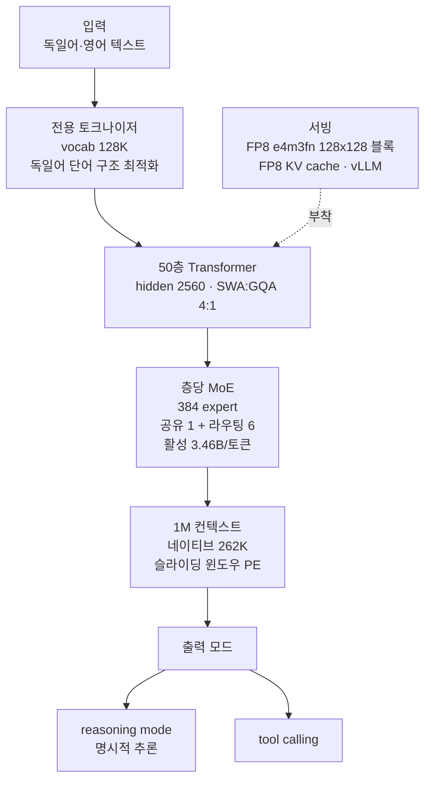

## 왜 읽어야 하나

소버린 AI나 온프레미스 LLM 도입을 검토하는 플랫폼 담당자, EU 고객 대상 독일어 성능이 필요한 제품팀이라면 이 모델카드를 읽어야 합니다. 결론은 한 줄입니다. **Aleph Alpha가 2026년 10월 3일 Apache 2.0으로 공개한 Kolibri 1은 "독일어와 영어에서 강한, 토큰당 활성 3.46B의 78B MoE"로, H200 1장이라는 최소 하드웨어 요구와 검증된 1M 컨텍스트를 갖춘 소버린 오픈웨이트 옵션입니다.** 다만 트윗이 붙인 "프런티어 레이스 진입"이라는 수식어는 모델카드의 실제 비교 집합보다 크게 부풀린 것입니다.

## 개요

2026년 10월 5일, "GERMANY JUST ENTERED THE FRONTIER LLM RACE. Meet Kolibri, a new sovereign open source model"이라는 트윗이 돌았습니다. 원출처는 독일 베를린의 AI 기업 Aleph Alpha로, 공개 당일인 10월 3일에 기술 보고서(PDF)와 함께 블로그 포스트를 내놓았습니다. Hugging Face의 모델 리포지토리는 10월 2일 생성되었고, 공개 이틀 만에 커뮤니티 양자화(GGUF, MLX, NVFP4 등)가 15종 이상 쌓였습니다.

이 모델의 가장 큰 특징은 "breadth 대신 depth"라는 명시적 선택입니다. 모델카드는 다국어를 두지 않고 독일어와 영어 두 개 언어에 집중했으며, 독일어 단어 구조에 맞춘 전용 토크나이저까지 만들었습니다. EU GPAI Code of Practice 서명 기업이라는 점, Apache 2.0 라이선스라는 점, 그리고 자체 훈련·서빙 스택(B200 768장으로 21일 훈련)을 공개했다는 점에서 "소버린"이라는 단어가 마케팅이 아니라 설계 목표였다는 것을 알 수 있습니다.

## 이 모델은 무엇인가

구조는 mixture-of-experts입니다. 50개 층, 층마다 384개 expert(공유 1개 + 라우팅 6개)로, 총합 파라미터는 78,103,074,560(약 78B)이고 토큰당 활성은 3,457,573,120(약 3.46B)입니다. hidden size 2560, 어텐션 헤드 48, KV 헤드 4의 4:1 SWA:GQA 구성이고, vocab은 128K입니다. 위치 인코딩은 슬라이딩 윈도우 층에만 적용되어, 컨텍스트를 스케일링 없이 연장할 수 있다는 것이 카드의 설명입니다. 네이티브 262,144 토큰까지 훈련했고, 1,048,576(1M) 토큰까지 품질과 서빙 효율을 검증했다고 명시합니다. 단, 지연이나 처리량 민감 배포에는 262,144 이하를 권합니다.

정밀도는 FP8이 기본입니다. 가중치는 float8_e4m3fn의 128x128 블록에 동적 양자화 activations를 쓰고, FP8 KV cache로 평가했습니다. embeddings, LM head, norms, MoE router만 bfloat16입니다. reasoning mode와 tool calling을 지원하고, OpenAI 호환 API로 서빙되는 것을 전제로 문서화되어 있습니다.

훈련 데이터와 컴퓨트도 공개되어 있습니다. pre-training은 20T 토큰의 이중 언어 코퍼스(약 62.5% 영어, 23.9% 독일어, 13.6% 코드)에, mid-training 3.44T, long-context 확장 201B가 추가되었습니다. post-training은 open-source와 synthetic 데이터를 섞은 SFT와 reasoning·agentic·instruction following 환경을 포함한 RL입니다. 컴퓨트는 NVIDIA B200 768장(96개 HGX 8x 노드)으로, pre-training 21일(511시간, 392k GPUh), FLOPS 6.4e23입니다. energy 항목에는 9.5e2 MWh(추정, 노드 전력 포함)가 적혀 있습니다. knowledge cutoff는 영어·독일어 모두 2026년 6월 18일입니다.

## 벤치마크

모델카드는 자체 eval 테이블을 싣고 있습니다. 비교 집합은 동일 active-parameter 대(3-4B MoE)와 12B MoE, dense 7B/27B/32B/70B이며, reasoning effort high로 측정했습니다. post-training Overall(카테고리 평균의 무가중 mean)을 번역 없이 옮기면 다음과 같습니다.

| 모델 | EN | DE |
|---|---|---|
| **Kolibri** | **75.5** | **70.8** |
| Kolibri Origin | 54.1 | 46.4 |
| Qwen3.5 35B-A3B | 74.7 | 69.8 |
| Qwen3.6 35B-A3B | 71.4 | 67.3 |
| Nemotron 3 Super 120B-A12B | 73.0 | 67.9 |
| GPT-OSS 120B | 72.3 | 70.2 |
| Gemma 4 26B-A4B IT | 71.9 | 66.3 |
| Qwen3-Next 80B-A3B Thinking | 62.4 | 58.0 |
| Nemotron 3 Nano 30B-A3B | 65.6 | 59.3 |
| GLM-4.7 Flash 30B-A3B | 64.7 | 50.4 |
| Mistral Small 4 119B-A6B | 63.1 | 61.4 |
| GLM-4.5 Air 106B-A12B | 64.4 | 64.8 |
| Qwen3.8 27B (dense) | 80.2 | 79.9 |
| Apertus 70B Instruct | - | - |

읽어야 할 곳은 두 곳입니다. 첫째, Kolibri(75.5/70.8)는 MoE 비교군 가운데 EN·DE 모두 최상입니다. Qwen3.5 35B-A3B와 Qwen3.6 35B-A3B, Nemotron 3 Super 120B-A12B를 모두 앞섭니다. 둘째, dense Qwen3.8 27B(80.2/79.9)가 Kolibri보다 높습니다. "동일 active 대 MoE의 정점"이지, "표 전체의 정점"은 아닙니다.

base 모델 단계의 표에서도 같은 그림이 나옵니다. Kolibri Base(81.1/81.5)가 Nemotron 3 Super 120B-A12B Base(83.1/85.0)에 이어 2위입니다. 즉 base는 밀고 post-training으로 역전하는 구조입니다.

트윗의 "Beats Qwen2 635B" 같은 표현은 이 테이블에 대응하는 행이 없습니다. 카드가 실제로 비교하는 Qwen 계열은 Qwen3.5/3.6 35B-A3B, Qwen3-Next 80B-A3B, Qwen3.8 27B입니다. 바이럴 수식어와 모델카드의 실제 청구사항 사이의 간격을 구분해서 읽는 것이 이 글의 목적 중 하나입니다.

## 서빙과 온프레미스

서빙 스택은 vLLM을 전제로 합니다. 리포지토리 메타데이터의 library는 vllm이고, fp8·safetensors 태그가 붙어 있습니다. 모델 메모리 footprint는 약 78GB(FP8 가중치)로, 카드의 하드웨어 요구는 다음과 같습니다.

- 최소: 2x A100 80GB, 2x H100 SXM5, 1x H200, 1x B200 또는 1x B300
- 권장: 2x H100 SXM5, 2x H200, 1x B200 또는 1x B300

H200 1장이 최소 요구의 한 변이라는 점은 실용적으로 중요합니다. MoE의 단점, 즉 활성이 작아도 전체 가중치를 메모리에 올려야 한다는 trade-off가 78GB footprint로 드러나고, FP8 기본 정밀도가 그 부담을 낮추고 있습니다. 커뮤니티 양자화(GGUF 3-8bit, MLX mixed, NVFP4, GPTQ)가 공개 이틀 만에 다수 생긴 것도, 78B MoE가 로컬·소형 클러스터 서빙 대상이 되기 때문으로 읽힙니다.

## ThakiCloud 제품 적용 시사점

ThakiCloud의 ai-platform은 다양한 고객 환경에서 모델을 서빙하는 K8s 기반 AI/ML 인프라이고, 소버린·온프레미스 요구 대응이 핵심 포지션입니다. Kolibri가 이 포지션에 들어맞는 이유는 세 가지입니다.

첫째, EU GPAI Code of Practice 서명 기업의 Apache 2.0 모델이라는 provenance입니다. 온프레미스 배포 시 라이선스 리스크가 없고, 공급자(독일 기업)의 규제 준수 이력을 모델카드에 문서화했습니다. 소버린 요구가 "미국 모델이 아닌 것"에서 "규제 문서화된 것"으로 심화되는 추세에서, 이 프로비네스는 직접적인 차별자입니다.

둘째, H200 1장 최소 요구와 FP8 네이티브입니다. ThakiCloud의 서빙 스택(vLLM, FP8 KV cache, tuned maxModelLen)이 이 모델의 카드 스펙과 일치합니다. 1M 컨텍스트를 검증했다면서도 262K 이하를 권하는 모델카드의 가이드라인은, 우리가 서빙 엔드포인트를 만들 때 max-model-len를 어디로 잡을지 같은 실용 판단에 그대로 쓸 수 있는 정보입니다.

셋째, 독일어 특화 토크나이저와 DE 벤치 70.8입니다. EU 고객 대상 문서 처리·RAG·에이전트 워크플로우에서 영어 모델의 독일어 약점은 반복되는 주제인데, Kolibri는 그 약점을 설계 목표로 삼았습니다. Paxis 관점에서 보면, tool calling과 reasoning mode를 갖춘 이 모델을 EU 고객 온프레미스에 배치하면, 에이전트 워크플로우의 소버린 옵션이 하나 더 생기는 것입니다.

## 한계 및 반론

"프런티어"라는 단어부터 주의가 필요합니다. 총합 78B는 프런티어 스케일이 아니라, active 3-4B MoE의 중간 크기입니다. 카드의 자기 테이블에서도 dense Qwen3.8 27B가 앞섭니다. 바이럴 프레임이 실제 청구사항보다 한 단계 위에 있습니다.

두 언어 선택은 강점이면서 동시에 한계입니다. "depth over breadth"라는 모델카드의 표현 그대로, 한국어·프랑스어·스페인어 등 다른 언어에서는 강보를 기대할 수 없습니다. 우리처럼 다국어 환경을 전제로 하는 플랫폼에는 "독일어·영어 전용 마린"으로 위치짓기 좋습니다.

벤치마크는 전량 모델 제공자 자체 측정입니다. 카테고리 평균의 무가중 mean이라는 집계 방식은 명시되어 있지만, 독립 재측정이 없는 상태입니다. 도입 전에는 반드시 우리 eval 세트(독일어 비즈니스 문서, tool calling, 코딩)로 재검증이 필요합니다.

knowledge cutoff가 2026년 6월 18일이라는 점, MoE 전체 가중치 메모리 부담(약 78GB)이라는 점, 그리고 1M 컨텍스트가 "검증까지"이지 "권장까지"는 아니라는 점도 온프레미스 설계 시 고려 항목입니다.

## 정리

독일어가 필요한 EU 소버린 워크로드를 전제로 한다면, Kolibri는 지금 시점에 가장 검증된 Apache 2.0 오픈웨이트 옵션 중 하나입니다. MoE 비교군 최상(EN 75.5/DE 70.8), H200 1장 최소 요구, FP8 네이티브, vLLM 전제, EU GPAI 서명기업 provenance. 반면 "프런티어" 수식어와 dense Qwen3.8 27B와의 격차, 두 언어 전용이라는 한계는 같이 읽어야 합니다.

다음 단계로 권하는 것은 두 가지입니다. 우리 eval 세트로 독립 재측정하는 것, 그리고 Metis 서빙 엔드포인트를 max-model-len 262K, FP8 KV cache, H200 1장으로 만들어 처리량과 지연을 실측하는 것입니다.

## 출처

- 모델카드 (Hugging Face): https://huggingface.co/Aleph-Alpha/Kolibri-1
- Aleph Alpha 기술 보고서 (PDF): https://aleph-alpha.com/downloads/tech-report.pdf
- Aleph Alpha 블로그: https://aleph-alpha.com/en/blog/kolibri-has-landed-a-sovereign-open-weight-model/
- 관련 트윗(2026-10-05): https://x.com/hjguyhan/status/2107065145038082423
