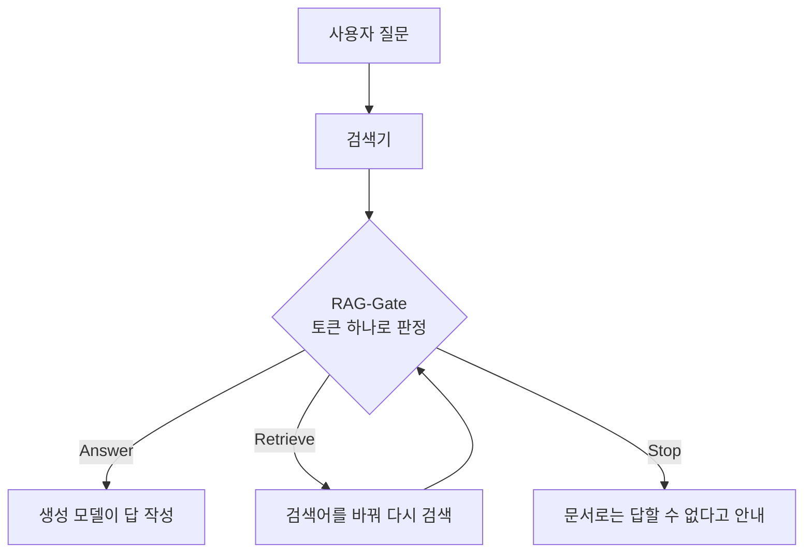

사내 문서로 답하는 RAG 서비스를 운영하고 계신다면 결론부터 드립니다. 답을 쓰기 전에 "지금 가진 문서로 답해도 되는가"를 따로 묻는 작은 모델 하나를 두면, 근거 없는 답과 쓸데없는 거절을 함께 줄일 수 있습니다.

다키클라우드는 그 일만 하는 판정 모델 RAG-Gate를 세 가지 크기(4B, 8B, 9B)로 공개했습니다. 판정은 토큰 하나입니다. 근거가 다 있으면 **Answer**, 모자라지만 더 찾을 수 있으면 **Retrieve**, 모자라고 더 찾을 수도 없으면 **Stop**입니다.

*검색이 끝난 뒤, 답을 쓰기 전에 한 번 서는 자리입니다.*

## 왜 읽어야 하나

RAG를 붙인 챗봇이 틀리는 방식은 크게 두 가지입니다. 하나는 문서에 없는 내용을 그럴듯하게 지어내는 경우입니다. 다른 하나는 문서에 답이 다 있는데도 "확인할 수 없습니다"라며 물러서는 경우입니다. 앞의 것은 신뢰를 깎고, 뒤의 것은 쓸모를 깎습니다.

보통은 생성 모델의 프롬프트에 "근거가 없으면 답하지 마라"를 한 줄 넣고 끝냅니다. 저희가 같은 크기의 원본 모델에 정확히 그 지시를 주고 재 보니, 모델마다 버릇이 전혀 달랐습니다. 4B 모델은 근거가 충분한 질문도 열에 여덟 번 넘게 거절했습니다. 9B 모델은 반대로 근거가 모자란 질문에도 셋 중 하나꼴로 답을 냈습니다. 프롬프트 한 줄로는 어느 쪽 버릇도 고쳐지지 않았습니다.

이 글은 그 판정을 따로 학습한 모델이 무엇을 바꿨는지, 그리고 어디까지 믿으면 되는지를 정리합니다. RAG 품질 지표를 맡고 계신 분, 사내 검색 위에 에이전트를 올리려는 분께 특히 쓸모가 있습니다.

<!-- nlm-visual -->

*NotebookLM이 소스를 종합해 생성한 인포그래픽입니다.*

## 쉽게 말하면

요리사가 주문을 받고 냉장고를 여는 장면을 떠올려 보시면 됩니다. 재료가 다 있으면 바로 요리를 시작합니다. 몇 가지가 빠졌는데 가게가 아직 열려 있으면 장을 보러 갑니다. 빠진 재료가 있고 가게도 닫혔다면 손님께 오늘은 그 메뉴가 안 된다고 말씀드립니다.

RAG-Gate는 이 냉장고 확인만 맡는 보조 요리사입니다. 요리, 곧 답 쓰기는 하지 않습니다. 대신 재료가 정말 다 있는지, 비슷해 보이는 다른 재료를 진짜로 착각하지 않았는지를 봅니다. 그 판단이 서야 주방장인 생성 모델이 엉뚱한 요리를 내지 않습니다.

## 이 모델이 하는 일

입력은 세 가지입니다. 사용자의 질문, 검색기가 가져온 문서들, 그리고 지금 더 검색할 수 있는지 여부(`Retrieval available: YES/NO`)입니다. 출력은 `Final action:` 뒤에 오는 토큰 하나이고, 세 라벨 토큰의 확률을 그대로 읽어 씁니다. 문장을 만들지 않으니 판정 한 번에 드는 시간은 프롬프트를 한 번 읽는 시간과 거의 같습니다.

판정 기준은 학습 데이터에 박혀 있습니다. 답에 필요한 사실이 문서 안에서 끊김 없이 이어져야 Answer입니다. 모델이 원래 알고 있는 지식으로 빈칸을 메우면 안 됩니다. 이 기준은 사용자가 입력하는 프롬프트에도 그대로 적혀 있어서, 모델이 무엇을 기준으로 판정하는지 숨김없이 드러납니다.

## 세 모델이 서로 다른 버릇을 고쳤습니다

평가는 학습에 쓰지 않은 시험 문항 1만 4,818건(서로 다른 다단계 질문 2,256개)으로 했습니다. 비교 대상은 같은 크기의 원본 모델에 똑같은 프롬프트를 준 결과입니다.

*회색 빗금이 학습 전, 파란색이 RAG-Gate입니다. 가운데와 오른쪽 그림은 낮을수록 좋습니다.*

| 크기 | 판정 정확도 (학습 전 → 후) | 근거 없이 답한 비율 | 답할 수 있는데 거절한 비율 |
|---|---|---|---|
| 4B | 46.7% → **95.0%** | 2.4% → 3.7% | 84.9% → **7.0%** |
| 8B | 52.9% → **94.9%** | 10.3% → **4.7%** | 60.6% → **5.7%** |
| 9B | 68.6% → **95.5%** | 31.6% → **3.3%** | 15.5% → **6.2%** |

세 모델의 출발점은 제각각이었습니다. 4B와 8B는 거의 모든 질문에서 물러서는 쪽이었고, 9B는 근거가 없어도 답하는 쪽이었습니다. 학습 뒤에는 세 모델 모두 정확도 95% 안팎, 근거 없는 답변 3~5%, 과잉 거절 6~7%라는 비슷한 자리에 모였습니다. 즉, 사람 말로는 크기와 상관없이 "답할 때 답하고, 아닐 때 물러서는" 같은 습관이 들었다는 뜻입니다.

한 가지는 숨기지 않겠습니다. 4B는 근거 없이 답한 비율이 2.4%에서 3.7%로 조금 늘었습니다. 원본이 거의 답을 하지 않았으니 근거 없는 답도 적었던 것이고, 답을 하기 시작하면서 그 비율이 소폭 오른 것입니다. 8B와 9B는 이 비율까지 함께 내려갔습니다.

## 편집 흔적에 속지 않습니다

판정 모델이 쉽게 빠지는 지름길이 있습니다. 문서가 손을 탄 흔적만 보이면 무조건 거절하는 습관입니다. 이 습관을 배운 모델은 시험 점수는 그럴듯하게 나와도 실제 문서 앞에서는 쓸 수 없습니다. 사내 문서는 원래 계속 고쳐지기 때문입니다.

그래서 시험지에 일부러 함정을 넣었습니다. 방해 문단 하나를 고쳐 넣었지만 답에 필요한 근거는 그대로 남은 문항입니다. 이런 문항의 정답은 Answer입니다. 학습 전 4B는 이 문항을 19.4%만 맞혔고, RAG-Gate-4B는 94.1%를 맞혔습니다. 8B는 46.9%에서 96.2%로, 9B는 91.4%에서 94.9%로 올랐습니다.

반대 방향의 함정도 있습니다. 문서가 겉보기엔 멀쩡한데 중간 연결 고리 하나가 어긋난 경우입니다. 9B 원본은 이런 문항을 17.2%만 알아봤고, RAG-Gate-9B는 94.1%를 알아봤습니다. 판정이 문서의 겉모습이 아니라 근거 사슬이 이어져 있는지를 보게 됐다는 신호입니다.

이 점은 학습과 완전히 따로 만든 시험으로도 확인했습니다. [ChainCheck](https://huggingface.co/datasets/ThakiCloud/ChainCheck)는 같은 질문을 "원문 그대로", "사슬은 살리고 이름만 바꿈", "사슬을 끊음" 세 가지로 만들어, 모델이 편집보다 사슬에 더 크게 반응하는지 재는 벤치마크입니다. 그 지표(Σ)가 0보다 크면 사슬을 더 본다는 뜻입니다. 세 모델 모두 실존 인물 문항과 가상 인물 문항 양쪽에서 Σ가 0보다 컸고, 신뢰구간의 아래 끝도 0 위였습니다. 9B 원본은 두 문항군 모두에서 Σ가 음수였습니다.

## 공개 전에 다섯 관문을 정해 두었습니다

공개 여부는 학습을 시작하기 전에 정한 다섯 조건으로 갈랐습니다. 하나라도 못 넘으면 공개하지 않고 결과만 남기기로 했습니다.

| 관문 | 조건 | 세 모델 |
|---|---|---|
| G1 | 원본 대비 정확도 향상, 신뢰구간 아래 끝이 0보다 큼 | 통과 |
| G2′ | 근거 없는 답 10% 이하, 그리고 과잉 거절 감소 | 통과 |
| G3 | 편집됐지만 충분한 문항 정확도 80% 이상 | 통과 |
| G4 | ChainCheck Σ가 두 문항군 모두 0보다 큼 | 통과 |
| G5 | 공개 파일을 다시 내려받아 200문항 재채점, 판정 일치 98% 이상 | 통과 (일치 100%) |

G2는 원래 "원본보다 근거 없는 답이 적을 것"이었습니다. 그런데 본 학습 전 시험 운전에서 4B 원본이 거의 모든 질문을 거절했습니다. 그 기준이라면 늘 거절만 하는 모델이 이깁니다. 그래서 결과를 보기 전에 G2를 지금의 형태로 바꾸고, 바꾼 이유와 시점을 기록으로 남겼습니다. G5의 합격선도 G5를 돌리기 전에 정했습니다.

G5는 사용자가 실제로 받게 될 파일을 검증하는 관문입니다. 학습 결과를 하나의 가중치 파일로 합칠 때 숫자가 아주 조금 반올림되기 때문에, 합친 파일을 저장소에서 다시 받아 같은 문항을 채점했습니다. 세 모델 모두 200문항에서 판정이 하나도 바뀌지 않았습니다.

## 기업에서 어떻게 쓰면 되나

가장 단순한 자리는 기존 RAG 파이프라인의 검색과 생성 사이입니다. Answer일 때만 생성 모델을 부르면, 근거 없는 답이 사용자에게 닿기 전에 걸러집니다. 생성 모델 호출 자체도 줄어듭니다. 큰 생성 모델 앞에 4B 판정기를 두면, 답할 수 없는 질문에는 큰 모델을 아예 부르지 않게 됩니다.

두 번째 자리는 에이전트의 검색 반복입니다. Retrieve가 나오면 검색어를 바꿔 한 번 더 찾고, 몇 번을 돌아도 Answer가 나오지 않으면 Stop으로 끝내는 식입니다. 검색을 몇 번 할지 정하는 일을 고정 횟수가 아니라 판정 모델에 맡길 수 있습니다. 다키클라우드가 만드는 업무 자동화 플랫폼 Paxis처럼, 에이전트가 사내 문서를 뒤져 일을 처리하는 환경에 잘 맞는 구조입니다.

세 번째는 운영 지표입니다. 판정 확률을 그대로 남겨 두면 "어떤 질문에서 문서가 모자랐는가"가 데이터로 쌓입니다. Stop과 Retrieve가 몰리는 주제는 문서를 보강해야 할 자리입니다.

임계값은 서비스 성격에 맞춰 고르시면 됩니다. 근거 없는 답이 치명적인 금융·법무 문서라면 argmax 대신 `p(Answer)`가 높을 때만 답하게 하면 됩니다. 다만 그만큼 거절이 늘어나니, 자체 검증 데이터로 선을 정하시길 권합니다.

서빙 측면에서는 판정이 토큰 하나라는 점이 유리합니다. 출력 길이가 1로 고정되니 지연 시간과 비용은 거의 입력 길이로 정해집니다. 다키클라우드의 추론 플랫폼 Metis 같은 서빙 환경에 올릴 때도 출력 토큰을 1로 묶어 두면 됩니다. 다만 저희가 측정한 것은 transformers bf16 경로입니다. vLLM 같은 서빙 엔진으로 옮길 때는 같은 프롬프트로 몇 문항을 먼저 재채점해 판정이 같은지 확인하시길 권합니다.

## 못 믿을 부분

학습과 시험 데이터는 모두 영어 위키백과 기반 다단계 질문(MuSiQue)에서 만들었습니다. 한국어 문서, 사내 규정, 표, 코드에서는 아직 재지 않았습니다. 시험 문항은 학습 데이터와 질문이 겹치지 않지만 같은 방식으로 만들었고, 완전히 다른 분포에서 본 것은 ChainCheck 하나뿐입니다.

이 모델은 문서에 근거가 충분한지를 볼 뿐, 문서 내용이 사실인지는 보지 않습니다. 틀린 내용이라도 앞뒤가 맞으면 충분하다고 판정합니다. 2,048토큰이 넘는 입력은 평가하지 않았고, 4B와 9B는 원본이 이미지도 읽는 모델이지만 RAG-Gate는 텍스트만 다룹니다.

마지막으로, 판정 정확도 95%는 스무 번에 한 번은 틀린다는 뜻입니다. 모델 카드에 일부러 틀린 사례를 하나씩 실어 두었습니다. 판정기를 최종 안전장치로 쓰기보다는 생성 모델의 답과 인용을 한 번 더 보는 장치와 함께 쓰시길 권합니다.

<!-- nlm-visual -->

*NotebookLM이 소스를 종합해 생성한 인포그래픽입니다.*

## 공개한 것

네 모델은 Apache-2.0으로 공개했습니다. 사용법 코드, 크기별 전체 지표와 신뢰구간, 다섯 관문의 결과는 각 모델 카드에 있습니다.

- [ThakiCloud/RAG-Gate-4B](https://huggingface.co/ThakiCloud/RAG-Gate-4B)
- [ThakiCloud/RAG-Gate-8B](https://huggingface.co/ThakiCloud/RAG-Gate-8B)
- [ThakiCloud/RAG-Gate-9B](https://huggingface.co/ThakiCloud/RAG-Gate-9B)
- [ThakiCloud/RAG-Gate-27B](https://huggingface.co/ThakiCloud/RAG-Gate-27B)

## 27B는 한 번 떨어진 뒤 다시 넘었습니다

27B를 처음 4B·8B·9B와 같은 방식으로 학습했을 때는 공개하지 않았습니다. 정확도는 78.9%에서 94.8%로 올랐지만, ChainCheck Σ가 실존 개체 문항에서 0.24에서 -0.04로 떨어져 G4를 넘지 못했습니다. 원인을 들여다보니 사슬이 끊긴 문서를 못 알아보게 된 것이 아니었습니다. 연결 고리 이름만 바꾼 문서에도 판정이 뒤집히는 비율이 10건 중 1건에서 4건으로 늘어, 겉모습 변화와 사슬 변화를 구분하지 못하게 된 것이었습니다.

그래서 학습 설정은 그대로 두고 손실 하나만 더해 다시 사전등록했습니다. 학습 문항과 그 문항의 연결 고리 이름을 모두 바꾼 짝을 함께 넣고, 두 판정이 원본 모델보다 더 벌어지는 만큼만 벌했습니다. 사슬이 끊긴 문서를 더 엄격하게 거르는 쪽은 자유롭게 두었습니다. 그 전에 원본의 판단 전체를 붙잡는 방식도 시험했는데, 사슬 감각은 지켰지만 정확도가 82% 근처에서 멈췄습니다. 이번에는 보존할 범위를 이름 변경 하나로 좁힌 것입니다.

결과는 학습 224스텝에서 미리 정한 검증 기준을 처음 넘었고, 그 체크포인트로 봉인해 둔 시험을 한 번만 열었습니다. 정확도는 78.9%에서 93.8%로 올랐고, ChainCheck Σ는 실존 개체 0.26, 가상 개체 0.45로 원본보다 오히려 높았습니다. 이름만 바뀐 문서에서 판정이 뒤집히는 비율은 10건 중 2건 정도에 머물렀습니다. 공개 파일을 다시 내려받아 200문항을 재채점한 마지막 관문에서도 판정이 199건 일치했습니다. 즉, 사람 말로는 판정 방법을 배우면서도 원래 갖고 있던 근거 사슬 감각을 잃지 않았습니다.

대가도 있습니다. 근거 없는 답은 5.5%로 작은 모델들(3~5%)보다 조금 높고, 사슬이 끊긴 문서를 맞히는 비율은 86%로 처음 학습판(97%)보다 낮습니다. 학습에 쓴 이름 변경 짝이 ChainCheck의 문항과 같은 종류의 편집이라, 27B에서는 G4가 작은 모델들보다 덜 독립적인 점검이라는 점도 모델 카드에 적었습니다. 근거 없는 답이 치명적인 곳이라면 `p(Answer)` 임계값을 높여 쓰는 편이 안전합니다. 학습 데이터는 배포하지 않습니다.

*측정 출처: 다키클라우드 사내 GPU(H200·H100·B200)에서 bf16 가중치로 직접 잰 결과이며, 수치는 모두 공개 전 기록해 둔 측정 원장에서 옮겼습니다.*
