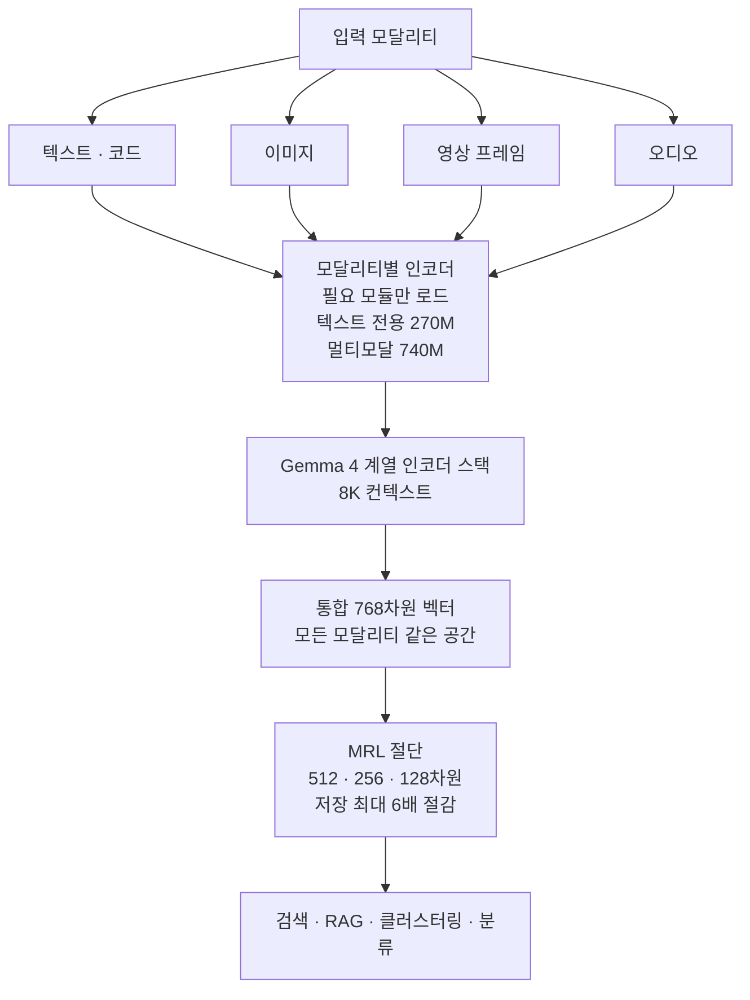

## 왜 읽어야 하나

멀티모달 검색이나 RAG 파이프라인을 설계하는 인프라·플랫폼 담당자, 온디바이스·엣지 환경에 임베딩 모델을 내려야 하는 팀이라면 이 모델카드를 읽어야 합니다. 결론은 한 줄입니다. **Google DeepMind가 2026년 10월 6일 Apache 2.0으로 공개한 EmbeddingGemma 2는 텍스트·코드·이미지·영상 프레임·오디오를 단일 768차원 임베딩 공간으로 매핑하는 740M 멀티모달 오픈웨이트 모델로, 그동안 "캡션 생성 후 텍스트 임베딩"이라는 2단 파이프라인이던 멀티모달 검색을 단일 모델 호출 하나로 줄여 줍니다.** 다만 공개된 벤치마크는 전량 Google 자체 측정이고, 8K 컨텍스트는 긴 문서에서는 청킹 부담이 그대로 남습니다.

## 개요

2026년 10월 6일, "Google launched EmbeddingGemma 2"라는 트윗이 돌면서 화제가 됐습니다. 원출처는 Google 공식 발표로, [Google 블로그](https://blog.google/innovation-and-ai/technology/developers-tools/embeddinggemma-2/), [개발자 가이드](https://developers.googleblog.com/embeddinggemma-2-the-developer-guide/), [모델카드 문서](https://ai.google.dev/gemma/docs/embeddinggemma/model_card_2)가 같은 날 나왔고 Hugging Face에 [google/embeddinggemma-2](https://huggingface.co/google/embeddinggemma-2) 리포지토리가 열렸습니다.

이 모델의 위치를 잡기 위해 필요한 사실만 먼저 정리합니다.

- 파라미터 740M의 멀티모달 버전과, 텍스트·코드 전용 270M 모듈이 같은 패밀리에 속합니다.
- 모든 모달리티가 하나의 768차원 벡터 공간에 매핑됩니다. 텍스트 쿼리가 이미지를 찾고 이미지가 텍스트를 찾는 크로스모달 검색이 그 전제입니다.
- Apache 2.0 라이선스로, 상용 사용에 제약이 없습니다.
- Gemma 4 계열 아키텍처 기반이며 컨텍스트는 8K 토큰입니다.

커뮤니티 반응도 빠졌습니다. 공개 직후 Ollama 라이브러리에 [embeddinggemma-2](https://ollama.com/library/embeddinggemma-2)가 등록됐고 다른 트윗에서는 "로컬에서 0.5GB만으로 돌린다"는 요약이 돌았습니다. 온디바이스 임베딩 모델에서 Google이 1년 사이 텍스트 전용 1세대를 멀티모달 2세대로 바꾼 셈입니다.

## 이 모델은 무엇인가

핵심은 "공유 임베딩 공간"이라는 설계입니다. 기존 멀티모달 RAG는 각 미디어를 텍스트로 번역하는 전처리(이미지 캡셔닝, 오디오 전사)를 거친 뒤 텍스트 임베딩 모델에 넘기는 2단 구조였습니다. 캡션 모델과 임베딩 모델 두 개가 필요하고 전처리에서 의미가 빠지면 검색에서 돌아올 수 없습니다. EmbeddingGemma 2는 각 모달리티를 담당하는 인코더를 하나의 모델 안에 넣어, 출력부터가 같은 공간의 벡터로 나오게 했습니다.

구조는 Gemma 4 계열의 인코더 스택 위에 모달리티별 입력 경로를 얹는 형태입니다. 멀티모달 풀 버전이 740M이고 텍스트·코드만 필요한 환경은 270M 모듈을 불러오면 됩니다. 같은 패밀리가 768차원 공간을 공유하기 때문에, 270M으로 텍스트 코퍼스만 임베딩해 두고 뒤에서 740M으로 이미지를 임베딩해도 두 벡터는 같은 공간에서 비교할 수 있습니다.

출력 벡터는 Matryoshka Representation Learning(MRL)이 적용되어 768차원에서 512·256·128차원으로 잘라 쓸 수 있습니다. 절단해도 상위 차원의 유사도 순위가 유지되는 구조라, 저장 비용은 최대 6분의 1로 줄이면서 검색 품질을 상당 부분 보존할 수 있다는 것이 Google의 설명입니다.



라이선스는 Apache 2.0입니다. Gemma 모델들이 Gemma Terms of Use라는 별도 동의 라이선스를 쓰는 것과 달리, EmbeddingGemma 2는 상용·내부 배포·파생 모두 제약이 적은 표준 라이선스라는 점에서 온프레미스 도입 판단이 한 단계 쉬워집니다.

## 벤치마크

공개된 수치는 Google 측 측정입니다. 텍스트 중심 MTEB 계열과 오디오 MAEB에서 sub-1B 멀티모달 임베딩 클래스 내 최상위라는 것이 발표 내용이고 확인된 세부 수치는 다음과 같습니다.

| 벤치마크 | 수치 | 비고 |
|---|---|---|
| MTEB Code | 78.68 | 이전 세대 대비 68.76에서 +9.92 |
| MTEB Multilingual v2 | 61.36 | 다국어 텍스트 임베딩 |
| MAEB (오디오) | sub-1B 클래스 최상 | Google 발표 기준, 세부 점수는 미공개 |

읽어야 할 곳은 MTEB Code입니다. 코드 임베딩 점수가 이전 세대보다 9.92점 올랐다는 것은, 코드 스니펫 검색과 유사 구현 조회 같은 개발자 워크로드에서 2세대가 실질적으로 빨랐음을 뜻합니다. 8K 컨텍스트 제한 때문에 긴 함수나 파일 전체를 한 벡터로 넣기는 어렵지만 청크 단위 코드 검색은 주 사용처입니다.

다만 MTEB Multilingual v2의 61.36은 프런티어 텍스트 임베더(클라우드 API 계열)와 비교하면 중간 이하 대입니다. "모든 임베딩을 이 모델 하나로"라고 읽으면 안 되고 "소형·온디바이스·멀티모달 통합"이라는 조건부에서 최강이라는 것이 정확한 위치입니다.

## 서빙과 온디바이스

서빙은 Ollama가 가장 빠른 길입니다. 공개 당일 라이브러리에 등록됐고 740M 버전을 740m-bf16 태그로 풀면 됩니다.

```bash
ollama pull embeddinggemma-2
curl http://localhost:11434/api/embed \
  -d '{
    "model": "embeddinggemma-2",
    "input": ["Python에서 pgvector로 검색하는 방법"]
  }'
```

응답은 768차원 벡터 배열이며 배치 입력과 차원 절단 옵션을 지원합니다. Python SDK로는 `client.embed(model="embeddinggemma-2", input=[...])` 한 줄입니다.

메모리 수치가 이 모델의 본체입니다. Google 발표 기준 양자화 시 활성 RAM은 텍스트 전용 모듈이 약 191MB, 멀티모달 풀 버전이 약 567MB이며 Pixel 11 Pro에서 멀티모달 버전을 구동하는 데모가 공개됐습니다. "활성 RAM"이므로 OS와 런타임 포함 총 요구 메모리는 이보다 높지만 1GB 이하 클래스의 엣지 디바이스나 저사양 노드에 임베딩 서비스를 올릴 수 있는 선입니다.

서버 환경에서는 vLLM 계열 서빙도 논의되지만 공식 1차 경로가 Ollama와 Google AI 개발 가이드(torchrun-free 단일 프로세스)인 점을 참고하면 됩니다. 740M 모델은 GPU 한 장의 일부도 차지하지 않아, 추론 엔드포인트와 같은 GPU에 공존시키는 것이 현실적인 배치입니다.

## ThakiCloud 제품 적용 시사점

ThakiCloud의 ai-platform은 K8s 기반 AI/ML 인프라이고 온프레미스·소버린 요구 대응이 핵심 포지션입니다. EmbeddingGemma 2가 이 포지션에 들어맞는 이유는 세 가지입니다.

첫째, Apache 2.0 + 567MB라는 조합이 온프레미스 멀티모달 검색의 최소 요건을 채웁니다. 고객 문서(텍스트·표·스크린샷·녹음)가 외부 API로 나가면 안 되는 환경에서, 멀티모달 임베딩을 로컬 한 대에 올리면 데이터 외부 전송 문제가 사라집니다. Aegis(온프레미스 배포) 라인에서 "멀티모달 RAG를 소버린으로"라는 제안이 성립하는 모델입니다.

둘째, 2단 파이프라인의 운영비 절감입니다. 기존에는 캡션·전사 모델(대형 LLM 호출) + 텍스트 임베딩 모델 두 번의 추론과 두 개의 모델 운영이 필요했습니다. 단일 모델로 줄면 호출 수, 모델 카탈로그, 파이프라인 코드 모두 줄어듭니다. Metis에서 임베딩 엔드포인트 하나만 서빙하면 되는 구조로, 검색 계층의 총소유비용이 직접 내려갑니다.

셋째, Paxis 관점의 에이전트 기억 확장입니다. Paxis는 에이전트 워크플로우에 지식과 검색이 붙는 구조인데, 임베딩 공간이 텍스트를 넘어 이미지·오디오까지 열리면 "회의 녹음으로 관련 화면 캡처 찾기", "제품 사진으로 사양 문서 찾기" 같은 크로스모달 검색이 에이전트의 1급 도구가 됩니다. 에이전트가 벡터 하나로 모든 미디어를 검색할 수 있는 것은, 이 통합 공간 설계가 가능하게 합니다.

## 한계 및 반론

벤치마크 신뢰도는 도입 판단에서 가장 먼저 짚어야 할 부분입니다. MTEB Code 78.68과 Multilingual v2 61.36 모두 Google 자체 측정이며 독립 재측정 수치가 없습니다. 특히 Multilingual v2 61.36은 "1B 미만 클래스 최강"이더라도, 클라우드 프런티어 임베더와 동급은 아닙니다. 한국어·일본어 같은 동아시아 언어의 실사용 품질은 우리 코퍼스에서 직접 재검증이 필요합니다.

컨텍스트 8K도 한계입니다. 긴 계약서나 논문 한 편을 한 벡터로 표현하는 용도로는 부족하고 청킹 전략이 그대로 필수입니다. 멀티모달 통합의 이점이 크로스모달 검색에서 크지만 텍스트 전용 사용처라면 270M 모듈로도 충분한 경우가 많아, 740M 풀 버전을 무조건 쓸 이유가 없습니다. 텍스트 전용 워크로드에는 270M 모듈로 시작하는 배치가 합리적입니다.

영상 입력이 프레임 단위라는 점도 짚어야 합니다. "영상을 임베딩한다"는 것은 영상 전체를 한 벡터로 요약하는 것이 아니라, 선택된 프레임을 벡터화하는 구조입니다. 시간 축에서의 정위(어느 순간이 나왔는지)는 여전히 메타데이터나 전처리가 책임집니다.

마지막으로, "온디바이스" 수치는 양자화 기준 활성 RAM입니다. 567MB는 디바이스 전체 메모리 요구가 567MB라는 뜻이 아니고, 런타임과 OS를 빼고 나면 실전 배치는 이보다 여유가 필요합니다.

## 정리

멀티모달 검색을 2단 파이프라인으로 짜던 설계에서, 단일 모델 하나로 줄일 수 있는 첫 공식 옵션이 나왔습니다. EmbeddingGemma 2는 740M, 768차원 통합 공간, Apache 2.0, 양자화 시 활성 RAM 약 567MB라는 숫자 조합으로, 온프레미스·소버린 멀티모달 RAG의 비용과 데이터 주권 문제를 동시에 만질 수 있습니다.

다음 단계로 권하는 것은 세 가지입니다. Ollama로 로컬 스모크를 돌리고 크로스모달 검색(텍스트 쿼리로 이미지 조회)이 실제로 성립하는지 확인하는 것, 기존 캡션+임베딩 2단 파이프라인 대비 지연과 호출 비용을 실측 비교하는 것, 그리고 Metis 엔드포인트에 올리는 스모크로 서빙 계층 적합성을 확인하는 것입니다. 수치가 우리 코퍼스에서 재검증되기 전까지는, 이 모델을 "도입"이 아니라 "파일럿"으로 대하는 것이 정석입니다.

## 출처

- Google 공식 블로그: https://blog.google/innovation-and-ai/technology/developers-tools/embeddinggemma-2/
- 개발자 가이드: https://developers.googleblog.com/embeddinggemma-2-the-developer-guide/
- 모델카드 문서: https://ai.google.dev/gemma/docs/embeddinggemma/model_card_2
- Hugging Face 모델: https://huggingface.co/google/embeddinggemma-2
- Ollama 라이브러리: https://ollama.com/library/embeddinggemma-2
- MarkTechPost 보도 (2026-10-06): https://www.marktechpost.com/2026-10-06/google-deepmind-releases-embeddinggemma-2-a-740m-open-multimodal-embedding-model-built-on-gemma-4/
- 관련 트윗 (2026-10-06): https://x.com/hjguyhan/status/2107691031076782210
