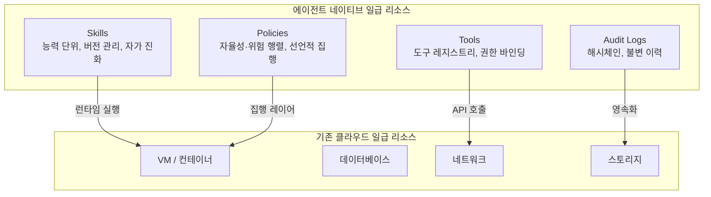

## 개요

클라우드 컴퓨팅은 지금까지 한 가지 질문에 집중해 왔습니다. "애플리케이션이 실행될 환경을 어떻게 추상화할 것인가?" 물리 서버에서 가상머신(VM)으로, VM에서 컨테이너로, 컨테이너에서 서버리스로 이어지는 흐름은 그 질문에 대한 답을 점점 더 세밀하게 다듬어 온 과정입니다.

그런데 이제 우리는 다른 종류의 질문과 마주하고 있습니다. "자율적으로 판단하고 행동하는 AI 에이전트를 실행할 환경을 어떻게 추상화할 것인가?" 이 질문은 기존의 클라우드 추상화 체계가 설계 당시 전혀 상정하지 않은 무언가를 요구합니다.

이 글은 그 갭을 들여다보고, 에이전트 시대에 필요한 인프라 추상화의 원칙을 살펴봅니다. 제품 소개가 아니라 패러다임에 관한 이야기입니다.

## 클라우드 추상화의 진화

클라우드 인프라의 역사는 추상화 계층을 쌓아 온 역사입니다.

**1세대: 물리 서버 임대.** 코로케이션 데이터센터가 랙을 빌려 주는 모델입니다. 운영자는 OS 설치부터 네트워크 구성까지 모든 것을 직접 관리해야 했습니다. 변경 비용이 매우 높았고, 수요 변화에 유연하게 대응하기 어려웠습니다.

**2세대: 가상머신(VM).** AWS EC2, GCP Compute Engine이 대표하는 모델입니다. 물리 서버는 논리적 단위로 분할되었고, 운영자는 CPU·메모리·스토리지 같은 컴퓨팅 리소스를 API로 프로비저닝할 수 있게 되었습니다. 추상화 덕분에 인프라 탄력성이 크게 향상되었습니다.

**3세대: 컨테이너와 오케스트레이션.** Docker와 Kubernetes가 정의한 세계입니다. 실행 환경 자체를 이미지로 패키징하고, 선언적 명세로 워크로드를 배치하는 방식이 자리를 잡았습니다. 불변 인프라(immutable infrastructure), GitOps, 서비스 메시 같은 개념들이 이 세대에서 꽃을 피웠습니다.

**4세대(현재 과도기): 서버리스와 함수.** AWS Lambda, Google Cloud Functions로 대표되는 모델입니다. 운영자는 서버 자체를 더 이상 관리하지 않아도 됩니다. 이벤트에 반응하는 함수 단위로 실행 비용만 지불합니다.

이 모든 세대를 관통하는 공통점이 있습니다. 관리 대상이 항상 **실행 환경**이었다는 점입니다. VM이든 컨테이너든 함수든, 클라우드는 "무언가를 실행하는 공간"을 제공하는 데 집중해 왔습니다.

자율 AI 에이전트는 이 프레임을 벗어납니다.

## 에이전트 운영의 4대 난제

자율 AI 에이전트를 프로덕션 환경에 배치해 본 팀이라면 공통으로 마주치는 어려움들이 있습니다.

### 난제 1: 모델 선택과 비용 제어

에이전트는 단일 LLM 호출로 완결되지 않습니다. 복잡한 목표를 해결하기 위해 계획을 세우고(Planning), 도구를 실행하고(Execution), 결과를 종합하는(Synthesis) 여러 단계를 거칩니다.

문제는 각 단계가 요구하는 모델 역량이 다르다는 점입니다. 계획 단계에는 넓은 문맥과 복잡한 추론이 필요하지만, 단순 검색 단계에는 그럴 필요가 없습니다. 그런데 기존 방식에서는 이를 세밀하게 제어하기가 어렵습니다. 개발자가 각 단계마다 직접 모델을 지정하거나, 하나의 강력한(그리고 비싼) 모델로 전부 처리하거나, 둘 중 하나를 선택해야 합니다.

전자는 코드 복잡성을 높이고, 후자는 비용 폭증으로 이어집니다. [추정] 대규모 에이전트 운영 조직에서 모델 비용이 전체 인프라 비용의 60% 이상을 차지하는 경우도 드물지 않습니다.

### 난제 2: 스킬 관리와 중복 증식

에이전트가 활용하는 도구와 능력의 집합을 편의상 "스킬"이라 부르겠습니다. 에이전트 생태계가 성장하면서 스킬은 빠르게 증식합니다. 비슷한 기능을 하는 스킬이 여러 개 생기고, 그 중 일부는 유지보수되지 않습니다. 어떤 스킬이 어떤 상황에 가장 적합한지 판단하기 어려워집니다.

VM 관리에서 AMI 이미지를 체계적으로 관리하지 않으면 이미지 스프롤이 발생하듯, 에이전트 생태계에서는 스킬 스프롤이 발생합니다. 그러나 기존 클라우드 인프라는 이를 다루는 추상화를 제공하지 않습니다.

### 난제 3: 거버넌스와 자율성의 균형

자율 AI 에이전트는 "얼마나 스스로 판단하고 행동할 것인가"라는 근본적인 질문을 마주합니다. 너무 제한하면 에이전트의 가치가 사라지고, 너무 풀어 주면 예기치 않은 행동이 발생합니다.

이를 운영 레이어에서 제어하려면 정책 엔진이 필요합니다. 어떤 도구를 허용하고, 어떤 데이터에 접근할 수 있으며, 어떤 행동은 사람의 승인이 필요한지를 선언적으로 정의하고 집행해야 합니다.

기존 클라우드의 IAM과 보안 그룹은 "누가 어떤 API를 호출할 수 있는가"를 다룹니다. 그러나 에이전트 거버넌스는 "이 에이전트가 이 상황에서 이런 판단을 내릴 수 있는가"라는 맥락 의존적인 질문을 다뤄야 합니다. 이는 질적으로 다른 추상화를 요구합니다.

실무적으로는 이런 상황을 생각해 볼 수 있습니다. 고객 데이터베이스에 접근하는 에이전트가 평소와 다른 시간대에 대량 조회를 시도할 때, 단순히 API 권한이 있다는 이유만으로 허용해야 할까요? 상황에 따른 판단(contextual authorization)은 기존 IAM 모델이 설계 범위 밖에 두었던 영역입니다.

### 난제 4: 지속적 학습과 스킬 진화

에이전트는 정적인 소프트웨어가 아닙니다. 운영하면서 어떤 전략이 효과적이고 어떤 스킬이 자주 실패하는지 데이터가 쌓입니다. 이 데이터를 바탕으로 에이전트와 스킬을 개선하는 피드백 루프가 필요합니다.

배포 파이프라인을 통해 컨테이너 이미지를 갱신하듯, 에이전트의 능력도 체계적으로 갱신되어야 합니다. 그러나 기존 클라우드 인프라는 이런 "능력의 진화"를 일급 시민으로 다루지 않습니다.

이 난제는 특히 엔터프라이즈 환경에서 두드러집니다. 수백 명의 팀원이 사용하는 에이전트 시스템에서 어떤 스킬이 지난 달에 비해 성능이 떨어졌는지, 어떤 시나리오에서 새로운 스킬이 필요한지를 파악하는 것은 엄청난 운영 비용을 필요로 합니다. 이 과정이 자동화되지 않으면, 에이전트 시스템은 초기 배포 이후 점진적으로 품질이 저하되는 경향을 보입니다.

## 일급 리소스로서의 Skills·Tools·Policies·Audit

이 네 가지 난제는 모두 같은 근원을 가리킵니다. 기존 클라우드가 일급 리소스로 취급하는 것들(VM, 컨테이너, 함수, 스토리지, 네트워크)이 에이전트 운영에서 핵심적인 것들이 아니라는 사실입니다.

에이전트 네이티브 클라우드는 다음 네 가지를 일급 리소스로 취급해야 합니다.

**Skills는 능력의 단위입니다.** 단순한 프롬프트 묶음이 아니라, 버전을 가지고, 평가 지표를 가지며, 서로 비교하고 통합할 수 있는 관리 가능한 객체여야 합니다. 사용 빈도, 성공률, 비용 효율성 같은 지표를 바탕으로 어떤 스킬을 유지하고 어떤 스킬을 폐기할지 결정할 수 있어야 합니다.

**Tools는 도구 레지스트리입니다.** 에이전트가 호출할 수 있는 외부 인터페이스의 목록이며, 각 도구에는 접근 권한이 바인딩됩니다. 어떤 에이전트가 어떤 도구를 호출할 수 있는지를 중앙에서 관리할 수 있어야 합니다.

**Policies는 거버넌스의 언어입니다.** 에이전트의 자율성 수준과 허용 가능한 위험의 범위를 교차한 행렬로 정책을 표현합니다. 선언적 정책이 런타임에 집행되어야 하며, 사람의 승인이 필요한 경우 워크플로를 자동으로 트리거해야 합니다.

**Audit Logs는 신뢰의 기반입니다.** 에이전트가 내린 판단과 실행한 행동의 이력이 변조 불가능하게 기록되어야 합니다. 이는 규제 준수의 문제이기 이전에, 에이전트 시스템을 신뢰할 수 있게 만드는 설계 원칙입니다.

이 네 가지 리소스가 일급 시민으로 취급된다는 것은 단순히 이들을 저장하고 조회할 수 있다는 의미가 아닙니다. 컴퓨팅 리소스처럼 프로비저닝하고, 버전을 관리하고, 정책으로 접근을 제어하고, 비용을 추적하고, 장애 시 롤백할 수 있는 라이프사이클 관리가 가능해야 합니다. 쿠버네티스가 컨테이너를 "Deployment"와 "ReplicaSet"이라는 추상화로 다루듯, 에이전트 네이티브 플랫폼은 스킬을 "SkillRelease"와 "SkillPolicy"라는 추상화로 다루어야 합니다.

## ThakiCloud의 구현: Paxis와 AI Platform 연계

ThakiCloud는 이 설계 원칙을 구체화한 플랫폼으로 **Paxis**를 개발하고 있습니다. "AWS for Agents"라는 콘셉트 아래, 기존 클라우드가 VM·DB·Network를 다루듯 Skills·Tools·Policies·Audit Logs를 일급 리소스로 다루는 것을 목표로 합니다.

**LLM·스킬 라우터**는 에이전트 실행의 각 단계(계획·실행·종합)에 맞는 모델을 자동으로 선택합니다. Claude, GPT, Gemini, Kimi, Ollama와 ThakiCloud의 자체 모델인 Metis를 포함한 10개 이상의 제공사를 지원하며, 비용을 인식하는 라우팅을 통해 불필요한 고비용 모델 호출을 줄입니다. 스킬 선택은 2단계로 이루어집니다. 먼저 도메인 후보군을 좁힌 뒤, 적합성·비용·신뢰도 등 7개 요소를 기준으로 최적 스킬을 선택합니다.

**Curator 자가진화 데몬**은 스킬 생태계를 지속적으로 관리합니다. 유사한 스킬을 감지해 통합하고, 성능이 저하된 스킬을 자동으로 패치하며, 운영 데이터를 바탕으로 새로운 스킬을 발굴합니다. 메모리 증류를 통해 반복 실행에서 얻은 통찰을 지식 베이스로 축적합니다.

**보안·거버넌스 계층**은 자율성 4단계와 위험 수준 7단계를 교차한 정책 행렬을 제공합니다. 입력 11종·출력 2종에 대한 프롬프트 보호와 개인정보 16종 마스킹이 적용됩니다. Docker와 Kata 컨테이너 기반의 샌드박스 실행 환경이 에이전트를 격리하며, 20개 이상의 이벤트 유형에 걸친 해시체인 감사 로그가 90일간 보존됩니다.

**멀티채널 인바운드 레이어**는 Web React SPA, Slack(48개 커맨드 지원), CLI를 통해 에이전트와 상호작용할 수 있게 합니다. 자연어로 커스텀 작업을 정의하는 동적 스케줄러도 포함됩니다. "매일 아침 경쟁사 뉴스를 수집해서 요약해 줘"와 같은 지시를 에이전트가 직접 자신의 스케줄로 등록합니다.

**하이브리드 지식엔진(HKE)**은 팀별 위키 기반 RAG와 지식 그래프를 결합합니다. 각 에이전트는 자신의 도메인에 특화된 지식 베이스를 참조하고, 실행 경험을 통해 이를 지속적으로 보강합니다.

Paxis는 **AI Platform(ai-suite)**과 연계하여 동작합니다. AI Platform이 중앙 LLM 정책·비용 통제를 담당하고, Paxis가 에이전트 런타임을 제공하며, Metis가 추론 레이어를 맡는 3층 구조입니다. 각 계층이 명확한 책임을 가지고 결합하는 방식은, 기존 클라우드에서 컨트롤 플레인과 데이터 플레인이 분리되는 방식과 유사합니다.

스택은 Go 1.26(백엔드)과 React 19(프론트엔드)로 구성되며, 프로덕션 환경에서는 PostgreSQL·Redis·MinIO를 스토리지 레이어로 사용합니다.

## 한계 및 전망

에이전트 네이티브 클라우드라는 개념 자체는 아직 성숙하지 않았습니다. 몇 가지 근본적인 어려움을 솔직하게 살펴볼 필요가 있습니다.

**스킬 품질의 측정 문제.** 컨테이너 이미지의 신뢰도는 취약점 스캔, 서명 검증 등 비교적 확립된 방법으로 평가할 수 있습니다. 반면 스킬의 품질은 실행 컨텍스트에 깊이 의존합니다. "이 스킬이 이 상황에 적합한가"는 사전에 자동화된 방법으로 완전히 평가하기 어렵습니다. 현재의 평가 지표(성공률, 비용 효율성)는 대리 지표일 뿐, 진정한 효과성을 측정하지는 못합니다.

**정책의 완전성 환상.** 선언적 정책은 명시된 상황에 대해 집행되지만, 에이전트가 마주치는 상황의 다양성은 정책 설계자의 상상을 초과합니다. 정책이 "거버넌스를 해결했다"는 착각을 주지 않도록 주의가 필요합니다. 정책은 안전망이지 보증이 아닙니다.

**다중 에이전트 조율의 복잡성.** 단일 에이전트를 다루는 것과 여러 에이전트가 협력하는 시스템을 다루는 것은 질적으로 다른 문제입니다. 에이전트 간의 신뢰 모델, 충돌 해소 메커니즘, 책임 귀속 같은 문제들은 아직 인프라 레이어에서 충분히 해결되지 않았습니다.

**산업 표준의 부재.** VM의 경우 OVF/OCI 같은 이미지 표준, 클라우드 제공사 간 호환되는 API 패턴이 존재합니다. 에이전트 스킬과 정책을 기술하는 표준은 아직 형성 중입니다. MCP(Model Context Protocol)처럼 도구 인터페이스 표준화를 시도하는 움직임이 있지만, 더 넓은 생태계 합의까지는 시간이 필요합니다.

그럼에도 방향은 분명합니다. 에이전트가 소프트웨어 시스템의 일부로 자리를 잡아 가면서, 이를 운영하는 인프라의 추상화 수준도 올라가야 합니다. 물리 서버를 직접 관리하던 시대에서 VM API를 호출하는 시대로 넘어갔듯, "에이전트의 능력과 행동 범위를 API로 정의하고 플랫폼이 이를 집행하는" 시대가 가까워지고 있습니다.

Q4 2026에는 스킬 마켓플레이스를, Q2 2027 이후에는 SOC2 인증과 에어갭 배포를 [추정] 로드맵에 포함하고 있는 Paxis의 여정도 그 흐름의 일부입니다. 플랫폼이 성숙할수록 개발자는 에이전트의 능력 설계에 집중하고, 실행 안전성과 비용 최적화는 인프라가 담당하는 분업이 가능해질 것입니다.

에이전트 네이티브 클라우드는 아직 완성된 개념이 아닙니다. 그러나 다음 세대의 소프트웨어 운영이 어떤 문제를 인프라 레이어에서 해결해야 하는지는, 지금 이 시점에 설계 원칙으로 자리를 잡아 가고 있습니다.
