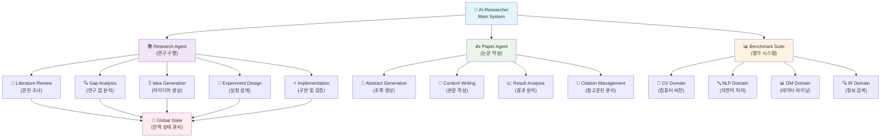
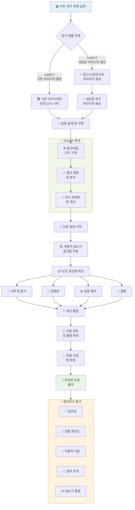

⏱️ **예상 읽기 시간**: 12분

## 서론

과학 연구의 패러다임이 근본적으로 변화하고 있습니다. 홍콩대학교(HKUDS) 연구팀이 개발한 **AI-Researcher**는 단순한 연구 도구를 넘어서 **완전 자율 과학 연구 시스템**을 구현한 혁신적인 프로젝트입니다. [arXiv:2505.18705](https://arxiv.org/abs/2505.18705) 논문으로 발표된 이 시스템은 문헌 조사부터 논문 출간까지 전 과정을 AI가 독립적으로 수행할 수 있습니다.

이 분석에서는 AI-Researcher의 기술적 아키텍처, 핵심 혁신 요소, 그리고 한국의 연구 환경에서의 활용 가능성을 종합적으로 살펴보겠습니다.

## AI-Researcher 프로젝트 개요

### 📄 논문 및 핵심 가치

**"AI-Researcher: Autonomous Scientific Innovation"**은 대형 언어 모델(LLM)의 강력한 추론 능력과 복잡한 작업 자동화 에이전트 프레임워크를 결합하여 과학적 혁신을 가속화하는 시스템입니다.

**🔬 핵심 혁신 포인트:**

1. **완전 자율성**: 연구 아이디어 발굴부터 논문 출간까지 전 과정을 AI가 독립적으로 수행
2. **인간 인지 한계 극복**: 기존 인간 연구자가 탐색하기 어려운 솔루션 공간의 체계적 탐색
3. **다중 에이전트 협업**: 전문화된 AI 에이전트들이 협력하여 복잡한 연구 작업 수행
4. **객관적 평가 시스템**: 4개 주요 도메인에서 전문가 수준의 품질 평가

### 🏗️ GitHub 저장소 현황

[GitHub 저장소](https://github.com/HKUDS/AI-Researcher)는 **2,000개 이상의 스타**를 받으며 활발한 오픈소스 프로젝트로 자리잡았습니다:

- **다중 LLM 지원**: Claude, OpenAI, Deepseek 등 다양한 언어 모델 통합
- **최소 전문 지식 요구**: 도메인 전문성이 부족해도 효과적인 연구 수행 가능
- **즉시 사용 가능**: 복잡한 설정 없이 바로 사용할 수 있는 구조
- **완전 오픈소스**: 벤치마크 구축 방법론부터 전체 시스템까지 공개

## 시스템 아키텍처 분석

### 🎨 전체 시스템 구조

AI-Researcher는 세 가지 핵심 컴포넌트로 구성됩니다:

1. **Research Agent**: 연구 수행의 모든 단계를 담당
2. **Paper Agent**: 연구 결과를 학술 논문으로 변환
3. **Benchmark Suite**: 다차원적 품질 평가 시스템

### 🔄 상세 실행 플로우

시스템은 두 가지 연구 레벨을 지원합니다:

- **Level 1**: 기존 연구 아이디어를 바탕으로 한 심화 연구 및 실험
- **Level 2**: 참고 논문만으로 새로운 연구 아이디어 생성부터 실험까지

## 기술 스택 및 도구 생태계

### 🛠️ 통합 기술 아키텍처

```mermaid
graph LR
    subgraph AI_MODELS["🤖 AI 모델 계층"]
        CLAUDE["🎭 Claude 3.5<br/>Sonnet/Haiku"]
        OPENAI["🧠 OpenAI<br/>GPT Models"]
        DEEPSEEK["🔍 DeepSeek<br/>Models"]
        OTHERS["⚡ 기타 LLM<br/>Provider"]
    end
    
    subgraph CORE_SYSTEM["🎯 핵심 시스템"]
        MAIN["🚀 main_ai_researcher.py<br/>(메인 오케스트레이터)"]
        GLOBAL["🌐 global_state.py<br/>(전역 상태 관리)"]
        WEB["🌍 web_ai_researcher.py<br/>(웹 인터페이스)"]
    end
    
    subgraph AGENTS["🤝 에이전트 시스템"]
        RA["📚 Research Agent<br/>(연구 수행)"]
        PA["✍️ Paper Agent<br/>(논문 작성)"]
        EA["📊 Evaluator Agent<br/>(평가 수행)"]
    end
    
    subgraph EXECUTION["⚙️ 실행 환경"]
        DOCKER["🐳 Docker<br/>Container"]
        SCRIPTS["📜 Shell Scripts<br/>(run_infer_*.sh)"]
        PYTHON["🐍 Python<br/>Environment"]
        GPU["💾 GPU Support<br/>(CUDA)"]
    end
    
    subgraph BENCHMARK["📏 벤치마크 시스템"]
        EVAL_DATA["📊 Evaluation<br/>Datasets"]
        METRICS["📈 Performance<br/>Metrics"]
        DOMAINS["🎯 Multi-Domain<br/>Testing"]
        GROUND_TRUTH["✅ Expert<br/>Ground Truth"]
    end
    
    subgraph OUTPUT["📤 결과물"]
        PAPERS["📄 Academic<br/>Papers"]
        CODE["💻 Research<br/>Code"]
        RESULTS["📊 Experimental<br/>Results"]
        REPORTS["📝 Analysis<br/>Reports"]
    end
    
    AI_MODELS --> CORE_SYSTEM
    CORE_SYSTEM --> AGENTS
    AGENTS --> EXECUTION
    EXECUTION --> BENCHMARK
    BENCHMARK --> OUTPUT
    
    RA --> |"문헌조사<br/>실험설계"| EXECUTION
    PA --> |"논문작성<br/>구조화"| EXECUTION
    EA --> |"품질평가<br/>검증"| BENCHMARK
    
    style AI_MODELS fill:#e3f2fd
    style CORE_SYSTEM fill:#f3e5f5
    style AGENTS fill:#e8f5e8
    style EXECUTION fill:#fff3e0
    style BENCHMARK fill:#ffebee
    style OUTPUT fill:#f1f8e9
```

## 핵심 혁신 요소

### 1. 🎯 완전 자동화된 연구 파이프라인

**전통적 연구 프로세스의 한계 극복:**

- **인간 인지 편향 제거**: AI가 객관적 데이터 기반으로 연구 방향 결정
- **24/7 연구 수행**: 시간 제약 없이 지속적인 연구 진행
- **대규모 문헌 처리**: 인간이 처리하기 어려운 방대한 문헌 동시 분석

### 2. 🤝 지능형 에이전트 협업

**전문화된 에이전트들의 역할 분담:**

- **Research Agent**: 문헌 조사, 갭 분석, 가설 검증을 담당
- **Paper Agent**: 계층적 글쓰기 방식으로 출판 품질의 논문 생성
- **Evaluator Agent**: 다차원적 품질 평가 (참신성, 실험 완성도, 이론적 기반 등)

### 3. 🌍 범용성과 접근성

**연구의 민주화 실현:**

- **최소 전문 지식**: 도메인 전문가가 아니어도 고품질 연구 수행 가능
- **다중 LLM 지원**: 다양한 AI 모델을 상황에 맞게 선택 활용
- **Docker 기반**: 일관된 실행 환경으로 재현 가능한 연구 보장

### 4. 📊 객관적 평가 시스템

**표준화된 품질 평가 프레임워크:**

- **4개 주요 도메인**: Computer Vision, NLP, Data Mining, Information Retrieval
- **전문가 수준 기준**: 인간 전문가가 작성한 논문을 기준으로 한 평가
- **다차원 메트릭**: 참신성, 실험 설계, 이론적 배경, 결과 분석, 글쓰기 품질

## 벤치마크 및 평가 체계

### 📏 종합 평가 프레임워크

AI-Researcher는 다음과 같은 포괄적인 평가 체계를 구축했습니다:

**평가 차원:**

1. **🌟 참신성 (Novelty)**: 연구 아이디어의 혁신성과 독창성
2. **🔬 실험 완성도 (Experimental Comprehensiveness)**: 실험 설계와 실행의 체계성
3. **📖 이론적 기반 (Theoretical Foundation)**: 이론적 배경의 견고성
4. **📈 결과 분석 (Result Analysis)**: 결과 해석의 깊이와 정확성
5. **✍️ 글쓰기 품질 (Writing Quality)**: 논문의 명확성과 구조

**도메인 커버리지:**

- **컴퓨터 비전 (CV)**: 이미지 인식, 객체 탐지, 세그멘테이션
- **자연어 처리 (NLP)**: 언어 모델, 텍스트 분류, 기계 번역
- **데이터 마이닝 (DM)**: 패턴 발견, 클러스터링, 추천 시스템
- **정보 검색 (IR)**: 검색 알고리즘, 랭킹, 쿼리 최적화

## 한국 연구 환경에서의 활용 가능성

### 🇰🇷 국내 연구 생태계 적용 방안

**1. 대학 연구실 적용**

- **박사과정 연구 가속화**: 문헌 조사 자동화로 연구 시간 단축
- **학제간 융합 연구**: 도메인 전문성 부족 문제 해결
- **연구 품질 표준화**: 객관적 평가 기준으로 연구 품질 향상

**2. 기업 R&D 혁신**

- **신기술 탐색**: 대량의 특허 및 논문 분석으로 기술 동향 파악
- **제품 개발 가속화**: 알고리즘 프로토타이핑 자동화
- **연구개발 비용 절감**: 초기 연구 단계의 인력 투입 최소화

**3. 정부 정책 지원**

- **국가 R&D 효율성**: 연구 과제 평가 및 방향 설정 지원
- **인력 양성**: 젊은 연구자들의 연구 역량 개발 도구
- **국제 경쟁력**: 글로벌 연구 트렌드 실시간 분석 및 대응

### 🚀 도입 시 고려사항

**기술적 요구사항:**

- **컴퓨팅 리소스**: GPU 클러스터 또는 클라우드 환경 필요
- **데이터 인프라**: 대용량 논문 데이터베이스 구축
- **보안 체계**: 연구 데이터 보호 및 지적재산권 관리

**조직적 변화:**

- **연구 문화 전환**: AI 협업 연구 방식에 대한 인식 개선
- **교육 프로그램**: 연구자 대상 AI-Researcher 활용 교육
- **평가 체계 개편**: AI 보조 연구에 대한 새로운 평가 기준

## 미래 전망 및 발전 방향

### 🔮 기술적 진화

**1. 멀티모달 연구 확장**

- **이미지-텍스트 통합**: 시각적 데이터와 텍스트 정보의 융합 분석
- **음성-언어 연결**: 음성 데이터 기반 연구 영역 확장
- **센서 데이터 활용**: IoT 환경에서 수집되는 다양한 데이터 분석

**2. 실시간 연구 적응**

- **동적 문헌 업데이트**: 새로운 논문 발표에 따른 연구 방향 실시간 조정
- **트렌드 예측**: 연구 동향 분석을 통한 미래 연구 주제 예측
- **협업 네트워크**: 전 세계 연구자들과의 실시간 협업 플랫폼

### 🌏 사회적 영향

**1. 연구 접근성 향상**

- **지역격차 해소**: 연구 인프라가 부족한 지역의 연구 역량 강화
- **언어장벽 제거**: 다국어 지원으로 글로벌 연구 참여 확대
- **비용장벽 완화**: 오픈소스 기반으로 연구 비용 대폭 절감

**2. 과학 발전 가속화**

- **발견의 민주화**: 누구나 과학적 발견에 기여할 수 있는 환경 조성
- **학제간 융합**: 서로 다른 분야의 지식 자동 연결 및 융합
- **재현성 향상**: 표준화된 실험 환경으로 연구 재현성 보장

## 결론

AI-Researcher는 단순한 연구 도구를 넘어서 **과학 연구의 패러다임 자체를 변화**시키는 혁신적인 시스템입니다. 완전 자율적인 연구 수행, 지능형 에이전트 협업, 그리고 객관적인 평가 체계를 통해 연구의 효율성과 품질을 동시에 향상시킵니다.

특히 한국의 연구 환경에서는 다음과 같은 긍정적 변화를 기대할 수 있습니다:

1. **연구 생산성 혁신**: 문헌 조사부터 논문 작성까지 전 과정의 자동화
2. **연구 품질 표준화**: 객관적 평가 기준을 통한 일관된 품질 보장
3. **연구 접근성 향상**: 도메인 전문성 장벽 제거로 더 많은 연구자 참여 가능
4. **국제 경쟁력 강화**: 글로벌 연구 트렌드에 빠른 대응 및 혁신 창출

AI-Researcher가 제시하는 미래는 인간과 AI가 협력하여 **더 창의적이고 혁신적인 과학적 발견**을 이루어내는 새로운 시대입니다. 이 기술의 도입과 발전을 통해 한국의 연구 생태계가 한 단계 더 진화할 수 있을 것으로 기대됩니다.

## 참고 자료

- [AI-Researcher GitHub Repository](https://github.com/HKUDS/AI-Researcher)
- [논문: "AI-Researcher: Autonomous Scientific Innovation"](https://arxiv.org/abs/2505.18705)
- [프로젝트 공식 웹사이트](https://hkuds.github.io/AI-Researcher/)
- [커뮤니티 Slack 채널](https://join.slack.com/t/ai-researcher/shared_invite/)
- [Discord 서버](https://discord.gg/ai-researcher)

---

**💡 이 글이 도움이 되셨나요?** AI-Researcher와 같은 혁신적인 연구 도구에 대한 더 많은 분석과 활용 가이드를 원하신다면, Thaki Cloud 블로그를 구독해주세요!
