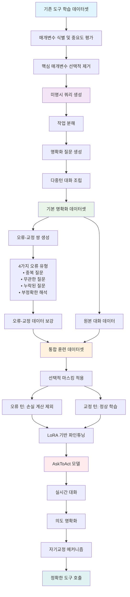

⏱️ **예상 읽기 시간**: 12분

## 서론: 실제 상황에서 LLM 도구 사용의 핵심 과제

대규모 언어모델(LLM)이 외부 도구와 API를 통해 상호작용하는 능력은 인공지능의 실용적 응용을 크게 확장시켰습니다. Toolformer, ToolLLaMA, Gorilla와 같은 도구 증강 LLM 프레임워크들이 등장하면서, 모델들은 단순한 텍스트 생성을 넘어 복잡한 작업을 수행할 수 있게 되었습니다. 그러나 현재의 도구 학습 프레임워크들은 사용자 쿼리가 항상 명시적이고 명확하다는 이상적인 가정 하에 동작합니다.

실제 환경에서 사용자들은 종종 불완전하고 모호하며 부정확한 쿼리를 제공합니다. 이러한 미명시 쿼리는 도구 학습 시나리오에서 독특한 도전을 제기합니다. API 호출은 정확한 매개변수를 요구하며 모호함을 허용하지 않기 때문입니다. 미명시 쿼리에 직면했을 때, LLM들은 누락된 매개변수를 임의로 생성하거나 알 수 없는 상태로 남겨두는 경향이 있어, 도구 호출에서 잠재적 위험을 초래합니다.

## 기존 접근법의 근본적 한계점

최근 연구들이 대화형 명확화 접근법을 도입했지만, 두 가지 근본적 한계에 직면하고 있습니다. 첫째, 훈련을 위해 수동으로 구축된 데이터셋에 크게 의존합니다. 이러한 데이터셋을 생성하려면 인간 주석자들이 쿼리와 명확화를 만들어야 하는데, 이는 본질적으로 규모와 다양성을 제한하는 과정입니다. 결과적으로 생성된 데이터셋은 제한된 범위의 모호성 패턴만을 포착하여, 다양한 실제 쿼리에 대한 효과를 감소시킵니다.

둘째, 다중 턴 명확화 과정에서 강력한 오류 처리가 부족합니다. 기존 모델들은 완벽한 명확화 시퀀스만을 포함한 데이터셋으로 훈련됩니다. 하지만 실제로는 모델들이 이미 제공된 정보를 다시 요청하거나, 무관한 경로를 따르거나, 미명시 세부사항을 놓치는 경우가 자주 발생합니다. 오류 복구 훈련 없이는 이러한 문제들이 대화 전반에 걸쳐 누적되어 효율성을 떨어뜨리고 도구 호출 품질을 손상시킵니다.

## AskToAct 프레임워크의 핵심 혁신

AskToAct는 이러한 한계를 체계적으로 해결하는 자기교정 명확화 프레임워크입니다. 핵심 통찰은 도구 매개변수가 자연스럽게 명시적 사용자 의도를 나타낸다는 점으로, 이는 자동화된 데이터 생성의 기회를 창출합니다. 연구팀은 기존 데이터셋의 완전한 쿼리에서 핵심 매개변수를 전략적으로 제거하여 다양한 미명시 쿼리를 생성하는 자동화된 파이프라인을 개발했습니다. 이렇게 생성된 쿼리들은 내장된 정답을 가지고 있어, 효과적인 의도 도출을 보여주는 풍부한 명확화 대화를 구성할 수 있습니다.

상호작용 중 강력한 오류 처리를 가능하게 하기 위해, 현실적인 실수와 그 해결책을 시뮬레이션하는 신중하게 설계된 오류-교정 쌍으로 훈련 데이터를 보강했습니다. 또한 훈련 과정에서 선택적 마스킹을 구현하여 부정적 패턴 학습을 방지하면서 오류 탐지 능력을 향상시켰습니다.

## 의도 명확화 데이터셋 구축 방법론

### 미명시 쿼리 생성 과정

AskToAct의 데이터셋 구축은 현실적인 모호한 쿼리와 완전한 의도의 쌍을 얻는 것부터 시작합니다. 이를 위해 혁신적인 역공학 접근법을 사용하여 기존 도구 학습 데이터셋을 활용합니다. 기존 데이터셋의 각 인스턴스는 사용자 쿼리와 해당하는 도구 호출 솔루션을 포함하고 있습니다. 연구팀은 도구 매개변수가 사용자 의도의 명시적 표현이라는 핵심 통찰을 바탕으로, 완전한 쿼리에서 핵심 매개변수를 체계적으로 제거하여 미명시 쿼리를 생성합니다.

이 과정은 세 단계로 구성됩니다: (1) 매개변수 식별 - 도구 호출 솔루션에서 모든 매개변수를 추출, (2) 중요도 평가 - 각 매개변수의 중요성을 도구 기능에 대한 영향에 따라 평가, (3) 선택적 제거 - 가장 중요한 매개변수들을 전략적으로 선택하여 제거. 이러한 접근법은 대규모 고품질 훈련 데이터를 자동으로 생성할 수 있게 합니다.

### 대화 구축 파이프라인

미명시 쿼리가 생성되면, 다음 단계는 효과적인 명확화 대화를 구성하는 것입니다. 이 과정은 작업 분해, 명확화 생성, 대화 조립의 세 가지 핵심 구성요소로 이루어집니다. 작업 분해 단계에서는 복잡한 쿼리를 개별 API 호출이 필요한 하위 작업으로 나눕니다. 명확화 생성 단계에서는 각 미명시 매개변수에 대해 자연스럽고 맥락적으로 적절한 명확화 질문을 생성합니다. 마지막으로 대화 조립 단계에서는 이러한 구성요소들을 응집력 있는 다중 턴 대화로 결합합니다.

## 자기교정 훈련 패러다임의 핵심 메커니즘

### 오류-교정 데이터 보강

실제 대화에서 발생할 수 있는 오류를 시뮬레이션하기 위해, AskToAct는 체계적인 오류-교정 데이터 보강 전략을 사용합니다. 이는 네 가지 유형의 오류를 다룹니다: (1) 중복 질문 - 이미 제공된 정보를 다시 요청, (2) 무관한 질문 - 작업과 관련 없는 정보 요청, (3) 누락된 질문 - 중요한 미명시 매개변수 무시, (4) 부정확한 매개변수 해석 - 사용자 응답을 잘못 이해.

각 오류 유형에 대해, 연구팀은 실제 대화에서 이러한 실수가 어떻게 발생하고 교정될 수 있는지를 보여주는 대화 쌍을 생성합니다. 이러한 오류-교정 쌍은 모델이 실시간으로 자신의 실수를 인식하고 교정하는 능력을 학습할 수 있게 합니다.

### 선택적 마스킹 전략

훈련 과정에서 모델이 부정적 패턴을 학습하는 것을 방지하기 위해, AskToAct는 선택적 마스킹 전략을 채택합니다. 이 접근법에서는 오류가 포함된 대화 턴에 대해서는 손실을 계산하지 않고, 교정 턴에 대해서만 학습을 진행합니다. 이는 모델이 올바른 행동을 학습하면서도 오류 패턴을 인식할 수 있는 능력을 유지하게 합니다. 특히, 마스킹은 오류 토큰에만 적용되고 맥락 토큰은 유지되어, 모델이 전체 대화 흐름을 이해할 수 있게 합니다.

## 데이터셋 포맷과 예제 분석

### 기본 데이터 구조

AskToAct의 데이터셋은 다음과 같은 구조를 가집니다:

**원본 쿼리 예제:**
```
사용자: "특정 언어에 대해 지원되는 지역은 어디인가요? 그리고 주어진 이메일 주소가 유효한지 확인할 수 있나요?"
```

**미명시 쿼리 생성 후:**
```
사용자: "언어에 대해 지원되는 지역은 어디인가요? 그리고 이메일 주소가 유효한지 확인할 수 있나요?"
[제거된 매개변수: 'en' (언어 코드), 'user@example.com' (이메일 주소)]
```

**명확화 대화 예제:**
```
AI: [작업 분해] 이 작업은 2단계로 분해할 수 있습니다. 
1단계: regions API를 사용하여 지정된 언어에 대해 지원되는 지역 확인
2단계: check_email API를 사용하여 이메일 주소 유효성 검증

[매개변수 평가] 현재 정보: 
1단계에서 regions API의 "language" 매개변수에 명확한 값이 부족합니다.
2단계에서 check_email API의 "email" 매개변수에 명확한 값이 부족합니다.

[질문] 지원되는 지역을 확인하고 싶은 언어 코드는 무엇인가요?

사용자: 언어 코드는 'en'입니다.

AI: [매개변수 평가] regions API의 "language" 매개변수 값이 "en"임을 확인했습니다.
[질문] 유효성을 검증하고 싶은 이메일 주소는 무엇인가요?

사용자: 'user@example.com'이 유효한 이메일 주소인지 확인하고 싶습니다.

AI: [요약] 모든 필요한 정보를 확보했으며 관련 API를 호출할 수 있습니다.
솔루션: [{'task': 'regions', 'arguments': [{'name': 'language', 'value': 'en'}]}, {'task': 'check_email', 'arguments': [{'name': 'email', 'value': 'user@example.com'}]}]
```

### 오류-교정 쌍 예제

**중복 질문 오류와 교정:**
```
[오류] AI: 언어 코드를 다시 한 번 확인해 주시겠어요?
사용자: 이미 'en'이라고 말했잖아요.
[교정] AI: 죄송합니다. 언어 코드 'en'을 확인했습니다. 이제 이메일 주소를 알려주세요.
```

**무관한 질문 오류와 교정:**
```
[오류] AI: 사용하시는 운영체제는 무엇인가요?
사용자: 그게 왜 필요한가요? 그냥 이메일 검증만 하면 되는 거 아닌가요?
[교정] AI: 맞습니다. 운영체제 정보는 불필요했습니다. 검증하고 싶은 이메일 주소를 알려주세요.
```

## 학습 과정 플로우 다이어그램



## 종합적 실험 결과와 성능 분석

### 핵심 성능 지표

AskToAct의 성능 평가는 의도 명확화 품질과 도구 호출 정확성이라는 두 가지 핵심 차원에서 진행되었습니다. 의도 명확화 품질 측면에서, 연구팀은 명확화 정확도(Clarification Precision Score, CPS)와 명확화 효율성(Clarification Efficiency Score, CES)를 도입했습니다. CPS는 모델이 실제로 미명시된 중요한 의도를 얼마나 정확하게 식별하고 회복할 수 있는지를 측정하며, CES는 명확화 과정의 효율성을 평가합니다.

도구 호출 정확성 측면에서는 전체 솔루션 정확도(Overall Solution Accuracy, OSA), 도구 선택 점수(Tool Selection Score, TSS), 매개변수 해상도 점수(Parameter Resolution Score, PRS)를 사용했습니다. OSA는 쿼리에 대해 완전히 정확한 도구 호출 솔루션이 생성되는 비율을 측정하고, TSS는 각 쿼리에 대해 API를 얼마나 정확하게 선택하는지를 평가하며, PRS는 올바른 도구 호출에 필요한 매개변수를 정확하게 채우는 능력을 측정합니다.

### 뛰어난 성능 향상 결과

실험 결과, AskToAct는 모든 핵심 지표에서 기존 방법들을 크게 앞섰습니다. 가장 인상적인 결과는 중요한 미명시 의도를 57% 이상 정확하게 회복할 수 있다는 점입니다. 이는 기존 방법들이 보통 30-40% 수준에 머물렀던 것과 비교할 때 상당한 개선입니다. 또한 명확화 효율성 면에서 기본 모델 대비 평균 10.46%의 향상을 달성했습니다. 이는 동일한 정확도를 유지하면서도 더 적은 대화 턴으로 필요한 정보를 수집할 수 있음을 의미합니다.

엔드-투-엔드 도구 호출 성능에서는 81% 이상의 도구 선택 정확도와 68% 이상의 매개변수 해상도 정확도를 달성했습니다. 특히 주목할 만한 점은 복잡한 다중 도구 시나리오에서도 높은 성능을 유지한다는 것입니다. 이는 실제 응용에서 매우 중요한 특성으로, 사용자들이 종종 여러 작업을 동시에 요청하는 경우가 많기 때문입니다.

### 모델 아키텍처 간 일관된 성능

AskToAct의 강력함은 다양한 모델 아키텍처에서 일관된 성능 향상을 보여준다는 점에서도 확인됩니다. Mistral-7B-Instruct-v0.3, LLaMA3-8B-Instruct, Qwen2.5-7B-Instruct 등 세 가지 대표적인 기본 모델에 적용했을 때 모두 상당한 성능 개선을 보였습니다. 특히 흥미로운 관찰은 초기 성능이 낮은 모델일수록 더 큰 상대적 향상을 보인다는 점입니다.

LLaMA3-8B-Instruct의 경우 CPS에서 27.83%, PRS에서 25.46%의 대폭적인 개선을 보인 반면, 더 강력한 Qwen2.5-7B-Instruct는 CPS에서 5.01%, PRS에서 11.18%의 여전히 유의미한 향상을 보였습니다. 이는 AskToAct가 특히 성능이 낮은 모델의 능력을 크게 끌어올리면서도, 이미 강력한 모델에서도 지속적인 개선을 제공함을 의미합니다.

### 미지의 API에 대한 놀라운 일반화 능력

AskToAct의 가장 인상적인 특성 중 하나는 완전히 새로운 API에 대한 일반화 능력입니다. 추가 훈련 없이도 이전에 본 적 없는 API들을 사용하는 작업에서 GPT-4o와 비교할 만한 성능을 달성했습니다. 이는 매우 중요한 실용적 의미를 가지는데, 실제 환경에서는 새로운 도구와 API가 지속적으로 등장하기 때문입니다.

이러한 일반화 능력은 AskToAct가 특정 API의 세부사항을 단순히 암기하는 것이 아니라, 의도 명확화와 도구 사용의 근본적인 패턴을 학습했음을 시사합니다. 모델은 새로운 도구의 설명과 매개변수 정보만으로도 효과적인 명확화 전략을 수립하고 정확한 도구 호출을 수행할 수 있습니다.

### 계산 효율성과 비용 효과성

AskToAct는 높은 성능을 달성하면서도 계산 효율성 면에서도 우수한 결과를 보여줍니다. GPT-4o와 비교할 만한 성능을 제공하면서도 상당히 적은 계산 자원을 요구합니다. 이는 LoRA 기반의 효율적인 파인튜닝 전략과 선택적 마스킹을 통한 학습 최적화 덕분입니다. 실제 배포 환경에서 이러한 효율성은 운영 비용 절감과 응답 시간 단축으로 이어집니다.

또한 오류-교정 메커니즘의 비율 조정 실험에서는 30%의 보강 비율이 가장 최적의 성능을 제공함을 발견했습니다. 이 비율에서 CPS 60.41%, PRS 68.71%의 최고 성능을 달성했으며, 40-50%로 비율을 높일 경우 오히려 성능이 저하되는 것을 관찰했습니다. 이는 과도한 오류-교정 노출이 모델을 오류 패턴에 과적합시키거나 오류 탐지에 지나치게 집중시킬 수 있음을 시사합니다.

## 실제 대화 시나리오에서의 강건성

### 다양한 사용자 응답 패턴에 대한 적응력

AskToAct의 실용적 가치는 다양한 사용자 응답 패턴에 효과적으로 적응할 수 있는 능력에서 드러납니다. 연구팀이 제시한 케이스 스터디에서, 모델은 간결하거나 장황한, 협조적이거나 회피적인, 심지어 중복적이거나 주제에서 벗어난 내용을 포함한 사용자 응답에도 일관되게 정확한 의도 파악과 효과적인 다중 턴 명확화를 수행했습니다.

예를 들어, 사용자가 "오, 내 질문에 답하라고 나를 속이려는 거야? 영리하네! 하지만 당신의 질문에 집중하자"와 같은 유머러스하고 회피적인 응답을 하더라도, 모델은 핵심 정보('en' 언어 코드)를 정확히 추출하고 다음 단계로 진행할 수 있었습니다. 이러한 강건성은 실제 사용자 상호작용의 예측 불가능성을 고려할 때 매우 중요한 특성입니다.

### 기능적 신뢰성과 상호작용 일관성

AskToAct는 다양한 대화 시나리오에서 기능적 신뢰성과 상호작용 일관성을 모두 유지할 수 있음을 보여주었습니다. 모델은 사용자 응답의 스타일이나 톤에 관계없이 일관된 구조화된 접근법([작업 분해], [매개변수 평가], [질문], [요약])을 유지하면서도, 각 상황에 맞게 자연스럽고 적절한 응답을 생성합니다.

이러한 일관성은 사용자 경험 관점에서 매우 중요합니다. 사용자들은 시스템이 예측 가능하고 신뢰할 수 있는 방식으로 작동하기를 기대하며, 동시에 자연스럽고 인간적인 상호작용을 원합니다. AskToAct는 이 두 가지 요구사항을 성공적으로 균형을 맞춥니다.

## 한계점과 향후 연구 방향

### 현재 접근법의 제약사항

AskToAct가 상당한 성과를 달성했음에도 불구하고, 몇 가지 한계점이 존재합니다. 첫째, 현재 프레임워크는 주로 명시적으로 정의된 API와 구조화된 매개변수에 의존합니다. 더 복잡하고 동적인 도구 환경에서의 성능은 추가 연구가 필요합니다. 둘째, 오류-교정 메커니즘이 훈련 시에 사전 정의된 오류 패턴에 기반하므로, 완전히 새로운 유형의 오류에 대한 적응력은 제한적일 수 있습니다.

셋째, 현재 평가는 주로 영어 기반 데이터셋에서 이루어졌으며, 다언어 환경에서의 성능과 문화적 맥락의 차이에 대한 고려가 부족합니다. 마지막으로, 매우 긴 대화나 복잡한 다중 단계 작업에서의 장기 메모리 유지와 일관성 보장에 대한 추가 연구가 필요합니다.

### 미래 연구의 유망한 방향들

향후 연구는 여러 흥미로운 방향으로 확장될 수 있습니다. 첫째, 동적 도구 발견과 적응 능력을 개발하여 런타임에 새로운 도구를 학습하고 통합할 수 있는 시스템을 구축하는 것입니다. 둘째, 멀티모달 입력을 처리할 수 있도록 확장하여 텍스트뿐만 아니라 이미지, 음성, 비디오 등의 다양한 입력 형태에서 의도를 명확화할 수 있는 능력을 개발하는 것입니다.

셋째, 협업적 명확화 메커니즘을 도입하여 여러 AI 에이전트가 함께 복잡한 사용자 의도를 명확화하고 해결할 수 있는 시스템을 구축하는 것입니다. 넷째, 개인화된 명확화 전략을 개발하여 개별 사용자의 선호도와 의사소통 패턴을 학습하고 적응하는 능력을 향상시키는 것입니다.

## 결론: 실용적 AI 시스템을 위한 중요한 진전

AskToAct는 대규모 언어모델의 도구 사용 능력을 실제 환경에 한 걸음 더 가깝게 만드는 중요한 진전을 나타냅니다. 이 연구의 핵심 가치는 단순히 기술적 성능 향상에 그치지 않고, 실제 사용자와의 상호작용에서 발생하는 근본적인 문제들을 체계적으로 해결했다는 점에 있습니다.

자동화된 데이터 생성 파이프라인은 고품질 훈련 데이터의 확장성 문제를 해결했으며, 자기교정 메커니즘은 실시간 오류 탐지와 복구를 통해 실용적 신뢰성을 크게 향상시켰습니다. 57% 이상의 의도 회복률과 10.46%의 효율성 향상은 사용자 경험 개선에 직접적으로 기여할 수 있는 의미 있는 성과입니다.

특히 미지의 API에 대한 일반화 능력과 다양한 모델 아키텍처에서의 일관된 성능 향상은 이 프레임워크의 실용적 가치를 크게 높입니다. 이는 AskToAct가 특정 도메인이나 모델에 국한된 해결책이 아니라, 광범위하게 적용 가능한 일반적 접근법임을 시사합니다.

앞으로 AI 시스템이 더욱 복잡하고 다양한 실제 환경에서 사용되면서, AskToAct와 같은 명확화 기반 접근법의 중요성은 더욱 커질 것입니다. 이 연구는 인간과 AI 간의 자연스럽고 효과적인 의사소통을 위한 중요한 기반을 제공하며, 더 지능적이고 사용자 친화적인 AI 시스템 개발의 새로운 방향을 제시합니다.
