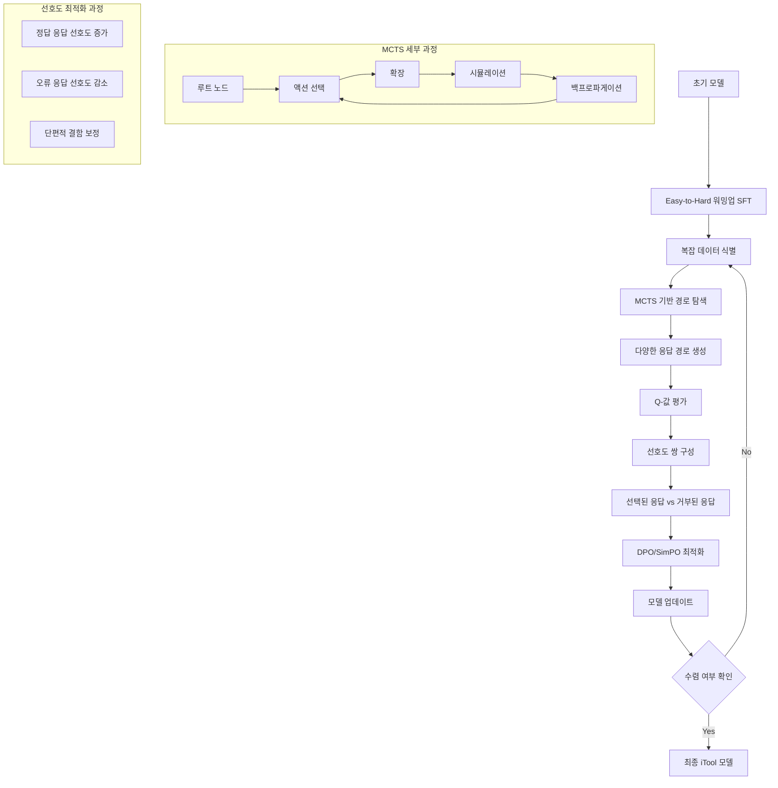

⏱️ **예상 읽기 시간**: 12분

## 서론

하빈공과대학 SCIR Lab과 화웨이 테크놀로지스, 화웨이 노아방주 연구소가 공동으로 발표한 "[iTool: Reinforced Fine-Tuning with Dynamic Deficiency Calibration for Advanced Tool Use](https://arxiv.org/pdf/2501.09766)" 논문은 대형 언어모델(LLM)의 도구 사용 능력을 향상시키는 혁신적인 방법론을 제시합니다. 이 연구는 외부 도구와 LLM을 통합하여 복잡한 실제 작업을 처리하는 능력을 크게 향상시키는 것을 목표로 하며, 특히 합성 데이터를 활용한 기존 훈련 방법의 한계를 극복하는데 중점을 두고 있습니다.

현재까지 LLM과 외부 도구의 통합은 복잡한 작업, 특히 최신 정보 접근, 정밀한 계산 수행, 환각(hallucination) 감소 등에서 상당한 잠재력을 보여왔습니다. 그러나 기존의 합성 데이터 기반 지도 미세조정(Supervised Fine-Tuning, SFT) 방법은 데이터 규모가 증가함에 따라 훈련 효과가 감소하는 문제를 겪고 있었으며, 이는 특히 복잡한 도구 사용 시나리오에서 더욱 두드러졌습니다.

## 기존 문제점 및 동기

### 훈련 효과 감소 현상 분석

연구진이 수행한 예비 연구에서는 합성 도구 사용 데이터의 비율이 증가함에 따라 모델의 성능 향상이 현저히 감소하는 현상을 발견했습니다. 이는 단순히 데이터 양을 늘리는 것만으로는 복잡한 도구 사용 시나리오에서의 성능을 효과적으로 개선할 수 없음을 의미합니다. 특히 Berkeley Function-Calling Leaderboard(BFCL)를 통한 실험에서, 합성 데이터가 증가할수록 성능 개선 효과가 포화되거나 오히려 감소하는 패턴을 확인할 수 있었습니다.

### 단편적 결함(Fragment Deficiency) 문제

더 깊이 있는 분석을 통해 연구진은 이러한 한계가 주로 "단편적 결함"으로 나타난다는 것을 발견했습니다. 이는 모델이 사용자 쿼리에서 매개변수 이름을 추출하거나 올바른 매개변수 값을 추론하는 데 실패하는 현상으로, 일반적으로 응답의 작은 부분에만 영향을 미치지만 전체 도구 사용의 정확성을 크게 해치는 문제입니다. 예를 들어, 날씨 정보를 요청하는 API 호출에서 location 매개변수는 올바르게 설정하지만 weather 매개변수를 'unknown'과 같은 잘못된 값으로 설정하는 경우입니다.

### 복잡한 시나리오에서의 한계

기존의 프롬프트 엔지니어링 방법은 단순한 도구 사용 시나리오에서는 효과적이지만, 긴 컨텍스트나 광범위한 도구 세트가 포함된 복잡한 실제 애플리케이션에서는 상당한 어려움을 겪고 있습니다. 이러한 복잡성은 단순한 지도 학습만으로는 해결하기 어려운 고급 맥락 이해와 추론 능력을 요구합니다.

## iTool 방법론 심층 분석

### 핵심 접근법 개요

iTool은 OpenAI의 o1 모델에서 보여준 단계별 사고 과정(step-by-step slow thinking)과 강화 미세조정(Reinforced Fine-Tuning, ReFT)의 성공에서 영감을 얻어 개발되었습니다. 이 방법론은 몬테카를로 트리 탐색(Monte Carlo Tree Search, MCTS) 기반의 경로 탐색과 반복적 강화 미세조정을 통해 모델의 도구 사용 능력을 점진적으로 개선합니다.

### MCTS 기반 경로 탐색

iTool의 첫 번째 핵심 구성 요소는 MCTS를 활용한 응답 다양성 향상입니다. 기존의 단일 경로 생성 방식과 달리, MCTS는 여러 가능한 응답 경로를 탐색하고 각 경로의 품질을 평가함으로써 더 다양하고 품질 높은 훈련 데이터를 생성합니다. 이 과정에서 각 노드는 특정 도구 선택 또는 매개변수 설정을 나타내며, Q-값을 통해 해당 경로의 예상 성능을 추정합니다.

MCTS 과정에서 생성되는 다양한 경로들은 정답 응답과의 비교를 통해 선호도 쌍(preference pairs)을 구성하는 데 활용됩니다. 이때 올바른 도구 호출과 매개변수 설정을 포함한 경로는 선택된(chosen) 응답으로, 오류가 포함된 경로는 거부된(rejected) 응답으로 분류됩니다.

### 반복적 강화 미세조정 전략

두 번째 핵심 구성 요소는 모델의 결함을 점진적으로 식별하고 개선하는 반복적 강화 미세조정입니다. 이 과정은 다음과 같은 단계로 구성됩니다:

1. **복잡 데이터 식별**: 정책 모델의 피드백을 바탕으로 모델이 어려워하는 복잡한 데이터를 반복적으로 식별합니다.

2. **세밀한 선호도 쌍 구성**: MCTS 탐색 경로에서 수집된 정보를 바탕으로 특정 오류 유형에 초점을 맞춘 세밀한 선호도 쌍을 구성합니다.

3. **직접 선호도 최적화**: DPO(Direct Preference Optimization) 등의 강화 학습 정책을 적용하여 모델의 응답을 정답 응답과 일치시키고 잘못된 부분과는 불일치시킵니다.

### Easy-to-Hard 워밍업 전략

반복적 강화 미세조정 이전에, iTool은 복잡한 시나리오 학습을 위한 easy-to-hard 워밍업 SFT 전략을 제안합니다. 이는 모델이 먼저 상대적으로 단순한 도구 사용 작업을 학습한 후 점진적으로 더 복잡한 시나리오로 이동하는 커리큘럼 학습 방식입니다. 이러한 접근법은 모델의 기본적인 도구 사용 능력을 먼저 확립한 후 고급 능력을 개발하는 데 도움을 줍니다.

## 실험 설계 및 평가 방법론

### 데이터셋 구성

연구에서 사용된 주요 훈련 데이터는 ToolACE 데이터셋으로, 이는 최대 10만 개의 샘플을 포함하는 일반적인 도구 사용 데이터셋입니다. 이 데이터셋은 새로운 자기 진화 합성(self-evolution synthesis) 방법을 통해 생성되었으며, 실제 도구 사용 시나리오를 시뮬레이션하는 다양한 복잡성 수준의 작업을 포함합니다.

평가를 위해서는 Berkeley Function-Calling Leaderboard(BFCL)가 주요 벤치마크로 사용되었습니다. BFCL은 도구 사용 능력을 종합적으로 평가할 수 있는 표준화된 벤치마크로, 다양한 복잡성 수준의 함수 호출 작업을 포함합니다.

### 데이터셋 예제 분석

논문에서 제시된 구체적인 데이터셋 예제들은 iTool의 효과를 명확히 보여줍니다:

**예제 1: 트렌딩 결과 조회**
- 도구: "Get Trending Result" (Google Trends에서 미국의 트렌딩 검색 결과 조회)
- 매개변수: category (필수), timeframe (선택)
- 사용자 쿼리: "Can you tell me the latest trending topics in entertainment today?"
- 올바른 응답: `Get Trending Result(category="entertainment", timeframe="today")`
- 잘못된 응답: `Get Trending Result category="entertainment", timeframe="1"`

이 예제에서 잘못된 응답은 괄호 누락과 timeframe 매개변수의 잘못된 값 할당을 보여줍니다.

**예제 2: 복합 분석 작업**
- 도구: fetchTrendingProducts, extractSentiment
- 사용자 쿼리: 마케팅 캠페인을 위한 제품 리뷰 감정 분석 및 경쟁사 제품 트렌드 분석
- 올바른 응답: 필요한 매개변수 값(리뷰 데이터, 메트릭 정보)의 부족을 올바르게 식별
- 잘못된 응답: 필요한 정보 없이 환각된 매개변수 값으로 함수 호출 시도

### 평가 지표

모델의 성능은 다음과 같은 세부적인 기준으로 평가됩니다:

1. **함수 이름 정확성**: 호출된 모든 함수의 이름이 올바른가
2. **매개변수 개수**: 모든 함수의 매개변수 개수가 정확한가
3. **매개변수 이름**: 함수의 모든 매개변수 이름이 올바른가
4. **매개변수 값/타입**: 모든 매개변수의 값과 타입이 정확한가
5. **의미적 유사성**: 생성된 응답이 정답 응답과 의미적으로 유사한가

전체 품질은 Excellent(모든 기준 충족), Acceptable(대부분 기준 충족, 미미한 차이), Fair(일부 기준 충족, 중요한 문제 존재), Poor(대부분 또는 모든 기준 미충족)의 4단계로 분류됩니다.

## 실험 결과 및 성능 분석

### 전반적 성능 향상

iTool은 동일한 크기의 기본 모델 대비 13.11%의 성능 향상을 달성했습니다. 이는 기존의 단순한 SFT 방법과 비교할 때 상당한 개선을 나타내며, 특히 복잡한 시나리오에서는 기준선 대비 6.5%의 추가적인 성능 향상을 보였습니다. 더욱 주목할 만한 것은 8B 매개변수만을 가진 iTool 모델이 더 큰 오픈소스 모델들을 능가하고 최상위 클로즈드 소스 모델들과 경쟁할 수 있는 수준에 도달했다는 점입니다.

### 복잡한 시나리오에서의 우수성

iTool의 가장 큰 강점은 복잡한 도구 사용 시나리오에서의 성능입니다. 기존 방법들이 단순한 함수 호출에서는 어느 정도 성능을 보였지만 복잡한 멀티스텝 작업이나 다중 도구 조율에서는 한계를 보인 반면, iTool은 이러한 복잡한 상황에서도 일관된 성능 향상을 보여주었습니다. 이는 MCTS 기반 탐색과 반복적 개선 과정이 복잡한 추론 과정을 효과적으로 학습할 수 있음을 시사합니다.

### 선호도 최적화 알고리즘 비교

연구진은 다양한 선호도 최적화 알고리즘과의 비교를 통해 iTool의 효과를 검증했습니다. DPO, IPO, ORPO, SimPO 등의 알고리즘을 적용한 결과, SimPO와 결합된 iTool이 가장 우수한 성능을 보였습니다. 특히 ORPO를 제외한 대부분의 알고리즘에서 유사한 성능을 보여, iTool의 핵심 아이디어가 다양한 최적화 방법과 호환성이 높다는 것을 확인할 수 있었습니다.

### 아블레이션 연구 결과

각 구성 요소의 기여도를 분석한 아블레이션 연구에서는 MCTS 기반 경로 탐색과 반복적 강화 미세조정이 모두 성능 향상에 중요한 역할을 한다는 것을 확인했습니다. 특히 두 구성 요소를 모두 포함한 전체 iTool 시스템이 개별 구성 요소만을 사용한 경우보다 현저히 우수한 성능을 보였습니다.

## 학습 과정 플로우

iTool의 전체 학습 과정을 다음 다이어그램으로 시각화할 수 있습니다:

## 기술적 혁신점 및 기여도

### 단편적 결함 개념의 도입

iTool 연구의 가장 중요한 기여 중 하나는 "단편적 결함(Fragment Deficiency)" 개념을 명확히 정의하고 이를 해결하는 체계적인 방법을 제시한 것입니다. 이는 기존의 전체적인 응답 품질 평가에서 벗어나 특정 부분의 오류가 전체 작업 성공에 미치는 영향을 정밀하게 분석할 수 있게 했습니다.

### MCTS와 강화학습의 효과적 결합

기존의 도구 사용 연구에서는 주로 지도 학습이나 간단한 강화학습 방법이 사용되었지만, iTool은 MCTS의 탐색 능력과 선호도 최적화의 정밀한 조정 능력을 결합하여 더욱 효과적인 학습 방법을 제시했습니다. 이는 복잡한 의사결정 과정이 필요한 도구 사용 작업에 특히 적합한 접근법입니다.

### 반복적 개선의 체계화

단순한 일회성 훈련과 달리, iTool은 모델의 약점을 지속적으로 식별하고 개선하는 반복적 과정을 체계화했습니다. 이는 모델의 성능을 점진적이고 지속적으로 향상시킬 수 있는 프레임워크를 제공합니다.

## 한계점 및 향후 연구 방향

### 현재 한계점

iTool 방법론은 상당한 성과를 보였지만 몇 가지 한계점도 존재합니다. 첫째, MCTS 기반 탐색은 계산 비용이 상당히 높아 대규모 배포에서는 효율성 문제가 발생할 수 있습니다. 둘째, 현재의 평가 방법은 주로 함수 호출의 정확성에 초점을 맞추고 있어, 실제 도구 실행 결과의 유용성이나 사용자 만족도와 같은 실용적 측면의 평가가 부족합니다.

### 향후 연구 방향

향후 연구에서는 계산 효율성을 개선하면서도 성능을 유지할 수 있는 방법을 모색해야 할 것입니다. 또한 더 다양한 도메인과 복잡한 실제 시나리오에서의 평가를 통해 iTool의 일반화 능력을 검증하는 것이 필요합니다. 마지막으로, 도구 사용의 안전성과 신뢰성을 보장하는 메커니즘을 추가로 개발하는 것도 중요한 연구 방향이 될 것입니다.

## 결론

iTool 연구는 LLM의 도구 사용 능력 향상을 위한 중요한 이정표를 제시합니다. 기존의 단순한 데이터 확장 방식의 한계를 인식하고, MCTS 기반 탐색과 반복적 강화 미세조정을 통해 이를 극복하는 혁신적인 방법론을 제안했습니다. 특히 단편적 결함 개념의 도입과 이를 체계적으로 해결하는 접근법은 향후 도구 사용 연구에 중요한 참고점이 될 것입니다.

13%의 전반적 성능 향상과 복잡한 시나리오에서의 6.5% 추가 개선은 iTool의 실용적 가치를 명확히 보여주며, 8B 매개변수 모델이 더 큰 모델들과 경쟁할 수 있다는 결과는 효율적인 모델 개발의 새로운 가능성을 제시합니다. 이러한 성과는 AI 시스템의 실제 적용에서 요구되는 복잡한 도구 사용 능력을 효과적으로 개발할 수 있는 새로운 패러다임을 제공한다고 할 수 있습니다.

향후 이 연구의 아이디어가 더 다양한 도메인과 응용 분야로 확장되어, 더욱 강력하고 신뢰할 수 있는 AI 도구 사용 시스템의 개발에 기여할 것으로 기대됩니다.
