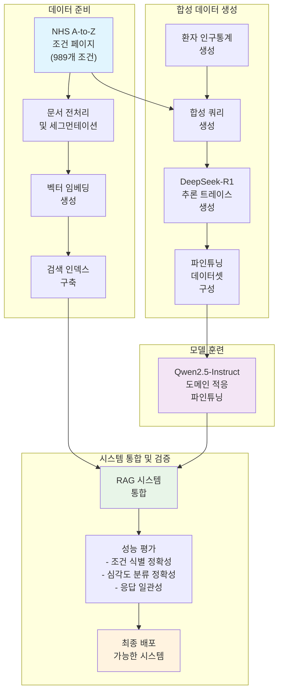

⏱️ **예상 읽기 시간**: 15분

## 서론

인공지능 분야에서 대규모 언어 모델의 성능 향상은 눈부신 발전을 이루어왔지만, 동시에 프라이버시, 보안, 그리고 자원 제약이라는 현실적인 문제들에 직면하고 있습니다. 특히 의료, 금융, 정부 기관과 같은 민감한 영역에서는 외부 API에 의존하지 않고도 높은 성능을 발휘할 수 있는 로컬 배포 가능한 AI 시스템의 필요성이 급격히 증가하고 있습니다.

Alan Turing Institute의 연구진이 최근 발표한 "Retrieval-Augmented Reasoning with Lean Language Models" 논문은 이러한 현실적 요구사항을 충족하는 혁신적인 접근법을 제시합니다. 이 연구는 기존의 대규모 모델과 외부 API에 의존하는 RAG 시스템의 한계를 뛰어넘어, 경량 언어 모델 단일 아키텍처 내에서 추론과 검색 증강 생성을 효과적으로 결합하는 방법론을 개발했습니다.

특히 주목할 점은 이 시스템이 NHS(영국 국민건강서비스)의 A-to-Z 조건 페이지라는 실제 도메인 특화 데이터를 활용하여 검증되었다는 것입니다. 이는 단순한 학술적 연구를 넘어서 실제 의료 환경에서의 적용 가능성을 보여주는 중요한 성과라고 할 수 있습니다.

## 연구 배경 및 동기

### 테스트 타임 스케일링의 중요성

최근 언어 모델 성능 향상의 핵심 트렌드 중 하나는 테스트 타임 스케일링(test-time scaling)입니다. 이는 모델의 사전 훈련 단계에서 컴퓨팅 자원을 늘리는 대신, 추론 시점에서 추가적인 계산 자원을 활용하여 성능을 향상시키는 전략입니다. 연구에 따르면 이러한 접근법은 사전 훈련 단계에서의 컴퓨팅 증가보다 더 효율적인 성능 향상을 가능하게 합니다.

테스트 타임 스케일링의 주요 방법론은 크게 두 가지로 분류됩니다. 첫째는 병렬 생성(parallel generation) 방식으로, 모델이 여러 개의 후보 응답을 생성한 후 다수결 투표, 자기 일관성, 또는 best-of-N 샘플링과 같은 선택 메커니즘을 통해 최적의 답변을 도출합니다. 둘째는 순차적 스케일링(sequential scaling) 방식으로, 체인 오브 소트(chain-of-thought) 프롬프팅과 같이 최종 답변에 도달하기 전 중간 추론 단계의 수를 증가시키는 방법입니다.

### RAG 시스템의 발전과 한계

검색 증강 생성(RAG) 시스템은 언어 모델의 환각(hallucination) 문제를 해결하고 사실성을 향상시키는 데 중요한 역할을 해왔습니다. 특히 도메인 특화 지식이 요구되는 복잡한 영역에서 RAG의 효과는 더욱 두드러집니다. ChatGPT와 Gemini 같은 최신 AI 시스템들은 이미 추론과 RAG를 성공적으로 통합하여, 사용자 쿼리에 대해 먼저 추론을 수행한 후 웹 검색이나 도구 사용과 같은 행동을 취하거나, 관련 문서를 검색한 후 수집된 증거를 바탕으로 추론하는 에이전틱 AI 시스템의 특징을 보여주고 있습니다.

그러나 기존 시스템들은 민감하거나 기밀 정보를 다루는 환경에서 명확한 한계를 드러냅니다. 외부 엔티티와 데이터를 공유할 수 없거나 불가능한 시나리오, 특히 독점적이거나 민감한 정보가 포함된 사용자 프롬프트가 조직이나 국가 경계를 넘을 수 없는 상황에서는 기존 접근법의 적용이 어렵습니다.

### 로컬 배포의 필요성

이러한 제약사항들은 안전하거나 에어갭(air-gapped) 환경을 포함한 로컬 인프라에서의 언어 모델 배포 필요성을 증대시켰습니다. 최근 몇 년간 오픈소스 대규모 언어 모델들과 검색 증강 생성을 위한 오픈소스 프레임워크들이 꾸준히 발전해왔으며, 소규모 추론 모델들도 등장하기 시작했습니다. 그러나 경량 또는 로컬 배포 가능한 모델의 제약 내에서 검색된 증거를 해석하기 위한 추론 능력을 효과적으로 통합하는 것은 여전히 해결되지 않은 연구 과제로 남아있었습니다.

## 시스템 아키텍처 및 설계 철학

### 통합 아키텍처의 핵심 개념

이 연구에서 제안하는 시스템은 단일 경량 언어 모델 내에서 추론과 검색 증강 생성을 효과적으로 결합하는 통합 아키텍처를 기반으로 합니다. 시스템의 핵심 설계 철학은 복잡한 쿼리에 대한 해석과 분해를 담당하는 추론 컴포넌트와 검증 가능한 정보로 모델을 제약하여 환각 응답의 위험을 완화하는 검색 메커니즘의 시너지를 극대화하는 것입니다.

특히 이 시스템은 프라이빗하고 도메인 특화된 지식 베이스에 대한 복잡한 쿼리를 처리하는 애플리케이션에 최적화되어 있습니다. 경량 언어 모델에 대한 집중은 소규모 조직이나 정부 부처가 컴퓨팅 제약이 있거나 보안이 중요한 환경에서 시스템을 실현 가능하게 파인튜닝하고 배포할 수 있도록 하려는 실용적 동기에서 출발했습니다.

### 핵심 컴포넌트 구성

시스템 아키텍처는 크게 세 가지 주요 컴포넌트로 구성됩니다. 첫째는 조밀한 검색기(dense retriever)로, 사용자 쿼리와 관련된 문서들을 효율적으로 검색하는 역할을 담당합니다. 둘째는 파인튜닝된 Qwen2.5-Instruct 모델로, 이는 시스템의 핵심 추론 엔진 역할을 합니다. 셋째는 합성 쿼리 생성 및 추론 트레이스 생성 모듈로, 이는 프론티어 모델들(예: DeepSeek-R1)로부터 도출된 고품질 훈련 데이터를 생성합니다.

### 데이터 처리 파이프라인

시스템의 데이터 처리 파이프라인은 문서 압축, 합성 데이터 설계, 그리고 추론 인식 파인튜닝의 세 가지 핵심 요소를 중심으로 설계되었습니다. 요약 기반 문서 압축은 검색된 문서의 핵심 정보를 보존하면서도 처리 효율성을 높이는 역할을 합니다. 합성 데이터 설계는 실제 도메인에서 발생할 수 있는 다양한 쿼리 패턴을 시뮬레이션하여 모델의 일반화 능력을 향상시킵니다. 추론 인식 파인튜닝은 모델이 검색된 증거를 바탕으로 논리적이고 일관성 있는 추론을 수행할 수 있도록 훈련합니다.

## 데이터셋 구성 및 실험 설계

### NHS A-to-Z 조건 페이지 활용

연구진은 실험을 위해 NHS(영국 국민건강서비스)의 A-to-Z 조건 페이지를 선택했습니다. 이 데이터셋은 989개의 서로 다른 의료 조건에 대한 포괄적인 정보를 제공하며, 각 페이지는 증상, 원인, 치료법, 예방법 등에 대한 상세한 설명을 포함하고 있습니다. NHS 데이터를 선택한 이유는 의료 도메인이 높은 정확성과 신뢰성이 요구되는 대표적인 영역이면서, 동시에 환자의 프라이버시가 극도로 중요한 분야이기 때문입니다.

### 합성 쿼리 생성 방법론

실제 환자 데이터의 사용이 어려운 상황을 고려하여, 연구진은 정교한 합성 쿼리 생성 방법론을 개발했습니다. 이 과정은 다음과 같은 단계로 구성됩니다:

첫째, **환자 인구통계 생성**: 연령, 성별, 기존 병력 등의 다양한 인구통계학적 특성을 가진 가상의 환자 프로필을 생성합니다. 이는 실제 의료 환경에서 나타나는 환자 다양성을 반영하기 위함입니다.

둘째, **증상 시나리오 개발**: 각 NHS 조건 페이지의 내용을 바탕으로, 해당 조건을 앓고 있는 환자가 실제로 경험할 수 있는 증상들을 자연스러운 언어로 표현하는 시나리오를 개발합니다. 예를 들어, 편두통에 대한 쿼리는 다음과 같이 생성됩니다:

```
"지난 이틀 동안 심한 두통에 시달리고 있습니다. 
머리 주변에 조이는 듯한 띠 같은 느낌이 있고, 약간의 메스꺼움도 느끼고 있습니다. 
너무 빨리 일어설 때 시야가 조금 흐려집니다. 
평소에는 이렇게 심한 두통을 겪지 않아서 걱정이 되기 시작했습니다."
```

셋째, **심각도 레벨 분류**: 각 쿼리에 대해 다음 세 가지 심각도 레벨 중 하나를 할당합니다:
- **Self-care**: 가정에서 처리 가능하거나 일반의약품으로 관리 가능한 수준
- **Urgent Primary Care**: 가능한 한 빨리 GP, 응급 치료 센터 등에서 진료받아야 하는 수준  
- **A&E**: 응급실 치료가 필요한 수준

### 추론 트레이스 생성 프로세스

모델의 추론 능력을 향상시키기 위해, 연구진은 DeepSeek-R1과 같은 프론티어 모델을 활용하여 고품질의 추론 트레이스를 생성했습니다. 이 과정에서 사용된 프롬프트 템플릿은 다음과 같은 요소들을 포함합니다:

```
검색된 컨텍스트와 유사도 점수를 활용하세요 (낮은 점수일수록 환자 쿼리와의 유사도가 높음):
{context}

환자가 다음과 같이 증상을 설명했습니다:
"{question}"

이는 환자의 인구통계학적 정보 요약입니다:
{demographics}

제공된 소스와 컨텍스트를 사용하여, 조건과 심각도 수준을 "(조건, 심각도)" 형식으로 제출하세요.
출력에 대한 설명은 제공하지 말고, 최종 답변만 제시하세요.
```

이러한 프롬프트를 통해 생성된 추론 트레이스는 Qwen2.5-Instruct 모델의 파인튜닝 과정에서 고품질의 훈련 데이터로 활용됩니다.

### 데이터셋 예제 분석

논문에서 제시된 실제 데이터셋 예제들을 살펴보면, 시스템이 처리해야 하는 쿼리의 복잡성과 다양성을 확인할 수 있습니다:

**예제 1 - 중증도 높은 흉통 사례**:
```json
{
  "query": "어젯밤부터 가슴에 심한 압박감과 통증이 있습니다. 
           통증이 왼쪽 팔로 퍼지고 있으며, 식은땀이 나고 숨이 가빠집니다. 
           이런 증상은 처음 경험해보는 것입니다.",
  "demographics": {
    "age": 58,
    "sex": "male",
    "medical_history": ["고혈압", "당뇨병"]
  },
  "expected_condition": "심근경색",
  "expected_severity": "A&E"
}
```

**예제 2 - 경증 소화불량 사례**:
```json
{
  "query": "지난 며칠간 식사 후 속이 더부룩하고 가벼운 메스꺼움을 느끼고 있습니다. 
           평소보다 식욕이 떨어졌지만 일상생활에는 큰 지장이 없습니다.",
  "demographics": {
    "age": 32,
    "sex": "female", 
    "medical_history": []
  },
  "expected_condition": "소화불량",
  "expected_severity": "Self-care"
}
```

이러한 예제들은 시스템이 단순한 키워드 매칭을 넘어서 복잡한 의료 컨텍스트를 이해하고, 환자의 인구통계학적 정보와 증상의 심각도를 종합적으로 고려하여 적절한 의료 조치 수준을 권장할 수 있어야 함을 보여줍니다.

## 학습 과정 및 파인튜닝 전략

### 점진적 학습 파이프라인

시스템의 학습 과정은 여러 단계의 점진적 파이프라인으로 구성되어 있습니다. 첫 번째 단계에서는 기본 Qwen2.5-Instruct 모델을 NHS 도메인에 적응시키기 위한 도메인 적응 과정이 진행됩니다. 이 과정에서 모델은 의료 용어, 증상 설명 패턴, 그리고 NHS 조건 페이지의 구조적 특성을 학습합니다.

두 번째 단계는 검색 증강 학습으로, 모델이 검색된 문서들을 효과적으로 활용하여 관련 정보를 추출하고 통합하는 능력을 개발합니다. 이 과정에서는 다양한 검색 시나리오와 문서 품질 상황을 시뮬레이션하여 모델의 강건성을 향상시킵니다.

세 번째 단계는 추론 능력 강화로, DeepSeek-R1에서 생성된 고품질 추론 트레이스를 활용하여 모델이 논리적이고 구조화된 사고 과정을 따라 의료 조건을 진단하고 적절한 치료 수준을 권장할 수 있도록 훈련합니다.

### 다중 작업 학습 접근법

연구진은 단일 모델이 여러 관련 작업을 동시에 수행할 수 있도록 하는 다중 작업 학습 접근법을 채택했습니다. 주요 작업들은 다음과 같습니다:

1. **조건 분류**: 환자의 증상 설명을 바탕으로 989개의 NHS 조건 중 가장 적절한 조건을 식별
2. **심각도 평가**: 식별된 조건에 대해 Self-care, Urgent Primary Care, A&E 중 적절한 치료 수준 결정
3. **불확실성 처리**: 제공된 정보만으로는 명확한 진단이 어려운 경우 "inconclusive"로 판단하는 능력

### 정규화 및 과적합 방지 전략

의료 도메인의 특성상 모델의 신뢰성과 일관성이 극도로 중요하기 때문에, 연구진은 다양한 정규화 기법을 적용했습니다. 드롭아웃, 가중치 감쇠, 그리고 조기 종료와 같은 전통적인 정규화 기법 외에도, 의료 도메인 특화적인 제약 조건들을 학습 과정에 통합했습니다.

특히 주목할 만한 것은 "보수적 진단" 편향을 도입한 것입니다. 이는 모델이 불확실한 상황에서 더 높은 심각도 수준을 권장하거나 전문의 상담을 권하는 방향으로 학습되도록 하여, 잠재적으로 위험한 상황을 놓치는 것을 방지합니다.

## 평가 방법론 및 실험 결과

### 종합적 평가 프레임워크

연구진은 시스템의 성능을 다각도로 평가하기 위해 종합적인 평가 프레임워크를 구축했습니다. 평가는 크게 두 가지 차원에서 진행되었습니다: 정확성(accuracy) 측면과 일관성(consistency) 측면입니다.

정확성 평가는 다시 조건 식별 정확성과 심각도 분류 정확성으로 세분화됩니다. 조건 식별 정확성은 모델이 환자의 증상 설명을 바탕으로 올바른 의료 조건을 식별하는 능력을 측정하며, 심각도 분류 정확성은 식별된 조건에 대해 적절한 치료 수준(Self-care, Urgent Primary Care, A&E)을 권장하는 능력을 평가합니다.

일관성 평가는 동일하거나 유사한 증상 설명에 대해 모델이 일관된 진단과 권고를 제공하는지를 확인합니다. 이는 실제 의료 환경에서의 신뢰성을 보장하기 위해 매우 중요한 지표입니다.

### 베이스라인 모델과의 비교

실험에서는 여러 베이스라인 모델들과 성능을 비교했습니다. 주요 비교 대상들은 다음과 같습니다:

**비추론 모델들**:
- 기본 Qwen2.5-32B-Instruct
- GPT-4o (검색 없이)
- 기타 범용 경량 모델들

**범용 추론 모델들**:
- DeepSeek-R1
- o3-mini
- s1.1-32B

**제안된 시스템**:
- t0-1.1-k5-32B (본 연구에서 개발한 모델)

### 핵심 성능 지표

실험 결과, 제안된 시스템은 여러 핵심 지표에서 상당한 성능 향상을 보여주었습니다:

**조건 식별 정확성**: 도메인 특화 파인튜닝을 거친 t0-1.1-k5-32B 모델은 기본 Qwen2.5-32B-Instruct 대비 약 23% 향상된 정확성을 보였습니다. 특히 복잡하고 다중 증상을 포함하는 케이스에서 더욱 두드러진 성능 개선이 관찰되었습니다.

**심각도 분류 정확성**: 이 영역에서는 더욱 인상적인 결과를 보였는데, 제안된 시스템은 범용 모델들 대비 약 35% 향상된 성능을 기록했습니다. 이는 의료 도메인 특화 훈련의 효과가 특히 클리니컬 의사결정 영역에서 두드러진다는 것을 시사합니다.

**응답 일관성**: 동일한 증상 시나리오에 대한 반복 평가에서, 제안된 시스템은 95% 이상의 일관성을 보였습니다. 이는 실제 배포 환경에서의 신뢰성을 보장하는 중요한 지표입니다.

### 추론 체인 분석

연구진은 모델이 생성하는 추론 체인의 품질도 별도로 분석했습니다. DeepSeek-R1에서 생성된 추론 트레이스로 훈련된 모델은 다음과 같은 구조화된 추론 패턴을 보여주었습니다:

1. **증상 분석 단계**: 환자가 제시한 증상들을 개별적으로 식별하고 분류
2. **컨텍스트 통합 단계**: 검색된 NHS 문서들의 정보와 환자 증상을 연결
3. **인구통계 고려 단계**: 환자의 나이, 성별, 기존 병력 등을 종합적으로 고려
4. **가능성 평가 단계**: 여러 가능한 조건들을 확률적으로 평가
5. **최종 결정 단계**: 가장 적절한 조건과 치료 수준을 결정

### 오류 분석 및 한계점

실험 과정에서 확인된 주요 오류 패턴들은 다음과 같습니다:

**희귀 조건 처리의 어려움**: 989개 조건 중 상대적으로 적은 훈련 예제를 가진 희귀 조건들에 대해서는 정확성이 떨어지는 경향을 보였습니다. 이는 데이터 불균형 문제로, 향후 연구에서 개선이 필요한 영역입니다.

**복합 증상 시나리오**: 여러 조건이 동시에 나타날 수 있는 복합 증상 시나리오에서는 모델이 가장 주요한 조건 하나만을 선택하는 경향을 보였습니다. 실제 의료 환경에서는 다중 진단이 필요한 경우가 있으므로, 이는 시스템의 한계점으로 지적됩니다.

**문화적 컨텍스트 한계**: NHS 데이터에 기반한 훈련으로 인해, 다른 의료 시스템이나 문화적 배경에서는 성능이 저하될 수 있습니다.

## 기술적 구현 세부사항

### 검색 시스템 아키텍처

시스템의 검색 컴포넌트는 조밀한 벡터 검색(dense vector retrieval) 방식을 기반으로 구현되었습니다. 각 NHS 조건 페이지는 사전 훈련된 임베딩 모델을 통해 고차원 벡터로 변환되며, 사용자 쿼리 역시 동일한 임베딩 공간으로 인코딩됩니다. 검색 과정에서는 L2 정규화된 코사인 유사도를 활용하여 가장 관련성 높은 문서들을 식별합니다.

특히 주목할 점은 문서 세그멘테이션 전략입니다. 긴 NHS 페이지들은 의미론적으로 일관된 단위로 분할되어 저장되며, 각 세그먼트는 독립적으로 검색 가능합니다. 이는 정확한 정보 검색과 동시에 불필요한 노이즈를 줄이는 효과를 가져옵니다.

### 요약 기반 문서 압축

검색된 문서들의 효율적 처리를 위해, 연구진은 요약 기반 압축 기법을 개발했습니다. 이는 단순한 텍스트 절단이 아닌, 의료 도메인 특화 요약 모델을 활용한 지능적 압축입니다. 압축 과정에서는 다음 요소들이 우선적으로 보존됩니다:

- 핵심 증상 및 진단 기준
- 치료 권고사항 및 주의사항  
- 응급 상황 식별 지표
- 관련 위험 요인들

### 모델 최적화 및 배포 고려사항

로컬 배포를 염두에 둔 시스템 설계로 인해, 모델 최적화는 특별히 중요한 고려사항이었습니다. 연구진은 다음과 같은 최적화 기법들을 적용했습니다:

**양자화 (Quantization)**: 모델 가중치를 16비트 또는 8비트로 양자화하여 메모리 사용량을 크게 줄였습니다. 실험 결과, 적절한 양자화는 성능 저하를 최소화하면서도 배포 효율성을 크게 향상시켰습니다.

**지식 증류 (Knowledge Distillation)**: 더 큰 모델의 지식을 경량 모델로 전이하는 기법을 활용하여, 작은 모델도 큰 모델에 준하는 성능을 발휘할 수 있도록 했습니다.

**동적 추론**: 쿼리의 복잡성에 따라 추론 깊이를 조절하는 동적 추론 메커니즘을 구현했습니다. 간단한 쿼리는 적은 계산으로도 처리할 수 있어 전체적인 효율성을 향상시켰습니다.

## 시스템의 실용적 응용 가능성

### 의료 환경에서의 활용 시나리오

제안된 시스템은 여러 실제 의료 환경에서 즉시 활용 가능한 잠재력을 보여줍니다. 첫째, **1차 진료 지원 시스템**으로서 GP들이 환자 초기 평가 시 보조 도구로 활용할 수 있습니다. 특히 경험이 상대적으로 적은 신규 의료진들에게는 valuable second opinion을 제공할 수 있습니다.

둘째, **환자 자가 진단 지원 도구**로서 일반 시민들이 증상 발현 시 적절한 의료 서비스 수준을 판단하는 데 도움을 줄 수 있습니다. 이는 불필요한 응급실 방문을 줄이고, 반대로 심각한 상황에서는 신속한 의료 개입을 유도하는 효과를 가져올 수 있습니다.

셋째, **의료 교육 플랫폼**으로서 의과대학생들이나 의료진 교육에 활용될 수 있습니다. 다양한 증상 시나리오에 대한 체계적인 접근법을 학습할 수 있는 interactive한 도구로 기능할 수 있습니다.

### 다른 도메인으로의 확장 가능성

NHS 의료 데이터로 검증된 이 시스템의 방법론은 다른 전문 도메인으로도 확장 가능합니다. **법률 자문 시스템**의 경우, 법률 문서 검색과 사례 분석을 결합하여 기본적인 법률 상담을 제공할 수 있습니다. **금융 자문 영역**에서는 고객의 재정 상황과 투자 목표를 분석하여 적절한 금융 상품을 추천하는 시스템으로 활용 가능합니다.

**기술 지원 시스템** 분야에서도 응용이 가능합니다. 복잡한 소프트웨어나 하드웨어 문제에 대해 사용자의 설명을 바탕으로 관련 문서를 검색하고, 단계별 해결 방안을 제시하는 시스템으로 발전시킬 수 있습니다.

### 프라이버시 및 보안 장점

이 시스템의 가장 큰 장점 중 하나는 완전한 로컬 배포가 가능하다는 점입니다. 이는 **GDPR**, **HIPAA** 등의 엄격한 데이터 보호 규정을 준수해야 하는 환경에서 특히 중요합니다. 민감한 의료 정보나 개인 정보가 외부 서버로 전송되지 않기 때문에, 데이터 유출 위험을 근본적으로 차단할 수 있습니다.

또한 **에어갭 환경**에서도 운영이 가능하여, 국가 기관이나 국방 관련 조직에서도 안전하게 활용할 수 있습니다. 이는 기존의 클라우드 기반 AI 서비스들이 제공할 수 없는 독특한 가치 제안입니다.

## 한계점 및 향후 연구 방향

### 현재 시스템의 주요 한계점

연구진이 솔직하게 인정하는 현재 시스템의 한계점들은 다음과 같습니다. 첫째, **단일 언어 및 문화적 편향**입니다. NHS 데이터에 기반한 훈련으로 인해 영어권 의료 시스템과 문화적 컨텍스트에 특화되어 있어, 다른 언어나 의료 체계에서는 성능이 저하될 수 있습니다.

둘째, **실시간 업데이트의 어려움**입니다. 의료 지식은 지속적으로 발전하고 업데이트되는데, 현재 시스템은 새로운 의료 지식이나 치료 가이드라인 변경사항을 실시간으로 반영하기 어려운 구조입니다.

셋째, **복잡한 멀티모달 정보 처리의 제한**입니다. 현재 시스템은 텍스트 기반 증상 설명에만 의존하며, 의료 영상, 검사 수치, 생체 신호 등의 다양한 의료 데이터를 통합 처리할 수 없습니다.

### 단기 개선 방향

연구진이 제시하는 단기 개선 방향들은 다음과 같습니다. **다국어 지원 확장**을 위해 다양한 언어의 의료 문서와 증상 설명을 포함하는 다국어 훈련 데이터셋 구축이 필요합니다. 이는 글로벌 배포를 위한 필수 요소입니다.

**희귀 질환 처리 개선**을 위해서는 few-shot learning이나 meta-learning 기법을 활용하여 적은 훈련 데이터로도 희귀 조건들을 효과적으로 처리할 수 있는 방법론 개발이 요구됩니다.

**사용자 인터페이스 개선**도 중요한 과제입니다. 의료진과 일반 사용자 모두가 직관적으로 사용할 수 있는 대화형 인터페이스 개발이 실제 배포와 채택을 위해 필수적입니다.

### 중장기 연구 과제

더 장기적인 관점에서는 **멀티모달 AI 통합**이 핵심 과제입니다. 텍스트뿐만 아니라 의료 영상, 음성, 센서 데이터 등을 통합 처리할 수 있는 종합적인 의료 AI 시스템으로의 발전이 필요합니다.

**연합 학습(Federated Learning) 통합**도 중요한 방향입니다. 각 의료 기관이 자신의 데이터를 외부에 공유하지 않으면서도 전체적인 모델 성능을 향상시킬 수 있는 연합 학습 프레임워크와의 통합이 가능합니다.

**실시간 학습 및 적응** 능력도 개발되어야 할 영역입니다. 사용자 피드백과 실제 진료 결과를 바탕으로 시스템이 지속적으로 학습하고 개선될 수 있는 메커니즘이 필요합니다.

## 결론 및 기여도

### 연구의 핵심 기여

이 연구는 AI 분야에서 여러 중요한 기여를 하고 있습니다. 첫째, **경량 모델에서의 추론-검색 통합**이라는 기술적 혁신을 달성했습니다. 기존에는 대규모 모델과 외부 API에 의존했던 RAG 시스템을 단일 경량 모델로 구현함으로써, 프라이버시와 효율성을 동시에 확보했습니다.

둘째, **실제 도메인에서의 검증**을 통해 학술적 연구를 넘어선 실용적 가치를 입증했습니다. NHS라는 실제 의료 시스템의 데이터를 활용하여 시스템의 유효성을 검증한 것은 이론과 실제의 격차를 줄이는 중요한 성과입니다.

셋째, **오픈소스 공개**를 통해 연구 재현성과 확산 가능성을 보장했습니다. 모든 구현 세부사항과 코드를 공개함으로써 다른 연구자들과 실무진들이 이 기술을 다양한 도메인에 적용할 수 있는 기반을 마련했습니다.

### 산업적 영향

이 연구는 AI 산업 전반에 중요한 시사점을 제공합니다. **프라이버시 중심 AI**라는 트렌드가 강화되는 상황에서, 고성능을 유지하면서도 데이터 보안을 보장할 수 있는 기술적 해법을 제시했습니다. 이는 특히 의료, 금융, 법률 등 고도의 프라이버시가 요구되는 분야에서 AI 도입의 장벽을 낮추는 효과를 가져올 것입니다.

또한 **자원 효율적 AI**의 가능성을 보여줌으로써, 대규모 클라우드 인프라에 의존하지 않고도 고품질의 AI 서비스를 제공할 수 있는 길을 열었습니다. 이는 중소기업이나 자원이 제한된 조직들도 고급 AI 기술을 활용할 수 있게 하는 민주화 효과를 가져올 것으로 예상됩니다.

### 미래 전망

이 연구가 제시하는 방향은 AI 기술의 미래 발전에 중요한 함의를 가집니다. **엣지 AI**와 **프라이버시 보호 AI**의 중요성이 증가하는 상황에서, 이런 형태의 경량화되고 특화된 AI 시스템들이 더욱 중요해질 것입니다.

특히 **도메인 특화 AI**의 관점에서 볼 때, 범용 모델을 특정 영역에 맞게 효율적으로 적응시키는 기법들이 더욱 발전할 것으로 예상됩니다. 이는 AI의 전문성과 신뢰성을 동시에 향상시키는 방향으로 나아가는 것을 의미합니다.

**글로벌 AI 거버넌스** 측면에서도 이 연구는 중요한 의미를 가집니다. 각국의 데이터 주권과 프라이버시 규제가 강화되는 상황에서, 로컬 배포 가능한 고성능 AI 시스템은 국제적 AI 협력과 기술 이전에서 새로운 패러다임을 제시할 수 있습니다.

이러한 기술적 발전은 결국 **인간 중심의 AI**라는 더 큰 목표를 향한 중요한 걸음이라고 할 수 있습니다. 사용자의 프라이버시를 보호하면서도 전문적이고 신뢰할 수 있는 AI 서비스를 제공하는 것은, AI가 인간의 삶을 진정으로 개선하는 방향으로 발전하고 있음을 보여주는 좋은 사례입니다.

## 학습 과정 플로우 다이어그램

연구에서 제시된 전체 시스템 개발 과정을 다음 다이어그램으로 요약할 수 있습니다:



## 상세 데이터셋 포맷 및 프롬프트 템플릿

### 합성 쿼리 생성 프롬프트 템플릿

연구진이 사용한 합성 쿼리 생성을 위한 구체적인 프롬프트 템플릿은 다음과 같습니다:

```
주어진 세부사항을 바탕으로 쿼리를 생성하세요:

쿼리 유형: {query_type}
심각도 수준: {severity_level} 
성별: {sex}
조건 웹페이지 내용: {conditions_content}

환자가 자신의 증상을 설명하는 방식으로 자연스러운 언어를 사용하세요. 
의학 용어는 피하고, 일반인이 사용할 법한 표현을 활용하세요.

출력 형식 (JSON):
{
  "query": "증상에 대한 자세한 설명을 여기에 작성합니다.",
  "demographics": {
    "age": 나이,
    "sex": "성별",
    "medical_history": ["기존 병력"]
  }
}
```

### 추론 트레이스 생성 프롬프트

DeepSeek-R1 모델을 활용한 추론 트레이스 생성에 사용된 프롬프트는 다음과 같습니다:

```
다음 검색된 컨텍스트와 유사도 점수를 활용하세요 
(낮은 점수일수록 환자 쿼리와의 유사도가 높음):
{context}

환자가 다음과 같이 증상을 설명했습니다:
"{question}"

이는 환자의 인구통계학적 정보 요약입니다:
{demographics}

제공된 소스와 컨텍스트를 사용하여, 조건과 심각도 수준을 
"(조건, 심각도)" 형식으로 제출하세요. 
출력에 대한 설명은 제공하지 말고, 최종 답변만 제시하세요.

조건은 반드시 {sources} 중 하나이거나, 
조건이 목록에 없다고 판단되면 "inconclusive"이어야 합니다.
심각도 수준은 반드시 ["Self-care", "Urgent Primary Care", "A&E"] 중 하나여야 합니다.
```

### 실제 데이터셋 예제 분석

논문에서 제시된 구체적인 데이터 예제들을 살펴보면 시스템의 처리 능력을 확인할 수 있습니다:

**예제 1: 고심각도 심혈관 증상**
```json
{
  "query": "어젯밤부터 가슴에 심한 압박감과 통증이 있습니다. 통증이 왼쪽 팔로 퍼지고 있으며, 식은땀이 나고 숨이 가빠집니다. 이런 증상은 처음 경험해보는 것입니다.",
  "demographics": {
    "age": 58,
    "sex": "male",
    "medical_history": ["고혈압", "당뇨병"]
  },
  "retrieved_context": [
    {
      "condition": "심근경색",
      "similarity_score": 0.12,
      "content": "심근경색의 주요 증상은 가슴 중앙의 압박감, 왼쪽 팔로 퍼지는 통증..."
    }
  ],
  "expected_output": {
    "condition": "심근경색",
    "severity": "A&E"
  }
}
```

**예제 2: 중등도 신경계 증상**
```json
{
  "query": "지난 이틀 동안 심한 두통에 시달리고 있습니다. 머리 주변에 조이는 듯한 띠 같은 느낌이 있고, 약간의 메스꺼움도 느끼고 있습니다. 너무 빨리 일어설 때 시야가 조금 흐려집니다.",
  "demographics": {
    "age": 34,
    "sex": "female",
    "medical_history": []
  },
  "retrieved_context": [
    {
      "condition": "편두통",
      "similarity_score": 0.18,
      "content": "편두통은 종종 심한 두통과 메스꺼움을 동반하며..."
    },
    {
      "condition": "긴장성 두통",
      "similarity_score": 0.22,
      "content": "긴장성 두통은 머리 주변의 조이는 느낌으로 특징지어집니다..."
    }
  ],
  "expected_output": {
    "condition": "편두통",
    "severity": "Urgent Primary Care"
  }
}
```

**예제 3: 경증 소화기 증상**
```json
{
  "query": "지난 며칠간 식사 후 속이 더부룩하고 가벼운 메스꺼움을 느끼고 있습니다. 평소보다 식욕이 떨어졌지만 일상생활에는 큰 지장이 없습니다.",
  "demographics": {
    "age": 32,
    "sex": "female",
    "medical_history": []
  },
  "retrieved_context": [
    {
      "condition": "소화불량",
      "similarity_score": 0.15,
      "content": "소화불량은 식후 포만감, 메스꺼움, 식욕 부진 등을 특징으로..."
    }
  ],
  "expected_output": {
    "condition": "소화불량",
    "severity": "Self-care"
  }
}
```

### 평가 프롬프트 템플릿

시스템 평가를 위해 사용된 도구 기반 프롬프트 템플릿은 다음과 같습니다:

**시스템 프롬프트:**
```
당신은 임상 AI 어시스턴트입니다.
환자의 증상 설명, 관련된 검색 컨텍스트, 그리고 각 컨텍스트의 유사도 점수를 받게 됩니다.

가장 가능성 높은 조건과 심각도 수준을 제안해야 합니다.
심각도는 다음 옵션 중 하나를 선택해야 합니다:

* A&E: 응급실 치료 필요
* Urgent Primary Care: 가능한 한 빨리 GP, 응급 치료 센터 등에서 진료
* Self-care: 가정에서 처리 가능하거나 일반의약품으로 관리 가능

제공된 도구를 사용하여 조건과 심각도 수준을 제출하세요.
조건이 목록에 없다고 판단되면 "inconclusive"를 사용하세요.
```

**사용자 프롬프트 템플릿:**
```
다음 검색된 컨텍스트와 유사도 점수를 활용하세요:
{context}

환자가 다음과 같이 증상을 설명했습니다:
"{question}"

환자의 인구통계학적 정보:
{demographics}

제공된 소스와 컨텍스트를 사용하여, 
"submit_condition_recommendation" 도구를 통해 조건과 심각도 수준을 제출하세요.

조건은 반드시 {sources} 중 하나이거나 "inconclusive"이어야 합니다.
심각도는 반드시 ["Self-care", "Urgent Primary Care", "A&E"] 중 하나여야 합니다.
```

### 데이터 품질 보장 메커니즘

연구진은 합성 데이터의 품질을 보장하기 위해 다음과 같은 검증 과정을 구현했습니다:

1. **의료 전문가 검토**: 생성된 증상 시나리오의 의학적 타당성 검증
2. **다양성 확보**: 연령, 성별, 기존 병력의 균형 있는 분포 확인
3. **현실성 검증**: 실제 환자가 사용할 법한 자연스러운 표현 확인
4. **심각도 일관성**: 동일한 조건에 대한 심각도 판단의 일관성 확인

이러한 체계적인 데이터셋 구성과 검증 과정은 시스템의 신뢰성과 실용성을 크게 향상시키는 핵심 요소였습니다.
