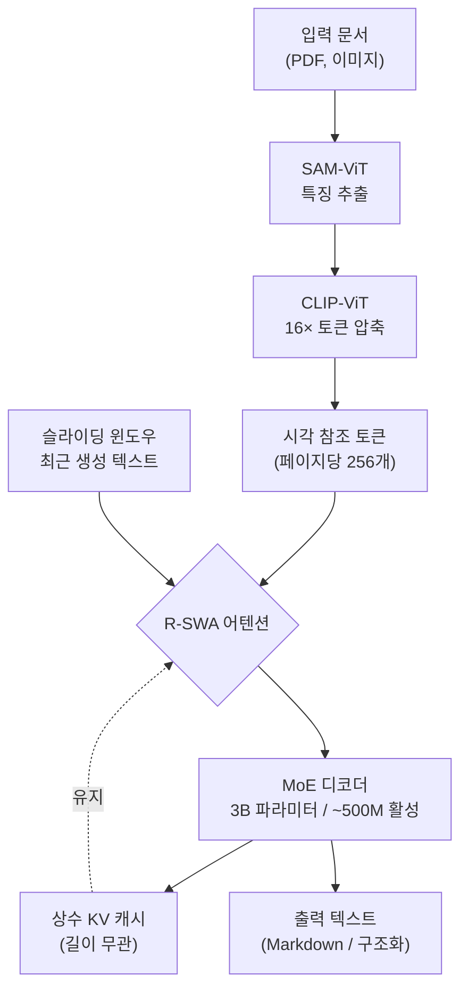

## 개요

문서를 기계가 읽을 수 있는 구조로 바꾸는 작업은 RAG와 에이전트 시대에 다시 핵심으로 떠올랐습니다. 계약서 한 건이 수십 페이지에 달하고, 재무 보고서나 논문은 표와 수식과 다단 레이아웃이 페이지를 가로질러 이어집니다. 이런 긴 문서를 정확한 읽기 순서로 한 번에 풀어내야 LLM이 제대로 활용할 수 있습니다.

문제는 비용입니다. 비전-언어 모델로 문서를 파싱할 때 디코더는 출력 토큰을 하나씩 자기회귀로 생성하는데, 표준 트랜스포머의 풀 어텐션은 시퀀스가 길어질수록 KV 캐시가 선형으로 커집니다. 페이지가 늘면 메모리가 함께 부풀고, 결국 한 번에 처리할 수 있는 문서 길이에 천장이 생깁니다. 그래서 기존 도구 대부분은 문서를 페이지 단위로 잘라 따로 처리한 뒤 다시 이어 붙였고, 이 과정에서 페이지를 넘나드는 표나 단락의 연속성이 깨지곤 했습니다.

Baidu가 공개한 **Unlimited OCR**(arXiv 2606.23050)은 이 천장을 다른 방식으로 걷어냅니다. 디코더의 모든 어텐션 레이어를 Reference Sliding Window Attention(R-SWA)으로 교체해서, 디코딩이 진행되는 내내 KV 캐시 크기를 상수로 유지합니다. 그 결과 32K 컨텍스트 한 번의 순전파로 수십 페이지짜리 문서를 통째로 전사할 수 있습니다. 논문 제목이 말하는 "one-shot long-horizon parsing", 즉 긴 문서를 한 방에 읽는다는 표현이 과장이 아닙니다.

저희 ThakiCloud는 쿠버네티스 기반 AI/ML SaaS 플랫폼에서 멀티테넌트 추론과 문서 처리 워크로드를 직접 운영합니다. 추론 비용의 상당 부분이 KV 캐시 메모리에서 나오는 환경이라, "길이에 상관없이 상수 메모리"라는 설계는 단순한 학술적 호기심이 아니라 서빙 경제성에 직접 닿는 주제입니다. 이번 글에서는 R-SWA가 무엇이고 왜 KV 캐시가 상수로 유지되는지, 그리고 우리 플랫폼 관점에서 어디에 맞는지를 정리합니다.

## Unlimited OCR란 무엇인가

Unlimited OCR은 바닥부터 새로 만든 모델이 아니라, DeepSeek-OCR을 한 단계 더 밀어붙인 모델입니다. DeepSeek-OCR의 강점인 **DeepEncoder**를 그대로 가져와 인코더로 쓰고, 디코더의 어텐션만 R-SWA로 갈아끼웠습니다.

*DeepEncoder가 페이지를 256개 시각 토큰으로 압축하고, R-SWA 디코더가 상수 KV 캐시로 긴 문서를 한 번에 전사합니다. 도표를 클릭하면 크게 볼 수 있습니다.*
*고압축 인코더가 페이지를 소수의 시각 토큰으로 줄이고, R-SWA 디코더가 상수 KV 캐시로 긴 출력을 생성합니다.*

**인코더(DeepEncoder)**: SAM-ViT와 CLIP-ViT를 직렬로 연결한 구조로, 16배 토큰 압축을 적용합니다. 1024×1024 해상도의 PDF 한 페이지가 단 256개의 시각 토큰으로 압축됩니다. 입력 측에서 이미 토큰 수를 크게 줄여 두기 때문에, 디코더가 참조해야 할 시각 정보의 양 자체가 작습니다. 이 고압축 설계가 뒤에 설명할 상수 KV 캐시와 맞물려 장문 처리를 가능하게 합니다.

**디코더(R-SWA를 적용한 LLM)**: 디코더는 3B 규모의 MoE(Mixture of Experts) 구조이며, 활성 파라미터는 약 500M입니다. 토큰마다 전체 3B가 아니라 일부 전문가만 활성화하므로, 파라미터 수에 비해 토큰당 연산이 가볍습니다. 여기에 모든 어텐션 레이어를 R-SWA로 교체한 것이 이 모델의 핵심 차별점입니다.

전체 모델은 약 30억 파라미터 규모이며 BF16 가중치로 공개되었고, 라이선스는 상업적 활용이 자유로운 MIT입니다. 가중치는 허깅페이스 `baidu/Unlimited-OCR`와 ModelScope에서 받을 수 있고, 코드와 함께 GitHub에 공개되었습니다. 공개 시점 기준 단일 중급 NVIDIA GPU 한 장에서 구동할 수 있다고 보고합니다.

이 모델은 앞서 저희가 다룬 PaddleOCR-VL과 같은 Baidu 계열이지만 접근법이 다릅니다. PaddleOCR-VL은 레이아웃 분석과 요소 인식을 두 단계로 분리해 작은 모델로 안정성을 확보한 반면, Unlimited OCR은 종단간 한 모델을 유지하되 어텐션 메커니즘을 바꿔 장문 한 방 처리를 노립니다. 같은 문제를 푸는 두 가지 설계 철학을 비교해 보는 재미가 있습니다.

## 핵심 메커니즘: Reference Sliding Window Attention

R-SWA를 이해하려면 먼저 두 가지 기존 방식의 약점을 봐야 합니다.

**풀 어텐션**은 모든 출력 토큰이 그 앞의 모든 토큰을 다 봅니다. 정확하지만 KV 캐시가 시퀀스 길이에 비례해 커집니다. 페이지가 늘면 메모리가 선형으로 늘어 천장에 부딪힙니다.

**일반 슬라이딩 윈도우 어텐션(SWA)**은 최근 W개의 토큰만 봅니다. KV 캐시가 윈도우 크기로 고정되어 메모리는 상수가 되지만, 윈도우 밖으로 밀려난 정보는 잊습니다. 일반 텍스트 생성에서는 통하지만, OCR처럼 "원본을 보고 그대로 옮겨 적어야 하는" 작업에서는 치명적입니다. 윈도우가 지나가면 어느 페이지를 전사하던 중이었는지 근거를 잃기 때문입니다.

R-SWA는 이 둘을 절충합니다. 핵심 발상은 인간이 긴 문서를 옮겨 적는 방식에서 왔습니다. 사람은 방금 쓴 몇 문장(단기 작업 기억)과, 눈앞에 펼쳐 둔 원본 문서(참조 대상)를 함께 보면서 받아 적습니다. R-SWA의 "Reference"는 바로 이 원본 참조에 해당합니다. 인코더가 만든 고압축 시각 토큰을 항상 참조 가능한 앵커로 유지하면서, 생성되는 텍스트 토큰에 대해서는 슬라이딩 윈도우를 적용합니다.

즉 어텐션이 보는 대상은 두 묶음으로 나뉩니다. 하나는 크기가 고정된 시각 참조 토큰(인코더 출력)이고, 다른 하나는 최근 생성 텍스트의 슬라이딩 윈도우입니다. 두 묶음 모두 길이가 상한으로 묶여 있으므로, 출력이 아무리 길어져도 KV 캐시 총량이 상수로 유지됩니다. 원본을 잊지 않으면서도 메모리는 일정한, 말 그대로 "작업 기억"을 모사한 어텐션입니다.

논문은 R-SWA가 OCR 전용 트릭이 아니라 범용 파싱 어텐션이라고 강조합니다. 긴 입력을 보고 긴 출력을 만들어야 하는 작업, 예컨대 음성 인식(ASR)이나 번역에도 같은 구조를 적용할 수 있다는 것입니다. 입력이라는 참조를 고정 앵커로 두고 출력에 슬라이딩 윈도우를 거는 패턴은 시퀀스-투-시퀀스 문제 전반에 일반화될 여지가 있습니다.

## 벤치마크 결과

성능 수치는 OmniDocBench 기준으로 보고됩니다. OmniDocBench는 본문, 표, 수식, 읽기 순서를 종합적으로 평가하는 문서 파싱 벤치마크입니다.

- **OmniDocBench v1.5 전체 점수 93.23%**: 베이스라인인 DeepSeek-OCR 대비 6.22%포인트 향상입니다.
- **OmniDocBench v1.6 전체 점수 93.92%**: 종단간 방식에서 SOTA로 보고됩니다.

주목할 점은 정확도 향상과 메모리 효율을 동시에 잡았다는 것입니다. 보통 윈도우를 좁혀 메모리를 줄이면 정확도가 떨어지는 트레이드오프가 발생하는데, R-SWA는 시각 참조를 고정 앵커로 유지함으로써 정확도 손실 없이 상수 KV 캐시를 달성했습니다. 페이지를 잘라 따로 처리하지 않고 연속 문서 스트림을 한 번에 흘려보낼 수 있다는 점도 실무적으로 큰 차이를 만듭니다. 페이지 경계에서 끊기는 표나 각주, 다단 본문의 연속성이 보존되기 때문입니다.

다만 위 수치는 모두 논문과 모델 카드가 보고한 값이며, 저희가 직접 재현한 수치는 아닙니다. Unlimited OCR은 3B MoE 모델이라 의미 있는 검증에는 GPU와 모델 다운로드가 필요해, 이번 글은 설계 분석에 초점을 맞췄습니다. 실측 재현은 별도 실험으로 다룰 계획입니다.

## ThakiCloud K8s AI/ML SaaS 플랫폼 적용 및 시사점

저희 ThakiCloud의 플랫폼 관점에서 이 모델이 흥미로운 이유는 명확합니다. 멀티테넌트 추론 서빙에서 가장 다루기 까다로운 자원이 바로 KV 캐시 메모리이기 때문입니다.

**서빙 경제성**: vLLM 같은 서빙 엔진에서 동시 처리 가능한 요청 수, 즉 배치 크기는 GPU 메모리에서 KV 캐시가 차지하는 양에 좌우됩니다. 풀 어텐션 모델은 긴 문서 요청 하나가 KV 캐시를 크게 잡아먹어 동시 처리량을 떨어뜨립니다. 반면 상수 KV 캐시 모델은 문서 길이와 무관하게 요청당 메모리가 예측 가능합니다. 한 장의 청구서든 200페이지 계약서든 같은 메모리 풋프린트로 처리되므로, 워크로드 길이 분포에 흔들리지 않고 배치 크기를 안정적으로 계획할 수 있습니다. 멀티테넌트 환경에서 테넌트별 자원 격리와 용량 산정이 훨씬 단순해집니다.

**온프레미스와 비용 효율**: 가중치가 MIT 라이선스로 공개되어 있고 단일 중급 GPU에서 돌아간다는 점은, 데이터를 외부로 내보낼 수 없는 고객에게 결정적입니다. 금융, 공공, 의료처럼 문서 자체가 민감 정보인 도메인에서는 클라우드 OCR API로 계약서를 올리는 것 자체가 컴플라이언스 위반이 될 수 있습니다. 상수 메모리 설계 덕에 적당한 GPU 한 장으로 장문 문서 파이프라인을 온프레미스에 세울 수 있다면, 저희가 Kueue로 GPU를 스케줄링하고 vLLM으로 서빙하는 스택 위에 자연스럽게 얹힙니다.

**적용 로드맵**: 저희 플랫폼에서 문서 인텔리전스 워크로드는 RAG 인덱싱 전처리와 에이전트의 문서 도구로 들어옵니다. 상수 KV 캐시 OCR은 이 두 경로 모두에서 긴 문서를 청크로 쪼개기 전에 통째로 정확히 파싱하는 1차 관문 역할을 할 수 있습니다. 특히 페이지를 넘나드는 표와 다단 레이아웃이 많은 한국어 공문서와 재무 문서에서, 페이지 분할 없이 연속 처리하는 능력은 후속 RAG 품질에 직접 기여합니다. 앞서 다룬 PaddleOCR-VL의 분리형 안정성과 Unlimited OCR의 장문 한 방 처리를 워크로드 특성에 따라 선택적으로 배치하는 것이 현실적인 운용 전략입니다.

## 한계 및 반론

설계가 우아하다고 해서 모든 상황에 맞는 것은 아닙니다.

**슬라이딩 윈도우의 본질적 제약**: R-SWA가 시각 참조를 앵커로 유지하더라도, 생성 텍스트 측은 여전히 슬라이딩 윈도우입니다. 출력 토큰 사이의 아주 먼 의존성, 예컨대 1페이지에서 정의한 약어를 180페이지에서 일관되게 풀어 쓰는 것 같은 장거리 텍스트 일관성은 시각 참조가 보강한다 해도 풀 어텐션만큼 보장된다고 단정하기 어렵습니다. 이 부분은 직접 재현 실험으로 확인해야 할 지점입니다.

**MoE의 운영 부담**: 3B MoE는 토큰당 연산은 가볍지만, 전문가 전체를 메모리에 올려야 하므로 활성 파라미터(500M)보다 실제 메모리 점유는 큽니다. 또한 MoE는 배치 내 토큰의 전문가 라우팅이 불균형해지면 처리량이 흔들리는 특성이 있어, 서빙 엔진의 MoE 지원 성숙도에 성능이 좌우됩니다.

**벤치마크와 실사용의 간극**: OmniDocBench 점수가 높다고 해서 한국어·아랍어 같은 비라틴 문자, 손글씨, 저품질 스캔, 도장이 겹친 공문서 등 실제 운영 환경의 까다로운 입력에서 같은 수준을 보장하지는 않습니다. 문서 OCR은 벤치마크와 현장의 격차가 특히 큰 영역이며, 도입 전 자사 문서 분포로 별도 평가가 반드시 필요합니다.

**검증의 필요**: 이 글의 모든 수치는 논문과 모델 카드 보고값입니다. 상수 KV 캐시가 실제 서빙에서 약속한 만큼의 처리량 이득을 주는지, 정확도 손실 없이 32K를 채우는지는 저희가 직접 벤치마크해 봐야 확정할 수 있습니다.

그럼에도 "참조를 고정하고 생성에 슬라이딩 윈도우를 건다"는 발상은 장문 시퀀스-투-시퀀스 작업의 메모리 천장을 다루는 깔끔한 한 수입니다. OCR을 넘어 ASR과 번역까지 일반화될 수 있다는 주장이 맞다면, 멀티테넌트 추론 플랫폼을 운영하는 입장에서 계속 지켜볼 가치가 충분합니다.

## 출처

- [Unlimited OCR Works: Welcome the Era of One-shot Long-horizon Parsing (arXiv 2606.23050)](https://arxiv.org/abs/2606.23050)
- [Hugging Face 논문 페이지](https://huggingface.co/papers/2606.23050)
- [baidu/Unlimited-OCR (Hugging Face 모델·가중치)](https://huggingface.co/baidu/Unlimited-OCR)
- [baidu/Unlimited-OCR (GitHub 코드)](https://github.com/baidu/Unlimited-OCR)
