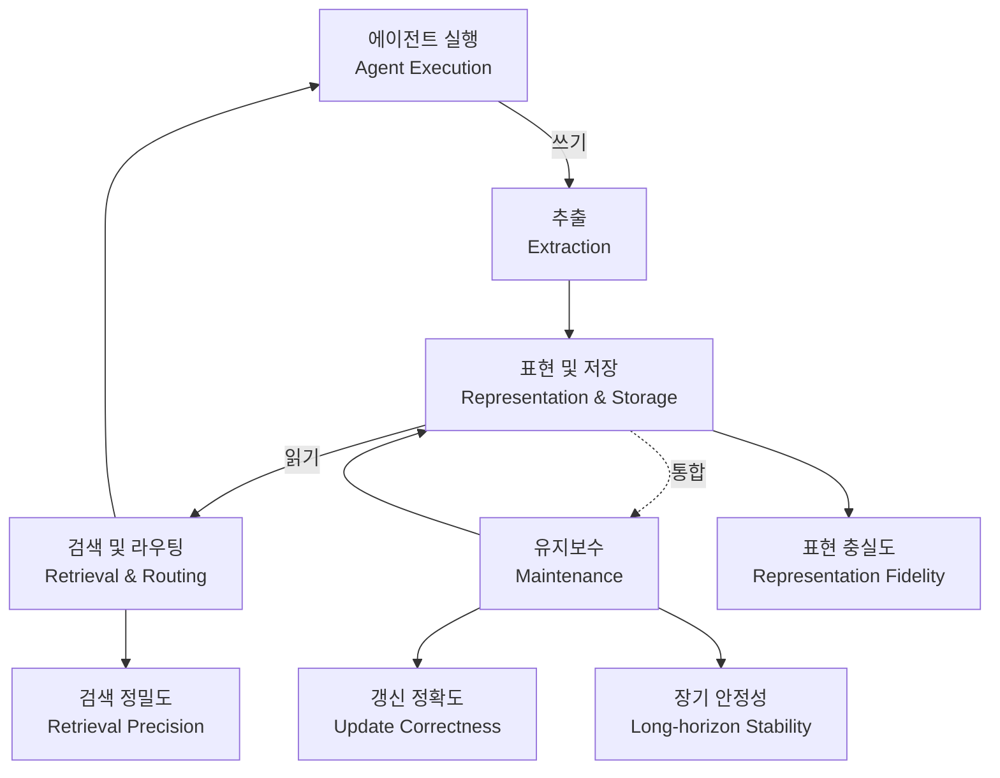

## 개요

LLM 에이전트를 오래 굴려본 분이라면 한 번쯤 같은 벽에 부딪힙니다. 단발 질의응답은 잘 하는데, 며칠에 걸친 작업이나 여러 세션을 가로지르는 맥락이 되면 에이전트가 자기가 무엇을 했는지 잊습니다. 그래서 등장한 것이 "에이전트 메모리"이고, 처음에는 그저 벡터 스토어에 대화를 넣고 검색하는 RAG의 변형 정도였습니다.

그런데 2026년 6월 23일 공개된 arXiv 논문 [Are We Ready For An Agent-Native Memory System?](https://arxiv.org/abs/2606.24775)는 이 흐름에 한 줄로 정리되는 관점을 제시합니다. 에이전트 메모리는 더 이상 검색 보강 장치가 아니라, **영속 저장·검색·갱신·통합·동적 수명주기 관리를 모두 떠안은 하나의 데이터 관리 시스템(data management system)** 으로 진화했다는 것입니다. dair_ai가 "에이전트 메모리는 이제 데이터 시스템이다"라고 요약한 그 논문입니다.

이 관점이 중요한 이유는 ThakiCloud처럼 쿠버네티스 위에서 멀티테넌트 에이전트를 실제로 운용하는 입장에서, 메모리가 "기능"이 아니라 "운영해야 하는 시스템"이 되는 순간 비용·견고성·아키텍처 선택이 전부 따라오기 때문입니다. 이 글은 논문의 공식 초록과 [공개 코드](https://github.com/OpenDataBox/MemoryData)를 근거로 핵심 주장을 정리하고, 우리 플랫폼 관점에서 무엇을 가져갈 수 있는지를 짚습니다.

> 📄 **심층 리뷰 전문(DOCX)**: 이 논문의 상세 피어리뷰를 [Google Drive에서 다운로드](https://drive.google.com/file/d/1wLivKobOMtAKQ1zwCmG-O8wdebyZRbcz/view)할 수 있습니다.

## 이 연구는 무엇인가

논문이 던지는 문제 제기는 단순하지만 날카롭습니다. 지금까지 에이전트 메모리를 평가하는 방식은 대부분 **종단(end-to-end) 과제 성공 지표**에 머물러 있었습니다. F1이나 BLEU 같은 점수로 "질문에 잘 답했는가"만 보고, 그 답을 만들어낸 메모리 시스템 내부는 통째로 블랙박스로 취급했다는 것입니다.

이렇게 되면 정작 운영자가 알아야 할 시스템 수준의 질문이 가려집니다. 메모리를 유지하는 데 드는 **운영 비용**은 얼마인지, 메모리 모듈을 어떻게 조합하느냐에 따른 **아키텍처 트레이드오프**는 무엇인지, 지식이 계속 바뀌는 상황에서 **견고성**은 어느 정도인지. 점수 하나로는 이 중 어느 것도 답할 수 없습니다.

저자들(Wei Zhou, Xuanhe Zhou, Guoliang Li, Zhiyu Li, Feiyu Xiong 등, 데이터베이스 시스템 연구자들이 포함되어 있다는 점이 이 논문의 색깔을 설명합니다)은 그래서 메모리를 **데이터 관리의 관점**에서 체계적으로 실험합니다. 핵심은 에이전트 메모리를 네 개의 핵심 모듈로 분해하는 분석 프레임워크입니다.

*에이전트 네이티브 메모리 시스템의 네 모듈 구조와 흐름. 도표를 클릭하면 크게 볼 수 있습니다.*

네 모듈은 다음과 같습니다.

1. **표현 및 저장(Representation & Storage)**: 기억을 어떤 형태로 담고 어디에 보관하는가. 벡터, 그래프, 트리, 평문 등 표현 방식이 곧 **표현 충실도(representation fidelity)** 를 좌우합니다.
2. **추출(Extraction)**: 에이전트 실행 과정에서 무엇을 기억으로 남길지 골라내는 단계입니다. 모든 토큰을 다 저장할 수는 없으니 여기서 신호와 잡음을 가릅니다.
3. **검색 및 라우팅(Retrieval & Routing)**: 필요한 순간에 올바른 기억을 찾아 적절한 경로로 되돌려 주는 단계입니다. 여기서 나오는 지표가 **검색 정밀도(retrieval precision)** 입니다.
4. **유지보수(Maintenance)**: 오래된 기억을 통합·갱신·정리하는 단계입니다. **갱신 정확도(update correctness)** 와 **장기 안정성(long-horizon stability)** 이 여기서 결정됩니다.

데이터베이스를 다뤄본 분이라면 이 구도가 낯설지 않을 겁니다. 표현·저장은 스토리지 엔진, 추출은 ingest 파이프라인, 검색·라우팅은 쿼리 플래너, 유지보수는 컴팩션·가비지 컬렉션에 대응합니다. 논문이 "데이터 관리 관점"이라고 말하는 이유가 바로 이 대응 관계에 있습니다.

## 핵심 발견

논문은 이 프레임워크 위에서 **12개의 대표 메모리 시스템과 2개의 참조 베이스라인**을, **5개의 벤치마크 워크로드와 11개 데이터셋**에 걸쳐 평가합니다. 단일 모델이나 단일 데이터셋이 아니라 시스템 여러 개를 같은 잣대로 측정했다는 점이 이 연구의 무게입니다. 초록에서 직접 끌어낼 수 있는 결론은 세 가지입니다.

**첫째, 모든 상황을 지배하는 단일 아키텍처는 없습니다.** 어떤 메모리 구조가 가장 좋은가에 대한 답은 "그때그때 다르다"입니다. 더 정확히는, 메모리 구조가 **워크로드의 병목(workload bottleneck)** 과 얼마나 잘 맞물리느냐에 효과가 좌우됩니다. 검색이 병목인 워크로드와 갱신이 병목인 워크로드에서 최적 구조가 갈린다는 뜻입니다. 이는 "무조건 그래프 메모리가 최고", "벡터 스토어면 충분" 같은 단순 처방을 정면으로 반박합니다.

**둘째, 모듈 단위로 뜯어보면 책임 소재가 분리됩니다.** 저자들은 세밀한 절제(ablation) 실험으로 각 모듈이 표현 충실도, 검색 정밀도, 갱신 정확도, 장기 안정성에 미치는 개별 효과를 정량화합니다. 종단 점수 하나로 뭉뚱그릴 때는 보이지 않던 "어느 모듈이 무엇을 망가뜨리는가"가 드러납니다. 운영 관점에서는 이게 진짜 가치입니다. 메모리가 틀린 답을 줬을 때 추출이 문제였는지 검색이 문제였는지를 가를 수 있어야 고칠 수 있기 때문입니다.

**셋째, 유지보수에서 비용-성능 트레이드오프가 명확합니다.** 현실적인 워크로드에서, **국소적 유지보수(localized maintenance)가 전역 재구성(global reorganization)보다 비용 효율적**이라는 결과를 제시합니다. 메모리 전체를 주기적으로 갈아엎는 방식보다, 바뀐 부분만 손대는 방식이 더 싸게 먹힌다는 것입니다. 데이터베이스의 점진적 컴팩션이 전면 리빌드보다 싼 것과 같은 직관이며, 비용에 민감한 실서비스라면 이 한 줄이 설계 결정을 바꿉니다.

요약하면 이 논문은 "에이전트 메모리를 잘 만드는 법"을 처방하기보다, **"에이전트 메모리를 시스템으로서 어떻게 측정하고 비교할 것인가"의 틀**을 깔아 줍니다. 그리고 그 틀 위에서 단일 정답이 없음을, 대신 워크로드 정합성과 유지보수 비용이 진짜 레버임을 보입니다.

## ThakiCloud K8s AI/ML SaaS 플랫폼 적용 및 시사점

ThakiCloud의 AI 플랫폼은 쿠버네티스 위에서 다양한 고객 환경의 에이전트를 멀티테넌트로 운용합니다. 이 논문의 관점은 우리 플랫폼에 곧장 와닿는 지점이 몇 개 있습니다.

**메모리를 테넌트별로 운영되는 데이터 시스템으로 본다는 것.** 에이전트 메모리가 데이터 관리 시스템이라면, 이는 곧 테넌트마다 스토리지 비용·검색 지연·갱신 부하가 따로 발생하는 운영 대상이라는 뜻입니다. 멀티테넌트 환경에서 한 테넌트의 메모리 유지보수가 다른 테넌트의 GPU·I/O를 잠식하지 않도록 격리하는 일은 우리가 Kueue로 GPU 워크로드를 큐잉·격리하는 문제와 같은 결의 문제입니다. 메모리도 "기능"이 아니라 "자원 예산을 가진 워크로드"로 다뤄야 한다는 신호로 읽힙니다.

**단일 메모리 아키텍처를 강요하지 않는 설계.** "모든 상황을 지배하는 단일 아키텍처는 없다"는 결론은, 플랫폼이 특정 메모리 백엔드 하나를 하드코딩하기보다 **워크로드에 따라 메모리 구조를 교체·구성할 수 있는 추상화**를 제공해야 함을 시사합니다. 고객의 에이전트가 장기 대화형인지, 빈번한 지식 갱신형인지에 따라 검색 중심 구조와 유지보수 중심 구조를 갈아 끼울 수 있어야 합니다. 4개 모듈 분해는 이런 교체 가능한 추상화의 자연스러운 경계선이 됩니다.

**온프레미스·비용 효율 관점의 자산.** 국소적 유지보수가 전역 재구성보다 싸다는 결과는, 온프레미스로 자체 호스팅하는 고객에게 특히 중요합니다. 외부 관리형 메모리 서비스에 종속되지 않고, 제한된 자체 GPU·스토리지 예산 안에서 메모리 유지보수 비용을 통제할 수 있는 설계 원칙을 제공하기 때문입니다. 국정원 요구나 데이터 주권 때문에 외부 API를 쓰기 어려운 고객 환경에서, "메모리도 우리 클러스터 안에서 비용을 예측·통제할 수 있다"는 것은 그대로 영업 포인트가 됩니다.

당장 우리가 할 수 있는 일은 두 가지입니다. 하나는 공개된 [MemoryData 코드](https://github.com/OpenDataBox/MemoryData)의 4모듈 분해와 워크로드 분류를 우리 에이전트 메모리 계측의 출발점으로 삼아, 테넌트 메모리를 종단 점수가 아니라 모듈별 지표(표현 충실도·검색 정밀도·갱신 정확도·장기 안정성)로 관측하는 것입니다. 다른 하나는 유지보수 정책을 전역 재구성이 아니라 국소 갱신 우선으로 두어 비용 상한을 설계 단계에서 박아 두는 것입니다.

## 한계 및 반론

균형을 위해 이 연구를 그대로 받아들이기 전에 짚을 점도 분명히 둡니다.

첫째, 이 논문은 **측정 연구이지 새 메모리 시스템 제안이 아닙니다.** "더 나은 메모리를 어떻게 만드는가"에 대한 청사진을 기대하면 실망할 수 있습니다. 제시되는 것은 비교틀과 진단이며, "agent-native memory를 향한 유망한 방향"은 제시되지만 구현은 후속 과제로 남습니다.

둘째, **벤치마크의 일반화 한계**입니다. 5개 워크로드·11개 데이터셋은 적지 않지만, 에이전트가 실제로 마주치는 도메인은 그보다 훨씬 넓습니다. "워크로드 병목에 따라 최적이 갈린다"는 결론은 역설적으로, 우리 고객의 실제 워크로드가 이 벤치마크 분포와 다르면 논문의 순위가 그대로 이전되지 않는다는 뜻이기도 합니다. 결국 각 배포 환경에서 다시 측정해야 합니다.

셋째, **저자 구성에서 오는 관점의 편향 가능성**입니다. 데이터베이스 시스템 연구자 중심이라는 점은 "메모리를 데이터 관리로 본다"는 프레이밍을 강하게 만들지만, 인지과학적·강화학습적 메모리 관점(에피소드 메모리, 정책 학습형 메모리 관리 등)이 상대적으로 덜 조명될 여지가 있습니다. 데이터 관리는 강력한 렌즈이되 유일한 렌즈는 아닙니다.

그럼에도 "에이전트 메모리를 시스템으로 측정하라"는 핵심 메시지는, 메모리를 실제로 운영해야 하는 우리 같은 플랫폼에게는 반박하기 어려운 출발점입니다. 점수가 아니라 모듈과 비용으로 메모리를 보기 시작하는 순간, 고칠 수 있는 것이 비로소 보입니다.

## 출처

- 논문: [Are We Ready For An Agent-Native Memory System? (arXiv 2606.24775)](https://arxiv.org/abs/2606.24775)
- HF Papers: [hf.co/papers/2606.24775](https://hf.co/papers/2606.24775)
- 공개 코드: [github.com/OpenDataBox/MemoryData](https://github.com/OpenDataBox/MemoryData)
- 원 트윗 맥락: dair_ai, "Agent memory is a data system now"

> 📄 **심층 리뷰 전문(DOCX)**: 이 논문의 상세 피어리뷰를 [Google Drive에서 다운로드](https://drive.google.com/file/d/1wLivKobOMtAKQ1zwCmG-O8wdebyZRbcz/view)할 수 있습니다.
