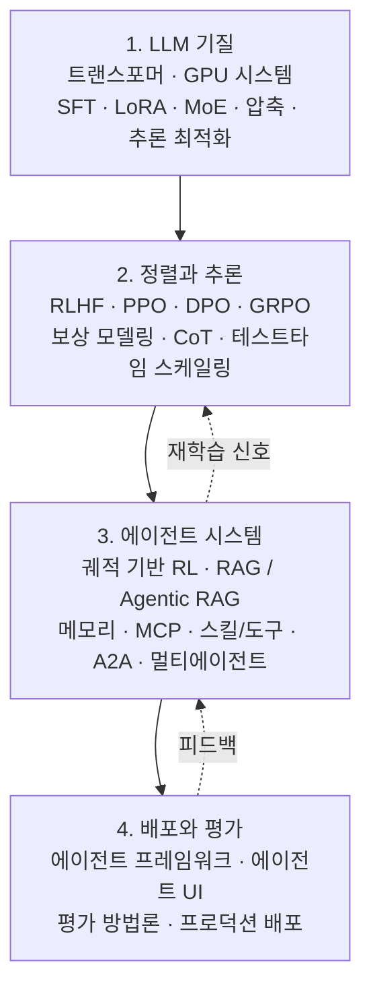

## 개요

에이전트 AI를 공부하다 보면 자료가 흩어져 있다는 사실에 먼저 부딪힙니다. 트랜스포머 구조는 한 곳에서, 강화학습 정렬은 다른 곳에서, MCP와 멀티에이전트 협업은 또 다른 블로그에서 조각조각 익히게 됩니다. 각 조각은 충실하지만, 그것들이 어떻게 한 시스템으로 이어지는지를 보여주는 자료는 드뭅니다.

2026년 6월 arXiv에 공개된 [The Hitchhiker's Guide to Agentic AI: From Foundations to Systems](https://arxiv.org/abs/2606.24937)가 채우려는 빈자리가 바로 여기입니다. 이 문서는 짧은 서베이가 아니라, LLM이라는 기질에서 출발해 정렬과 추론을 거쳐 에이전트 시스템을 세우고 프로덕션까지 배포하는 전 과정을 한 권으로 묶은 실무 레퍼런스입니다. 각 장은 이론적 토대와 함께 구현 가이드, 코드 예시, 그리고 1차 문헌 참조를 짝지어 제시합니다.

ThakiCloud처럼 에이전트를 일급 리소스로 다루는 플랫폼을 운영하는 입장에서 이 가이드는 남의 이야기가 아닙니다. 우리가 Paxis(Agent-Native Cloud)에서 매일 다루는 스킬, 도구, 메모리, 멀티에이전트 오케스트레이션이 이 문서의 후반부 절반을 그대로 차지하기 때문입니다. 이 글은 가이드의 구조를 네 개 층위로 정리하고, 우리 제품 관점에서 무엇을 취할 수 있는지를 함께 짚습니다.

*흩어진 에이전트 AI 지식을 하나의 시스템으로 묶는 것이 이 가이드의 출발점입니다.*

## 이 가이드는 무엇인가

이 문서는 "에이전트를 만들고 싶은 실무자"를 독자로 상정합니다. 그래서 개념을 나열하는 데 그치지 않고, 첫 원리에서 시작해 프로덕션 배포로 끝나는 스택 전체를 따라갑니다. 핵심은 계층 사이의 의존 관계입니다. 좋은 에이전트는 갑자기 등장하지 않습니다. 잘 학습된 모델 위에 정렬과 추론 능력이 얹히고, 그 위에 도구 사용과 메모리, 협업이 쌓여야 비로소 시스템이 됩니다.

가이드가 다루는 범위를 네 개 층위로 압축하면 다음과 같습니다.

아래에서 각 층을 차례로 살펴봅니다.

## 기반: LLM 기질

가이드는 트랜스포머 구조와 GPU 시스템에서 출발합니다. 그다음 학습과 미세조정으로 넘어가는데, 지도 미세조정(SFT), LoRA 같은 파라미터 효율 기법, 그리고 전문가 혼합(MoE) 구조를 다룹니다. 마지막으로 모델 압축과 추론 최적화로 마무리합니다.

이 순서가 의미하는 바가 있습니다. 에이전트의 행동 품질은 결국 기반 모델의 능력에 묶여 있고, 그 모델을 실제로 굴리는 비용은 압축과 추론 최적화에서 갈립니다. 추론 비용을 낮추지 못하면 에이전트가 도구를 여러 번 호출하고 긴 궤적을 밟는 순간 경제성이 무너집니다. 즉 가장 아래 층의 효율이 가장 위 층의 실현 가능성을 결정합니다.

*가장 아래 층의 효율이 가장 위 층의 실현 가능성을 결정합니다.*

## 정렬과 추론 층

두 번째 층은 정렬과 추론입니다. 인간 피드백 기반 강화학습(RLHF)에서 시작해 PPO, DPO와 그 변형들, 그리고 GRPO와 보상 모델링을 다룹니다. 이어서 큰 추론 모델을 위한 강화학습으로 넘어가며, 사고 사슬(chain-of-thought)과 테스트타임 스케일링을 짚습니다.

여기서 중요한 전환이 일어납니다. 단순히 "사람이 좋아하는 답"을 내도록 맞추는 단계에서, "스스로 더 오래 생각해 더 나은 답에 도달하는" 추론 능력으로 무게 중심이 옮겨갑니다. 에이전트가 여러 단계를 계획하고 중간 결과를 검증하려면 이 추론 층이 탄탄해야 합니다. 정렬이 안전을 책임진다면, 추론은 자율성을 책임집니다.

*정렬이 안전을 책임진다면, 추론은 자율성을 책임집니다.*

## 에이전트 시스템: MCP, 스킬, 메모리, 멀티에이전트

가이드의 후반부 절반이 여기에 할애됩니다. 그만큼 에이전트 AI의 무게중심이 이 층에 있다는 뜻입니다. 다루는 주제를 보면 우리에게 익숙한 이름들이 줄지어 등장합니다.

- **궤적 기반 강화학습**: 단발 응답이 아니라, 도구 호출과 관찰이 이어지는 행동 궤적 전체를 학습 신호로 삼습니다.
- **RAG와 Agentic RAG**: 검색 증강 생성을 정적 파이프라인에서 에이전트가 능동적으로 검색 전략을 결정하는 형태로 끌어올립니다.
- **메모리 시스템**: 세션을 넘어 지식을 누적하고 회수하는 구조입니다.
- **MCP(Model Context Protocol)**: 에이전트가 외부 도구·데이터와 표준화된 방식으로 연결되는 통로입니다.
- **에이전트 스킬과 도구 사용**: 능력을 재사용 가능한 단위로 패키징하고 선택·실행합니다.
- **A2A(Agent-to-Agent) 프로토콜과 멀티에이전트 구조**: 에이전트끼리 작업을 위임하고 조율합니다.

이 목록은 사실상 Agent-Native 플랫폼의 부품 명세서와 같습니다. 스킬을 어떻게 고르고, 도구를 어떻게 안전하게 호출하며, 메모리를 어떻게 라우팅하고, 여러 에이전트의 작업을 어떻게 DAG로 묶는가. 가이드는 이 질문들을 흩어진 기법이 아니라 하나의 시스템 설계 문제로 다룹니다.

*이 부품 목록은 사실상 Agent-Native 플랫폼의 명세서와 같습니다.*

## 배포와 평가

마지막 층은 실제 운영입니다. 에이전트 개발 프레임워크, 에이전트 UI 설계, 에이전트 작업에 맞는 평가 방법론, 그리고 프로덕션 배포를 다룹니다.

평가가 별도 층으로 분리되어 있다는 점이 인상적입니다. 단일 응답의 정확도만 보던 시절의 지표로는 도구를 여러 번 호출하고 여러 단계를 밟는 에이전트를 측정할 수 없습니다. 궤적의 성공률, 중간 단계의 안전성, 비용 대비 효용을 함께 봐야 합니다. 가이드가 평가를 구현의 부록이 아니라 독립된 주제로 둔 것은, 에이전트 시스템에서 "잘 돌아가는지 어떻게 아는가"가 그만큼 어려운 문제이기 때문입니다.

*단일 응답 정확도만 보던 지표로는 다단계 에이전트를 측정할 수 없습니다.*

## ThakiCloud 제품 적용 시사점

이 가이드의 후반부는 ThakiCloud의 **Paxis** 설계도와 거의 겹칩니다. Paxis는 ai-platform 위에서 도는 Agent-Native Cloud 제어 평면으로, 스킬·도구·정책·감사 로그를 일급 리소스로 다룹니다. 가이드가 다루는 부품들을 우리 레이어에 대응시키면 이렇게 읽힙니다.

- **에이전트 스킬과 도구 사용 → Skill Harness**: Paxis는 960개가 넘는 스킬을 BM25로 선택해 격리 샌드박스에서 실행합니다. 가이드가 강조하는 "능력을 재사용 단위로 패키징한다"는 원칙을 운영 규모에서 구현한 형태입니다.
- **MCP → MCP 커넥터**: Paxis는 OAuth 자동 재연결을 갖춘 MCP 커넥터로 외부 도구·데이터를 연결합니다. 가이드의 표준 연결 통로가 제품에서는 끊겨도 스스로 복구하는 인프라로 들어옵니다.
- **메모리 시스템 → HKE 지식 엔진**: 세션을 넘는 지식 누적·회수를 위키 기반 지식 엔진으로 다룹니다.
- **멀티에이전트·A2A → DAG 멀티에이전트**: 작업을 DAG로 묶어 위임하고 조율하며, NL Cron으로 시점을 제어합니다.
- **배포·평가·안전 → 정책 게이트 + 감사 로그 + 자가진화 스킬**: 모든 에이전트 행동을 정책 게이트와 감사 로그로 통과시키고, 반복 패턴은 자가진화 스킬로 흡수합니다. 가이드가 평가를 독립 층으로 둔 문제의식과 정확히 맞닿습니다.

기반 층의 시사점도 빼놓을 수 없습니다. 가이드 첫 층의 추론 최적화·압축은 그대로 **ai-platform**의 과제입니다. ThakiCloud의 ai-platform은 쿠버네티스와 Kueue 기반 GPU 스케줄링, vLLM 서빙, 멀티테넌트 격리를 통해 에이전트가 도구를 여러 번 호출해도 경제성이 유지되는 추론 기반을 제공합니다. 낮은 서빙 비용(ai-platform)이 곧 에이전트의 경제성(Paxis)을 만든다는 점에서, 이 가이드의 가장 아래 층과 가장 위 층은 우리 제품에서 한 줄로 이어집니다.

*가이드의 부품 명세가 Paxis의 실제 레이어와 거의 1:1로 대응합니다.*

## 한계 및 반론

이 문서를 만능 교재로 받아들이는 것은 경계해야 합니다. 첫째, 분야의 속도입니다. 에이전트 AI는 월 단위로 표준이 바뀝니다. 오늘 정리된 MCP·A2A 구현 세부는 6개월 뒤 달라질 수 있고, 가이드의 코드 예시도 버전에 묶입니다. 개념 지도로는 오래 유효하지만, 구현 디테일은 늘 1차 출처로 다시 확인해야 합니다.

둘째, "전부 다룬다"는 것은 곧 "어느 것도 끝까지 깊게 파지 못한다"는 뜻이기도 합니다. 한 권으로 전 계층을 묶으면 폭은 얻지만, 특정 기법을 실제 프로덕션 수준으로 끌어올리려면 결국 전용 문헌과 실험이 필요합니다. 이 가이드의 진짜 가치는 답을 주는 데 있다기보다, 흩어진 조각들이 한 시스템 안에서 어디에 놓이는지를 보여주는 지도에 있습니다. 지도와 실제 주행은 다른 일입니다.

*지도와 실제 주행은 다릅니다. 구현 디테일은 늘 1차 출처로 다시 확인해야 합니다.*

## 출처

- [The Hitchhiker's Guide to Agentic AI: From Foundations to Systems (arXiv:2606.24937)](https://arxiv.org/abs/2606.24937)
- [alphaXiv 페이지](https://www.alphaxiv.org/abs/2606.24937)
