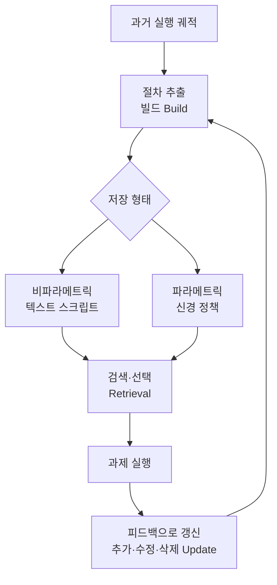

## 개요

LLM 에이전트를 오래 굴려 본 사람은 같은 벽에 부딪힙니다. 에이전트가 매번 처음부터 추론하고, 지난주에 이미 해결한 절차를 또다시 더듬거립니다. 흔한 대응은 자주 쓰는 스킬을 프롬프트에 통째로 밀어 넣는 것입니다. 하지만 이 방식은 두 가지 이유로 취약합니다. 첫째, 스킬이 늘수록 컨텍스트 창을 잡아먹어 정작 과제에 쓸 여지가 줄어듭니다. 둘째, 프롬프트 템플릿은 상황이 조금만 달라져도 쉽게 깨집니다.

최근 에이전트 메모리 연구는 이 문제를 **절차적 메모리(procedural memory)** 라는 렌즈로 다시 봅니다. 사람의 절차적 기억이 자전거 타기처럼 의식하지 않아도 실행되는 숙련된 동작을 담듯이, 에이전트의 절차적 메모리는 반복 과제의 실행 절차를 재사용 가능한 형태로 압축합니다. 핵심 흐름은 절차적 지식을 **프롬프트 검색을 넘어** 별도의 저장·검색·갱신 구조로, 나아가 모델 파라미터 안의 신경 정책으로 옮기는 것입니다.

이 글은 이 전환의 지형을 검증된 논문 중심으로 정리합니다. ThakiCloud의 Agent-Native Cloud인 Paxis가 스킬을 일급 리소스로 다루는 방식이 바로 이 연구 흐름의 실무 구현에 해당하므로, 마지막에 그 연결을 짚습니다.

## 절차적 메모리란 무엇인가

인지 관점에서 메모리는 흔히 세 가지로 나뉩니다. 사실을 담는 의미 기억(semantic), 사건을 담는 일화 기억(episodic), 그리고 방법을 담는 절차 기억(procedural)입니다. 에이전트 문헌에서 절차적 메모리는 "어떻게 하는가"를 담당합니다. 복잡한 동작 시퀀스를 재사용 가능한 패턴으로 추상화해, 매번 밑바닥부터 계획하지 않고도 실행하게 합니다.

문제는 현재 대부분의 에이전트에서 이 절차적 지식이 세 형태 중 하나로 존재한다는 점입니다. 사람이 손으로 짠 것, 깨지기 쉬운 프롬프트 템플릿에 담긴 것, 아니면 모델 파라미터에 암묵적으로 얽혀 갱신하기 비싼 것입니다. 연구가 겨냥하는 지점은 이 지식을 **학습 가능하고 갱신 가능한 일급 대상**으로 끌어올리는 것입니다.

## 프롬프트 검색을 넘어서: 저장·검색·갱신의 분리

이 흐름을 정면으로 다룬 대표 연구가 **Memp: Exploring Agent Procedural Memory**(arXiv 2508.06433)입니다. Memp는 절차적 메모리를 일급 최적화 대상으로 놓고, 과거 궤적을 두 층위로 증류합니다. 하나는 세밀한 단계별 지시이고, 다른 하나는 상위 수준의 스크립트 같은 절차입니다. 그리고 메모리 루프를 **빌드(build)·검색(retrieval)·갱신(update)** 세 국면으로 분리합니다. 갱신 국면에서는 실행 피드백에 따라 항목을 추가·수정·삭제합니다.

이 분리가 중요한 이유는, 프롬프트에 스킬을 밀어 넣는 방식과 근본적으로 다르기 때문입니다. 프롬프트 방식에서는 저장과 검색이 하나로 뭉개져 있고 갱신이라는 개념 자체가 희박합니다. 반면 세 국면을 분리하면 절차를 언제 어떻게 넣고 뺄지, 실패에서 무엇을 고칠지가 명시적인 설계 대상이 됩니다. 자료에 따르면 이 흐름의 큰 방향은 **명시적 비파라메트릭 템플릿에서 암묵적 파라메트릭 신경 정책으로**의 이동으로 요약됩니다(Foundation Agents 메모리 서베이, arXiv 2602.06052). 즉 절차를 텍스트로 저장해 검색하는 단계를 넘어, 경험을 모델의 정책 자체에 녹여 넣는 방향입니다.

## 왜 지금 중요한가: 평가의 어려움

절차적 메모리가 실제로 쓸 만한 스킬을 만들어 내는지는 아직 충분히 이해되지 않았습니다. 이 공백을 겨냥한 연구가 **Managing Procedural Memory in LLM Agents**(arXiv 2606.23127)입니다. 이 논문은 **AFTER**라는 벤치마크를 제안합니다. 6개 직무 역할에 걸친 382개의 현실적인 기업 과제와 22개의 절차적 스킬로 구성되어, 스킬이 과제·역할·모델 백본을 가로질러 얼마나 전이되는지를 측정합니다.

이 벤치마크가 던지는 질문이 핵심입니다. 한 상황에서 학습한 절차가 다른 상황에서도 통하는가? 모델을 바꿔도 스킬이 유효한가? 절차적 메모리를 도입하는 순간 우리는 "이 스킬이 실제로 재사용 가능한가"를 측정할 수단이 필요해집니다. 저장·검색·갱신 구조를 갖췄더라도, 전이가 안 되는 스킬은 결국 비싼 프롬프트 템플릿과 다를 바 없기 때문입니다.

## ThakiCloud 제품 적용 시사점

이 연구 흐름은 ThakiCloud의 **Paxis**에서 그대로 실무 형태를 갖춥니다. Paxis는 Agent-Native Cloud로 **스킬·도구·정책·감사 로그를 일급 리소스**로 다룹니다. 여기서 스킬 하니스는 사실상 프로덕션 절차적 메모리입니다.

- **빌드·검색·갱신의 실무 대응**: Paxis의 스킬 하니스는 960개 이상의 스킬을 BM25로 선택(검색)하고, 격리 샌드박스에서 실행하며, 자가진화 루프로 스킬을 개선(갱신)합니다. Memp가 제시한 세 국면 분리가 운영 시스템의 형태로 구현된 셈입니다.
- **프롬프트 검색을 넘어선 구조**: 스킬을 매번 프롬프트에 밀어 넣는 대신 검증된 스킬을 선택적으로 불러 쓰므로, 컨텍스트 예산을 아끼면서 절차의 일관성을 유지합니다. 이는 이 글이 다룬 "프롬프트 검색을 넘어서"라는 방향과 정확히 일치합니다.
- **평가와 감사**: AFTER 벤치마크가 강조한 "전이 가능성"을 Paxis는 정책 게이트와 감사 로그로 관리합니다. 어떤 스킬이 언제 선택되어 무엇을 했는지가 추적되므로, 재사용 가능한 절차와 그렇지 않은 절차를 데이터로 구분할 근거가 남습니다.

인프라 관점에서는 ai-platform이 이 스킬 실행을 떠받칩니다. Kueue GPU 스케줄링과 멀티테넌트 서빙 위에서 에이전트가 스킬을 실행하므로, 절차적 메모리의 실행 비용이 곧 서빙 효율 문제로 이어집니다. 저비용 서빙(ai-platform)이 에이전트 경제성(Paxis)을 떠받치는 구조입니다.

## 한계 및 반론

절차적 메모리를 파라메트릭 신경 정책으로 옮기는 방향에는 분명한 대가가 따릅니다. 텍스트 스크립트는 사람이 읽고 고칠 수 있지만, 파라미터에 녹아든 절차는 감사와 갱신이 어렵습니다. 무엇이 저장되었는지 들여다보기 힘들고, 잘못된 절차를 골라내 삭제하기도 까다롭습니다. 규제·소버린 환경처럼 설명 가능성이 중요한 곳에서는 이 불투명성이 곧바로 위험이 됩니다.

또한 비파라메트릭 검색 방식도 만능은 아닙니다. 검색은 여전히 잘못된 절차를 불러올 수 있고, 저장소가 커질수록 선택 품질이 떨어질 수 있습니다. AFTER 같은 벤치마크가 보여주듯 스킬의 전이 가능성은 아직 검증 초기 단계이며, 한 도메인에서 통한 절차가 다른 도메인에서 통한다는 보장은 없습니다. 절차적 메모리는 에이전트를 매번 백지에서 시작하지 않게 하는 유망한 방향이지만, 저장 형태·검색 품질·갱신 안전성·평가 방법이 함께 성숙해야 실무에서 신뢰할 수 있는 자산이 됩니다.

## 출처

- [Memp: Exploring Agent Procedural Memory (arXiv 2508.06433)](https://arxiv.org/abs/2508.06433)
- [Managing Procedural Memory in LLM Agents: Control, Adaptation, and Evaluation (arXiv 2606.23127)](https://arxiv.org/abs/2606.23127)
- [Rethinking Memory Mechanisms of Foundation Agents in the Second Half: A Survey (arXiv 2602.06052)](https://arxiv.org/abs/2602.06052)
