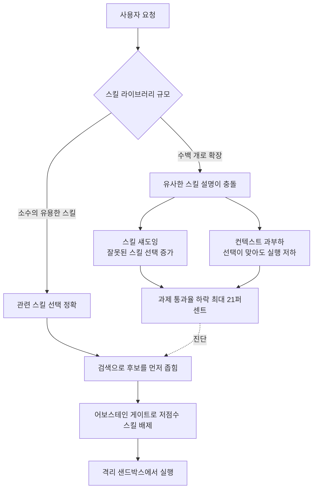

## 개요

에이전트에게 스킬을 더 많이 쥐여 주면 더 유능해질 것 같지만, 최근 연구는 정반대의 현상을 보고합니다. 스킬 라이브러리가 커질수록 같은 과제에서 에이전트의 성공률이 오히려 떨어집니다. arXiv 2605.24050 「More Skills, Worse Agents? Skill Shadowing Degrades Performance When Expanding Skill Libraries」는 이 역설을 정면으로 분석하고, 도움이 되는 소수의 스킬만 있던 상태에서 202개 규모의 라이브러리로 늘렸을 때 과제 통과율이 최대 21% 하락한다고 보고합니다.

이 문제는 학술적 호기심이 아니라 운영 현실입니다. ThakiCloud의 Agent-Native Cloud인 Paxis는 이미 960개가 넘는 스킬을 다루며, 매 요청마다 그중 어느 것을 로드할지 결정해야 합니다. 스킬을 늘리는 일은 쉽지만, 늘어난 스킬 속에서 맞는 것을 고르는 일은 갈수록 어려워집니다. 이 글은 스킬 섀도잉이라는 렌즈로 그 병목의 정체를 짚고, Paxis 스킬 하니스가 검색과 어보스테인 게이트로 이를 어떻게 실무에서 막는지 실제 측정치와 함께 정리합니다.

## 스킬 섀도잉이란 무엇인가

스킬 라이브러리는 LLM 에이전트가 필요할 때 과제별 지침을 온디맨드로 불러오게 해 줍니다. 비전문 사용자가 어떤 스킬이 존재하는지, 내부가 어떻게 동작하는지 몰라도 자연어만으로 도메인 과제를 풀 수 있게 하는 것이 목적입니다. 문제는 라이브러리가 커지면서 시작됩니다.

arXiv 2605.24050의 핵심 기여는 성능 하락을 두 효과로 분해한 점입니다. 첫째는 **스킬 섀도잉(skill shadowing)** 으로, 라이브러리가 커질수록 서로 비슷하게 설명된 스킬들이 충돌해 에이전트가 잘못된 스킬을 더 자주 고르는 현상입니다. 둘째는 **컨텍스트 과부하(context overhead)** 로, 스킬 설명이 컨텍스트를 채우면서 정작 선택이 맞았을 때조차 실행 품질이 떨어지는 현상입니다.

연구가 내놓은 결론은 직관과 어긋납니다. 성능을 갉아먹는 주범은 부풀어 오른 컨텍스트가 아니라 **잘못된 스킬 선택 자체**입니다. 즉 병목은 "모델이 너무 많은 텍스트를 읽어야 해서"가 아니라 "비슷비슷한 스킬 설명 속에서 맞는 것을 못 골라서"입니다. 이 진단은 대응 방향을 바꿉니다. 컨텍스트를 압축하는 것만으로는 부족하고, 애초에 후보를 좁혀 정확히 고르는 검색 단계가 필요합니다.

이 흐름은 우리가 이미 겪은 문제와 정확히 겹칩니다. 스킬 목록을 통째로 프롬프트에 넣던 방식은 스킬 수가 수백 개를 넘어가는 순간 무너집니다. 라이브러리를 계속 키우는 대신, 요청마다 상위 후보만 검색해 로드하는 구조로 바꿔야 하는 이유가 여기에 있습니다.

## 왜 지금 이 문제가 중요한가

스킬 라이브러리의 규모 문제는 한 편의 논문에 국한되지 않습니다. 같은 시기 공개된 SkillRet 벤치마크(arXiv 2605.05726)는 무려 17,810개의 공개 에이전트 스킬을 모아, 6개 대분류와 18개 소분류의 2단계 분류 체계로 정리한 대규모 검색 벤치마크를 제시합니다. 스킬이 수만 개 단위로 쌓이는 현실이 이미 도래했고, 그 안에서 맞는 스킬을 골라내는 검색이 별도의 연구 과제로 떠올랐다는 뜻입니다.

정리하면, 커뮤니티가 스킬을 빠르게 늘리는 흐름과 그 스킬을 정확히 선택하는 능력 사이에 격차가 벌어지고 있습니다. 스킬 섀도잉 연구는 그 격차가 실제 성능 하락으로 나타난다는 것을 정량적으로 보였고, SkillRet 같은 벤치마크는 그 격차를 측정할 공통 자를 제공합니다. 두 흐름이 가리키는 실무 처방은 하나입니다. **스킬을 늘리는 것과 별개로, 검색과 선택을 일급 문제로 다뤄라.**

## ThakiCloud 제품 적용 시사점

이 연구 흐름이 가리키는 처방은 Paxis 스킬 하니스가 이미 구현하고 있는 설계와 정확히 맞물립니다. Paxis는 ThakiCloud의 Agent-Native Cloud로, 스킬을 일급 리소스로 다룹니다. 매 요청에서 스킬 목록을 통째로 밀어 넣지 않고, BM25 어휘 검색으로 상위 후보만 좁혀 로드합니다. 이것이 스킬 섀도잉을 막는 1차 방어선입니다. 후보 집합이 수백 개에서 소수로 줄어들면, 비슷한 스킬 설명이 충돌할 여지 자체가 줄어듭니다.

두 번째 방어선은 **어보스테인 게이트(abstain gate)** 입니다. 검색 최고 점수가 임계값에 못 미치면 억지로 스킬을 매칭하지 않고 네이티브 처리로 넘깁니다. 스킬 섀도잉의 본질이 "확신 없는 상황에서 그럴듯한 오답 스킬을 고르는 것"이라면, 어보스테인 게이트는 그 확신 없는 매칭을 코드가 결정론적으로 차단하는 장치입니다. 모델이 스스로 "이건 애매하다"고 판단하도록 맡기지 않고, 점수 임계로 코드가 소유합니다.

우리 스킬 검색 하니스의 실제 측정치는 이 설계가 작동함을 보여 줍니다. 내부 SRA 벤치(63개 케이스 기준)에서 Recall@5는 82.2%, 어보스테인 게이트를 적용한 gated 정확도는 66.7%, Top-1은 40.0%였고, 환각(존재하지 않는 스킬을 지어내 매칭하는 비율)은 0%였습니다. 특히 환각 0%는 어보스테인 게이트의 직접적 효과입니다. 라이브러리가 아무리 커져도 없는 스킬을 만들어 내거나 임계 미달의 억지 매칭을 하지 않는다는 뜻이기 때문입니다.

여기에 Paxis의 격리 샌드박스 실행과 정책 게이트, 감사 로그가 더해집니다. 잘못된 스킬이 어쩌다 선택되더라도 그 실행은 격리된 환경에서 이뤄지고 모든 행동이 감사 로그에 남습니다. 스킬 섀도잉이 완전히 사라지지 않더라도, 그 파급을 실행 경계에서 봉쇄하는 구조입니다. 연구가 진단한 병목(선택 실패)과 그 하류 위험(잘못된 실행)을 검색·게이트·격리라는 세 겹으로 나눠 막는 셈입니다.

## 한계 및 반론

이 연구와 우리 설계 모두 한계가 분명합니다. 첫째, arXiv 2605.24050의 21% 하락 수치는 특정 실험 세팅(202개 규모 라이브러리)에서의 값이며, 스킬 설명의 품질과 중복도, 과제 도메인에 따라 크게 달라집니다. 스킬을 잘 설명하고 서로 겹치지 않게 유지하면 같은 규모에서도 하락 폭은 줄어듭니다. 즉 "스킬을 늘리지 마라"가 아니라 "설명 품질과 검색을 함께 관리하라"가 정확한 교훈입니다.

둘째, BM25 어휘 검색은 만능이 아닙니다. 순수 한국어 용어처럼 영문 확장 어휘가 부족한 질의에서는 정답 스킬을 못 띄우는 경우가 있고, 우리 벤치의 Top-1 40.0%라는 값도 개선 여지가 큽니다. 임베딩 앙상블 같은 보강이 후보에 있지만, 단일 신호의 단순함이 주는 결정론과 낮은 비용을 포기할 만한지는 별개의 판단입니다. 검색기를 무겁게 만들기 전에 스킬 설명 자체의 품질을 먼저 손보는 것이 대개 더 큰 효과를 냅니다.

셋째, 어보스테인 게이트는 임계값 설정의 문제로 환원됩니다. 임계가 너무 높으면 유용한 스킬까지 배제해 커버리지가 떨어지고, 너무 낮으면 섀도잉을 막지 못합니다. 환각 0%라는 결과는 보수적으로 잡은 임계의 산물이며, 그만큼 정당한 매칭도 일부 놓칩니다. 결국 스킬 라이브러리 운영은 "얼마나 늘리느냐"가 아니라 "검색·게이트·설명 품질의 균형을 어떻게 잡느냐"의 문제이고, 스킬 섀도잉 연구는 그 균형점이 생각보다 낮은 규모에서부터 흔들린다는 경고를 정량적으로 던진 것입니다.

## 관련 슬라이드

본문 내용을 NotebookLM(`cinematic_infographic` 스타일)으로 요약한 슬라이드입니다.

## 출처

- More Skills, Worse Agents? Skill Shadowing Degrades Performance When Expanding Skill Libraries, arXiv 2605.24050 (<https://arxiv.org/abs/2605.24050>)
- SkillRet: A Large-Scale Benchmark for Skill Retrieval in LLM Agents, arXiv 2605.05726 (<https://arxiv.org/abs/2605.05726>)
