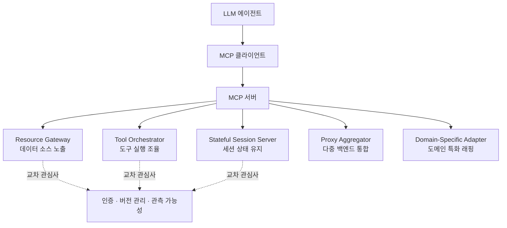

## 개요

Model Context Protocol(MCP)은 Anthropic이 2024년 11월에 공개한 표준 인터페이스입니다. 대규모 언어 모델을 외부 도구와 데이터 소스, 서비스에 연결하는 공통 규격이며, 공개 몇 달 만에 GitHub에는 커뮤니티가 만든 MCP 서버가 수백 개 등장했습니다. 그런데 정작 "이 서버들이 프로덕션에서 어떻게 구조화되고 있는가"를 소프트웨어 유지보수 관점에서 정리한 문헌은 없었습니다.

2026년 6월 29일 arXiv에 올라온 Carson Rodrigues 외 연구진의 논문 [MCP Server Architecture Patterns for LLM-Integrated Applications](https://arxiv.org/abs/2606.30317)가 그 공백을 메웁니다. 독립적으로 개발된 15개의 MCP 서버를 코퍼스로 삼아, 반복적으로 나타나는 다섯 가지 아키텍처 패턴과 네 가지 안티패턴을 카탈로그화했습니다. 여기에 인증, 버전 관리, 관측 가능성이라는 교차 관심사를 함께 다룹니다.

에이전트 인프라를 운영하는 입장에서 이 논문이 흥미로운 이유는 따로 있습니다. 논문은 "도구를 몇 개까지 붙일 수 있는가"를 실제로 측정했고, 그 답이 우리가 막연히 생각하던 것보다 훨씬 낮았기 때문입니다. ThakiCloud가 Agent-Native Cloud인 Paxis에서 960개가 넘는 스킬을 다루는 방식과 정면으로 맞닿는 주제라, 이 글에서 실측 결과와 우리 설계 선택을 함께 짚어보겠습니다.

## 이 연구는 무엇인가

논문의 접근은 실증적입니다. 이론에서 출발해 "이래야 한다"를 제시하는 대신, 이미 돌아가고 있는 서버 15개를 뜯어보고 공통 구조를 귀납적으로 추출했습니다. 그 결과 도출된 다섯 패턴은 서버가 LLM에게 무엇을 노출하느냐, 그리고 상태를 어떻게 다루느냐에 따라 갈립니다.

이 분류가 유용한 이유는 서버를 설계할 때 "내 서버는 어떤 종류인가"를 먼저 정하게 만들기 때문입니다. Resource Gateway를 만들면서 Tool Orchestrator의 복잡한 실행 로직을 욱여넣으면 두 패턴의 단점만 합쳐집니다. 패턴을 명시적으로 고르는 것 자체가 설계 규율입니다.

## 다섯 가지 아키텍처 패턴

**Resource Gateway**는 데이터베이스나 파일 시스템, API 같은 데이터 소스를 읽기 중심으로 노출하는 서버입니다. 도구 자체는 단순하고, 관건은 어떤 리소스를 어떤 권한으로 열어주느냐입니다.

**Tool Orchestrator**는 여러 도구를 묶어 실행 흐름을 조율합니다. 단일 호출이 내부적으로 여러 단계를 거치는 경우가 많아, 실패 처리와 부분 롤백 설계가 핵심 난이도입니다.

**Stateful Session Server**는 대화나 작업 세션에 걸친 상태를 유지합니다. LLM 호출은 본질적으로 무상태에 가깝기 때문에, 상태를 서버가 대신 들고 있으면서 세션 수명과 정리 정책을 명확히 해야 합니다.

**Proxy Aggregator**는 여러 백엔드나 다른 MCP 서버를 하나의 표면으로 합쳐 노출합니다. 편리하지만, 뒤에 붙는 도구가 늘어나면 곧 도구 과부하 문제로 이어집니다. 뒤에서 다시 다루겠습니다.

**Domain-Specific Adapter**는 특정 도메인(금융, 의료, 사내 시스템 등)의 개념을 LLM이 다루기 좋은 형태로 래핑합니다. 도메인 용어와 제약을 도구 스키마에 녹여, 모델이 엉뚱한 조합을 시도하지 않게 유도합니다.

## 도구 과부하: 도구가 많으면 왜 흔들리는가

이 논문에서 가장 실무적으로 중요한 부분은 도구 개수와 도구 선택 정확도의 관계를 측정한 대목입니다. 결과는 명확합니다. 컨텍스트에 붙는 도구가 일정 수를 넘으면, 모델이 올바른 도구를 고르는 정확도가 90% 아래로 떨어집니다.

구체적으로 논문은 Claude Haiku 4.5의 경우 도구 10~15개 구간에서, Sonnet 4의 경우 20~30개 구간에서 도구 선택 정확도가 90% 밑으로 내려간다고 보고합니다. 더 큰 모델일수록 감당하는 도구 수가 늘어나긴 하지만, "무한정 붙여도 된다"는 지점은 존재하지 않습니다. 도구가 많아지고 설명이 모호해질수록 모델은 헷갈립니다.

이 실측은 흔한 직관을 뒤집습니다. MCP를 처음 붙이는 팀은 "일단 가진 API를 전부 도구로 노출하자"고 시작하는 경우가 많습니다. Proxy Aggregator로 여러 백엔드를 합치면 도구 수는 금세 수십 개가 됩니다. 그 순간 정확도 곡선의 벼랑 아래로 떨어지는 셈입니다. 도구 개수는 무료가 아니라, 모델의 판단 예산을 갉아먹는 비용입니다.

## 안티패턴과 교차 관심사

논문은 네 가지 안티패턴도 함께 정리합니다. 세부 명칭까지는 초록 단계에서 확인되지 않지만, 방향은 위 실측과 연결됩니다. 도구를 무분별하게 늘리는 것, 도구 설명을 모호하게 두어 모델이 의도를 추론하게 만드는 것, 상태 관리 없이 세션을 흘려보내는 것, 그리고 인증과 버전을 서버마다 제각각 처리하는 것이 전형적인 실패 모드입니다.

교차 관심사로는 인증, 버전 관리, 관측 가능성 세 가지를 강조합니다. 이 셋은 어떤 패턴을 고르든 공통으로 필요합니다. 특히 관측 가능성은 에이전트 시스템에서 종종 뒤로 밀리는데, 도구 호출이 실패했을 때 왜 실패했는지 추적할 수 없으면 디버깅이 사실상 불가능합니다.

## ThakiCloud 제품 적용 시사점

이 논문의 도구 과부하 결론은 ThakiCloud가 **Paxis**를 설계한 이유와 그대로 겹칩니다. Paxis는 ai-platform 위에서 도는 Agent-Native Cloud 제어 평면으로, 스킬(Skills)과 도구(Tools), 정책(Policies), 감사 로그(Audit Logs)를 일급 리소스로 다룹니다. 여기서 핵심은 **Skill Harness**입니다.

Paxis는 960개가 넘는 스킬을 보유하고 있지만, 이 스킬을 전부 모델의 컨텍스트에 도구로 쏟아붓지 않습니다. 대신 사용자 요청마다 BM25 검색으로 관련 스킬 소수만 선택해 노출합니다. 논문의 실측에 대입하면, 이는 정확도 벼랑을 피하는 설계입니다. 모델은 언제나 자신이 감당 가능한 소수의 도구만 마주하고, 나머지 수백 개의 능력은 필요할 때만 검색으로 불려 나옵니다. "능력은 많이, 노출은 적게"가 도구 과부하 문제에 대한 우리의 답입니다.

Proxy Aggregator의 위험도 같은 렌즈로 관리합니다. Paxis의 MCP 커넥터는 여러 외부 서비스를 연결하지만, 연결된 도구를 무차별 노출하는 대신 정책 게이트로 걸러 실제 필요한 것만 격리 샌드박스 실행 경로에 올립니다. 모든 도구 호출은 감사 로그를 남겨 관측 가능성 요구를 충족합니다. 논문이 교차 관심사로 지목한 인증, 버전, 관측 가능성이 Paxis에서는 선택이 아니라 기본 배선입니다.

인프라 층위인 **ai-platform** 관점도 짚어둘 만합니다. MCP 서버가 늘어나면 각 서버는 결국 어딘가에서 프로세스로 떠야 합니다. ai-platform은 K8s와 Kueue 기반 GPU 스케줄링, 멀티테넌트 격리 위에서 이런 서버들을 온프렘과 소버린 환경까지 포함해 안정적으로 서빙합니다. Stateful Session Server처럼 상태를 들고 있는 서버일수록 배치와 수명 관리가 중요한데, 여기서 K8s의 운영 성숙도가 그대로 이점이 됩니다.

## 한계 및 반론

이 논문은 15개 서버라는 비교적 작은 코퍼스에 기반합니다. MCP 생태계가 워낙 빠르게 커지고 있어, 패턴 다섯 개가 앞으로도 대표성을 유지할지는 지켜봐야 합니다. 새로운 패턴이 등장하거나, 지금의 안티패턴이 도구 개선으로 완화될 여지도 있습니다.

도구 선택 정확도 실측 역시 모델과 프롬프트 설계에 따라 달라질 수 있는 값입니다. 잘 짜인 도구 설명과 명확한 네이밍은 같은 도구 수에서도 정확도를 끌어올립니다. 즉 "도구 N개까지 안전"이라는 절대선이 있는 것이 아니라, 도구 수는 여러 변수 중 하나입니다. 그럼에도 방향성은 분명합니다. 도구는 공짜가 아니며, 필요한 만큼만 노출하는 규율이 에이전트 신뢰성의 토대라는 점입니다.

## 관련 슬라이드

본문 내용을 NotebookLM(`cinematic_infographic` 스타일)으로 요약한 슬라이드입니다.

## 출처

- Carson Rodrigues 외, [MCP Server Architecture Patterns for LLM-Integrated Applications](https://arxiv.org/abs/2606.30317), arXiv:2606.30317 (2026-06-29)
- [Model Context Protocol 공식 소개](https://modelcontextprotocol.io/)
