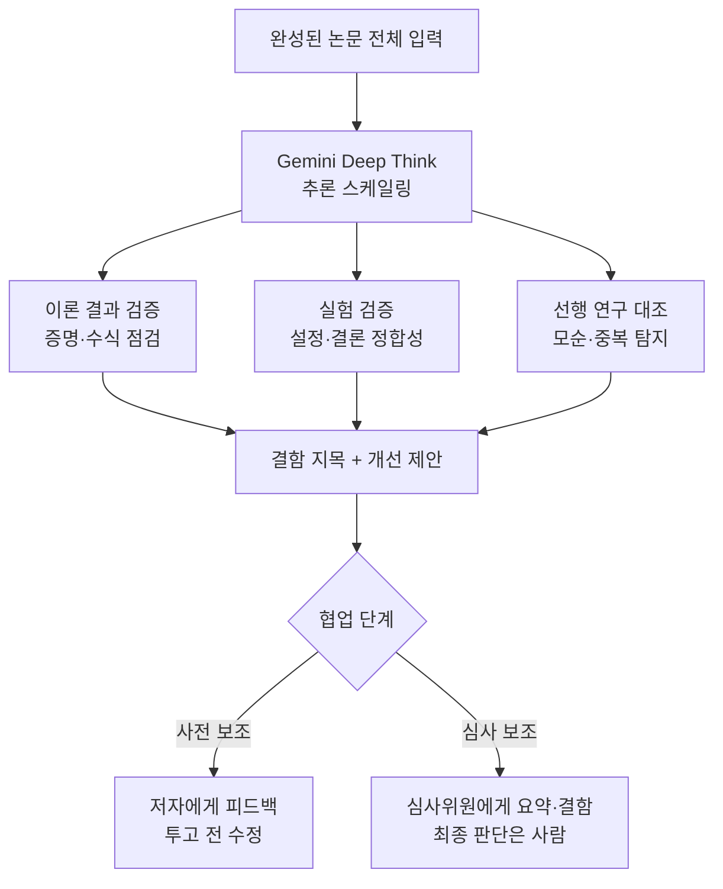

## 개요

과학 논문의 동료 심사(peer review)는 오래전부터 병목이었습니다. 투고량은 매년 폭증하는데 심사할 사람의 시간은 늘지 않습니다. 그 결과 중요한 오류가 심사를 통과해 게재되고, 나중에야 정정되거나 철회되는 일이 반복됩니다. 구글이 최근 공개한 Paper Assistant Tool(PAT)은 이 문제를 정면으로 겨냥합니다. PAT는 완성된 과학 논문을 통째로 입력받아 이론적 결과를 점검하고, 실험을 검증하며, 개선점을 제안하고, 잠재적 결함을 짚어내는 에이전트형 리뷰 프레임워크입니다.

이 연구가 흥미로운 이유는 단순히 "LLM으로 논문을 요약한다"는 수준을 넘어서기 때문입니다. PAT는 단발 프롬프트나 단순 샘플링의 한계를 인정하고, 추론 자체를 확장하는 방향으로 설계되었습니다. ThakiCloud는 쿠버네티스 기반 AI/ML SaaS 플랫폼을 운영하면서 논문 리뷰를 자동화하는 내부 파이프라인을 이미 돌리고 있습니다. 그래서 이 연구는 우리에게 남의 이야기가 아니라, 우리가 매일 다루는 검증 루프 설계에 직접 참고가 되는 사례입니다. 이 글은 PAT가 무엇을 어떻게 하는지, 실제 배포에서 무엇을 잡아냈는지, 그리고 그 설계가 ThakiCloud의 제품에 무엇을 시사하는지를 정리합니다.

## 이 연구는 무엇인가

PAT의 핵심 설계 선택은 추론 스케일링(inference scaling)입니다. 구체적으로는 Gemini Deep Think를 활용해, 한 번의 프롬프트로 답을 내는 대신 여러 단계에 걸쳐 깊이 추론하도록 합니다. 논문 심사는 본질적으로 장시간 이어지는 복잡한 분석 작업입니다. 정리(theorem)의 증명이 실제로 성립하는지, 실험 설정이 결론을 뒷받침하는지, 인용된 선행 연구와 모순이 없는지를 따지려면 한 번의 응답으로는 부족합니다. PAT는 이 판단을 여러 추론 단계로 나누어 수행합니다.

또한 PAT는 단순한 통과/불통과 판정기가 아니라, 논문을 읽고 구체적인 결함을 지목하고 개선을 제안하는 조력자로 설계되었습니다. 저자에게는 투고 전 명확성을 높이고 버그를 잡아 주는 사전 보조자로, 심사위원에게는 요약을 작성하고 잠재적 결함을 짚어 주되 최종 판단은 사람이 내리도록 하는 보조자로 동작합니다. 즉 사람을 대체하는 것이 아니라 사람의 판단을 보조하는 위치를 명확히 잡습니다.

## 핵심 결과

PAT의 성능은 SPOT 벤치마크에서 측정되었습니다. SPOT은 철회되었거나 오류가 확인된 과학 논문들로 구성된 데이터셋입니다. 이 벤치마크에서 PAT는 수학적·논리적 오류에 대해 89.7%의 검출 정확도를 기록했고, 이는 제로샷 기준선 대비 약 34% 향상된 수치입니다. 단발 프롬프트로는 놓치던 오류를 추론 스케일링이 상당 부분 잡아냈다는 의미입니다.

더 인상적인 것은 실제 배포 결과입니다. PAT는 STOC 2026과 ICML 2026의 파일럿에 투입되어 4,700편이 넘는 투고를 검토했습니다. 이 과정에서 ICML 논문의 3분의 1이 넘는 곳에서 유의미한 이론적 오류를 찾아냈고, 저자의 31%가 새로운 실험을 수행하도록 유도했다고 보고됩니다[추정: 논문 발표 기준]. 이 수치가 사실이라면, 자동 심사가 이미 실험실 데모 단계를 넘어 실제 학회 프로세스에 영향을 미치기 시작했다는 뜻입니다.

물론 이런 수치는 논문 저자 측이 제시한 것이므로 독립적 재현으로 확인되기 전까지는 조심스럽게 읽어야 합니다. 다만 벤치마크(SPOT)와 실제 배포(STOC/ICML)를 함께 제시했다는 점, 그리고 오류를 잡는 데 그치지 않고 저자의 행동 변화(새 실험 수행)까지 측정했다는 점은 방법론적으로 진지한 접근입니다.

## AI-인간 협업 4단계 분류

이 연구가 제안하는 또 하나의 기여는 과학 평가에서 AI와 인간이 협업하는 방식을 네 개의 점진적 단계로 나눈 분류 체계입니다. 각 단계는 AI에게 얼마나 많은 판단을 위임하는가에 따라 나뉘고, 저자들은 각 단계의 장단점(trade-off)을 함께 논의합니다.

현재 파일럿이 놓인 위치는 비교적 보수적인 단계입니다. AI가 투고 전 논문의 명확성을 높이고 버그를 잡는 사전 보조자로, 그리고 심사위원을 위해 요약을 작성하고 잠재적 결함을 지목하되 최종 결정권은 사람에게 남겨 두는 보조자로 동작합니다. 이 분류가 유용한 이유는, 자동 심사를 "전부 아니면 전무"의 이분법이 아니라 위임 수준을 조절하는 스펙트럼으로 보게 해 주기 때문입니다. 위험이 큰 최종 판단은 사람에게 남기고, 반복적이고 기계적인 확인은 AI에게 넘기는 식으로 단계를 설계할 수 있습니다.

## ThakiCloud 제품 적용 시사점

이 연구의 설계 철학은 ThakiCloud의 Paxis와 곧바로 연결됩니다. Paxis는 ai-platform 위에서 도는 Agent-Native Cloud 제어 평면으로, 검증으로 닫는 fan-out을 핵심 원리로 삼습니다. PAT가 단발 프롬프트를 거부하고 추론 스케일링으로 오류 검출률을 끌어올린 것은, Paxis가 병렬 서브에이전트의 결과를 그대로 합치지 않고 적대적 검증 스테이지로 걸러내는 방식과 같은 문제의식에서 나옵니다. 여러 회의적 검증자를 서로 다른 시각으로 띄워 표결로 결함을 가려내는 구조는, PAT가 여러 추론 단계로 증명과 실험을 교차 점검하는 것과 정확히 대응됩니다.

실무적으로 ThakiCloud는 이미 논문 리뷰 자동화 파이프라인을 운용합니다. arXiv 논문을 입력받아 심층 피어리뷰를 생성하고, 그 결과를 문서로 만들어 팀이 열람할 수 있게 하며, 리뷰에서 도출된 실행 항목을 시스템 개선 과제로 연결합니다. PAT의 결과는 이 파이프라인에 두 가지 방향을 제시합니다. 첫째, 검출 품질을 높이려면 모델 등급을 올리기 전에 추론 단계를 늘리는 편이 효과적일 수 있다는 것입니다. 둘째, 자동 심사의 산출은 통과/불통과 판정이 아니라 구체적 결함 지목과 개선 제안이어야 실제로 쓸모가 있다는 것입니다.

인프라 측면에서는 ai-platform 렌즈가 이 그림을 완성합니다. 추론 스케일링은 곧 추론 비용의 증가를 의미합니다. 논문 한 편을 여러 단계로 깊이 심사하려면 그만큼 많은 토큰과 연산이 듭니다. ai-platform은 쿠버네티스와 Kueue 기반 GPU 스케줄링, vLLM 서빙, 멀티테넌트 격리로 이 반복적 추론 부하를 비용 효율적으로 흡수합니다. 대량의 논문을 상시 심사하는 워크로드를 경제적으로 돌리려면 이런 서빙 하부 구조가 전제되어야 합니다. 온프레미스와 소버린 요구가 있는 연구 기관이라면, 민감한 미공개 논문을 외부로 내보내지 않고 자체 인프라 안에서 심사할 수 있다는 점도 중요한 차별점입니다.

## 한계 및 반론

이 연구를 낙관적으로만 읽는 것은 위험합니다. 첫째, 보고된 수치의 대부분이 저자 측 발표에 기반합니다. 89.7% 검출률이나 ICML 3분의 1 오류 검출 같은 수치는 독립적 재현으로 확인되기 전까지는 상한선으로 이해하는 편이 안전합니다. 특히 SPOT 벤치마크가 철회·오류 논문으로 구성되었다는 점은, 실제 투고 분포와 다를 수 있어 일반화에 주의가 필요합니다.

둘째, 자동 심사의 위양성(false positive) 위험입니다. AI가 오류라고 지목한 것이 실제로는 정당한 방법인 경우, 저자에게 불필요한 부담을 지우거나 정당한 연구를 위축시킬 수 있습니다. 그래서 최종 판단을 사람에게 남기는 설계가 필수적이며, 이 경계가 무너지면 자동화가 오히려 심사의 질을 떨어뜨릴 수 있습니다.

셋째, 심사의 자동화가 깊어질수록 심사위원이 AI의 판단을 무비판적으로 수용하는 인지적 태만이 생길 수 있습니다. "AI가 이미 봤으니 괜찮겠지"라는 태도는 가장 은밀한 실패 모드입니다. 자동 심사는 사람의 판단을 보조하는 도구이지 대체하는 도구가 아니며, 핵심 판단은 여전히 사람이 책임져야 합니다. PAT가 협업 단계를 보수적으로 잡고 최종 결정권을 사람에게 남긴 것은 이 위험을 의식한 설계로 읽힙니다.

정리하면, PAT는 자동 과학 심사가 데모 단계를 넘어 실제 학회 프로세스에 진입하기 시작했음을 보여 주는 중요한 사례입니다. 다만 그 힘은 화려한 단일 모델이 아니라, 추론을 여러 단계로 확장하고 최종 판단을 사람에게 남기는 신중한 설계에서 나옵니다. ThakiCloud가 논문 리뷰 파이프라인과 Paxis 검증 루프에서 배운 교훈과 같은 방향입니다. 좋은 검증은 좋은 구조에서 나옵니다.

## 출처

- Towards Automating Scientific Review with Google's Paper Assistant Tool, arXiv:2606.28277: [arxiv.org/abs/2606.28277](https://arxiv.org/abs/2606.28277)
- Hugging Face Papers: [huggingface.co/papers/2606.28277](https://huggingface.co/papers/2606.28277)
