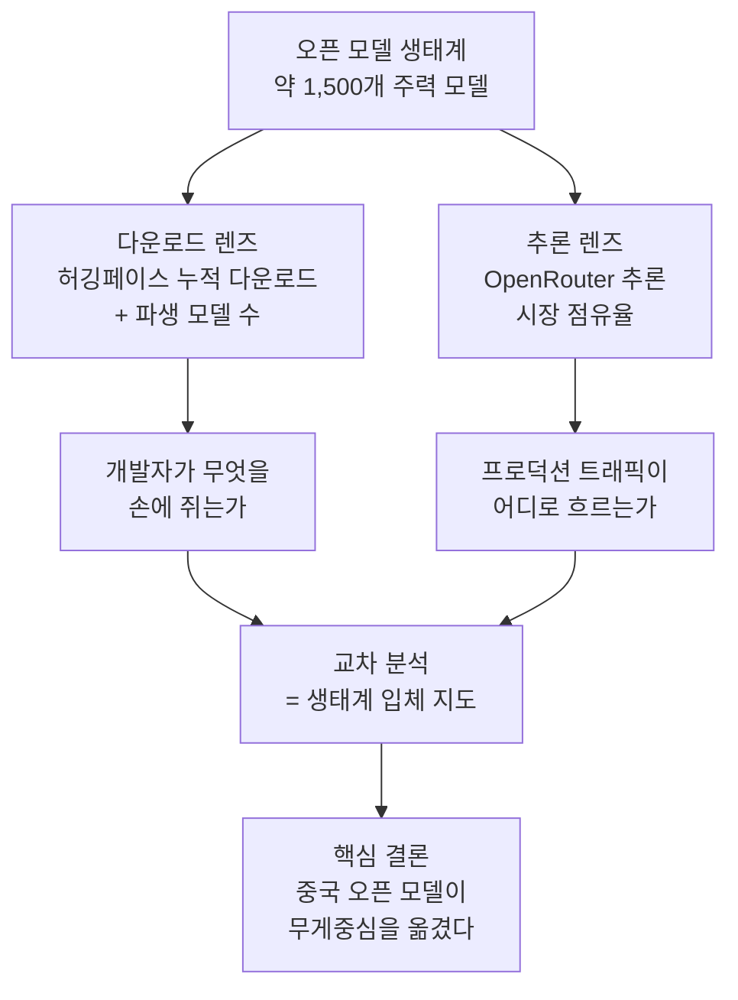

## 이 글을 누가 읽으면 좋은가

이 글은 어떤 오픈 모델을 사내 인프라에 올릴지 결정해야 하는 엔지니어와 기술 리더를 위해 씁니다. "요즘 Llama가 좋다더라" 수준의 인상이 아니라, 실제로 사람들이 무엇을 내려받고 무엇으로 추론을 돌리는지 데이터로 확인하고 싶은 분에게 맞습니다. ATOM 리포트는 그 두 축을 한자리에서 측정한 보기 드문 자료이고, 결론은 지난 1년 사이 오픈 모델의 무게중심이 눈에 띄게 이동했다는 것입니다.

## 개요: 왜 지금 오픈 모델 지형도인가

오픈 언어 모델 이야기를 할 때 우리는 대개 벤치마크 점수표를 봅니다. 그런데 점수표는 "무엇이 잘하는가"는 알려 주지만 "무엇이 실제로 쓰이는가"는 알려 주지 못합니다. 리더보드 상위 모델이 정작 아무도 배포하지 않는 경우도 흔하고, 반대로 점수는 평범한데 현장에서 압도적으로 채택되는 모델도 있습니다. 인프라를 운영하는 입장에서 진짜 중요한 신호는 후자입니다. 커뮤니티가 실제로 손에 쥐고 서비스에 올리는 모델이 무엇인지가, 우리가 어떤 생태계에 베팅해야 하는지를 결정하기 때문입니다.

ATOM 리포트(arXiv 2604.07190, 2026년 4월 8일 공개)는 바로 이 질문에 정면으로 답합니다. Interconnects가 펴낸 이 보고서는 약 1,500개의 주력 오픈 모델을 대상으로 허깅페이스 다운로드와 파생 모델 수, 추론 시장 점유율, 성능 지표를 교차해 오픈 모델 생태계 전체의 스냅샷을 그렸습니다. 한 조직이 자기 모델의 성공을 자랑하는 자료가 아니라, 생태계를 위에서 내려다보며 지도를 그린 자료라는 점이 이 리포트의 가치입니다.

## ATOM 리포트는 무엇을 측정했나

리포트의 방법론은 단일 지표의 함정을 피하려는 데서 출발합니다. 오픈 모델의 성공을 하나의 숫자로 재려는 시도는 대부분 왜곡을 낳습니다. 허깅페이스 다운로드만 보면 파인튜닝 커뮤니티가 활발한 모델이 과대평가되고, 추론 API 호출만 보면 상용 호스팅에 잘 얹힌 모델이 과대평가됩니다. ATOM 리포트는 이 둘을 분리해서 나란히 놓습니다. 하나는 개발자가 무엇을 자기 손으로 내려받아 만지작거리는가를 보는 다운로드 렌즈이고, 다른 하나는 실제 프로덕션 트래픽이 어느 모델로 흐르는가를 보는 추론 렌즈입니다.

이 두 렌즈가 서로 다른 그림을 보여 준다는 점이 핵심입니다. 다운로드 지표에서는 파생 생태계가 큰 모델 계열이 앞서고, 추론 지표에서는 사용량이 여러 조직에 더 고르게 퍼집니다. 같은 생태계를 두 각도에서 찍은 사진을 겹쳐야 비로소 입체가 보인다는 것이 리포트가 반복해서 강조하는 방법론적 태도입니다.

## 핵심 발견: 중국 오픈 모델이 지형을 바꿨다

리포트의 가장 무거운 발견은 지역 구도의 역전입니다. 중국 오픈 모델은 2025년 여름 미국 진영을 추월했고, 그 뒤로 격차를 오히려 벌려 왔습니다. 이것은 한두 개 화제작이 반짝 앞선 사건이 아니라, 다운로드와 추론 양쪽에서 함께 관측되는 구조적 이동입니다.

다운로드 축에서 이 이동을 상징하는 이름은 Qwen입니다. 알리바바의 Qwen 계열은 단일 오픈 모델 계열로는 가장 많이 쓰이며, 2026년 3월 기준 누적 다운로드가 약 10억 건에 이릅니다. 파생 모델 수도 10만 개를 넘습니다. Llama, DeepSeek, Kimi 같은 다른 계열이 뒤를 따르지만 Qwen과의 간격은 상당합니다. 한 계열이 이 정도 규모의 파생 생태계를 거느린다는 것은, 그 모델을 기반으로 파인튜닝하고 재배포하는 개발자 층이 그만큼 두껍다는 뜻입니다. 생태계는 이런 관성으로 굴러갑니다. 많이 쓰이니까 도구와 레시피가 쌓이고, 도구가 많으니까 또 많이 쓰입니다.

추론 축의 그림은 조금 다릅니다. OpenRouter 측정에서는 사용량이 특정 한 계열에 몰리기보다 여러 조직에 더 나뉘어 있고, 그 안에서 DeepSeek이 선두에 섭니다. 다운로드에서는 Qwen이 앞서지만 실제 트래픽에서는 DeepSeek의 존재감이 크다는 이 비대칭은, 두 렌즈를 굳이 분리해서 봐야 하는 이유를 그대로 보여 줍니다. 사람들이 내려받아 실험하는 모델과, 서비스에 실제로 얹어 요금을 내며 돌리는 모델이 반드시 같지는 않습니다.

리포트는 화제의 중심에 있는 모델만 다루지 않습니다. OpenAI가 내놓은 오픈웨이트 계열인 GPT-OSS의 부상, Moonshot과 Z.ai, MiniMax 같은 중국 중위권 조직의 영향력 확대, 그리고 미국 진영이 오픈 모델에서 다시 진전을 보이는 신호까지 함께 짚습니다. 지형도는 상위 몇 개 이름이 아니라 이 두꺼운 중간층이 만든다는 관찰은, 특정 스타 모델에만 의존하는 전략이 왜 위험한지를 넌지시 일러 줍니다.

## 다운로드와 추론, 두 개의 서로 다른 렌즈

이 지점을 조금 더 파고들 필요가 있습니다. 인프라를 설계하는 사람에게 이 두 렌즈의 차이는 단순한 통계 이야기가 아니라 곧바로 의사결정으로 연결되는 실무 문제이기 때문입니다.

다운로드 지표는 생태계의 활력과 미래 방향을 읽는 데 유용합니다. 어떤 계열의 파생 모델이 폭발적으로 늘어난다면, 그 계열을 위한 양자화 빌드, 서빙 최적화, 파인튜닝 스크립트, 어댑터가 함께 쏟아진다는 뜻입니다. 우리가 그 계열을 채택할 때 기댈 수 있는 도구와 커뮤니티 지원이 그만큼 풍부해집니다. 반대로 추론 지표는 지금 이 순간의 경제성을 읽는 데 유용합니다. 실제 트래픽이 어느 모델로 흐르는지는 그 모델의 가격 대비 성능이 현장에서 통한다는 사회적 증거이고, 호스팅 인프라가 이미 그 모델에 맞춰 튜닝돼 있을 가능성이 높다는 신호이기도 합니다.

두 지표가 어긋날 때 어느 쪽을 믿을지는 목적에 달려 있습니다. 사내 파인튜닝 파이프라인을 오래 끌고 갈 기반 모델을 고른다면 다운로드와 파생 생태계의 두께가 더 중요합니다. 지금 당장 비용 효율이 좋은 서빙 대상을 고른다면 추론 시장의 실제 점유율이 더 정확한 나침반입니다. ATOM 리포트가 두 축을 끝까지 분리해서 제시하는 이유가 여기에 있습니다.

## ThakiCloud 제품 적용 시사점

이 지형 변화는 ThakiCloud의 ai-platform이 겨냥하는 문제와 정확히 겹칩니다. ai-platform은 쿠버네티스 위에서 GPU 자원을 Kueue로 스케줄링하고, vLLM 기반으로 다양한 오픈 모델을 멀티테넌트 환경에 서빙하는 인프라입니다. 오픈 모델 생태계가 넓어지고 무게중심이 이동한다는 것은, 곧 우리 고객이 서빙하려는 모델의 목록이 계속 바뀐다는 뜻입니다.

첫째, 특정 모델 계열에 락인되지 않는 서빙 추상화의 가치가 커집니다. Qwen이 다운로드를 이끌고 DeepSeek이 추론을 이끄는 지금의 비대칭이 6개월 뒤 또 바뀔 수 있다면, 인프라는 어느 계열이 올라오든 같은 방식으로 배포하고 스케일링할 수 있어야 합니다. ai-platform이 모델을 일급 리소스로 다루고 서빙 파이프라인을 표준화하는 이유가 바로 이 변동성 때문입니다.

둘째, 오픈웨이트의 부상은 온프렘과 주권형 배포의 경제적 근거를 강화합니다. 상용 API에 의존하지 않고도 최상급에 근접하는 오픈 모델을 자체 클러스터에서 돌릴 수 있게 되면서, 데이터를 외부로 내보낼 수 없는 공공·금융·국방 고객이 실질적인 선택지를 갖게 됐습니다. ThakiCloud는 이런 환경에서 낮은 서빙 비용과 데이터 주권을 동시에 만족시키는 지점을 겨냥합니다. 오픈 모델 지형이 넓어질수록 이 포지션의 설득력은 커집니다.

셋째, 다운로드와 추론을 분리해서 보는 ATOM 리포트의 방법론 자체가 운영에 시사점을 줍니다. 우리 고객이 "요즘 이 모델이 뜬다"는 이유로 어떤 모델을 요청할 때, 그것이 다운로드 화제성인지 실제 추론 경제성인지를 구분해서 안내할 수 있어야 합니다. 인프라 제공자는 유행이 아니라 실사용 데이터에 근거해 서빙 대상을 권할 책임이 있습니다.

## 한계 및 반론

이 리포트를 읽을 때 함께 새겨야 할 유보도 있습니다. 우선 다운로드와 추론 사용량은 모두 대리 지표입니다. 다운로드는 자동화된 파이프라인이나 미러링으로 부풀 수 있고, 크롤러와 재배포가 숫자를 왜곡합니다. OpenRouter 추론 점유율은 그 라우터를 거치는 트래픽만 반영하므로, 대형 사업자가 자체 인프라에서 직접 돌리는 방대한 사용량은 애초에 측정 범위 밖입니다. 두 렌즈를 겹쳐도 여전히 사각지대가 남습니다.

지역 구도의 역전을 실력의 역전과 곧바로 등치하는 것도 성급합니다. 채택은 성능만이 아니라 가격, 라이선스, 접근성, 생태계 관성이 함께 만드는 결과입니다. 중국 오픈 모델이 널리 쓰이는 데는 뛰어난 성능뿐 아니라 공격적인 개방 전략과 낮은 진입 장벽이 크게 작용했습니다. "많이 쓰인다"는 사실은 "가장 좋다"와 다른 명제이며, 리포트가 측정한 것은 전자입니다.

마지막으로 이 스냅샷은 빠르게 낡습니다. 생태계가 몇 달 단위로 요동치는 분야에서 2026년 4월의 지도는 오늘의 지형과 이미 조금 다를 수 있습니다. 그럼에도 이 리포트의 값어치는 개별 순위가 아니라, 다운로드와 추론을 분리해서 보라는 방법론과 무게중심이 이동했다는 큰 흐름에 있습니다. 그 흐름은 당분간 유지될 가능성이 높고, 인프라를 준비하는 우리는 그 방향에 맞춰 서빙 스택을 열어 두면 됩니다.

## 관련 슬라이드

본문 내용을 NotebookLM(`architectural_portfolio` 스타일)으로 요약한 슬라이드입니다.

## 출처

- ATOM Report: Measuring the Open Language Model Ecosystem, arXiv:2604.07190 (2026-04-08). <https://arxiv.org/abs/2604.07190>
- Interconnects, "What I've been building: ATOM Report". <https://www.interconnects.ai/p/what-ive-been-building-atom-report>
