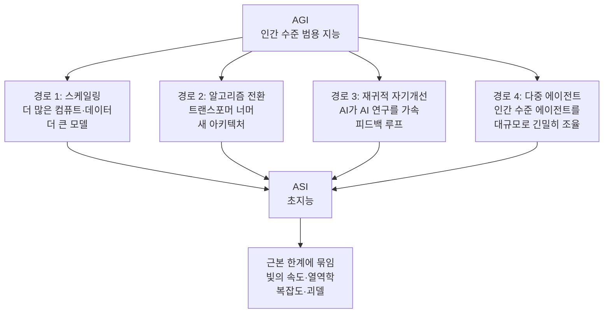

## 이 글을 누가 읽으면 좋은가

이 글은 AI가 앞으로 어디로 가는지에 대한 막연한 불안이나 과장된 낙관 대신, 잘 정리된 지도를 원하는 엔지니어와 기술 리더를 위해 씁니다. 초지능이라는 단어는 대개 공상과학의 어휘로 소비되지만, 세계 최고 수준의 연구소가 이것을 정색하고 계획 문제로 다루기 시작했다면 이야기가 다릅니다. 딥마인드가 무엇을 어떤 근거로 예상하는지, 그리고 그 예상이 실제 인프라와 에이전트 플랫폼을 만드는 우리에게 무엇을 의미하는지 함께 읽어 봅니다.

## 개요: 초지능을 사고실험이 아니라 계획 문제로

구글 딥마인드가 공개한 약 57페이지 분량의 보고서 From AGI to ASI(arXiv 2606.12683)는 제목 그대로 인간 수준 범용 인공지능에서 초지능으로 넘어가는 길을 지도로 그립니다. Tim Genewein를 포함한 딥마인드 연구진이 함께 작성했고, 보도에 따르면 이 보고서는 딥마인드가 의도적으로 이어 온 시리즈의 세 번째 편입니다. 즉 이 연구소는 초지능을 언젠가 논해 볼 주제가 아니라, 지금부터 대비 계획을 세워야 할 대상으로 취급하기 시작했습니다.

이 태도 전환 자체가 이 문서를 읽을 첫 번째 이유입니다. 보고서는 초지능이 반드시 온다고 단언하지 않습니다. 대신 만약 온다면 어떤 경로를 통해 올 수 있는지, 그리고 각 경로를 무엇이 가로막는지를 냉정하게 분류합니다. 흥분도 공포도 아닌 이 분류 작업이야말로 실무자에게 가장 쓸모 있는 부분입니다. 막연한 전망은 준비를 낳지 못하지만, 경로와 병목이 분명하면 우리가 어디를 지켜보고 무엇을 준비할지가 또렷해지기 때문입니다.

## 네 갈래 경로

보고서는 AGI에서 초지능으로 가는 길을 네 갈래로 정리합니다. 각 경로는 서로 배타적이지 않으며, 현실에서는 여러 경로가 겹쳐서 작동할 수도 있습니다.

첫 번째는 스케일링입니다. 더 많은 컴퓨트와 데이터, 더 큰 모델로 밀어붙여 능력을 끌어올리는 가장 익숙한 길입니다. 두 번째는 알고리즘 패러다임의 전환입니다. 지금의 트랜스포머를 넘어서는 새로운 아키텍처가 등장해 같은 자원으로 훨씬 높은 능력을 뽑아내는 경로입니다. 세 번째는 재귀적 자기개선입니다. 충분히 똑똑해진 AI가 자기 아키텍처와 학습 방법, 추론 능력을 스스로 개선하고, 개선할 때마다 다음 개선이 쉬워지는 피드백 루프에 진입하는 길입니다. 네 번째는 다중 에이전트 집단 형성입니다. 단 하나의 초인간적 모델을 만들지 않고도, 인간 수준의 에이전트를 충분히 많이, 충분히 빠르게, 충분히 긴밀하게 조율하는 것만으로 초지능에 해당하는 능력에 도달할 수 있다는 발상입니다.

이 네 번째 경로가 특히 흥미로운데, 초지능을 단일 거대 모델의 문제가 아니라 조율과 오케스트레이션의 문제로 재정의하기 때문입니다. 개별 구성원은 인간 수준을 넘지 않아도, 그들이 이루는 집단의 지적 산출은 개인의 합을 훌쩍 넘어설 수 있습니다. 인간 사회가 개인의 지능만으로는 설명되지 않는 문명을 만들어 온 것과 같은 논리입니다.

## 재귀적 자기개선: 가장 뜨거운 경로

네 경로 중 논쟁이 가장 뜨거운 쪽은 재귀적 자기개선입니다. 핵심 아이디어는 AI가 AI 연구개발 자체를 돕게 되는 순간, 개선된 시스템이 다음 연구를 더 잘 돕고, 그렇게 더 나아진 시스템이 그다음 연구를 또 가속하는 순환이 열린다는 것입니다. 이 순환이 충분히 빠르면 AGI에서 초지능으로의 전이가 점진적이지 않고 폭발적으로 일어날 수 있다는 것이 이 경로의 시나리오입니다.

보고서가 이 경로를 다루는 방식이 인상적인 이유는, 그것을 필연으로도 불가능으로도 단정하지 않는다는 점입니다. 자기개선 루프가 실제로 폭발적 전이를 일으키려면 여러 조건이 동시에 맞아야 하고, 각 조건마다 그 자체의 병목이 있습니다. 개선이 매 단계 실제로 다음 개선을 쉽게 만드는가, 아니면 수확이 점점 줄어드는가. 개선의 속도가 검증과 안전성 확인의 속도를 앞지르는가. 이런 질문들이 폭발의 실제 기울기를 좌우합니다. 보고서는 이 병목들을 나열함으로써, 재귀적 자기개선을 신화가 아니라 검토 가능한 공학 시나리오로 끌어내립니다.

## 초지능도 물리 법칙에 묶인다

이 보고서에서 가장 균형 잡힌 대목은 초지능조차 무한하지 않다는 주장입니다. 어떤 지능도 근본적인 물리적, 계산적 한계를 벗어날 수 없습니다. 신호는 빛의 속도보다 빠르게 전달될 수 없고, 계산에는 열역학이 부과하는 최소 에너지 비용이 따르며, 어떤 문제는 복잡도 이론상 아무리 똑똑해도 효율적으로 풀 수 없고, 괴델의 불완전성이 보여 주듯 어떤 참인 명제는 주어진 형식 체계 안에서 증명 자체가 불가능합니다.

이 한계론은 초지능 논의를 땅으로 끌어내립니다. 초지능은 마법이 아니라 여전히 물리 세계에서 돌아가는 계산 시스템이고, 그 시스템은 에너지와 지연시간과 계산 복잡도라는 실제 예산 안에서 작동해야 합니다. 인프라를 만드는 사람에게 이 대목이 특히 반가운 이유는, 능력의 상한이 결국 물리적 자원의 문제로 환원된다는 점을 분명히 하기 때문입니다. 아무리 영리한 알고리즘도 전력과 냉각, 상호연결 대역폭이라는 물리적 현실 위에서 돌아갑니다.

## ThakiCloud 제품 적용 시사점

이 보고서의 네 경로는 추상적 미래론처럼 보이지만, 놀랄 만큼 구체적으로 우리가 만드는 제품의 설계 축과 겹칩니다. ThakiCloud의 Paxis는 ai-platform 위에서 도는 Agent-Native Cloud 제어 평면으로, 스킬과 도구, 정책, 감사 로그를 일급 리소스로 다룹니다. 보고서가 말하는 두 경로가 여기에 직접 대응합니다.

먼저 재귀적 자기개선입니다. Paxis의 스킬 하네스는 960개가 넘는 스킬을 BM25로 선택해 격리된 샌드박스에서 실행하고, 실행 결과를 회고해 스킬 자체를 개선하는 자가진화 루프를 갖추고 있습니다. 이것은 보고서가 그린 폭발적 자기개선의 축소판이 아니라, 오히려 그 반대편의 교훈을 담은 실천입니다. 우리는 자기개선을 통제 불능의 폭주가 아니라, 정책 게이트와 감사 로그를 통과하는 검증 가능한 반복으로 설계합니다. 개선의 각 단계가 결정론적 게이트를 지나야 다음 단계로 넘어가도록 묶어 두면, 보고서가 지적한 병목, 즉 개선 속도가 검증 속도를 앞지르는 위험을 구조적으로 막을 수 있습니다.

다음은 다중 에이전트 집단 형성입니다. Paxis는 단일 거대 에이전트가 아니라 DAG 형태의 멀티에이전트 오케스트레이션으로 복잡한 작업을 분해해 처리합니다. 개별 에이전트는 특정 역할에 집중하고, 이들이 이루는 그래프가 개별 능력의 합을 넘는 산출을 만듭니다. 보고서의 네 번째 경로가 말하는 조율의 힘을, 우리는 이미 제품의 실행 모델로 삼고 있습니다. 초지능을 향한 거창한 이야기가 아니라, 오늘의 실무 문제를 더 잘 푸는 방식으로 다중 에이전트 조율을 다룬다는 점이 핵심입니다.

한계론도 무관하지 않습니다. 보고서가 강조한 열역학과 지연시간, 상호연결 한계는 곧 ai-platform이 매일 마주하는 GPU 스케줄링과 전력, 냉각, 네트워크 대역폭의 문제입니다. 능력의 상한이 물리적 자원으로 환원된다는 통찰은, 결국 누가 그 자원을 더 효율적으로 조직하느냐가 경쟁력이 된다는 뜻입니다. Kueue 기반의 GPU 스케줄링과 vLLM 서빙 최적화, 멀티테넌트 자원 격리는 바로 이 물리적 예산을 최대한 아껴 쓰기 위한 장치들입니다.

## 한계 및 반론

이 보고서를 과대평가하지 않도록 몇 가지를 함께 짚어야 합니다. 우선 이것은 실험 결과가 아니라 개념적 지도입니다. 네 경로 중 어느 것이 실제로 초지능을 낳을지, 언제 그럴지에 대한 검증된 예측은 담겨 있지 않습니다. 보고서의 가치는 정답이 아니라 분류 틀에 있으며, 틀은 유용하지만 그 자체로 미래를 알려 주지는 않습니다.

초지능이라는 전제 자체에 대한 회의도 정당합니다. 현재의 능력 곡선이 어디까지 이어질지는 여전히 열린 질문이고, AGI라는 목적지에 도달하는 것조차 확정된 미래가 아닙니다. 네 경로를 논하기 전에, 그 출발점인 AGI가 실제로 우리가 상상하는 형태로 도래할지부터가 논쟁적입니다. 보고서는 조건부 지도를 그린 것이지 도래를 보증한 것이 아닙니다.

마지막으로, 이런 담론이 실무에 주는 진짜 효용은 초지능 예측이 아니라 지금의 설계 원칙을 벼리는 데 있습니다. 폭발적 자기개선의 위험을 미리 상상해 보면, 오늘 우리가 만드는 자가진화 루프에 왜 검증 게이트가 필요한지가 분명해집니다. 다중 에이전트 조율의 힘을 진지하게 받아들이면, 오늘의 오케스트레이션을 더 견고하게 짤 이유가 생깁니다. 먼 미래를 논하는 문서에서 가까운 실천의 근거를 길어 올리는 것, 그것이 이 보고서를 읽는 가장 실용적인 방법입니다.

## 관련 슬라이드

본문 내용을 NotebookLM(`architectural_mono` 스타일)으로 요약한 슬라이드입니다.

## 출처

- From AGI to ASI, arXiv:2606.12683 (2026). <https://arxiv.org/abs/2606.12683>
- Google DeepMind, "From AGI to ASI" publication page. <https://deepmind.google/research/publications/239142/>
