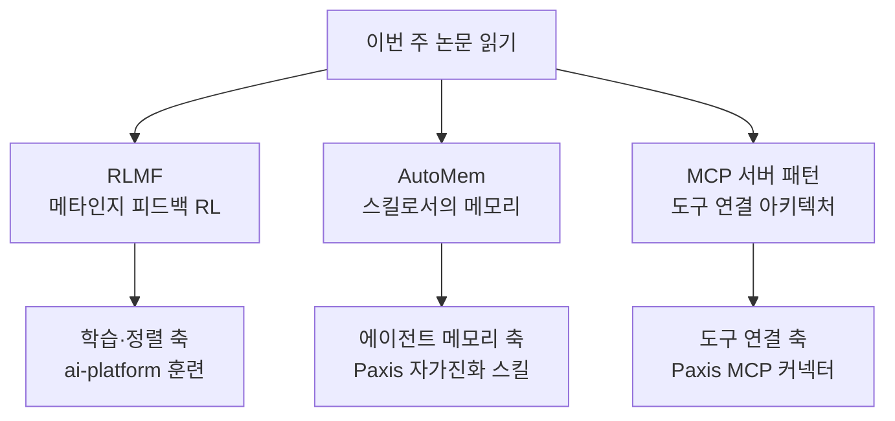

## 개요

매주 쏟아지는 AI 논문을 전부 따라가기는 어렵습니다. 그래서 dair.ai가 정리하는 주간 "Top AI Papers of the Week" 같은 큐레이션이 유용합니다. 이번 주(6월 28일-7월 5일) 목록에는 RLMF, AutoMem, MCP 서버 패턴을 비롯한 여러 편이 올라왔습니다.

이 글에서는 목록을 그대로 나열하는 대신, ThakiCloud가 운용하는 AI 인프라(ai-platform)와 Agent-Native Cloud(Paxis) 관점에서 특히 의미 있는 세 편을 골라 깊게 읽습니다. 세 편은 각각 학습(RL), 에이전트 메모리, 도구 연결(MCP)이라는 서로 다른 축을 다루지만, 공통적으로 "에이전트를 더 신뢰할 수 있게 만드는" 문제를 건드립니다. 각 논문의 핵심과 함께, 우리 제품에 어떤 시사점이 있는지 정리하겠습니다.

세 편이 다루는 축을 그림으로 옮기면 다음과 같습니다.

## RLMF: 메타인지 피드백으로 배우는 강화학습

첫 번째는 강화학습에 메타인지(metacognition)를 도입한 RLMF입니다. 표준 강화학습은 결과의 정답 여부로 보상을 줍니다. RLMF는 여기에 모델이 자기 능력의 한계를 스스로 평가하고 표현하는 능력, 즉 메타인지 피드백을 더해 선호 최적화 과정에서 완성본의 순위를 다듬습니다.

논문은 이 방식이 다양한 과제에서 표준 강화학습을 최대 63% 능가하면서도 정확도를 보존한다고 보고합니다. 단순히 정답률을 높이는 데 그치지 않고, 모델이 "내가 이건 확실하지 않다"를 더 충실하게 표현하도록 만든다는 점이 핵심입니다. 불확실성을 정직하게 드러내는 능력은 정렬(alignment)과 직결되며, 자동화 파이프라인에서 모델이 언제 사람에게 넘겨야 하는지를 판단하는 근거가 됩니다.

이 지점은 ThakiCloud의 ai-platform 렌즈와 맞닿습니다. ai-platform은 K8s와 Kueue 기반 GPU 스케줄링 위에서 SFT·DPO·GRPO 같은 후처리 학습(post-training)을 운용합니다. RLMF처럼 보상 신호에 메타인지를 결합하는 접근은, 고객이 자체 데이터로 모델을 정렬할 때 "정확하지만 과신하는" 모델 대신 "자기 한계를 아는" 모델을 만드는 방향으로 훈련 레시피를 확장할 수 있음을 시사합니다.

## AutoMem: 메모리를 학습 가능한 스킬로

두 번째 AutoMem은 이번 주 목록에서 가장 흥미로운 결과를 냈습니다. 스탠퍼드 연구진은 에이전트의 메모리 관리를 고정된 규칙이 아니라 **학습 가능한 스킬**로 다룹니다. 무엇을 기억(encode)하고, 언제 꺼내(retrieve)며, 지식을 어떻게 조직할지를 아는 것 자체가 훈련될 수 있는 전문성이라는 관점입니다.

수치가 인상적입니다. AutoMem은 Qwen2.5-32B-Instruct 에이전트의 성능을 과제에 따라 약 2배에서 4배까지 끌어올렸습니다. 논문이 보고한 에이전트 벤치마크 점수는 다음과 같습니다(모두 논문 보고 수치입니다).

| 벤치마크 | AutoMem (Qwen2.5-32B) | Claude Opus 4.5 |
|---|---|---|
| Crafter | 51.36 | 49.5 |
| MiniHack | 30.00 | 27.5 |
| NetHack | 1.85 | 2.0 |

메모리 관리라는 하나의 스킬을 학습시켜 32B 오픈 모델이 훨씬 큰 상용 모델과 대등하거나 앞서는 결과를 낸다는 점이 핵심입니다. 이는 "더 큰 모델"이 아니라 "더 나은 메모리 운용"이 에이전트 성능의 병목일 수 있음을 보여 줍니다.

AutoMem은 Paxis 렌즈와 정확히 겹칩니다. Paxis는 스킬을 일급 리소스로 다루는 Agent-Native Cloud이고, 그중에서도 자가진화 스킬과 지식 엔진(HKE)을 통해 에이전트가 무엇을 기억하고 어떻게 조직할지를 관리합니다. AutoMem이 말하는 "메모리는 스킬"이라는 명제는, Paxis가 메모리를 별도 저장소가 아니라 학습·라우팅되는 능력으로 취급하는 설계와 같은 방향입니다. 오픈 모델을 self-hosting으로 돌리는 고객에게는, 모델 크기를 키우지 않고도 메모리 스킬 개선만으로 에이전트 품질을 올릴 수 있다는 실용적 함의가 큽니다.

## MCP 서버 패턴: 도구 연결의 다섯 가지 아키텍처

세 번째는 LLM 통합 애플리케이션을 위한 MCP(Model Context Protocol) 서버 아키텍처 패턴을 정리한 산업 경험 논문입니다. MCP는 2024년 11월 Anthropic이 공개한, LLM을 외부 도구·데이터·서비스에 연결하는 표준 인터페이스입니다. 이 논문은 실무에서 반복적으로 나타나는 다섯 가지 MCP 서버 패턴을 카탈로그화합니다.

- **Resource Gateway**: 외부 데이터 소스를 읽기 중심으로 노출하는 게이트웨이.
- **Tool Orchestrator**: 여러 도구 호출을 조율하는 오케스트레이터.
- **Stateful Session Server**: 세션 상태를 유지하는 서버.
- **Proxy Aggregator**: 여러 MCP 서버를 하나로 묶는 프록시.
- **Domain-Specific Adapter**: 특정 도메인에 특화된 어댑터.

이 다섯 패턴은 MCP를 프로덕션에 붙일 때 "어떤 구조로 서버를 설계해야 하는가"라는 실무 질문에 공통 어휘를 제공합니다. 도구 연결이 늘어날수록 각 서버의 역할이 흐려지고 관측·보안이 어려워지는데, 패턴 언어가 있으면 이를 정리할 수 있습니다.

Paxis는 MCP 커넥터를 일급 리소스로 다루며 OAuth 자동 재연결을 포함해 외부 서비스 연결을 관리합니다. 위 다섯 패턴 중 Proxy Aggregator와 Tool Orchestrator는 여러 MCP 서버를 정책 게이트와 감사 로그 뒤에서 묶어 멀티테넌트로 제공하는 Paxis의 구조와 직접 대응합니다. 개별 개발자가 로컬에서 MCP 서버 하나를 붙이는 패턴이, 여러 테넌트의 수많은 커넥터를 안전하게 집약하는 제어 평면으로 확장되는 셈입니다.

## ThakiCloud 관점 종합

세 논문을 한 문장으로 엮으면, 에이전트를 더 신뢰할 수 있게 만드는 길은 세 갈래로 열려 있습니다. RLMF는 학습 단계에서 모델이 자기 한계를 알게 하고, AutoMem은 실행 단계에서 메모리를 스킬로 다뤄 작은 모델도 크게 쓰이게 하며, MCP 서버 패턴은 연결 단계에서 도구 통합을 구조화합니다.

ThakiCloud의 두 제품이 이 세 갈래를 나눠 받습니다. ai-platform은 RLMF 같은 후처리 학습을 GPU 인프라 위에서 저비용으로 받쳐 주고, Paxis는 AutoMem이 말하는 메모리 스킬과 MCP 패턴이 말하는 도구 연결을 Agent-Native Cloud의 일급 리소스로 운용합니다. 큰 모델 하나에 의존하는 대신, 학습·메모리·연결을 각각 개선해 에이전트 경제성을 만드는 방향입니다.

## 한계 및 반론

몇 가지는 짚어 둘 필요가 있습니다. 첫째, 위 벤치마크 수치는 모두 각 논문이 보고한 값이며, 우리가 직접 재현한 결과가 아닙니다. Crafter·MiniHack·NetHack 같은 에이전트 벤치마크는 시드와 환경 설정에 민감하므로, 실제 제품 적용 전에는 자체 재현이 필요합니다.

둘째, AutoMem의 "메모리는 스킬" 결과가 특정 에이전트 환경(게임형 벤치마크)에서 나왔다는 점입니다. 실무의 장기 대화·문서 검색·코드베이스 탐색처럼 메모리 특성이 다른 도메인에서도 같은 폭의 개선이 나올지는 별도 검증이 필요합니다.

셋째, MCP 패턴 논문은 산업 경험 정리이지 정량 평가가 아닙니다. 다섯 패턴은 유용한 공통 어휘이지만, 어떤 상황에 어떤 패턴이 최적인지는 팀의 부하·보안 요구·관측 수준에 따라 달라집니다. 패턴을 규범이 아니라 출발점으로 쓰는 것이 안전합니다.

주간 논문 읽기의 가치는 결국 "무엇이 지금 움직이는가"를 빠르게 감지하는 데 있습니다. 이번 주는 학습·메모리·연결 세 축에서 모두 에이전트 신뢰성을 높이려는 시도가 나왔고, 그중 상당수가 ThakiCloud가 이미 제품으로 다루는 문제와 겹칩니다.

## 관련 슬라이드

본문 내용을 NotebookLM(`academic_edge` 스타일)으로 요약한 슬라이드입니다.

## 출처

- [dair.ai AI Papers of the Week (GitHub)](https://github.com/dair-ai/ML-Papers-of-the-Week)
- [RLMF: Reinforcement Learning with Metacognitive Feedback (arXiv 2606.32032)](https://arxiv.org/abs/2606.32032)
- [AutoMem: Automated Learning of Memory as a Cognitive Skill (arXiv 2607.01224)](https://arxiv.org/abs/2607.01224)
- [MCP Server Architecture Patterns for LLM-Integrated Applications (arXiv 2606.30317)](https://arxiv.org/abs/2606.30317)
