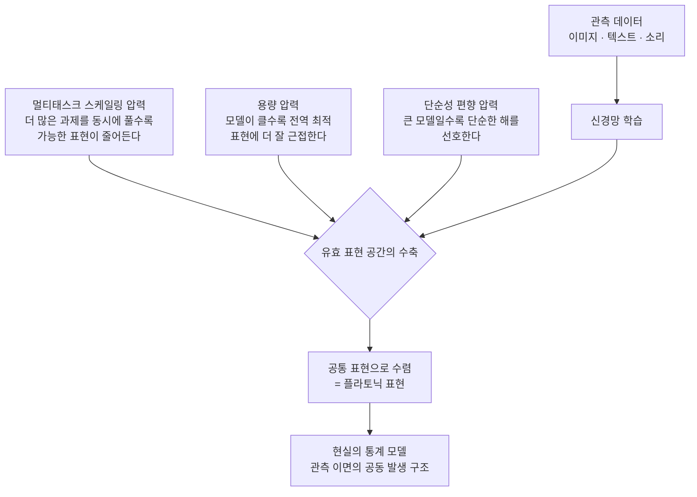

## 이 글을 누가 읽으면 좋은가

이 글은 여러 종류의 파운데이션 모델을 한 플랫폼에서 서빙하거나, 임베딩 기반 검색·추천·멀티모달 파이프라인을 설계하는 엔지니어와 데이터 과학자를 위해 씁니다. "왜 서로 다른 모델의 임베딩을 억지로 정렬하려는 시도가 생각보다 잘 통할까", "모델을 바꿔도 다운스트림 성능이 크게 흔들리지 않는 이유는 무엇일까" 같은 실무 질문의 밑바탕에 깔린 이론을 다룹니다. MIT 연구진이 2024년 ICML에서 발표한 플라토닉 표현 가설을 근거와 함께 읽고, 그 주장이 실제 플랫폼 설계에서 어떤 의미를 갖는지까지 이어 봅니다.

## 개요

서로 다른 팀이, 서로 다른 데이터로, 서로 다른 목적 함수를 걸고 학습한 신경망이 왜 점점 비슷해지는 걸까요. 이 질문은 오래된 현상 관찰에서 출발합니다. 비전 모델 두 개를 서로 다른 방식으로 학습해도, 어떤 이미지 쌍이 서로 가깝고 어떤 쌍이 먼지를 판단하는 방식이 시간이 갈수록 닮아 갑니다. 더 놀라운 것은 이 닮음이 모달리티를 건너뛴다는 점입니다. 이미지를 본 적 없는 언어 모델과 텍스트를 본 적 없는 비전 모델이, 데이터 사이의 거리 구조를 점점 같은 방식으로 재현하기 시작합니다.

Minyoung Huh, Brian Cheung, Tongzhou Wang, Phillip Isola가 쓴 「The Platonic Representation Hypothesis」(arXiv:2405.07987, ICML 2024 Oral)는 이 관찰을 하나의 주장으로 묶습니다. 신경망의 표현이 서로 다른 아키텍처와 목적을 넘어 하나의 공통된 통계적 실재 모델로 수렴하고 있으며, 그 이상적 종착점을 플라톤의 이데아에 빗대어 "플라토닉 표현"이라고 부릅니다. 이 글은 그 근거가 무엇인지, 어떻게 측정했는지, 그리고 여러 모델을 실제로 운영하는 입장에서 이 가설이 왜 실용적인 함의를 갖는지를 정리합니다.

## 플라토닉 표현 가설이란 무엇인가

가설의 핵심 문장은 단순합니다. 이미지든 텍스트든 소리든, 우리가 관측하는 데이터는 어떤 공통된 근원적 실재의 서로 다른 투영입니다. 충분히 크고 충분히 유능한 모델은 이 투영을 역으로 거슬러 올라가, 근원적 실재의 통계 구조를 점점 더 정확히 재구성합니다. 그 결과 서로 무관하게 학습한 모델들도 결국 같은 목적지를 향해 수렴합니다.

여기서 "표현이 같다"는 말은 가중치가 같다거나 뉴런이 일대일 대응한다는 뜻이 아닙니다. 표현이 유도하는 데이터 사이의 거리 구조, 즉 어떤 샘플들이 서로 이웃이고 어떤 샘플들이 먼지를 규정하는 커널(kernel)이 같아진다는 의미입니다. 두 표현이 서로 다른 좌표계를 쓰더라도, 데이터 포인트들의 상대적 관계가 같다면 두 표현은 본질적으로 같은 기하학을 담고 있는 것입니다.

이 가설은 표현 학습의 오래된 직관을 뒤집습니다. 흔히 우리는 데이터가 많아지고 모델이 커지면 표현이 더 다양해지고 특화될 것이라고 기대합니다. 가설은 반대로 말합니다. 규모가 커질수록 유효한 표현의 후보 공간이 좁아지고, 결국 하나의 최적 표현으로 눌린다는 것입니다.

## 수렴의 증거: 무엇을, 어떻게 측정했나

주장이 흥미로운 것과 그 주장이 참인 것은 다릅니다. 저자들은 수렴을 정량적으로 측정할 수 있는 지표를 세우고, 여러 모델 계열에 걸쳐 그 지표가 실제로 올라가는지를 확인합니다.

핵심 측정 도구는 상호 최근접 이웃(mutual nearest-neighbor) 정렬입니다. 같은 데이터 집합을 두 모델에 통과시켜 각각 임베딩을 얻은 뒤, 한 샘플의 최근접 이웃 집합이 두 표현 공간에서 얼마나 겹치는지를 셉니다. 겹침이 클수록 두 모델은 데이터의 이웃 관계를 같은 방식으로 본다는 뜻이고, 정렬 점수가 높습니다. 이 지표 외에도 중심 커널 정렬(CKA)이나 모델 스티칭(model stitching) 같은 보완적 방법이 같은 결론을 가리킵니다.

첫 번째 증거는 비전 모델 안에서의 수렴입니다. 저자들은 78개의 비전 모델을 Places-365 데이터셋 위에서 서로 비교합니다. 결과는 명확합니다. 다운스트림 벤치마크(VTAB, Visual Task Adaptation Benchmark)에서 더 유능한 모델일수록 서로 더 강하게 정렬됩니다. 능력이 높은 모델들끼리는 하나의 촘촘한 무리를 이루고, 능력이 낮은 모델들은 제각각 흩어집니다. 성능이 올라갈수록 표현이 하나로 모인다는 것입니다.

두 번째 증거가 더 도발적입니다. 모달리티를 건너뛰는 정렬입니다. 이미지-텍스트 쌍 데이터를 이용해 비전 모델의 이미지 표현과 언어 모델의 텍스트 표현을 비교하면, 언어 모델이 유능할수록 그 텍스트 표현이 강한 비전 모델의 이미지 표현과 더 잘 정렬됩니다. 텍스트만 학습한 모델과 이미지만 학습한 모델이, 능력이 올라갈수록 같은 거리 구조를 향해 다가가는 것입니다. 이것이 가설의 이름값을 하는 대목입니다. 수렴은 한 모달리티 안의 우연이 아니라 모달리티를 관통하는 경향입니다.

## 수렴을 이끄는 세 가지 압력

관찰을 넘어, 저자들은 왜 이런 수렴이 일어나는지를 세 가지 가설로 설명합니다. 아래 그림은 세 압력이 어떻게 하나의 공통 표현으로 모이는지를 요약합니다.

첫째는 멀티태스크 스케일링 가설입니다. 모델이 더 많은 과제를 동시에 풀도록 요구받을수록, 그 모든 과제를 만족시키는 표현의 후보는 줄어듭니다. 하나의 과제만 푸는 표현은 무수히 많지만, 수백 개 과제를 동시에 푸는 표현은 극소수만 남습니다. 데이터와 과제가 커질수록 살아남는 표현의 교집합이 좁아지고, 서로 다른 모델이 그 좁은 교집합으로 몰립니다.

둘째는 용량 가설입니다. 더 큰 모델은 더 나은 최적화와 더 넓은 함수 공간을 갖기 때문에, 아키텍처나 학습 방식의 차이와 무관하게 전역적으로 최적인 표현에 더 잘 근접합니다. 작은 모델들은 저마다 다른 지역 최적해에 머물지만, 용량이 커질수록 모두가 같은 전역 최적해 근처로 이끌립니다.

셋째는 단순성 편향 가설입니다. 신경망은 명시적 정규화든 최적화의 암묵적 성질이든, 데이터를 설명하는 여러 해 중에서 더 단순한 해를 선호하는 경향이 있습니다. 그리고 모델이 커질수록 이 단순성 편향은 오히려 강해집니다. 표현할 수 있는 복잡한 해가 늘어나도, 그중 가장 단순하고 일반적인 해로 눌리는 힘이 세지기 때문입니다. 결과적으로 큰 모델일수록 데이터를 설명하는 가장 간결한 공통 구조로 모입니다.

## 이상적 종착점: 현실의 통계 모델

세 압력이 향하는 종착점은 무엇일까요. 저자들은 이를 이론적으로 모델링합니다. 세상을 이산적인 사건들의 연쇄로 보고, 우리가 관측하는 이미지와 텍스트를 그 사건들의 서로 다른 투영이라고 두면, 최적의 표현은 관측 사건들이 함께 나타나는 정도, 즉 점별 상호정보량(pointwise mutual information)에 수렴하는 커널을 갖게 됩니다. 쉽게 말해 이상적인 표현은 "어떤 것들이 현실에서 함께 등장하는가"라는 공동 발생 통계를 담아냅니다.

이것이 왜 모달리티를 건너뛰는지가 여기서 설명됩니다. 이미지든 텍스트든 같은 현실을 다른 창문으로 본 것이라면, 그 창문 너머의 공동 발생 구조는 하나입니다. 충분히 유능한 모델은 어느 창문으로 들어오든 같은 구조에 도달합니다. 플라토닉 표현이라는 이름은 관측 뒤에 있는 이 공통된 통계적 실재를 가리킵니다.

## ThakiCloud 제품 적용 시사점

이 가설은 추상적으로 들리지만, 여러 모델을 실제로 서빙하는 플랫폼 입장에서는 매우 구체적인 함의를 갖습니다. ThakiCloud의 ai-platform은 Kubernetes와 Kueue 기반 GPU 스케줄링 위에서 다양한 고객 환경에 여러 종류의 모델을 서빙합니다. 서로 다른 비전 인코더, 서로 다른 임베딩 모델, 서로 다른 세대의 LLM이 한 플랫폼에서 공존합니다.

플라토닉 표현 가설이 시사하는 첫 번째 지점은 모델 간 상호운용성입니다. 유능한 모델들의 표현이 공통 기하학으로 수렴한다면, 임베딩 공간을 모델마다 완전히 격리해 관리할 필요가 줄어듭니다. 한 임베딩 모델로 색인한 벡터 저장소를 다른 세대 모델로 교체할 때, 두 표현이 근본적으로 같은 이웃 구조를 공유한다면 재색인 비용과 다운스트림 성능 저하를 예측 가능한 범위로 관리할 수 있습니다. 모델 교체가 곧 임베딩 파이프라인 전면 재구축이라는 통념은, 수렴이 강한 영역에서는 완화됩니다.

두 번째 지점은 멀티모달 정렬의 경제성입니다. 강한 비전 모델과 강한 언어 모델의 표현이 이미 서로 정렬되는 방향으로 움직인다면, 두 모달리티를 잇는 얇은 어댑터만으로도 상당한 정렬을 얻을 수 있습니다. 무거운 공동 학습 없이 각 모달리티의 최신 모델을 독립적으로 갱신하면서 그 위에 경량 정렬 계층을 얹는 설계가, 멀티테넌트 환경에서 자원 효율과 갱신 속도를 동시에 잡는 현실적인 선택지가 됩니다.

세 번째 지점은 벤치마킹의 관점입니다. 능력이 올라갈수록 표현이 공통 구조로 수렴한다는 명제는, 온프렘·소버린 환경에서 여러 후보 모델을 평가할 때 표현 정렬도를 하나의 진단 지표로 쓸 수 있음을 시사합니다. 두 모델의 상호 최근접 이웃 정렬이 낮다면, 그것은 둘 중 하나가 아직 덜 유능하거나 도메인이 어긋나 있다는 신호일 수 있습니다. 정렬 지표는 정확도 벤치마크를 보완하는 저비용 신호가 됩니다.

## 한계 및 반론

가설이 매력적일수록 반대 방향의 논거를 정직하게 세워야 합니다.

첫 번째 반론은 수렴이 플라톤적 실재 때문이 아니라 사회학적 동형화 때문일 수 있다는 것입니다. 오늘날의 모델들은 상당 부분 같은 웹 규모 데이터, 같은 트랜스포머 계열 아키텍처, 같은 최적화 관행을 공유합니다. 표현이 닮는 이유가 근원적 실재로의 수렴이 아니라 단지 모두가 같은 재료로 요리하기 때문일 가능성을 배제하기 어렵습니다.

두 번째 반론은 모달리티 사이의 환원 불가능한 차이입니다. 시각에만 존재하고 언어로는 결코 포착되지 않는 정보, 그 반대의 정보가 분명히 존재합니다. 모든 표현이 하나로 수렴한다는 강한 주장은, 각 모달리티가 고유하게 담는 정보를 과소평가할 위험이 있습니다. 실제로 특화된 목적으로 학습된 모델이나 서로 다른 정보를 보존하도록 설계된 표현은 수렴하지 않습니다.

세 번째 반론은 측정의 해석 의존성입니다. 상호 최근접 이웃이나 CKA 같은 지표는 특정한 거리 개념을 전제하며, 어떤 지표를 고르느냐에 따라 정렬도의 그림이 달라질 수 있습니다. "표현이 수렴한다"는 결론은 지표 선택과 데이터 분포에 어느 정도 의존하며, 이는 재현 연구들이 계속 검증하고 있는 열린 문제입니다.

그럼에도 이 가설의 실용적 가치는 종착점의 형이상학이 아니라 방향성에 있습니다. 능력이 커질수록 표현이 공통 구조로 이동한다는 경향 자체는 여러 지표에서 반복적으로 관찰되며, 멀티모델 인프라를 설계하는 사람에게는 그 방향성만으로도 충분히 실용적인 나침반이 됩니다.

## 출처

- Minyoung Huh, Brian Cheung, Tongzhou Wang, Phillip Isola, "The Platonic Representation Hypothesis", ICML 2024 (arXiv:2405.07987): [arxiv.org/abs/2405.07987](https://arxiv.org/abs/2405.07987)
- 코드 및 프로젝트: [github.com/minyoungg/platonic-rep](https://github.com/minyoungg/platonic-rep)
