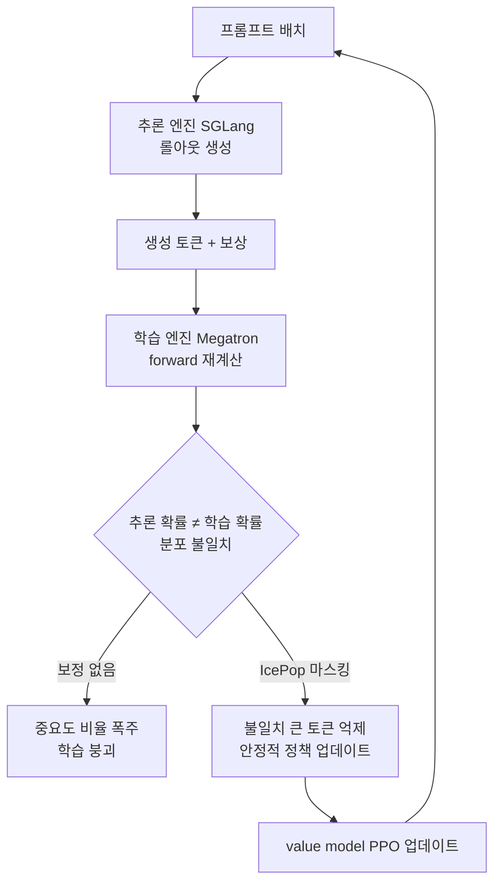

대규모 언어 모델의 강화학습(RL) 포스트트레이닝을 실제로 돌려 본 팀이라면, 지난 1~2년의 흐름이 한 방향으로 쏠려 있었다는 사실을 압니다. DeepSeek이 GRPO를 공개한 이후, 별도의 value model(critic)을 없애고 그룹 내부의 상대 보상만으로 advantage를 추정하는 방식이 사실상 표준처럼 자리 잡았습니다. critic을 학습시키지 않아도 되니 메모리와 연산이 절약되고, 구현도 단순해집니다. "critic은 이제 필요 없다"는 이야기가 반쯤은 정설처럼 통했습니다.

그런데 Zhipu가 공개한 GLM-5.2는 이 흐름을 정면으로 거스릅니다. 이 모델은 그룹 상대 방식을 버리고 학습된 value model을 다시 쓰는 PPO로 돌아갔고, 대신 RL의 고질적 불안정 요인인 학습-추론 분포 불일치를 IcePop이라는 기법으로 잡았습니다. 흥미로운 점은 이 선택이 단순한 회귀가 아니라, "GRPO가 만능"이라는 최근의 통념을 실측으로 반박하는 성격을 띤다는 것입니다.

*critic을 버렸다가 다시 불러오는 RL 포스트트레이닝의 방향 전환을 형상화했습니다.*

## 개요

GLM-5.2는 100만 토큰 컨텍스트 윈도우를 갖고 장기 호흡의 코딩·에이전트 벤치마크에서 강한 성능을 보인 오픈웨이트 모델입니다. 이 글이 다루는 것은 모델 자체의 성능 수치가 아니라, 그 성능을 만든 RL 포스트트레이닝의 설계 결정입니다. 핵심은 두 가지입니다. 첫째, 그룹 상대 방식(GRPO) 대신 학습된 value model을 쓰는 PPO로 돌아갔다는 것. 둘째, 그 과정에서 발생하는 학습-추론 불일치를 IcePop으로 완화하되, 원래 IcePop 정식화에 있던 KL 정규화 항을 제거해 RL 개선 속도를 끌어올렸다는 것입니다.

이 주제가 ThakiCloud 관점에서 중요한 이유가 있습니다. 우리가 운용하는 LLM 훈련 파이프라인은 SFT·CPT·DPO·GRPO·GKD 같은 여러 포스트트레이닝 방법을 지원합니다. RL 방법론의 선택은 단순한 알고리즘 취향이 아니라, GPU 예산·학습 안정성·재현성에 직접 영향을 주는 인프라 결정입니다. GLM-5.2의 사례는 "무엇을 쓸 것인가"보다 "왜 그것을 쓰는가"를 다시 묻게 만듭니다.

*전통적 PPO에서 GRPO로, 다시 GLM-5.2의 PPO 회귀로 이어지는 RL 포스트트레이닝의 구조적 흐름입니다. 알고리즘은 한 방향으로만 진화하지 않습니다.*

## GRPO가 부딪힌 벽: critic을 버린 대가

먼저 왜 그렇게 많은 팀이 GRPO로 옮겨 갔는지부터 짚겠습니다. 전통적인 PPO는 actor-critic 구조입니다. 정책(actor)이 토큰을 생성하고, 별도의 value model(critic)이 각 상태의 기대 보상을 추정합니다. 이 value 추정치로 advantage를 계산하고(대개 GAE), 클리핑된 surrogate 목적함수로 정책을 업데이트합니다. 문제는 이 critic을 학습시키는 비용입니다. 정책과 거의 같은 크기의 모델을 하나 더 얹어야 하고, critic이 잘못 수렴하면 전체 학습이 흔들립니다.

GRPO는 이 critic을 아예 없앱니다. 같은 프롬프트에 대해 여러 응답을 샘플링한 뒤, 그 그룹 안에서 보상을 정규화해 상대적 우열만으로 advantage를 만듭니다. critic이 사라지니 메모리가 줄고, value 학습의 불안정성도 함께 사라집니다. 수학적으로도 깔끔해서 빠르게 퍼졌습니다.

*GRPO는 정책과 같은 크기의 critic을 덜어 내 메모리와 연산을 절약하지만, 그 대가로 그룹 내부의 상대 우열이라는 저해상도 신호만 남습니다.*

하지만 공짜 점심은 없었습니다. 그룹 상대 방식은 그룹 내부의 분산이 작을 때, 즉 응답들이 서로 비슷하게 좋거나 비슷하게 나쁠 때 advantage 신호가 뭉개집니다. 또한 긴 시퀀스에서 토큰 단위의 세밀한 credit assignment가 어렵습니다. value model이 있었다면 "이 토큰이 최종 보상에 얼마나 기여했는가"를 상태별로 추정할 수 있지만, 그룹 정규화만으로는 그 해상도가 나오지 않습니다. 장기 호흡의 코딩·에이전트 작업처럼 궤적이 길고 보상이 희소한 문제에서 이 한계가 두드러집니다. GLM-5.2가 겨냥한 영역이 바로 그런 문제였습니다.

*짧은 궤적에서는 그룹 정규화가 잘 작동하지만, 궤적이 길어지고 보상이 희소해질수록 토큰 단위 신호의 해상도가 무너집니다.*

## GLM-5.2의 선택: value model을 되살린 PPO

GLM-5.2 팀은 여기서 학습된 value model을 다시 불러옵니다. 즉 GRPO가 버렸던 critic을 복원해, 토큰 단위의 advantage 추정 해상도를 되찾는 방향입니다. "PPO 하이프는 과장됐다"는 세간의 정서와 반대로, 이들은 오히려 잘 학습된 value model이 장기 궤적에서 더 안정적인 신호를 준다는 쪽에 베팅했습니다.

*GLM-5.2는 버려졌던 학습된 value model을 다시 불러와, 장기 호흡 에이전트 작업에서 토큰 단위의 고해상도 신호를 되찾는 쪽에 베팅했습니다.*

문제는 critic을 되살리는 순간, 앞서 언급한 학습의 불안정성도 함께 돌아온다는 점입니다. 그리고 여기에 최근 RL 스택 특유의 새로운 골칫거리가 하나 더 겹칩니다. 바로 학습-추론 분포 불일치입니다.

## IcePop: 학습-추론 불일치를 잡는 법

현대의 RL 포스트트레이닝은 두 개의 서로 다른 엔진을 오갑니다. 롤아웃(응답 생성)은 SGLang 같은 고처리량 추론 엔진이 담당하고, 실제 정책 업데이트를 위한 forward 계산은 Megatron 같은 학습 엔진이 담당합니다. 문제는 이 두 엔진이 같은 모델 가중치를 쓰더라도 커널 구현·수치 정밀도·연산 순서가 달라, 같은 토큰에 대해 미묘하게 다른 확률을 내놓는다는 것입니다.

RL은 보통 중요도 샘플링(importance sampling)으로 이 간극을 보정합니다. 추론 시 정책과 학습 시 정책의 확률 비율을 곱해 주는 방식입니다. 그런데 두 분포가 어긋난 토큰에서는 이 비율이 폭발적으로 커지거나 작아집니다. 비율이 튀는 토큰 몇 개가 그래디언트를 지배하면 학습 전체가 흔들리고, 심하면 붕괴합니다. 궤적이 길수록, 즉 토큰이 많을수록 이런 튐이 누적될 확률이 높아집니다. 장기 호흡 작업을 겨냥한 GLM-5.2에게는 특히 치명적인 문제였습니다.

*같은 가중치라도 학습 엔진(Megatron)과 추론 엔진(SGLang)의 커널·정밀도 차이로 확률이 어긋나, 중요도 비율이 폭발하며 학습을 붕괴시킵니다.*

IcePop은 이 불일치를 정면으로 다룹니다. 추론 분포와 학습 분포가 크게 어긋나는 토큰을 식별해, 그 토큰의 기여를 억제하거나 마스킹하는 방식으로 그래디언트가 소수의 불안정 토큰에 끌려가지 않게 만듭니다. 결과적으로 안정적인 토큰의 신호만 살려 정책 업데이트에 반영합니다. 이렇게 하면 value model을 되살린 PPO의 이점을 취하면서도, 학습-추론 불일치가 일으키는 붕괴를 피할 수 있습니다.

GLM-5.2가 원래 IcePop과 다른 지점은 KL 정규화 항을 제거했다는 것입니다. 많은 RL 레시피는 정책이 참조 정책에서 너무 멀어지지 않도록 KL 페널티를 겁니다. 이 항은 안정성을 높이지만, 동시에 정책이 개선될 수 있는 폭을 억제합니다. GLM-5.2 팀은 IcePop의 분포 불일치 마스킹이 이미 불안정성을 상당 부분 잡아 준다고 보고, KL 항을 떼어 내 정책이 더 공격적으로 개선되도록 허용했습니다. 안정성 장치를 하나 덜어 내는 대신, 그 역할을 IcePop의 토큰 선별에 맡긴 셈입니다.

*IcePop은 분포가 크게 어긋나는 토큰을 식별해 그 기여를 억제하고, GLM-5.2는 여기서 KL 정규화 항까지 제거해 정책 개선의 폭을 넓혔습니다.*

## 인프라: slime, Megatron, SGLang

이 알고리즘이 종이 위의 아이디어에 그치지 않고 실제로 돌아가려면, RL 스케일링을 견디는 인프라가 필요합니다. GLM-5.2의 포스트트레이닝은 slime라는 RL 스케일링 프레임워크 위에서 이뤄졌고, 분산 학습에는 Megatron-LM을, 고처리량 롤아웃 생성에는 SGLang을 씁니다. 앞서 설명한 학습-추론 불일치가 바로 이 구성에서 나옵니다. Megatron(학습)과 SGLang(추론)이 각자 최적화된 커널을 쓰기 때문에 확률이 어긋나는 것이고, IcePop은 정확히 이 구조적 간극을 겨냥한 대응입니다.

즉 IcePop은 순수한 알고리즘 개선이라기보다, 학습 엔진과 추론 엔진을 분리한 현대적 RL 스택에서 필연적으로 발생하는 시스템 수준의 문제에 대한 시스템-알고리즘 공동 설계에 가깝습니다. 이 점이 실무자에게 주는 교훈은 분명합니다. RL 방법론을 고를 때는 알고리즘만 보면 안 되고, 그 알고리즘이 어떤 학습·추론 엔진 조합 위에서 도는지를 함께 봐야 합니다.

## ThakiCloud 제품 적용 시사점

ThakiCloud의 ai-platform은 K8s 기반의 AI/ML 인프라로, Kueue를 통한 GPU 스케줄링과 다양한 포스트트레이닝 방법(SFT·CPT·DPO·GRPO·GKD)을 지원하는 훈련 파이프라인을 운용합니다. GLM-5.2의 사례는 이 파이프라인의 설계에 직접적인 시사점을 줍니다.

*K8s·Kueue 기반의 ai-platform이 학습-추론 불일치를 방어하고, 그 위에서 모듈형 RL 런타임과 Paxis의 장기 에이전트 워크플로가 동작하는 구조입니다.*

첫째, RL 방법론은 하나로 고정할 대상이 아니라 문제에 맞춰 고르는 선택지입니다. 짧은 궤적의 선호 정렬에는 critic 없는 GRPO가 여전히 경제적이지만, 긴 코딩·에이전트 궤적처럼 토큰 단위 credit assignment가 중요한 문제에서는 value model을 쓰는 PPO가 더 안정적인 신호를 줄 수 있습니다. 우리처럼 여러 방법을 한 플랫폼에서 지원하는 구조라면, 이 선택을 사용자가 문제 특성에 따라 바꿀 수 있게 노출하는 것이 실질적 가치를 만듭니다.

둘째, 학습-추론 불일치는 우리에게도 남의 일이 아닙니다. 롤아웃을 추론 엔진(vLLM/SGLang 계열)에서 뽑고 업데이트를 학습 엔진에서 도는 분리형 RL을 멀티테넌트 환경에서 돌리면, 같은 종류의 확률 불일치가 발생합니다. IcePop 같은 토큰 선별 보정을 훈련 런타임의 옵션으로 준비해 두면, 온프레미스·소버린 환경에서 자체 모델을 RL로 다듬으려는 고객의 학습 안정성을 크게 높일 수 있습니다. 낮은 서빙 비용과 안정적인 학습 파이프라인은 자체 호스팅을 검토하는 팀에게 결정적인 경쟁력입니다.

에이전트 관점에서는 Paxis와도 연결됩니다. Paxis는 ai-platform 위에서 도는 Agent-Native Cloud로, 스킬·도구·정책을 일급 리소스로 다룹니다. GLM-5.2가 강조한 장기 호흡 에이전트 궤적의 학습은, 결국 에이전트가 여러 스텝에 걸쳐 도구를 호출하며 작업을 완수하는 능력을 강화하는 일입니다. 잘 학습된 value model이 긴 궤적에서 세밀한 신호를 준다는 이 사례의 교훈은, Paxis가 다루는 다단계 에이전트 워크플로의 품질을 끌어올리는 학습 전략을 고민할 때 참고할 만한 지점입니다.

## 한계 및 반론

이 사례를 일반화할 때는 신중해야 합니다. 먼저 "PPO가 GRPO보다 낫다"는 단순 결론으로 읽으면 안 됩니다. GLM-5.2의 선택은 장기 호흡·희소 보상이라는 특정 문제 설정에서의 판단입니다. 짧고 밀도 높은 보상의 문제에서는 critic 유지 비용이 이득을 상쇄할 수 있고, 이 경우 GRPO가 여전히 합리적입니다. value model을 되살리는 순간 GPU 메모리 예산이 다시 늘어난다는 현실적 제약도 그대로입니다.

IcePop의 KL 항 제거도 만능은 아닙니다. KL 정규화는 정책이 참조 정책에서 폭주하는 것을 막는 안전장치입니다. 이를 떼어 내고 분포 불일치 마스킹에 안정성을 전적으로 맡기는 것은, 마스킹이 잘 작동한다는 전제 위에서만 성립합니다. 다른 데이터 분포나 다른 추론 엔진 조합에서는 이 전제가 깨질 수 있으므로, 그대로 이식하기보다 자체 환경에서 안정성을 검증하는 절차가 반드시 필요합니다.

마지막으로, 이 글의 기술적 설명은 공개된 분석과 논문(arXiv의 "GLM-5: from Vibe Coding to Agentic Engineering") 및 2차 해설을 종합한 것입니다. 세부 하이퍼파라미터나 정확한 벤치마크 수치는 원문에서 직접 확인해야 하며, 여기서 다루지 않은 구현 디테일이 실제 재현에서 결정적일 수 있습니다. RL 포스트트레이닝은 특히 재현이 까다로운 영역이므로, "이렇게 하면 된다"보다 "이런 방향으로 고민해 볼 수 있다"로 받아들이는 편이 안전합니다.

## 출처

- [arXiv, "GLM-5: from Vibe Coding to Agentic Engineering" (arXiv:2602.15763)](https://arxiv.org/abs/2602.15763)
- ["Why is GLM-5.2 So Good: The GRPO to PPO Switch", Medium (Coding Nexus)](https://medium.com/coding-nexus/why-is-glm-5-2-so-gooood-the-grpo-to-ppo-switch-5b3b7d613ace)
- ["Zhipu's GLM-5.2: A Usability Breakthrough for Chinese Open-Source Models?", Weijin Research](https://weijinresearch.substack.com/p/zhipus-glm-52-a-usability-breakthrough)
