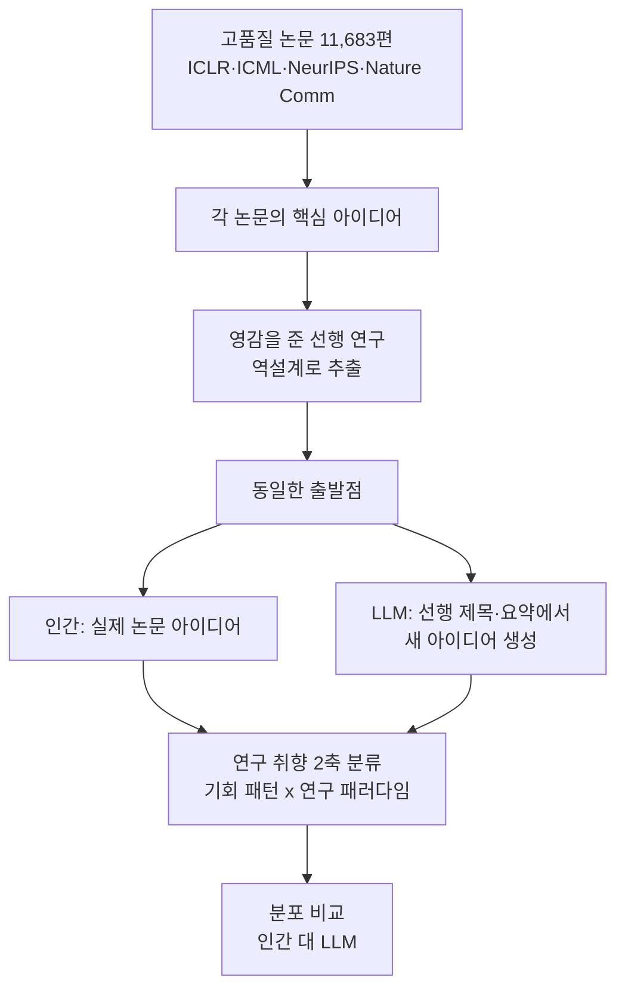

"연구 에이전트"라는 말을 들으면 대개 이런 그림을 떠올립니다. 논문을 읽고, 빈틈(gap)을 찾고, 아이디어를 내고, 실험을 돌리고, 논문을 쓴다. 그런데 예일대와 시카고대 연구진이 던진 질문은 한 단계 더 깊습니다. LLM이 만든 연구 아이디어는 인간 연구자가 실제로 논문으로 만들어 낸 아이디어와 무엇이, 얼마나 다른가.

논문 "Measuring the Gap Between Human and LLM Research Ideas"(arXiv 2607.01233)의 결론은 직관과 어긋납니다. LLM 아이디어의 약점은 흔히 말하는 "품질"이 아니었습니다. 진짜 격차는 폭(range)에 있었습니다. LLM은 인간 연구자보다 훨씬 좁은 영역에서 생각했고, 그 좁음은 한 가지 패턴, 즉 "기존 연구를 연결한다"는 발상에 심하게 쏠려 있었습니다.

*폭 넓게 흩어진 인간의 아이디어 분포와, 한 패턴에 좁게 뭉친 LLM의 아이디어 분포를 대비해 형상화했습니다.*

## 개요

이 연구가 중요한 이유는 자율 연구 에이전트가 더 이상 먼 미래의 이야기가 아니기 때문입니다. 이미 많은 팀이 LLM에게 가설을 생성시키고, 그중 일부를 골라 실험을 자동화하는 루프를 돌립니다. ThakiCloud도 야간에 서브모듈 활동과 트렌드에서 실험 가설을 뽑아 큐에 쌓고 자동 실행하는 연구 루프를 운용합니다. 이런 루프의 품질은 결국 "아이디어 생성기가 얼마나 다양하고 좋은 씨앗을 내놓느냐"에 달려 있습니다.

그런데 이 논문은 바로 그 씨앗의 특성을 실증적으로 해부했습니다. 단순히 "LLM 아이디어가 좋다/나쁘다"를 넘어, 인간과 LLM이 아이디어 공간의 어느 지점을 차지하는지를 좌표로 그렸습니다. 그 지도가 우리에게 알려 주는 것은, 지금 그대로의 단일 LLM 가설 생성기를 믿으면 무엇을 놓치게 되는가입니다.

## 무엇을 측정했나: 통제된 아이디어 실험

가장 인상적인 부분은 방법론의 엄격함입니다. 아이디어의 "좋고 나쁨"은 주관적이라 측정이 어렵습니다. 연구진은 이 문제를 통제 실험으로 우회했습니다.

먼저 ICLR·ICML·NeurIPS와 Nature Communications에서 고품질 논문 11,683편을 큐레이션했습니다. 각 논문에 대해, 그 핵심 아이디어에 영감을 주었을 법한 밀접한 선행 연구들을 역설계(reverse-engineer)해 소수의 집합으로 추립니다. 그런 다음 LLM에게 그 선행 논문들의 제목과 요약만 주고, 거기서 새로운 아이디어를 만들어 내라고 요청합니다. 즉 인간 연구자와 LLM에게 정확히 같은 출발점(같은 선행 연구 집합)을 주고, 각자 어떤 새 아이디어로 나아가는지를 비교한 것입니다.

비교의 잣대로는 "연구 취향(research-taste)"을 두 축으로 나눈 분류 체계를 썼습니다. 하나는 기회 패턴(어떤 종류의 빈틈을 동기로 삼는가), 다른 하나는 연구 패러다임(그 빈틈을 어떤 방법론으로 공략하는가)입니다. 이 좌표계 위에 인간과 LLM의 아이디어를 각각 찍어, 두 분포가 얼마나 겹치고 어긋나는지를 정량화했습니다. 평가 대상은 Claude·Gemini·GPT·DeepSeek·Qwen 등 주요 LLM 계열을 아울렀습니다.

## 핵심 발견: 격차는 품질이 아니라 폭이다

결과의 핵심은 한 문장으로 요약됩니다. LLM이 만든 아이디어는 연구 취향 좌표계에서 인간 아이디어보다 실질적으로 더 좁은 영역만 차지했습니다.

이 좁음이 가장 두드러진 곳이 "연결(connection)" 패턴입니다. 연결 패턴이란 동기를 "서로 떨어진 기존 문헌·방법·증거를 이어 붙일 필요가 있다"로 잡고, 방법 역시 기존 접근들을 통합·조정·통일하는 방향으로 전개하는 발상입니다. 쉽게 말해 "A와 B를 합치면 어떨까"라는 종류의 아이디어입니다.

숫자를 보면 격차가 선명합니다. 인간 아이디어 중 연결 패턴을 동기로 삼은 비율은 12.1%에 불과했고, 통합·통일을 핵심 방법 패러다임으로 쓴 비율은 5.1%였습니다. 반면 주요 LLM 9종에서는 그 비율이 각각 47.1%~64.2%, 22.5%~38.7%로 나타났습니다. 대략 4~5배 더 자주 이 발상에 기댄 것입니다.

인간 연구자들의 아이디어는 훨씬 넓게 흩어져 있었습니다. 메커니즘을 설명하려는 아이디어, 실패 사례를 파고드는 아이디어, 증거를 측정하려는 아이디어, 시스템을 구축하려는 아이디어, 효율을 개선하려는 아이디어가 고루 분포했습니다. LLM은 이 다양한 스펙트럼 대신, 안전하고 그럴듯한 "연결형" 아이디어의 좁은 골짜기에 반복적으로 착지했습니다.

## 왜 LLM은 "연결"에 쏠리는가

이 쏠림은 우연이 아니라 구조적입니다. "기존 A와 B를 결합한다"는 발상은 주어진 선행 논문들에서 가장 안전하게 도출되는 다음 수(next token 수준에서도)입니다. 위험이 낮고, 언제나 그럴듯하며, 표면적으로는 새로워 보입니다. 반대로 "이 현상의 숨은 메커니즘은 무엇인가" 같은 아이디어는 주어진 텍스트를 넘어서는 도약을 요구합니다. LLM은 확률적으로 전자로 수렴하기 쉽습니다.

문제는 실제 과학의 큰 진전이 종종 후자에서 나온다는 점입니다. 기존 것을 잇는 아이디어는 점진적 개선을 낳지만, 판을 바꾸는 발견은 대개 다른 종류의 질문에서 출발합니다. 단일 LLM 가설 생성기를 그대로 믿으면, 우리는 무의식적으로 아이디어 공간의 한 골짜기에 갇히게 됩니다.

## ThakiCloud 제품 적용 시사점

이 발견은 자율 에이전트를 운용하는 우리에게 직접적인 설계 지침을 줍니다.

**Paxis 렌즈(다양성을 하네스로 강제).** Paxis는 ThakiCloud의 Agent-Native Cloud로, DAG 기반 멀티에이전트 오케스트레이션과 자가진화 스킬을 일급 리소스로 다룹니다. 이 논문의 교훈은 명확합니다. 아이디어 생성을 단일 모델에 맡기면 "연결형" 골짜기에 갇히므로, 다양성을 우연에 기대지 말고 하네스로 강제해야 합니다. 구체적으로는 세 가지입니다. 첫째, 서로 다른 모델 계열(Claude·Gemini·GPT·DeepSeek·Qwen)에서 후보를 모아 단일 모델 편향을 줄이는 혼합 에이전트(mixture-of-agents) 방식입니다. 둘째, 같은 문제에 대해 메커니즘 설명·실패 분석·효율 개선처럼 서로 다른 렌즈를 명시적으로 배정해 연결형 한 패턴으로 쏠리지 않게 하는 것입니다. 셋째, 생성된 아이디어를 그대로 신뢰하지 않고 적대적 검증(adversarial verify) 스테이지로 걸러, 그럴듯하지만 좁은 아이디어가 파이프라인을 통과하지 못하게 닫는 것입니다.

ThakiCloud가 야간 연구 루프에서 가설을 뽑을 때 이 원칙은 실전 규율이 됩니다. 단일 프롬프트로 가설 하나를 받는 대신, 여러 렌즈로 팬아웃하고 검증 스테이지로 수렴시키는 구조가 "폭 좁음"이라는 이 논문의 실패 모드를 정면으로 막습니다.

**ai-platform 렌즈(모델 다양성의 인프라 비용).** 여러 모델 계열을 동시에 굴려 아이디어 다양성을 확보하려면, 서로 다른 오픈웨이트 모델을 멀티테넌트로 효율적으로 서빙하는 계층이 필요합니다. ThakiCloud의 ai-platform은 K8s·Kueue GPU 스케줄링·vLLM 서빙으로 이질적 모델 풀을 비용 효율적으로 운용합니다. 아이디어 다양성이라는 품질 목표가, 실은 다양한 모델을 값싸게 병렬로 돌릴 수 있는 서빙 인프라 위에서만 성립한다는 점이 여기서 드러납니다.

## 한계 및 반론

이 결과를 받아들이되, 몇 가지 유보를 함께 둡니다.

첫째, 분류 체계 자체가 하나의 관점입니다. "연구 취향"을 기회 패턴과 연구 패러다임 두 축으로 나눈 것은 유용하지만 유일한 분해는 아닙니다. 다른 분류 체계를 썼다면 격차의 모양이 달라 보일 수 있습니다. "폭이 좁다"는 결론은 이 좌표계에 상대적입니다.

둘째, 아이디어의 폭이 넓은 것이 곧 좋은 것은 아닐 수 있습니다. 인간 아이디어의 다양성 중 상당수는 결국 실패로 끝나는 방향일 수 있고, LLM의 "연결형" 쏠림이 오히려 실행 성공률이 높은 안전한 선택일 가능성도 있습니다. 이 논문은 아이디어의 분포를 측정했지 실행 결과의 우열을 측정하지는 않았습니다. 폭과 성과의 관계는 별도 질문으로 남습니다.

셋째, 프롬프트 설계에 대한 민감도입니다. LLM에게 "기존과 전혀 다른 종류의 아이디어를 내라"고 명시적으로 요구했다면 분포가 넓어졌을 수 있습니다. 즉 이 격차의 일부는 모델의 본질적 한계가 아니라 기본 프롬프트의 산물일 수 있으며, 하네스로 상당 부분 교정 가능하다는 것이 오히려 실무적으로는 희망적인 대목입니다.

그럼에도 실무 지침은 분명합니다. 자율 연구·아이디어 생성 파이프라인을 단일 모델·단일 프롬프트로 짜면 좁은 골짜기에 갇힙니다. 다양성을 하네스로 강제하고 검증으로 닫는 설계가, 이 논문이 측정한 실패 모드를 피하는 정공법입니다.

## 관련 슬라이드

본문 내용을 NotebookLM(`neo_swiss` 스타일)으로 요약한 슬라이드입니다.

## 출처

- [Measuring the Gap Between Human and LLM Research Ideas (arXiv 2607.01233)](https://arxiv.org/abs/2607.01233)
- [논문 전문(HTML)](https://arxiv.org/html/2607.01233v1)
- [Literature Review (The Moonlight)](https://www.themoonlight.io/en/review/measuring-the-gap-between-human-and-llm-research-ideas)
