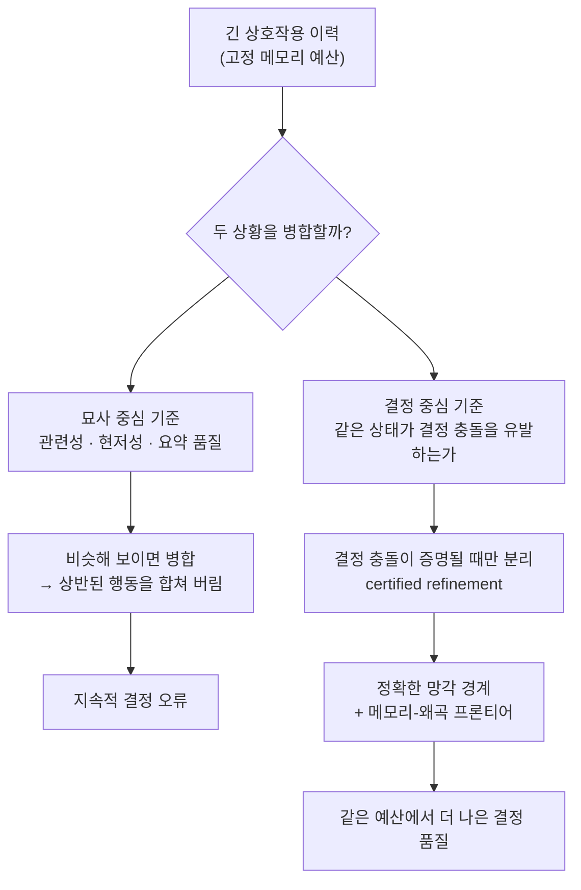

> 📄 **심층 리뷰 전문(DOCX)**: 이 논문의 상세 피어리뷰를 [Google Drive에서 다운로드](https://drive.google.com/file/d/1oxsADQALTfdn7I_mmZbaZfMnmqoCMF9o/view)할 수 있습니다.

## 개요

대화형 에이전트를 오래 굴려 본 사람이라면 익숙한 실패가 있습니다. 며칠 전에 사용자가 분명히 밝힌 선호나 결정을, 에이전트가 어느 순간 잊어버리고 반대로 행동하는 것입니다. 컨텍스트 창은 유한하고, 대화가 길어지면 과거 어딘가는 반드시 압축되거나 버려져야 합니다. 문제는 "무엇을 버릴 것인가"입니다.

지금까지의 에이전트 메모리는 이 질문에 대체로 **묘사적 기준**으로 답해 왔습니다. 관련성이 높은가, 현저한가, 요약이 잘 되는가. Meta AI의 연구자가 공동 저자로 참여한 이번 논문 「Remember the Decision, Not the Description」(arXiv 2605.10870)은 바로 이 기준 자체가 잘못됐다고 주장합니다. 이 글은 AI 에이전트를 설계하는 엔지니어와 연구자, 그리고 장기 메모리를 프로덕션에 얹어야 하는 팀을 위한 것입니다. 논문의 핵심 재정의와 그것을 뒷받침하는 실측 결과를 정리하고, 이 원리가 ThakiCloud의 에이전트 플랫폼 Paxis에 어떻게 적용되는지 살펴봅니다.

## 무엇이 문제인가

저자들의 출발점은 단순한 통찰입니다. 에이전트에게 메모리가 가치 있는 이유는 과거를 충실히 묘사하기 때문이 아니라, **서로 다른 행동을 요구하는 두 이력을 고정된 예산 안에서도 분리해 두기 때문**입니다.

간단한 예를 들어 보겠습니다. 사용자가 어제는 "이번 배포는 반드시 수동 승인 후에만 진행하라"고 했고, 오늘은 비슷한 문맥에서 "이 스크립트는 자동으로 돌려도 된다"고 했다고 합시다. 두 발화는 표면적으로 매우 유사합니다. 배포, 실행, 승인이라는 단어가 겹치고 요약하면 거의 같은 문장이 됩니다. 관련성 기반 메모리는 이 둘을 하나로 뭉쳐 "배포 관련 지시" 한 덩어리로 저장하기 쉽습니다. 그 순간 에이전트는 어느 쪽이 어느 상황에 적용되는지를 잃어버리고, 수동 승인이 필요한 배포를 자동으로 밀어붙이는 사고를 냅니다. 묘사적으로는 옳은 요약이지만 결정적으로는 치명적인 병합입니다.

구체적인 실패 모드는 이렇습니다. 두 상황이 텍스트상으로는 비슷하게 보이지만 실제로는 상반된 조치를 요구한다고 합시다. 메모리 예산이 빠듯하면 압축이 필요하고, 압축은 필연적으로 병합을 부릅니다. 이때 묘사적 유사도만 보면 이 둘을 하나로 합치게 됩니다. 그 결과 에이전트는 그 상태에 도달할 때마다 지속적으로 잘못된 결정을 내립니다. 관련성이나 요약 품질은 "이 둘을 합쳐도 되는가"라는 진짜 질문에 답하지 못합니다. 무엇이 비슷해 보이는지가 아니라, 무엇이 다르게 행동해야 하는지가 기준이 되어야 합니다.

## 핵심 아이디어: 결정 중심 율-왜곡

저자들은 이 문제를 정보이론의 율-왜곡(rate-distortion) 틀로 옮깁니다. 율-왜곡은 원래 "얼마나 압축하면(rate) 얼마나 왜곡(distortion)이 생기는가"를 다루는 이론인데, 여기서 왜곡의 정의를 바꾸는 것이 핵심입니다. 왜곡을 신호의 재구성 오차가 아니라 **압축이 유발하는 달성 가능한 결정 품질의 손실(decision loss)**로 정의합니다.

비유하자면 이렇습니다. 오디오를 압축할 때 우리는 사람 귀에 안 들리는 주파수를 먼저 버립니다. 왜곡의 기준이 "사람이 듣는 소리"이기 때문입니다. 에이전트 메모리도 마찬가지여야 한다는 것이 저자들의 주장입니다. 버려야 할 것은 "덜 관련 있어 보이는 기억"이 아니라 "버려도 앞으로의 결정이 달라지지 않는 기억"입니다. 여기서 rate는 메모리 예산이고 distortion은 그 압축이 유발하는 결정 손실입니다. 두 상황을 같은 슬롯으로 묶었을 때 앞으로 잘못될 결정이 없다면, 그 병합은 무료입니다. 반대로 병합이 상반된 행동을 뭉갠다면 그것은 값비싼 왜곡입니다.

이 정의에서 두 가지가 따라 나옵니다. 첫째, **정확한 망각 경계(exact forgetting boundary)**입니다. 결정 품질을 해치지 않고 안전하게 잊을 수 있는 것의 경계를 정확히 규정합니다. 둘째, **메모리-왜곡 프론티어**입니다. 메모리 예산과 결정 품질 사이의 최적 트레이드오프 곡선을 특징짓습니다. 즉 "예산을 이만큼 줄이면 결정 품질이 최소한 이만큼은 떨어질 수밖에 없다"는 하한을 이론적으로 못 박습니다.

## DeMem: 이론을 알고리즘으로

이 이론을 실제 슬롯 기반 에이전트 메모리로 옮긴 것이 DeMem입니다. DeMem은 온라인 메모리 학습기로, 한 가지 원칙으로 작동합니다. **공유된 상태가 결정 충돌을 유발한다는 것을 데이터가 증명(certify)할 때만 메모리 파티션을 세분화합니다.**

여기서 "증명"이라는 조건이 중요합니다. 두 상황이 그저 달라 보인다고 해서 즉시 분리하는 것이 아니라, 같은 메모리 상태에서 서로 다른 결정이 필요하다는 증거가 실제로 쌓였을 때만 분리합니다. 반대로 그런 증거가 없으면 병합을 유지해 예산을 아낍니다. 이 보수성이 핵심입니다. 성급하게 분리하면 예산을 낭비해 정작 중요한 구분을 담을 자리가 없어지고, 성급하게 병합하면 상반된 행동을 뭉갭니다. certified refinement는 이 둘 사이에서 데이터가 말해 줄 때까지 기다리는 규율입니다. 저자들은 이 절차가 near-minimax regret 보장을 만족함을 증명합니다. 다시 말해 최악의 경우에도 최적 대비 후회가 이론적 한계에 가깝게 억제됩니다.

저자들은 이 메커니즘을 두 층위에서 검증합니다. 먼저 합성 진단 환경에서, 묘사적 유사도와 결정적 유사도가 일부러 어긋나도록 설계한 과제를 줍니다. 여기서 묘사만 보는 기준은 겉보기에 비슷한 상황을 계속 병합해 후회가 누적되는 반면, DeMem은 결정 충돌이 인증될 때만 세분화해 이 함정을 피합니다. 그다음 실제 장기 대화 벤치마크에서 이 우위가 상용 모델과 오픈웨이트 모델 양쪽으로 이전되는지를 확인합니다. 이론에서 시작해 통제된 메커니즘 검증을 거쳐 현실 벤치마크로 내려오는 이 구조가, 결과를 단순한 성능 표가 아니라 "왜 이기는가"에 대한 설명으로 만듭니다.

## 실험 결과

합성 진단에서 DeMem은 예산이 매칭된 모든 기법 중 누적 후회(cumulative regret)가 가장 낮았고, 묘사적 유사도와 결정적 유사도의 괴리가 커질수록 우위가 벌어졌습니다. 묘사만 보는 기준이 상반된 상황을 합쳐 지속적 오류를 내는 동안, DeMem은 결정 충돌이 증명될 때만 세분화해 이를 피했습니다.

실제 벤치마크에서도 결과가 이어졌습니다. LoCoMo(GPT-4.1-mini 백본)의 전체 점수 기준 실측치입니다.

| 기법 | Overall | Temporal |
|---|---|---|
| **DeMem** | **0.921** | **0.908** |
| Mnemis | 0.891 | 0.858 |
| EMem-G | 0.757 | 0.660 |
| Nemori | 0.731 | 0.454 |
| RAG | 0.710 | 0.634 |
| FullContext | 0.692 | 0.511 |
| Zep | 0.554 | 0.383 |
| Mem0 | 0.514 | 0.428 |

DeMem은 전체 점수에서 최고를 기록했고, 특히 먼 상호작용 사이의 구분 보존이 중요한 Temporal, Open-Domain, Multi-Hop 범주에서 강했습니다. 단일 사실을 회수하는 Single-Hop에서는 Mnemis(0.940)가 DeMem(0.935)을 근소하게 앞섰는데, 이는 단발 회수에서는 결정 중심 분리의 이점이 작다는 해석과 맞아떨어집니다. LongMemEval에서도 두 백본 모두에서 최고 평균 점수를 냈고, 크로스 세션 통합이 필요한 범주에서 이득이 가장 컸습니다. 특히 오픈웨이트 백본인 Llama-3.1-70B에서도 우위가 유지되어, 이 이점이 특정 상용 모델에 종속된 것이 아님을 보였습니다.

## ThakiCloud 제품 적용 시사점

이 논문의 통찰은 ThakiCloud의 Agent-Native Cloud 제어 평면인 Paxis의 메모리 설계와 정확히 맞닿습니다. Paxis는 ai-platform 위에서 도는 제어 평면으로 스킬, 도구, 정책, 감사 로그를 일급 리소스로 다루는데, 그 안의 지식 엔진과 메모리 계층이 바로 "무엇을 병합하고 무엇을 분리할 것인가"를 매일 결정합니다.

첫째, HKE 위키 지식 엔진의 병합 기준을 결정 중심으로 옮길 수 있습니다. 유사 항목을 텍스트 유사도만으로 병합하면, 상반된 조치를 요구하는 두 사례가 하나로 합쳐질 위험이 있습니다. 병합 직전에 "이 둘이 서로 다른 행동을 유발하는가"를 게이트로 두는 방식은 이 논문의 certified refinement를 그대로 옮긴 것입니다.

둘째, 세션 상주 핫 메모리의 예산 관리에 이론적 근거를 줍니다. 핫 메모리는 이미 문자 상한으로 예산을 강제하고 있는데, 무엇을 남기고 무엇을 버릴지의 기준을 "결정에 영향을 주는 구분을 보존한다"로 정렬하면 프루닝의 품질이 올라갑니다. 요약이 매끄러운 항목이 아니라, 결정을 가르는 항목을 우선 보존하는 것입니다.

셋째, Paxis가 남기는 정책 게이트와 감사 로그는 "같은 상태에서 다른 결정이 났다"를 사후에 증명할 수 있는 자연스러운 데이터원입니다. DeMem의 온라인 certified refinement를 실시간으로 돌리기 어렵다면, 이 감사 로그를 오프라인 배치로 분석해 병합/분리 정책을 주기적으로 갱신하는 실용 경로를 택할 수 있습니다. 결정 중심 메모리라는 원리와, 그 원리를 안전하게 반복 가능하게 만드는 감사 기반 오케스트레이션이 이렇게 맞물립니다.

## 한계 및 반론

몇 가지는 분명히 해 둘 필요가 있습니다.

첫째, 증명(certify)에는 비용이 듭니다. 결정 충돌을 데이터로 인증하려면 관측이 쌓여야 하는데, 콜드 스타트나 희소한 상호작용 환경에서는 세분화가 지연되어 초기 결정 품질이 어떻게 되는지 본문만으로는 판단하기 어렵습니다.

둘째, 프로덕션에서 "결정 품질 손실"을 온라인으로 추정하려면 보상 신호나 판정기가 필요합니다. 벤치마크에는 정답이 있어 이 신호를 쉽게 얻지만, 정답이 없는 실제 대화에서 이 신호를 어떻게 확보할지가 다음 과제로 남습니다. 앞서 제안한 감사 로그 활용이 하나의 답이 될 수 있으나, 이는 논문의 범위 밖입니다.

셋째, 부록에 계산 경도(computational hardness) 증명이 포함되어 있다는 것은 최적 파티션을 찾는 문제가 일반적으로 어렵다는 뜻입니다. DeMem은 그 실전 근사인데, 어떤 조건에서 이 근사가 무너지는지에 대한 경계가 더 필요합니다.

그럼에도 "에이전트 메모리를 묘사에서 결정으로 옮기라"는 원칙 자체는 단순하고 강력하며, 지금 당장 채택을 검토할 가치가 있습니다. 에이전트가 자꾸 과거의 결정을 잊는다면, 문제는 메모리가 작아서가 아니라 메모리가 엉뚱한 것을 보존하고 있어서일 수 있습니다.

> 📄 **심층 리뷰 전문(DOCX)**: 이 논문의 상세 피어리뷰를 [Google Drive에서 다운로드](https://drive.google.com/file/d/1oxsADQALTfdn7I_mmZbaZfMnmqoCMF9o/view)할 수 있습니다.

## 관련 슬라이드

본문 내용을 NotebookLM(`executive_report` 스타일)으로 요약한 슬라이드입니다.

## 출처

- 논문: [Remember the Decision, Not the Description: A Rate-Distortion Framework for Agent Memory (arXiv 2605.10870)](https://arxiv.org/abs/2605.10870)
- 벤치마크: LoCoMo, LongMemEval / 백본: GPT-4o-mini, GPT-4.1-mini, Qwen2.5-14B-Instruct, Llama-3.1-70B
- 표의 수치는 논문 Table 1(LoCoMo, GPT-4.1-mini)에서 인용했습니다.
