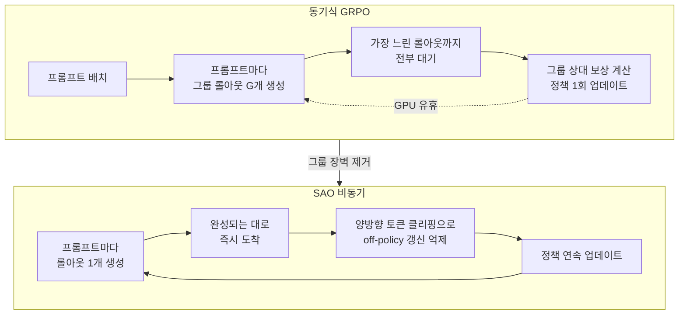

에이전트를 강화학습으로 다듬는다는 말은 이제 실험실 용어가 아닙니다. SWE-Bench처럼 코드베이스를 수십 턴에 걸쳐 고치는 작업, 수학 증명을 여러 단계로 풀어 가는 작업을 잘하는 모델은 대부분 사전학습만으로 만들어지지 않습니다. 사후학습(post-training) 단계에서 실제로 도구를 쓰고 환경과 상호작용하는 롤아웃(rollout)을 돌려 보상을 주는 방식이 핵심입니다. 그런데 이 롤아웃이 길어질수록, 지금까지 표준처럼 쓰이던 학습 방식이 무너지기 시작합니다.

칭화대와 Z AI 연구진이 2026년 7월 8일 공개한 논문 "Single-Rollout Asynchronous Optimization for Agentic Reinforcement Learning"(arXiv 2607.07508)은 바로 그 지점을 정면으로 다룹니다. 결론부터 말하면, 이들은 널리 쓰이는 GRPO의 핵심인 "그룹 샘플링"을 버렸습니다. 그리고 이 방식을 논문 속 실험에만 남겨 두지 않고, 750B 규모의 오픈 모델 GLM-5.2를 학습하는 실제 파이프라인에 투입했습니다.

## 개요

이 논문이 지금 중요한 이유는 학습 비용의 병목이 알고리즘이 아니라 인프라 활용률로 옮겨 갔기 때문입니다. 모델을 더 똑똑하게 만드는 손실 함수는 이미 여럿 나와 있습니다. 진짜 문제는 GPU 수백 장을 붙여 놓고도, 학습 스텝 하나를 만들기 위해 대부분의 시간을 "기다리는 데" 쓴다는 점입니다.

ThakiCloud도 kubeflow 기반의 LLM 학습 시스템에서 SFT·CPT·DPO·GRPO·GKD 다섯 가지 사후학습 기법을 운용합니다. 그래서 GRPO의 그룹 샘플링이 긴 롤아웃에서 어떤 대가를 치르는지, 그리고 그 대가를 없애는 대안이 어떤 새로운 위험을 부르는지는 남의 이야기가 아닙니다. 이 글은 SAO가 무엇을 바꿨고, 그 변경이 우리처럼 멀티테넌트 GPU 클러스터에서 에이전트를 학습하려는 조직에 무엇을 의미하는지를 정리합니다.

*연속적으로 하나씩 도착하는 단일 롤아웃과, 그룹이 다 찰 때까지 큐에서 얼어붙어 기다리는 롤아웃을 대비해 형상화했습니다.*

## 이 기술은 무엇인가

SAO는 이름 그대로 두 가지를 결합합니다. "단일 롤아웃(single-rollout)"과 "비동기 최적화(asynchronous optimization)"입니다.

기존의 표준적인 RL 파이프라인은 동기식(synchronous)이었습니다. 한 배치의 프롬프트를 정하고, 각 프롬프트마다 여러 개의 롤아웃을 생성하고, 그 롤아웃이 전부 끝나면 보상을 계산해 한 번의 정책 업데이트를 수행합니다. 짧은 답변을 생성하는 작업에서는 이 방식이 잘 돌아갔습니다. 롤아웃 길이가 엇비슷했기 때문입니다.

문제는 에이전트 작업입니다. 하나의 코딩 태스크는 3턴 만에 끝나고, 옆의 태스크는 40턴을 돌면서 도구를 계속 호출합니다. 동기식 파이프라인은 배치 안에서 가장 느린 롤아웃이 끝날 때까지 나머지 GPU를 놀립니다. 비동기 RL은 이 낭비를 없애려고 등장했습니다. 롤아웃이 완성되는 대로 즉시 모델을 업데이트하고, 생성기는 멈추지 않고 다음 롤아웃을 계속 만듭니다.

여기서 근본적인 충돌이 발생합니다. GRPO(Group Relative Policy Optimization)는 이름부터 "그룹 상대"입니다. 한 프롬프트에 대해 여러 롤아웃을 묶어 그룹을 만들고, 그 그룹 안에서 상대적으로 잘한 롤아웃과 못한 롤아웃을 비교해 우위(advantage)를 계산합니다. 별도의 가치 함수(critic) 없이 그룹 내부 비교만으로 학습 신호를 만드는 것이 GRPO의 장점이자, 동시에 족쇄입니다. 그룹이 다 채워지지 않으면 우위를 계산할 수 없기 때문입니다. 롤아웃이 도착하는 대로 학습하는 비동기 구조와, 그룹이 다 찰 때까지 기다려야 하는 GRPO는 근본적으로 어긋납니다.

## 왜 GRPO는 비동기 학습에 맞지 않는가

이 어긋남을 조금 더 구체적으로 보겠습니다. 비동기 파이프라인에서 그룹을 유지하려면 두 가지 나쁜 선택 중 하나를 강요받습니다.

첫째, 그룹 단위로 기다리는 것입니다. 그러면 비동기의 이점이 사라집니다. 결국 가장 느린 롤아웃을 기다리는 동기식으로 되돌아갑니다.

둘째, 그룹의 롤아웃들을 서로 다른 시점의 정책으로 생성하는 것입니다. 하나의 그룹 안에서 어떤 롤아웃은 오래된 정책이, 어떤 롤아웃은 몇 스텝 갱신된 정책이 만들었다면, 이들을 같은 그룹으로 묶어 상대 비교하는 것 자체가 통계적으로 오염됩니다. off-policy 정도가 롤아웃마다 다른데 이를 무시하고 하나의 baseline으로 취급하면 학습이 불안정해집니다.

SAO의 답은 단순합니다. 그룹을 아예 없애는 것입니다. 프롬프트마다 롤아웃을 하나만 생성하고, 그 하나가 도착하면 바로 학습에 씁니다. 그룹 장벽이 사라지므로 생성기는 절대 기다리지 않고, GPU 유휴 시간이 크게 줄어듭니다.

## SAO의 두 축: 단일 롤아웃과 양방향 토큰 클리핑

그런데 그룹을 없애면 GRPO가 공짜로 얻던 것을 잃습니다. 그룹 내부 비교는 그 자체로 분산을 줄이는 baseline 역할을 했습니다. 롤아웃이 하나뿐이면 "이 롤아웃이 그룹 평균보다 잘했는가"라는 비교 기준이 사라집니다. 게다가 비동기 구조에서는 롤아웃을 만든 정책과 지금 업데이트하려는 정책 사이에 시차가 생깁니다. 이 시차, 즉 off-policy 문제가 학습을 흔드는 두 번째 위험입니다.

SAO는 이 안정성 문제를 "엄격한 양방향 토큰 단위 클리핑(strict double-side token-level clipping)"으로 막습니다. PPO 계열이 원래 쓰던 클리핑은 중요도 비율(importance ratio)이 특정 범위를 벗어나면 그래디언트를 잘라 내는 장치입니다. SAO는 이를 토큰 단위로, 그리고 위아래 양쪽 모두에 엄격하게 적용합니다. 오래된 정책이 만든 롤아웃이 현재 정책과 지나치게 벌어진 토큰에서는 갱신을 강하게 억제해, 시차가 큰 신호가 학습을 망치는 것을 막습니다.

이 조합의 결과로 SAO는 1,000 스텝 동안 안정적으로 학습을 이어 갔다고 보고합니다. 비동기 RL에서 수백 스텝을 넘기면 발산하거나 붕괴하는 사례가 흔하다는 점을 감안하면, 1,000 스텝 안정 학습은 이 방법의 핵심 주장을 뒷받침하는 증거입니다.

## 실제 결과와 검증

논문은 SAO를 GRPO 및 그 변형들과 비교했고, 에이전트 코딩과 추론 벤치마크에서 일관되게 앞섰다고 보고합니다. 언급된 벤치마크는 SWE-Bench Verified(실제 GitHub 이슈 해결), BeyondAIME(고난도 수학), IMOAnswerBench(올림피아드 수준 수학)입니다. 셋 모두 짧은 단답이 아니라 긴 호흡의 다단계 작업이라는 공통점이 있습니다. 바로 SAO가 겨냥한 영역입니다.

가장 설득력 있는 검증은 벤치마크 표가 아니라 배포 사실 자체입니다. SAO는 GLM-5.2(750B-A40B, 활성 파라미터 40B 규모의 MoE) 오픈 모델을 학습하는 실제 에이전트 RL 파이프라인에 투입되었습니다. 연구용 방법이 논문에만 머물지 않고 수백 B 규모 모델의 프로덕션 학습에 쓰였다는 것은, 이 방법이 소규모 토이 세팅을 넘어 실제 스케일에서 견딘다는 강한 신호입니다.

다만 이 글에서는 벤치마크의 구체적 수치를 인용하지 않습니다. 원문에서 검증한 정확한 수치를 이 자리에서 재현할 수 없다면, 숫자를 지어내지 않고 방법의 구조와 명시된 벤치마크 이름만 전하는 것이 정직합니다. 정확한 점수가 필요하다면 아래 원문을 직접 확인하시기 바랍니다.

## ThakiCloud 제품 적용 시사점

SAO의 교훈은 알고리즘 논문 한 편을 넘어, GPU 클러스터를 운용하는 방식에 직접 닿아 있습니다.

**ai-platform 렌즈 (GPU 학습 인프라).** ThakiCloud의 ai-platform은 Kubernetes와 Kueue 위에서 멀티테넌트 GPU 학습을 스케줄링합니다. kubeflow 기반 LLM 학습 시스템은 이미 GRPO를 사후학습 기법의 하나로 지원합니다. SAO가 던지는 질문은 명확합니다. 우리 학습 잡의 GPU 사용률은 롤아웃 길이의 편차 때문에 얼마나 깎이고 있는가. 에이전트 롤아웃처럼 길이가 들쭉날쭉한 작업에서는 동기식 그룹 대기가 곧 비용입니다. 비동기 롤아웃 생성과 학습을 분리하면 같은 GPU로 더 많은 유효 스텝을 뽑을 수 있고, 이는 멀티테넌트 환경에서 테넌트당 학습 단가를 낮추는 직접적인 지렛대가 됩니다. Kueue의 gang scheduling과 큐 관리가 "그룹이 다 찰 때까지 대기"라는 패턴을 강제하지 않는지 점검하는 것도 실질적인 최적화 포인트입니다.

**Paxis 렌즈 (에이전트 학습의 산출물).** ThakiCloud의 Agent-Native Cloud인 Paxis는 스킬을 격리 샌드박스에서 실행하고 모든 행동을 정책 게이트와 감사 로그로 통과시키는 제어 평면입니다. SAO가 잘 학습시키려는 대상, 즉 여러 턴에 걸쳐 도구를 호출하며 코드베이스를 고치는 에이전트가 바로 Paxis가 실행하는 워크로드입니다. 더 나아가, Paxis가 격리 샌드박스에서 생성하는 실제 에이전트 트레이스는 그 자체로 SAO 같은 비동기 RL의 롤아웃 소스가 될 수 있습니다. 즉 ai-platform이 저비용으로 롤아웃을 생성·학습하고, Paxis가 그 결과 에이전트를 안전하게 운용하며 다시 학습 데이터를 만들어 내는 순환이 성립합니다. 저비용 학습 인프라(ai-platform)가 에이전트 경제성(Paxis)을 떠받치는 구조입니다.

## 한계 및 반론

이 방법을 무비판적으로 받아들이기 전에 몇 가지를 짚어야 합니다.

첫째, 단일 롤아웃은 그룹이 제공하던 분산 감소를 포기합니다. SAO는 이를 클리핑으로 보완하지만, 클리핑은 본질적으로 학습 신호를 잘라 내는 장치입니다. 지나치게 엄격한 클리핑은 유효한 그래디언트까지 버려 학습을 느리게 만들 수 있습니다. "안정성"과 "학습 속도" 사이의 균형점이 태스크와 스케일에 따라 달라질 여지가 큽니다.

둘째, 750B 모델 학습이라는 검증은 인상적이지만, 그 규모에서 통한다는 것이 소규모 조직의 세팅에서도 최적이라는 뜻은 아닙니다. 비동기 파이프라인은 생성기와 학습기를 분리하는 별도의 인프라 복잡도를 요구합니다. 롤아웃 몇 개로 짧게 튜닝하는 팀에게는 오히려 동기식 GRPO가 단순하고 충분할 수 있습니다.

셋째, 반대 방향의 접근도 활발합니다. 같은 시기에 비동기 RLHF의 staleness와 학습률 관계를 스케일링 법칙으로 다룬 연구(arXiv 2607.01083)나, 그래디언트 정렬로 비동기 학습을 안정화하는 접근도 나와 있습니다. SAO의 "그룹을 없애고 클리핑으로 막는다"가 유일한 정답이라기보다, 비동기 에이전트 RL이라는 열린 문제에 대한 여러 유력한 답 중 하나로 보는 것이 정확합니다.

그럼에도 SAO의 기여는 분명합니다. 문제(긴 롤아웃에서 그룹 샘플링의 비효율)를 정확히 짚었고, 해법(단일 롤아웃 + 양방향 클리핑)을 실제 수백 B 규모 프로덕션 학습으로 검증했습니다. GPU 활용률이 곧 학습 비용인 조직이라면, 자신의 파이프라인이 "그룹을 기다리느라" 얼마를 태우고 있는지 한 번쯤 계산해 볼 이유가 됩니다.

## 관련 슬라이드

본문 내용을 NotebookLM(`structured_mint` 스타일)으로 요약한 슬라이드입니다.

## 출처

- Zhenyu Hou, Yujiang Li, Jie Tang, Yuxiao Dong. "Single-Rollout Asynchronous Optimization for Agentic Reinforcement Learning." arXiv 2607.07508 (2026-07-08). <https://arxiv.org/abs/2607.07508>
- 관련: "Staleness-Learning Rate Scaling Laws for Asynchronous RLHF." arXiv 2607.01083. <https://arxiv.org/abs/2607.01083>
