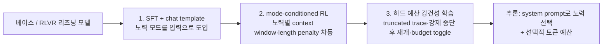

추론 서빙을 직접 운영하거나, GPU 예산을 들여다보거나, 에이전트 하네스에서 어느 단계에 비싼 모델을 붙일지 고민하는 엔지니어라면 최근 모델 출시 노트에서 "reasoning effort"라는 설정을 자주 마주쳤을 겁니다. 낮게 두면 빠르고 싸지만 성능이 아쉽고, 높이면 정확하지만 토큰과 지연이 불어납니다. 이 글은 Sebastian Raschka가 2026년 7월 정리한 [Controlling Reasoning Effort in LLMs](https://magazine.sebastianraschka.com/p/controlling-reasoning-effort-in-llms) 분석을 바탕으로, 그 설정 뒤에서 실제로 무슨 일이 벌어지는지, 그리고 모델을 그렇게 학습시키려면 무엇을 해야 하는지를 클라우드·추론 서빙 관점에서 풀어봅니다. 결론부터 말하면, 같은 low/medium/high 라벨이라도 모델마다 학습 레시피가 제각각이고, 아직 정답이라 부를 만한 단일 방법은 없습니다.

## 리즈닝 모델은 표준이 됐고, 이제는 노력의 양을 고른다

OpenAI가 o1로 LLM 리즈닝 모델을 대중화한 지 약 2년이 지났고, 넉 달 뒤 DeepSeek-R1이 검증 가능한 보상을 쓰는 강화학습(RLVR) 레시피를 공개하며 학습 방법까지 열어젖혔습니다. 그 사이 리즈닝은 특별한 기능이 아니라 신규 모델 출시의 기본 구성 요소가 됐습니다. 지난주 공개된 GPT-5.6 계열은 세 가지 크기로 나오는데, 각 크기마다 대략 대여섯 개의 추론 노력 설정을 함께 제공합니다.

여기서 핵심 관찰이 하나 나옵니다. 리즈닝 모델을 만드는 것과, 그 모델이 얼마나 오래 생각할지를 사용자가 고르게 만드는 것은 별개의 문제라는 점입니다. 전자는 이미 많이 다뤄졌지만, 후자, 즉 "노력의 양을 조절 가능한 입력으로 만드는 법"은 상대적으로 덜 정리돼 있습니다. 실무에서 이 조절 능력은 곧 비용 손잡이입니다. 쉬운 질의는 저노력으로 흘려보내고 어려운 질의에만 고노력을 태우면, 같은 GPU에서 처리량과 품질을 동시에 끌어올릴 수 있기 때문입니다.

## reasoning effort란 무엇인가

경험적으로 노력을 올리면 생성되는 토큰 수가 늘고, 벤치마크 성능도 함께 오릅니다. 다만 이 관계는 선형이 아니라서, 노력이 높은 구간으로 갈수록 추가 토큰당 성능 향상은 점점 줄어듭니다. Thinking Machines의 Inkling 발표 자료에서 노력 단계를 올릴 때 토큰과 성능이 함께 증가하되 상위 구간에서 이득이 둔해지는 곡선이 그대로 확인됩니다. 서빙 관점에서 보면, 최고 노력이 항상 최선의 선택은 아니라는 뜻입니다.

그렇다면 추론 시점에 노력은 어떻게 지정할까요. 놀랍도록 단순합니다. 대개 시스템 프롬프트 한 줄로 제어합니다. ChatGPT UI의 드롭다운 메뉴 선택도 내부적으로는 특정 시스템 프롬프트에 매핑되는 것으로 보입니다. 문제는 이 방식이 아무 모델에서나 통하지 않는다는 데 있습니다. 모델이 "노력: 낮음"이라는 지시를 받았을 때 실제로 더 짧게, 그러나 품질을 유지하며 생각하도록 학습돼 있어야 합니다. 즉 손쉬운 추론 시점 제어를 얻으려면 그 대가로 학습 파이프라인을 손봐야 합니다.

## 어떻게 학습시키는가: 두 개의 축

GPT-5.6이든 오픈소스 gpt-oss든 정확한 학습 세부는 공개돼 있지 않지만, 일반적으로 노력 라벨은 후처리(post-training) 단계의 프롬프트 안에 포함됩니다. 이를 구현하는 방법은 크게 두 갈래입니다.

첫째, RLVR 과정에서 시스템 프롬프트에 따라 길이 페널티를 다르게 주는 방식입니다. "노력: 낮음"일 때는 강한 길이 페널티를, "노력: 높음"일 때는 약하거나 없는 페널티를 적용하면, 모델은 지시된 노력에 맞춰 생각의 길이를 스스로 조절하도록 강화됩니다. 둘째, RLVR을 끝낸 뒤 SFT로 서로 다른 노력 지시를 따르게 미세조정하는 방식입니다. 이때 학습 데이터의 프롬프트에는 원하는 추론 분량을 담은 타깃 응답이 짝지어지고, 그 타깃은 사람이 쓰거나 다른 모델이 생성하거나 생성 후 필터링한 것일 수 있습니다.

두 방법의 큰 그림은 아래와 같습니다. 대다수 실제 레시피는 이 골격의 변주입니다.

## 오픈웨이트 6개 모델 딥다이브

Raschka는 개념 증명에 그치는 연구 대신, 실제로 작동한다는 증거가 있는 최신 오픈웨이트 모델 여섯 개의 레시피를 골랐습니다. 리포트마다 공개 수준은 다르지만, 각각이 쓸모 있는 변주를 하나씩 보여줍니다.

### DeepSeek V4: 노력 전문가를 분리한다

DeepSeek V4 기술 리포트는 세 가지 모드를 설명합니다. Non-think는 추론 흔적 없이 바로 답하고, Think High는 `<think>`와 `</think>` 사이에 추론 흔적을 두는 R1식 고전 방식이며, Think Max는 여기에 특별한 시스템 지시를 덧붙입니다. Think Max용 지시문은 "Reasoning Effort: Absolute maximum with no shortcuts permitted"로 시작합니다. 핵심은 서로 다른 노력 수준을 별개의 전문가처럼 다루고, 모드에 조건화된 RL로 다듬는다는 점입니다.

### Nemotron 3 Ultra: 학습된 모드와 하드 예산의 결합

Nemotron 3 Ultra는 reasoning-off, regular, medium-effort 세 설정을 씁니다. medium-effort는 regular보다 저렴한 추론 모드인데, NVIDIA는 이 모드를 GPT-OSS-120B의 medium-effort 출력으로 SFT 단계에서 도입한 뒤 RLVR로 추가 최적화합니다. RLVR 프롬프트의 약 2.5%가 medium-effort에 해당하며, 여기에 길이 기반 보상 조정이 적용됩니다. 여기에 더해 추론 시점의 토큰 예산을 외부 정지 장치로 겹쳐 쓸 수 있습니다. 클라이언트가 지정한 한도 근처에서 추론을 끝내라고 요청하고, 모델이 스스로 `</think>`를 내지 않으면 클라이언트가 강제로 닫습니다. 이렇게 잘려도 답이 무너지지 않도록, 무작위로 잘린 흔적으로 학습해 강건성을 확보합니다.

### Kimi K2.5: budgeted와 unconstrained를 번갈아 도는 Toggle

Kimi K2.5의 방법인 Toggle은, 고정 토큰 예산으로만 학습하면 모델이 짧은 해에 과적합해 추가 연산의 이득을 잃는다는 문제의식에서 출발합니다. 그래서 일정 학습 반복마다 두 국면을 번갈아 돕니다. budgeted 국면에서는 정답 해가 문제별 토큰 예산 안에 머물도록 유도하고, unconstrained 국면에서는 최대 생성 길이를 복원해 긴 해에서도 계속 배우게 합니다. 예산은 RLVR 정답 롤아웃 길이의 특정 백분위에서 추정하되, 해당 문제의 평균 정확도가 임계를 넘은 뒤에야 예산 제약을 켭니다. 토큰 효율은 크게 끌어올리면서 전체 벤치마크 성능은 비슷하게 유지하는 것이 목표입니다.

### GLM-5: turn-level·interleaved·preserved thinking

GLM-5는 GLM-4.5의 이진 on/off 스위치를 멀티턴과 툴 사용 시나리오로 확장합니다. 세 가지 노력 수준이 아니라 세 가지 관련 동작을 정의하는 점이 특징입니다. interleaved thinking은 응답과 툴 호출마다 앞에 추론 블록을 넣고, preserved thinking은 이전 추론 블록을 여러 턴에 걸쳐 보존해 재사용하며, turn-level thinking은 대화 안에서 요청 단위로 추론을 켜고 끕니다. 추론 시점의 실제 스위치는 turn-level입니다. Z.ai API에서는 기본으로 켜져 있고 개별 요청에서 비활성화할 수 있습니다.

### Qwen3: 모드 융합과 추론 시점 절단

Qwen3의 후처리 파이프라인은 long-CoT SFT, 리즈닝 RL, Thinking Mode Fusion, 일반 RL의 네 단계로 구성됩니다. 노력 on/off 스위치의 핵심은 Thinking Mode Fusion으로, thinking 예시와 non-thinking 예시를 섞은 SFT를 수행합니다. `/think` 예시는 추론 흔적을 담고, `/no_think` 예시는 빈 `<think></think>` 블록과 짧은 답으로 시작합니다. 이어지는 일반 RL이 두 동작 모두에서 지시·형식 준수를 강화합니다. Qwen3는 하드 thinking 예산도 지원하는데, 지정 임계에서 추론을 멈추고 정지 지시를 삽입한 뒤 최종 답으로 넘어갑니다. 흥미롭게도 이 부분 추론 동작은 명시적으로 학습된 것이 아니라 Thinking Mode Fusion 이후 창발했다고 리포트는 밝힙니다. DeepSeek V4나 Nemotron보다 단순하지만, 학습된 on/off 스위치와 추론 시점 예산을 함께 얻는 구성입니다.

### Inkling: 시스템 프롬프트 노력과 모드 조건화 RL

Inkling은 시스템 프롬프트로 노력을 지정하고, 노력에 조건화된 RL로 뒷받침합니다. 앞서 본 대로 노력을 올리면 토큰과 성능이 함께 오르되 상위 구간에서 이득이 둔해지는 경향을 보여, 서빙 시 노력 상한을 어디에 둘지 판단하는 데 참고가 됩니다.

## 공통 골격: 라벨은 같아도 뼈대는 하나

여섯 모델을 나란히 놓으면 공유하는 프레임워크가 드러납니다. 첫째, SFT와 chat template로 노력 모드를 입력으로 도입합니다. Qwen3는 thinking·non-thinking 예시를 명시적으로 섞고, GLM-5는 interleaved·preserved·turn-level 패턴을 더합니다. 둘째, 모드에 조건화된 RL 단계에서 요청된 노력에 따라 컨텍스트 윈도우와 길이 페널티를 바꿉니다. DeepSeek V4, Nemotron 3 Ultra, Inkling이 이 접근을 씁니다. 셋째, 명시적 예산 아래에서의 강건성을 더합니다. Nemotron은 무작위로 잘린 흔적으로 학습하고, Qwen3는 강제로 멈춘 추론 지점에서 이어갈 수 있으며, Kimi는 budgeted와 unconstrained RL을 번갈아 돕니다. 이 장치들은 가용 추론 길이가 바뀌거나 도중에 잘려도 답 품질을 지켜줍니다.

여섯 리포트에 실제로 문서화된 내용을 표로 정리하면 다음과 같습니다.

| 모델 | 모드·설정 | 학습 메커니즘 | 추론 시점 제어 |
|---|---|---|---|
| DeepSeek V4 | Non-think / Think High / Think Max | 노력 전문가 분리 + 모드 조건화 RL | 시스템 프롬프트(Think Max는 지시 추가) |
| Nemotron 3 Ultra | off / regular / medium | GPT-OSS-120B로 SFT + RLVR(약 2.5%) + 절단 흔적 학습 | chat template + 외부 토큰 예산 |
| Kimi K2.5 | budgeted / unconstrained | Toggle: 두 RL 국면 교차 | 문제별 토큰 예산 |
| GLM-5 | turn-level / interleaved / preserved | 멀티턴·툴 사용으로 확장한 SFT | turn-level on/off 스위치 |
| Qwen3 | think / no_think | Thinking Mode Fusion(혼합 SFT) + 일반 RL | on/off + 하드 thinking 예산(절단) |
| Inkling | 다단계 노력 | 모드 조건화 RL | 시스템 프롬프트 |

## 결론과 ThakiCloud 관점

여섯 사례가 보여주는 것은, 비슷한 라벨이 별개의 전문가, 혼합 SFT 데이터, 모드 조건화 보상, 하드 토큰 예산, 또는 이들의 조합으로 각각 뒷받침될 수 있다는 사실입니다. 어느 방법이 가장 낫다고 단정하기는 어렵습니다. 모델마다 베이스 체크포인트, 학습 데이터, 후처리 연산량, 벤치마크, 서빙 목표가 다르고 리포트가 비교에 필요한 세부를 생략하기 때문입니다. 대화형 어시스턴트에 잘 맞는 방법이 장시간 도는 코딩 에이전트에는 나쁠 수도 있습니다.

궁극의 목표는 물론 노력의 자동 선택입니다. 한때 GPT-5의 Auto 모드가 그 방향을 시도했지만 성공보다 실패에 가까웠고, 결국 UI에서 사라졌습니다. 가까운 미래에는 노력이 여전히 명시적 모델 입력으로 남아 대개 시스템 프롬프트로 전달되되, LLM을 감싸는 에이전트 하네스나 내부 라우터가 작업 상태와 남은 예산으로부터 적절한 모드와 예산을 점점 더 자동으로 추론하는 방향이 유력합니다. 물론 지연이나 비용을 우선하거나 최대 성능을 노릴 때를 위해 사용자 오버라이드는 남겨두는 형태가 될 겁니다.

이 지점이 우리 플랫폼 운영과 정확히 맞닿습니다. 추론 예산을 손잡이로 다룰 수 있다면, GPU 서빙 비용과 지연을 질의 난이도에 맞춰 배분할 수 있습니다. 쉬운 요청에는 저노력을, 어려운 요청에만 고노력을 태우는 라우팅은 Kueue 기반 GPU 스케줄링과 결합해 같은 클러스터에서 처리량과 품질을 함께 끌어올리는 실질적 여지를 만듭니다. 실제로 에이전트 하네스를 운영해 보면, 비싼 추론은 검증·합성 같은 소수 단계에만 몰아주고 탐색·요약은 저노력으로 처리하는 편이 비용 대비 품질이 좋습니다. 노력 조절은 모델 자랑거리가 아니라, 추론 인프라를 운영하는 팀이 매일 돌리는 비용-품질 레버라는 관점에서 이 흐름을 읽는 편이 실용적입니다.

원문은 각 모델의 기술 리포트 링크와 도식을 풍부하게 담고 있으니, 특정 모델의 세부 레시피가 필요하면 [Sebastian Raschka의 원글](https://magazine.sebastianraschka.com/p/controlling-reasoning-effort-in-llms)과 해당 리포트를 직접 확인하시길 권합니다.
