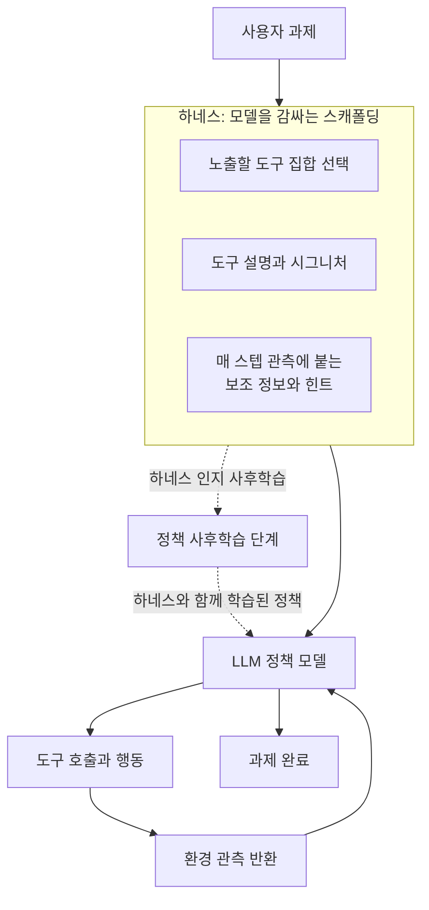

에이전트를 직접 운영하거나, 도구 호출이 많은 워크플로를 붙여 본 엔지니어라면 한 가지 경험을 공유할 겁니다. 같은 베이스 모델을 쓰는데도 어떤 스캐폴딩(도구 목록, 도구 설명, 관측에 붙는 힌트) 위에 올리느냐에 따라 에이전트가 눈에 띄게 달라진다는 것입니다. 이 스캐폴딩을 최근에는 하네스(harness)라고 부릅니다. 이 글은 2026년 6월 공개된 논문 [The Interplay of Harness Design and Post-Training in LLM Agents](https://arxiv.org/abs/2606.25447)(arXiv:2606.25447)를 바탕으로, 하네스를 잘 짜는 것과 모델을 학습시키는 것이 왜 별개가 아닌지, 그리고 이 결과가 에이전트를 실제로 서빙하는 클라우드에 어떤 의미인지를 정리합니다. 결론을 먼저 말하면, 하네스는 학습이 끝난 뒤에 갈아 끼우는 부품이 아니라 학습 단계부터 함께 설계해야 하는 요소입니다.

## 개요: 왜 지금 하네스인가

지난 몇 달 사이 "모델보다 모델을 둘러싼 코드가 더 중요하다"는 주장이 부쩍 자주 보입니다. 도구를 쓰는 에이전트에서는 모델 가중치만큼이나 도구를 어떻게 노출하고 설명하는지, 매 스텝마다 무엇을 관측으로 돌려주는지가 최종 성능을 좌우하기 때문입니다. 같은 주제를 다룬 서베이 [From Question Answering to Task Completion](https://arxiv.org/abs/2606.20683)도 하네스 설계를 에이전트 시스템의 독립된 연구 축으로 정리합니다.

문제는 그동안 이 두 가지, 즉 하네스 설계와 사후학습(post-training)이 서로 다른 팀의 일처럼 다뤄졌다는 데 있습니다. 리서치 팀은 강화학습으로 정책을 다듬고, 플랫폼 팀은 도구와 프롬프트를 손봅니다. 이 논문의 기여는 그 분업이 틀렸음을 보이는 데 있습니다. 하네스의 정보량과 사후학습은 곱셈처럼 얽혀 있어서, 한쪽만 최적화하면 다른 쪽의 이득을 대부분 흘려버립니다. ThakiCloud처럼 하네스를 일급 리소스로 다루는 플랫폼 입장에서 이 발견은 곧 운영 원칙으로 번역됩니다.

## 하네스란 무엇이고 어디서 성능이 갈리는가

논문은 하네스를 "모델을 감싸는 스캐폴딩"으로 정의합니다. 구체적으로는 어떤 도구를 노출할지, 그 도구를 어떻게 설명할지, 그리고 매 스텝의 관측에 어떤 보조 정보를 함께 실어 줄지를 결정하는 층입니다. 도구 호출 에이전트의 한 사이클을 그리면 다음과 같습니다.

여기서 핵심 변수는 하네스의 정보량(informativeness)입니다. 정보량이 높은 하네스는 도구를 풍부하게 설명하고 관측에 유용한 힌트를 실어 주므로, 모델이 사전 지식에 덜 의존하고도 올바른 도구를 고르도록 돕습니다. 정보량이 낮은 하네스는 반대로 최소한의 시그니처만 던져 주고 나머지를 모델의 추론에 맡깁니다. 이 차이가 학습과 만나면서 결과가 갈립니다.

## 이 논문이 뒤집은 통념

에이전트를 다뤄 본 사람들이 은연중에 가진 가정이 하나 있습니다. 좋은 하네스는 배포 직전에 얹으면 된다는 것입니다. 모델은 모델대로 잘 학습시키고, 하네스는 나중에 도구 설명을 다듬어 붙이면 성능이 올라간다는 기대입니다. 논문은 이 가정을 정면으로 반박합니다.

첫째, 제로샷(추가 학습 없이 프롬프트만으로) 상황에서도 하네스 정보량이 높아질수록 성능이 단조롭게 개선되며, 이 효과는 고용량 모델에서 더 뚜렷합니다. 정보가 풍부한 하네스에 담긴 사전 지식이 곧 성능이라는 뜻입니다.

둘째, 그리고 더 중요한 발견은 사후학습과의 상호작용입니다. 하네스를 학습 단계에 함께 넣고 훈련한 모델과, 학습이 끝난 뒤에 같은 하네스를 얹은 모델을 비교하면, 후자는 전자가 누린 이득의 극히 일부만 회복합니다. 즉 하네스 인지 사후학습(harness-aware post-training)은 성능을 얹어 주는 부가물이 아니라, 견고한 성능을 얻기 위한 전제 조건입니다. 하네스를 학습 이후에 갈아 끼우는 접근은 반쪽짜리라는 것입니다.

## 진짜 차이는 도구 환경이 바뀔 때 드러난다

가장 실무적인 결과는 분포 밖(OOD) 실험에서 나옵니다. 여기서 OOD란 학습 때 보지 못한 도구 환경, 예를 들어 도구가 추가·교체되거나 API 시그니처가 달라진 상황을 말합니다. 실제 운영에서는 이런 변화가 상수입니다. 도구는 계속 늘고, 버전은 올라가며, 테넌트마다 노출되는 도구 집합이 다릅니다.

논문은 두 갈래를 비교합니다. 정보량이 높은 하네스로 하네스 인지 사후학습을 한 에이전트는 도구 환경이 크게 바뀌어도 견고하게 버티고, 과제 그룹을 가로질러 일반화합니다. 반면 설계 노력이 낮은 하네스로 학습한 에이전트는 도구 환경 변화가 강해질수록 성능이 급락하고, 새로운 환경으로 전이하지 못합니다. 다시 말해 하네스에 담긴 사전 지식이 일반화의 앵커 역할을 합니다. 잘 설계된 하네스와 함께 학습한 정책은 낯선 도구 앞에서도 무엇을 어떻게 부를지에 대한 감을 유지하지만, 빈약한 하네스로 학습한 정책은 그 감을 통째로 잃습니다.

이 대목이 클라우드 운영자에게 특히 뼈아픕니다. 벤치마크에서 잘 나온 에이전트가 프로덕션에서 무너지는 전형적인 이유가 바로 도구 환경 이동이기 때문입니다. 그리고 이 논문은 그 취약성이 상당 부분 하네스 설계 단계에서 이미 결정된다고 말합니다.

## ThakiCloud 제품 적용 시사점

이 발견은 ThakiCloud의 두 제품 축 모두와 맞닿아 있어서, 하나의 렌즈로만 보면 절반을 놓칩니다.

첫 번째는 **Paxis 렌즈**입니다. Paxis는 ai-platform 위에서 도는 Agent-Native Cloud 제어 평면으로, Skills·Tools·Policies·Audit Logs를 일급 리소스로 다룹니다. 이 논문의 언어로 옮기면 Paxis의 Skill Harness가 바로 여기서 말하는 하네스입니다. 960여 개 스킬을 BM25로 선택해 노출 도구 집합을 정하고, 각 스킬의 설명과 시그니처를 정돈하며, 격리 샌드박스 실행 결과를 관측으로 되돌려 주는 과정 전체가 하네스 정보량을 결정합니다. 논문의 결론은 Paxis 설계 원칙을 뒷받침합니다. 스킬을 무작정 많이 노출하는 것이 아니라 과제에 맞게 선택해 정보량 높은 하네스를 구성하는 편이, 그리고 그 하네스를 학습·평가 루프와 함께 진화시키는 편이 낯선 도구 환경에서의 견고함으로 이어지기 때문입니다. 정책 게이트와 감사 로그로 모든 행동을 통과시키는 구조도, 하네스를 실험 대상이자 버전 관리 대상으로 유지하려는 같은 문제의식의 연장선에 있습니다.

두 번째는 **ai-platform 렌즈**입니다. 하네스 인지 사후학습이 전제 조건이라는 결론은, 학습과 서빙을 한 인프라 안에서 붙여 두는 것의 가치를 높입니다. ai-platform은 K8s와 Kueue 기반 GPU 스케줄링 위에서 파인튜닝·RLVR 같은 사후학습 워크로드와 vLLM 추론 서빙을 함께 운용합니다. 하네스를 학습 시점에 반영하려면, 서빙에서 쓰는 도구 스키마와 관측 포맷을 학습 파이프라인이 그대로 참조할 수 있어야 합니다. 학습과 서빙이 다른 조직·다른 스택으로 분리돼 있으면 하네스가 어긋나고, 논문이 경고한 "학습 후 하네스 교체"의 반쪽 이득에 갇힙니다. 멀티테넌트 환경에서 테넌트별로 다른 도구 집합을 노출하면서도 온프렘·소버린 요건을 지켜 self-hosting으로 학습·서빙을 한 울타리 안에 두는 구성은, 이 하네스-학습 정합을 지키기에 유리한 자리입니다.

두 렌즈는 서로를 보완합니다. Paxis가 하네스를 일급 리소스로 관리해 정보량과 버전을 통제하고, ai-platform이 그 하네스를 학습 루프에 흘려 넣어 하네스 인지 사후학습을 현실로 만듭니다.

## 한계 및 반론

이 논문의 결과를 과대 해석하지 않으려면 몇 가지를 함께 봐야 합니다.

먼저 "하네스 정보량을 높일수록 좋다"는 명제에는 비용이 딸려 옵니다. 관측에 힌트를 많이 실을수록 컨텍스트가 길어지고, 도구 설명이 풍부할수록 프롬프트 토큰과 지연이 늘어납니다. 서빙 관점에서 정보량은 공짜가 아니며, 처리량과의 트레이드오프를 함께 봐야 합니다. 논문이 말하는 정보량은 "무조건 더 많이"가 아니라 "과제에 유용한 사전 지식을 담는가"에 가깝게 읽는 편이 안전합니다.

또한 하네스 인지 사후학습은 학습 파이프라인을 손봐야 한다는 진입 비용을 요구합니다. 이미 만들어진 오픈웨이트 모델을 그대로 쓰는 다수의 실무에서는, 하네스만 다듬는 제로샷 개선이 여전히 현실적인 첫 수입니다. 논문 자신도 제로샷에서 정보량이 성능을 끌어올린다고 밝히므로, 학습 여력이 없는 팀에게는 이쪽이 합리적인 출발점입니다.

마지막으로, 논문의 OOD 실험이 다루는 도구 환경 이동이 실제 프로덕션의 변화 폭을 모두 대표한다고 단정하기는 어렵습니다. 벤치마크상의 도구 교체와, 수십 개 테넌트가 각자 API를 갱신하는 운영 환경 사이에는 간극이 있습니다. 그럼에도 방향성, 즉 "하네스를 학습과 함께 설계한 에이전트가 변화에 강하다"는 결론은, 도구가 끊임없이 바뀌는 실제 클라우드일수록 오히려 더 크게 작동할 가능성이 높습니다.

정리하면, 이 논문은 하네스를 배포 직전에 얹는 마감재가 아니라 학습 첫 단계부터 함께 설계하는 구조로 다루라고 말합니다. 하네스를 일급 리소스로 관리하고, 학습과 서빙을 한 인프라 안에 두려는 방향은 그 권고와 정확히 같은 곳을 가리킵니다.

## 출처

- The Interplay of Harness Design and Post-Training in LLM Agents, arXiv:2606.25447: <https://arxiv.org/abs/2606.25447>
- From Question Answering to Task Completion: A Survey on Agent System and Harness Design, arXiv:2606.20683: <https://arxiv.org/abs/2606.20683>
