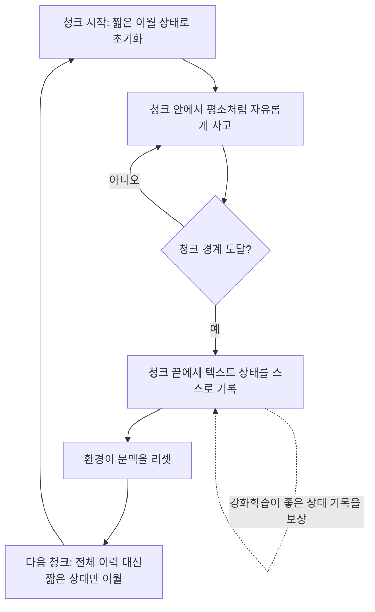

추론 모델이 점점 더 길게 생각하게 만들면서 그 비용이 감당이 안 되는 지점을 겪어 봤다면, 이 글이 바로 여러분을 위한 것입니다. 핵심 결론을 먼저 적겠습니다. 긴 사고연쇄의 진짜 비용은 모델이 생각하는 동안 상태가 무한정 커져 비용이 사고 길이의 제곱으로 늘어난다는 데 있고, 마르코프 사고(Markovian Thinking)는 정책이 고정 크기 상태만 보고 추론을 이어 가게 만들어 이 비용을 선형으로 낮춥니다. 이 발상을 구현한 Delethink 환경에서 8K 토큰 청크로 훈련한 1.5B 모델이 24K 토큰까지 사고하며 같은 예산의 기존 방식과 맞먹거나 앞섰고, 96K 사고 길이에서는 훈련 비용이 27 H100-월에서 7 H100-월로 줄었습니다.

*긴 사고를 고정 크기 청크로 끊고 짧은 상태만 다음으로 넘기는 마르코프 사고를 형상화했습니다.*

## 왜 읽어야 하나

이 글은 긴 추론 모델을 서빙하거나 강화학습으로 훈련하는 엔지니어와, 그 추론 비용을 책임지는 플랫폼 담당자를 위한 것입니다. 여러분이 마주한 결정은 이것입니다. 모델이 더 길게 생각하게 하고 싶은데, 그 길이에 비례해 제곱으로 뛰는 계산량과 메모리를 어떻게 감당할 것인가입니다. 마르코프 사고(arXiv:2510.06557, McGill-NLP)는 사고 길이를 문맥 크기에서 분리하는 방식으로 답합니다. 결론부터 말하면, 추론을 고정 크기 청크로 끊고 청크 경계에서 다음 청크로 넘길 짧은 텍스트 상태만 남기게 하면, 사고가 아무리 길어져도 비용은 선형으로만 늘고 메모리는 상수로 유지됩니다.

## 개요

지난 몇 년간 추론 모델의 성능은 사고연쇄를 길게 늘이는 방향으로 올랐습니다. 더 오래 생각할수록 더 어려운 문제를 풀 수 있다는 것이 이 흐름의 전제입니다. 그런데 이 길어지는 사고에는 잘 드러나지 않는 대가가 붙어 있습니다. 표준적인 강화학습 사고 환경에서 상태는 프롬프트에 그때까지 생성한 모든 추론 토큰을 더한 것으로 정의됩니다. 즉 모델이 생각을 이어 갈수록 상태가 계속 부풀고, 어텐션 기반 정책은 그 커지는 상태를 매번 다시 훑어야 하므로 계산량이 사고 길이의 제곱으로 늘어납니다. 메모리도 함께 자랍니다. 생각을 두 배로 길게 하면 비용은 네 배가 되는 셈입니다.

마르코프 사고는 이 전제 자체를 다시 봅니다. 상태를 무한정 키우는 대신, 정책이 항상 고정된 크기의 상태만 보고 추론을 진행하게 만듭니다. 사고 길이가 문맥 크기와 묶여 있던 고리를 끊어, 사고가 길어져도 계산은 선형으로, 메모리는 상수로 유지되게 하는 것입니다. 마치 마르코프 과정에서 다음 상태가 바로 앞의 고정 상태에만 의존하듯, 다음 사고 조각이 앞선 모든 토큰이 아니라 방금 넘겨받은 고정 상태에만 의존하게 만든다는 뜻입니다.

## 이 기술은 무엇인가

마르코프 사고를 실제로 구현한 것이 Delethink라는 강화학습 환경입니다. Delethink는 추론을 고정 크기 청크로 구조화합니다. 각 청크 안에서 모델은 평소처럼 자유롭게 생각합니다. 그러다 청크 경계에 이르면, 환경이 문맥을 리셋하고 프롬프트를 짧은 이월분(carryover)으로 다시 초기화합니다. 여기서 핵심은 강화학습을 통해 정책이 배우는 것입니다. 정책은 각 청크가 끝나갈 무렵, 리셋 이후에도 추론을 매끄럽게 이어 가기에 충분한 텍스트 상태를 스스로 써 두는 법을 학습합니다. 다음 청크는 앞선 청크 전체가 아니라 이 짧은 상태만 물려받아 시작합니다.

아래 도표가 이 흐름을 보여 줍니다.

기존의 긴 사고연쇄 방식(LongCoT)과의 차이가 여기서 갈립니다. LongCoT은 생성한 모든 토큰을 문맥에 계속 쌓아 두므로 상태가 무한정 커집니다. Delethink는 청크마다 문맥을 비우고 짧은 상태만 넘기므로 상태 크기가 고정됩니다. 사고의 길이는 청크를 몇 번 이어 붙이느냐로 늘리되, 한 번에 문맥에 올라가는 양은 청크 하나 크기로 묶어 두는 것입니다.

## 논문이 보고한 실험 결과

논문이 보고한 수치는 이 발상이 실제로 통한다는 것을 보여 줍니다. R1-Distill 1.5B 모델을 Delethink 환경에서 8K 토큰 청크로 훈련했더니, 이 모델은 최대 24K 토큰까지 사고하면서 24K 예산으로 훈련한 기존 LongCoT-RL과 맞먹거나 그것을 앞섰습니다. 8K짜리 창만 보면서도 그보다 세 배 긴 추론을 해낸 것입니다.

비용 차이는 규모가 커질수록 벌어집니다. 논문은 평균 사고 길이 96K 지점에서 LongCoT-RL의 훈련 비용이 27 H100-월인 데 비해 Delethink는 7 H100-월이라고 보고합니다. 선형 대 제곱의 차이가 만드는 격차입니다.

| 항목 | LongCoT-RL | Delethink(마르코프 사고) |
|---|---|---|
| 상태 크기 | 사고 길이에 비례해 무한정 증가 | 청크 크기로 고정 |
| 계산 스케일링 | 사고 길이의 제곱 | 사고 길이에 선형 |
| 96K 사고 길이 훈련 비용 | 27 H100-월 | 7 H100-월 |
| 테스트타임 스케일링 | 정체 경향 | 계속 개선 |

테스트타임 스케일링에서도 차이가 납니다. 추론 시점에 사고를 더 늘렸을 때, LongCoT이 정체되는 지점에서 Delethink는 계속 개선됩니다. 또 하나 흥미로운 관찰은 강화학습 초기화 시점 분석에서 나옵니다. 1.5B부터 120B까지 시중의 여러 추론 모델이 다양한 벤치마크에서 마르코프적 궤적을 별도 훈련 없이도 곧잘 샘플링하더라는 것입니다. 이 자연 발생하는 긍정 샘플들이 강화학습을 규모에서도 효과적으로 만들어 주는 밑거름이 됩니다.

여기서도 정직하게 짚겠습니다. 위 수치는 모두 논문이 보고한 값이며, 저희가 별도로 재현해 측정한 것이 아닙니다. 구체적 실험 조건은 원문과 공개된 코드 저장소에서 직접 확인하시기를 권합니다.

## ThakiCloud 제품 적용 시사점

마르코프 사고가 던지는 실무적 함의는 ThakiCloud의 두 제품 모두에 닿습니다.

ai-platform 관점이 특히 직접적입니다. 긴 추론을 서빙할 때 비용을 실제로 밀어 올리는 것은 사고가 길어질수록 커지는 KV 캐시와 어텐션 계산입니다. 문맥이 무한정 자라면 H200 한 장에 올릴 수 있는 동시 요청 수가 줄고, 멀티테넌트 환경에서 GPU 메모리 압박이 심해집니다. 마르코프 사고처럼 한 번에 문맥에 올라가는 양을 청크 크기로 고정하면, KV 캐시 발자국이 사고 길이와 무관하게 상수로 유지됩니다. 이는 Kueue 기반 GPU 스케줄링 위에서 같은 하드웨어로 더 많은 동시 추론을, 그것도 더 긴 사고를 요구하는 워크로드로 소화할 수 있다는 뜻입니다. 온프레미스와 소버린 배포처럼 GPU 예산이 빡빡한 환경일수록 선형 비용의 이점은 커집니다.

Paxis 관점도 있습니다. Paxis는 ThakiCloud의 Agent-Native Cloud로, 에이전트가 여러 단계에 걸쳐 길게 추론하고 도구를 호출하는 워크플로를 격리 샌드박스에서 실행합니다. 에이전트의 추론이 길어질수록 문맥이 부풀어 비용과 지연이 함께 오르는데, 마르코프 사고의 고정 상태 이월은 긴 에이전트 루프를 상수 메모리로 유지하는 길을 제시합니다. 스킬 하네스가 여러 스킬을 이어 붙여 긴 작업을 수행할 때, 각 단계가 전체 이력이 아니라 압축된 상태만 물려받게 하는 설계는 에이전트 경제성을 직접 개선합니다.

## 한계 및 반론

가장 큰 물음은 정보 손실입니다. 청크 경계에서 문맥을 리셋하고 짧은 상태만 넘긴다는 것은, 앞선 청크의 세부가 그 짧은 상태에 담기지 못하면 영영 사라진다는 뜻입니다. 정책이 정말 중요한 것을 상태에 잘 압축해 넣도록 학습해야 하며, 상태 크기와 청크 크기를 잘못 잡으면 긴 의존성을 요구하는 문제에서 성능이 떨어질 수 있습니다. 모든 추론이 마르코프적으로 잘 쪼개지는 것은 아닙니다.

또한 이 방식은 강화학습으로 상태 기록 습관을 길들여야 비로소 작동합니다. 상태를 쓰는 법을 아직 배우지 못한 모델에 그냥 적용하면 청크 사이가 끊깁니다. 다만 논문이 관찰한 대로 시중 모델들이 마르코프적 궤적을 어느 정도 자연히 샘플링한다는 점은 이 부트스트랩 부담을 덜어 줍니다. 마지막으로 보고된 이득은 논문의 실험 설정과 벤치마크에 대한 것이며, 도메인이 크게 다른 실제 프로덕션 추론으로 그대로 이전될지는 별도의 검증이 필요합니다.

## 정리

긴 추론의 비용 문제를 모델을 더 키우는 것으로 풀려 하기 전에, 마르코프 사고는 문제의 정의 자체를 바꾸라고 말합니다. 상태를 무한정 키우지 말고 고정하라는 것입니다. 여러분이 긴 추론을 서빙하거나 훈련한다면 오늘 가져갈 한 가지는 분명합니다. 사고를 길게 늘리는 것과 문맥을 무한정 키우는 것은 같은 일이 아니며, 둘을 분리하면 같은 성능을 훨씬 적은 비용으로 얻을 여지가 생긴다는 것입니다. 청크 경계에서 무엇을 남기고 무엇을 버릴지를 정책이 스스로 배우게 하는 이 설계는, 추론 비용이 곧 사업 비용인 서빙 현장에서 먼저 살펴볼 값싼 레버입니다.

출처: [The Markovian Thinker: Architecture-Agnostic Linear Scaling of Reasoning (arXiv:2510.06557)](https://arxiv.org/abs/2510.06557) · [코드 저장소(McGill-NLP/the-markovian-thinker)](https://github.com/McGill-NLP/the-markovian-thinker)
