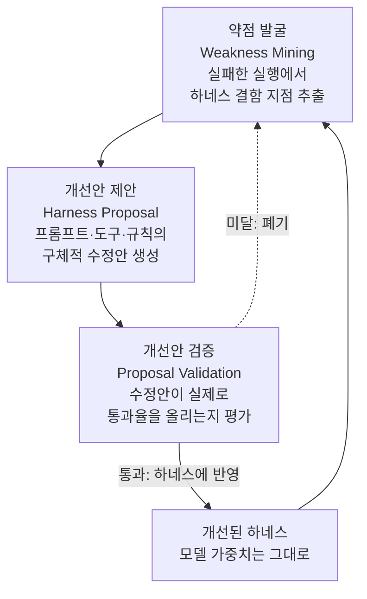

프로덕션에서 에이전트 하네스를 운영하는 엔지니어라면, 모델을 더 큰 것으로 바꾸지 않고도 통과율을 크게 올릴 여지가 어디에 남아 있는지 늘 궁금하실 겁니다. Self-Harness(arXiv 2606.09498)의 결론부터 말씀드리면, 그 여지는 모델이 아니라 하네스에 있고, 놀랍게도 에이전트가 사람 손 없이 자기 하네스를 스스로 고쳐서 그 여지를 상당 부분 회수할 수 있습니다. 다만 이 자가개선 루프가 어디까지 올라가느냐는 생성기가 아니라 평가자가 얼마나 까다로워지느냐에 달려 있습니다. 이 글은 그 메커니즘과 한계를 정리합니다.

## 왜 읽어야 하나

이 글은 에이전트 하네스를 직접 운영하는 엔지니어, 그리고 자가개선 루프를 설계하려는 플랫폼 담당자를 대상으로 합니다. 여기서 하네스란 모델을 감싸는 시스템 프롬프트, 도구 정의, 라우팅 규칙, 출력 검증 게이트처럼 모델 바깥의 골격 전체를 말합니다. 핵심 결론은 이렇습니다. 에이전트 성능을 끌어올리는 지렛대는 모델 교체만이 아니라 하네스 개선이며, 그 개선을 에이전트가 스스로 반복할 수 있다는 것입니다. 대신 이 루프의 상한은 평가자의 품질이 정합니다. 이 사실을 알면 "성능이 안 나오니 더 큰 모델로 올리자"는 반사적 결정을 미루고, 하네스와 평가자를 먼저 손보는 순서를 갖게 됩니다.

## 개요

지난 2년 동안 에이전트 연구의 무게 중심은 모델 자체에서 모델을 둘러싼 골격으로 옮겨 왔습니다. 같은 모델이라도 시스템 프롬프트를 어떻게 쓰고, 어떤 도구를 주고, 실패를 어떻게 되먹임하느냐에 따라 결과가 크게 달라진다는 것이 반복해서 확인됐기 때문입니다. 그런데 이 하네스를 개선하는 일은 여전히 사람 엔지니어의 몫이었습니다. 실패 사례를 모아 읽고, 프롬프트를 고치고, 도구를 다듬는 지루한 수작업이 계속됐습니다.

Self-Harness는 이 수작업을 에이전트에게 넘깁니다. 사람 엔지니어도, 더 강한 외부 에이전트도 끌어들이지 않고, 에이전트가 자기 자신의 하네스를 스스로 고치도록 만드는 것입니다. 논문이 던지는 질문은 단순합니다. 모델 가중치를 전혀 건드리지 않고 하네스만 반복해서 고치면 성능이 얼마나 올라가는가, 그리고 그 개선은 어디에서 멈추는가.

## 이 연구는 무엇인가

Self-Harness의 뼈대는 세 단계가 맞물려 도는 루프입니다. 약점 발굴(Weakness Mining), 하네스 개선안 제안(Harness Proposal), 개선안 검증(Proposal Validation)입니다.

첫 단계인 약점 발굴은 실패한 실행을 뒤져 하네스의 어느 부분이 문제를 일으켰는지 찾아냅니다. 단순히 "틀렸다"가 아니라, 어떤 파일이나 어떤 절차에서 하네스가 에이전트를 잘못 이끌었는지를 짚는 것이 핵심입니다. 두 번째 단계인 하네스 개선안 제안은 그 약점을 겨냥해 시스템 프롬프트, 도구 정의, 라우팅 규칙을 어떻게 고칠지 구체적인 수정안을 만듭니다. 세 번째 단계인 개선안 검증은 그 수정안이 실제로 통과율을 올리는지 확인합니다. 여기서 통과한 수정안만 하네스에 반영되고, 그러지 못한 수정안은 폐기됩니다.

이 구조에서 중요한 점은 모델 가중치를 전혀 학습시키지 않는다는 것입니다. 개선되는 것은 오직 모델 바깥의 골격뿐입니다. 그래서 이 방법은 가중치를 다시 학습할 여력이 없는 팀도, 폐쇄형 모델을 API로만 쓰는 팀도 그대로 적용해 볼 수 있는 여지를 남깁니다.

## 실제 실험 결과

논문은 Terminal-Bench-2.0이라는 벤치마크 위에서 세 가지 기반 모델로 Self-Harness를 돌렸습니다. 결과를 표로 정리하면 다음과 같습니다.

| 기반 모델 | 개선 전 통과율 | 개선 후 통과율 | 상대 향상 |
|---|---|---|---|
| MiniMax M2.5 | 40.5% | 61.9% | 약 +53% |
| Qwen3.5-35B-A3B | 23.8% | 38.1% | 약 +60% |
| GLM-5 | 42.9% | 57.1% | 약 +33% |

세 모델 모두 가중치를 건드리지 않았는데도 held-out(학습에 쓰지 않은) 문제에서 통과율이 뚜렷하게 올랐습니다. Qwen3.5-35B-A3B의 경우 상대 향상이 약 60%에 이르렀습니다. 절대 수치로 보면 가장 낮았던 모델이 가장 큰 폭으로 개선됐다는 점도 눈에 띕니다. 하네스가 부실할수록 스스로 고칠 여지가 크다는 해석이 가능합니다.

여기서 한 가지 주의할 점을 덧붙입니다. 이 수치들은 논문 초록과 소개에서 확인한 값이며, 저희가 직접 재현한 것은 아닙니다. Terminal-Bench-2.0은 터미널 환경에서 실제 작업을 수행하는 능력을 재는 벤치마크이므로, 같은 하네스 개선 기법이 다른 도메인(예를 들어 문서 생성이나 데이터 분석)에서 같은 폭으로 통할지는 별도로 검증해야 합니다.

## 자가개선 루프의 진짜 병목: 평가자

이 논문에서 가장 곱씹을 대목은 성능 수치가 아니라 그 수치가 어디에서 멈추느냐입니다. 세 번째 단계인 개선안 검증이 곧 이 루프의 평가자 역할을 합니다. 그런데 자가개선 루프는 평가자가 더 까다로워지기를 멈추는 순간 함께 정체하는 경향이 있습니다. 개선안을 통과시키는 기준이 느슨하면, 에이전트는 실제로 더 나아지지 않는 변화를 자꾸 통과시키고, 루프는 겉으로만 도는 상태가 됩니다.

이것은 저희가 사내 규율로 반복해서 강조해 온 지점과 정확히 겹칩니다. 팬아웃한 결과를 합치기 전에 반드시 검증 단계로 닫아야 하고, 그 검증은 생성기와 다른 시각으로 적대적이어야 하며, 품질이 안 나올 때 가장 흔한 원인은 "모델이 약해서"가 아니라 "검증 단계가 없거나 약해서"라는 것입니다. Self-Harness는 이 원칙을 벤치마크 수치로 뒷받침합니다. 즉, 자가개선의 상한을 올리고 싶다면 생성기를 더 크게 만들기 전에 평가자를 더 까다롭게 만들어야 합니다.

## ThakiCloud 제품 적용 시사점

이 논문은 저희 Paxis 관점에서 특히 직접적입니다. Paxis는 ThakiCloud의 Agent-Native Cloud로, Skills와 Tools, Policies, Audit Logs를 일급 리소스로 다루는 제어 평면입니다. 960개가 넘는 스킬을 BM25로 선택해 격리된 샌드박스에서 실행하고, 모든 행동을 정책 게이트와 감사 로그로 통과시킵니다. Self-Harness가 말하는 하네스, 즉 프롬프트와 도구와 라우팅 규칙의 집합이 바로 Paxis의 스킬 하네스에 해당합니다.

Self-Harness의 3단계 루프는 Paxis의 자가진화 스킬 계층에 자연스럽게 대응됩니다. 실패한 실행 기록에서 약점을 뽑아내는 약점 발굴은 저희 스킬 회고와 채굴 루틴이 맡고, 하네스 개선안 제안은 스킬과 규칙을 고치는 진화 단계에, 개선안 검증은 결정론적 게이트와 적대적 표결에 대응합니다. 논문이 강조한 "평가자가 병목"이라는 결론은 저희가 게이트를 코드로 소유하고, 검증 단계를 생성기와 분리하며, 평가자가 실제로 무언가를 기각하지 않으면 그 평가자를 고장으로 간주하는 규율과 맞닿아 있습니다.

인프라 관점에서 보면 ai-platform 렌즈도 함께 작동합니다. 하네스만 고쳐서 성능을 올린다는 것은 값비싼 재학습 없이 추론 단계의 골격만 바꿔 개선한다는 뜻입니다. K8s 기반 멀티테넌트 서빙 환경에서 이런 방식은 GPU 재학습 비용을 들이지 않고도 고객별 하네스를 반복 개선할 수 있는 경로를 열어 줍니다. 저비용 서빙이 에이전트 경제성을 만들고, 그 위에서 하네스 자가개선이 품질을 끌어올리는 구조입니다.

## 한계 및 반론

Self-Harness에도 분명한 한계가 있습니다. 첫째, 이 방법의 상한은 결국 평가자의 품질에 묶여 있습니다. 검증 단계가 실제 성능을 제대로 가르지 못하면 루프는 정체하거나, 더 나쁘게는 벤치마크 특정 패턴에만 과적합할 수 있습니다. 둘째, Terminal-Bench-2.0이라는 특정 벤치마크에서 나온 수치이므로, 다른 과제 분포에서 같은 폭의 향상이 재현될지는 확인되지 않았습니다. 셋째, 하네스가 스스로 커지고 복잡해지면서 통제하기 어려운 방향으로 자라날 위험도 있습니다. 사람의 검토 없이 하네스가 무한히 자기 자신을 고치도록 두면, 어느 순간 왜 그렇게 동작하는지 아무도 설명하지 못하는 상태에 이를 수 있습니다.

그래서 이 기법을 실제 시스템에 넣을 때는 자가개선을 완전 자율로 풀어 두기보다, 사람이 주기적으로 표본을 검토하고 평가자 자체를 계속 강화하는 안전장치를 함께 두는 편이 현실적입니다. 자동화는 사고를 대체하는 것이 아니라 보조하는 도구라는 원칙이 여기서도 그대로 적용됩니다.

## 정리

Self-Harness가 주는 실무 교훈을 한 문장으로 줄이면 이렇습니다. 에이전트 성능이 벽에 부딪혔을 때 가장 먼저 손댈 곳은 더 큰 모델이 아니라 하네스와 그 하네스를 채점하는 평가자입니다. 모델 가중치를 전혀 건드리지 않고도 통과율을 최대 60% 넘게 올렸다는 결과는, 아직 회수하지 못한 성능이 골격 안에 상당히 남아 있음을 보여 줍니다. 다만 그 회수의 상한은 평가자가 정합니다. 여러분이 자가개선 루프를 운영하고 계신다면, 다음 스프린트에는 생성기보다 평가자를 먼저 더 까다롭게 만들어 보시길 권합니다. 그것이 이 논문이 수치로 증명한 가장 확실한 지렛대입니다.

## 출처

- Self-Harness: Harnesses That Improve Themselves, arXiv 2606.09498 (<https://arxiv.org/abs/2606.09498>)
