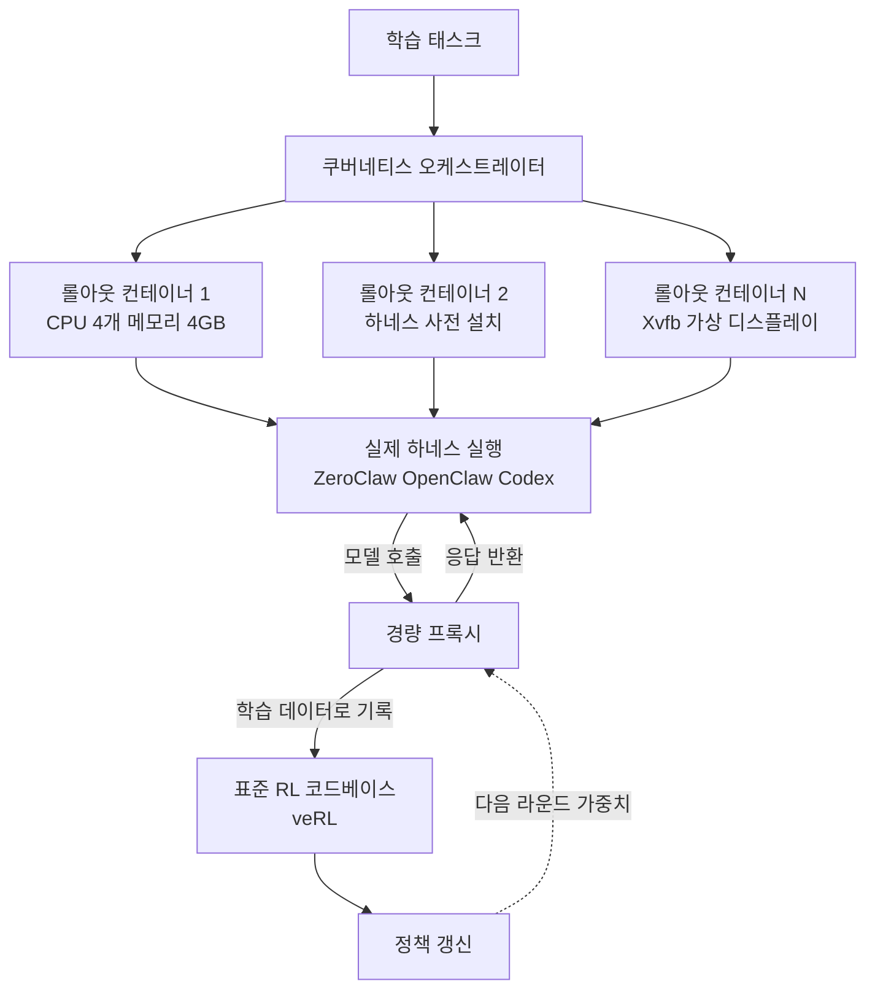

에이전트를 파인튜닝해 보신 분이라면 한 번쯤 겪으셨을 겁니다. 학습은 단순한 ReACT 루프로 시켜 놓고, 실제 배포는 Claude Code나 Codex 같은 복잡한 하네스 위에서 돌리는 상황 말입니다. OpenForgeRL(arXiv 2607.21557)의 결론부터 말씀드리면, 이 불일치는 RL 스택을 통째로 갈아엎지 않고도 프록시 하나와 쿠버네티스 오케스트레이터 하나로 해소할 수 있습니다. 그리고 그렇게 학습한 8B 모델이 태스크 2,500개만으로 훨씬 큰 모델들과 겨룹니다.

## 왜 읽어야 하나

이 글은 에이전트 모델을 직접 후처리 학습시키는 ML 엔지니어와, 사내 에이전트 플랫폼의 학습 인프라를 설계하는 담당자를 위한 글입니다. 핵심 결론은 이렇습니다. 에이전트 성능의 병목은 학습 알고리즘이 아니라, 학습 시점의 실행 환경과 배포 시점의 실행 환경이 다르다는 데 있으며, 그 간극은 하네스 자체를 학습 루프 안으로 끌어들여야 메워집니다. 이 사실을 받아들이면 데이터 수집 전략이 바뀝니다. 더 많은 태스크를 모으는 대신, 실제로 배포할 하네스 안에서 더 적은 태스크를 굴리는 쪽이 이깁니다. 논문은 2,500개 태스크로 20만 개를 쓴 모델을 앞선 사례를 제시합니다.

## 개요

이 논문은 컬럼비아대학교와 다트머스대학, 마이크로소프트 리서치가 함께 썼고 2026년 7월 23일 arXiv에 올라온 뒤 다음 날 개정판이 나왔습니다. 저자는 Xiao Yu와 Baolin Peng을 비롯한 10명이며, 논문 헤더는 ICLR 2027을 향하고 있습니다.

문제 제기는 현장 감각이 뚜렷합니다. 요즘 쓸 만한 에이전트는 전부 정교한 추론 하네스 위에서 돕니다. Claude Code, Codex, OpenClaw 같은 하네스가 멀티턴 추론과 도구 사용, 외부 시스템 접근을 관리합니다. 문제는 이 하네스들이 강력한 만큼 복잡하다는 점입니다. 하네스는 상태를 갖고, 여러 프로세스에 걸쳐 있으며, 내부에서 도구를 호출하고 파일을 만지고 셸을 띄웁니다. 그런데 공개된 SFT와 RL 스택은 이런 형태의 추론을 자기 데이터 모델로 표현하지 못합니다. 대부분의 오픈 RL 코드베이스는 프롬프트를 넣으면 응답이 나오는 단일 프로세스 생성을 전제로 설계되어 있기 때문입니다.

그래서 지금까지의 타협은 두 가지였습니다. 하나는 하네스를 포기하고 단순한 루프로 학습시킨 뒤 배포 때만 복잡한 하네스에 얹는 것입니다. 학습과 배포가 다른 환경이 되니 성능이 새어 나갑니다. 다른 하나는 RL 프레임워크 안에 하네스를 다시 구현하는 것입니다. 구현 비용도 크고, 재구현본은 결국 진짜 하네스와 미묘하게 달라집니다.

OpenForgeRL은 세 번째 길을 냅니다. 하네스를 건드리지 않고, RL 스택도 건드리지 않고, 둘 사이에 통역을 하나 세웁니다.

## 이 연구는 무엇인가

핵심 장치는 두 개입니다.

첫째는 경량 프록시입니다. 하네스는 평소처럼 모델 API를 호출한다고 믿고 동작합니다. 그 호출을 프록시가 받아 응답을 돌려주는 동시에, 주고받은 내용을 학습 데이터 형식으로 기록합니다. 하네스 입장에서는 아무것도 달라지지 않고, RL 코드베이스 입장에서는 자기가 아는 형식의 샘플이 쌓입니다. 학습 백엔드로는 veRL 같은 표준 프레임워크를 그대로 씁니다. 하네스의 복잡성을 RL 스택이 이해할 필요가 없어지는 지점이 여기입니다.

둘째는 쿠버네티스 오케스트레이터입니다. 롤아웃 하나마다 독립된 원격 컨테이너를 띄웁니다. 컴퓨터 유즈 학습의 경우 태스크별 Dockerfile로 이미지를 만들고 대상 하네스를 미리 설치해 두며, 각 파드는 CPU 4개와 메모리 4GB로 상한이 걸립니다. GUI 환경은 Xvfb로 가상 디스플레이를 렌더해서 모델이 마우스 클릭과 키보드 입력으로 화면을 조작하게 합니다. 브라우저 환경에서는 스텔스 브라우저 서비스를 붙였는데, 이것만으로 IP 차단과 캡차 차단 비율이 40퍼센트에서 거의 0으로 떨어졌다고 보고합니다. 실험을 해 보신 분이라면 이 한 줄이 얼마나 큰 실무적 차이인지 아실 겁니다.

롤아웃 격리 구성과 스텔스 브라우저 도입 효과입니다.

이 구조의 이점은 학습과 추론이 완전히 분리된다는 점입니다. 연구자는 에이전트가 실제로 배포될 그 하네스와 그 환경 안에서 곧바로 학습하고 관찰하고 개선할 수 있습니다. 하네스를 바꾸고 싶으면 컨테이너 이미지만 바꾸면 되고, RL 알고리즘을 바꾸고 싶으면 veRL 쪽만 손대면 됩니다.

한 가지 더 눈길을 끄는 세부가 있습니다. OpenClaw와 Codex는 내장 도구가 풍부한 대신 커스텀 도구를 붙이기가 쉽지 않습니다. 연구진은 벤치마크 전용 도구를 이 하네스들에 노출시키기 위해 SKILL.md 파일을 썼습니다. 스킬 문서가 곧 도구 노출 인터페이스로 기능한 것입니다. 스킬 하네스를 운영하는 입장에서는 남 얘기가 아닙니다.

## 실험 결과

두 계열의 모델이 나옵니다.

OpenForge-Claw는 Qwen3-30B-A3B-Thinking을 백본으로 삼은 30B 규모 MoE 모델이며 활성 파라미터는 3B 수준입니다. 표준 ReACT 루프에 더해 ZeroClaw, OpenClaw, Codex 세 하네스에서 학습했습니다. 결과는 ClawEval에서 31.7(pass^3)과 55.9(pass@3), QwenClawBench 33.7, MCPAtlas 28.1입니다.

OpenForge-GUI는 Qwen3-VL-8B-Thinking을 백본으로 한 8B 모델이며, 수정한 Kimi-Agent와 Molmo-Web 하네스에서 학습했습니다. OSWorld-Verified 37.7, Online-Mind2Web 63.0, WebVoyager 72.3을 기록했습니다. 논문은 이 결과가 비슷한 규모의 오픈 베이스라인을 거의 모든 벤치마크에서 앞서고, GUI 설정에서는 몇 배 큰 모델과 대등하거나 이를 넘어선다고 보고합니다.

논문이 보고한 점수와 GUI 학습에 쓰인 태스크 규모입니다. 파란색은 툴 사용 계열, 초록색은 GUI 계열 모델입니다.

가장 인상적인 대목은 데이터 효율입니다. 비교 대상인 MolmoWeb은 20만 개가 넘는 태스크로 학습했는데, OpenForge-GUI는 2,500개만 쓰고도 Online-Mind2Web에서 이를 앞섰고 WebVoyager에서도 경쟁력을 유지했습니다. SFT 단계에서는 더 강한 교사 모델로 태스크당 3회 롤아웃을 돌려 성공한 궤적만 남겼고, Qwen3-Embedding-8B로 유사도 기반 중복 제거를 거쳐 후보 2,500개를 만든 뒤 최종적으로 1,496개 궤적을 증류에 썼습니다. 데이터를 늘리는 대신 데이터가 만들어지는 환경의 충실도를 높인 결과로 읽힙니다.

태스크를 만드는 과정도 눈여겨볼 만합니다. 환경 오류나 지시문의 모호함은 실제로 태스크를 실행해 보기 전에는 잘 드러나지 않습니다. 그래서 연구진은 만들어진 환경 안에서 별도의 오픈 모델을 불러 태스크를 직접 풀어 보게 하는 검증 스크립트를 붙였습니다. 태스크가 애초에 풀 수 있는 것인지, 환경이 제대로 떴는지를 사람이 아니라 실행으로 판정하는 셈입니다. 데이터 품질 게이트를 선언이 아니라 실행으로 닫는다는 점에서, 저희가 강조해 온 검증 원칙과 같은 결입니다.

논문은 벤치마크 너머의 분석도 담았습니다. 하네스 선택이 학습에 미치는 영향을 따로 살폈는데, 어떤 하네스는 다른 하네스보다 학습하기가 확연히 어렵다는 관찰이 나옵니다. 연구진은 정교함이 서로 다른 네 가지 하네스, 즉 ReACT 계열과 ZeroClaw, OpenClaw, Codex 위에서 같은 모델을 평가했습니다. 더 나아가 태스크와 학습 레시피를 동일하게 두고 롤아웃을 만든 하네스만 달리한 두 모델을 비교했습니다. 하나는 ZeroClaw 하나만으로 학습했고, 다른 하나는 ZeroClaw와 OpenClaw와 Codex를 함께 썼습니다. 학습에 쓰지 않은 하네스에서 어떻게 동작하는지를 보려는 설계입니다. 여러 하네스를 섞어 학습하는 것이 일종의 도메인 랜덤화처럼 작동하는지 확인하는 실험이라, 사내에서 하네스를 여러 벌 운영하는 조직에는 직접적인 참고가 됩니다.

행동 수준 분석도 있습니다. SFT만 한 체크포인트와 SFT 뒤 RL을 붙인 체크포인트에서 각각 궤적 100개를 뽑아 비교했더니, RL 이후 모델은 범용 셸 도구를 두드리던 호출을 전용 서비스 도구 호출로 옮기고 자기검증 같은 상위 행동을 늘렸습니다. 도구를 아무거나 잡고 우회하던 습관이 줄고, 하네스가 제공한 정식 경로를 쓰게 됐다는 뜻입니다. 반대로 오류 복구 능력은 RL 이후에도 여전히 취약하다고 명시합니다. 이 솔직한 서술이 논문의 신뢰도를 올립니다.

## ThakiCloud 제품 적용 시사점

이 논문은 저희 두 제품 모두와 맞닿아 있습니다.

논문 구조와 Paxis 제어 평면이 겹치는 지점입니다.

Paxis 관점부터 보겠습니다. Paxis는 ThakiCloud의 Agent-Native Cloud로, Skills와 Tools, Policies, Audit Logs를 일급 리소스로 다루는 제어 평면입니다. 960개가 넘는 스킬을 BM25로 선택해 격리된 샌드박스에서 실행하고, 모든 행동을 정책 게이트와 감사 로그로 통과시킵니다. 논문이 말하는 하네스가 바로 이 스킬 하네스에 해당합니다. 그렇다면 OpenForgeRL의 메시지는 이렇게 번역됩니다. 저희 에이전트를 개선하려고 모델을 따로 학습시킨다면, 그 학습은 실험용 단순 루프가 아니라 Paxis 하네스 안에서 이뤄져야 합니다. 특히 연구진이 커스텀 도구를 SKILL.md로 노출시켰다는 대목은 저희 스킬 포맷이 이미 학습 인터페이스로 쓰일 수 있는 형태라는 뜻이기도 합니다.

ai-platform 관점에서는 인프라 궁합이 좋습니다. 롤아웃마다 독립 컨테이너를 띄우고 파드 단위로 CPU와 메모리 상한을 거는 방식은 저희가 K8s 위에서 학습 워크로드를 오케스트레이션하는 방식과 그대로 겹칩니다. 논문 구현이 특정 퍼블릭 클라우드를 롤아웃 컨테이너 제공자로 썼다는 점도 뒤집어 보면 기회입니다. 온프레미스나 소버린 요구가 있는 고객이라면 롤아웃 컨테이너를 외부 클라우드에 두는 선택지 자체가 막혀 있고, 그때 필요한 것이 저희처럼 자체 클러스터에서 격리 롤아웃과 GPU 큐를 함께 제공하는 플랫폼입니다. 롤아웃은 CPU 파드로 대량 병렬화하고 학습 백엔드만 GPU 큐에 얹는 구성은 자원 효율 측면에서도 합리적입니다.

실무적으로 검토할 항목은 두 가지로 정리됩니다. 첫째, 프록시로 하네스 트래픽을 기록하는 방식은 저희 감사 로그 계층과 상당 부분 겹칩니다. 이미 정책 게이트와 감사 로그를 통과시키고 있으므로, 그 기록을 학습 데이터 형식으로 변환하는 경로를 얼마나 짧게 만들 수 있는지 확인할 가치가 있습니다. 둘째, 롤아웃 격리 수준입니다. 논문은 파드당 CPU 4개와 메모리 4GB라는 소박한 상한으로 돌렸습니다. 저희 클러스터에서 동시 롤아웃 수를 얼마까지 밀 수 있는지는 실제로 재 봐야 알 수 있는 숫자입니다.

## 한계 및 반론

프로덕션에 옮기기 전에 계산해야 할 세 가지입니다.

먼저 이 프레임워크가 모든 문제를 푸는 것은 아닙니다. 논문 스스로 오류 복구 능력이 RL 이후에도 취약하다고 밝힙니다. 자기검증과 도구 커버리지, 다단계 계획 완수는 개선되지만, 실패한 상황에서 빠져나오는 능력은 남는 과제입니다. 에이전트를 실제 업무에 붙이면 가장 아쉬운 지점이 정확히 이 부분이라, 벤치마크 점수만 보고 프로덕션 준비가 됐다고 판단하기는 이릅니다.

둘째, 인프라 비용이 만만치 않습니다. 롤아웃마다 컨테이너를 띄운다는 것은 학습 한 번에 수천 개의 컨테이너를 스케줄링한다는 뜻입니다. 쿠버네티스 클러스터를 운영할 수 있는 조직에는 자연스러운 설계이지만, 단일 GPU 장비로 파인튜닝하던 팀에게는 진입 장벽이 새로 생기는 셈입니다. 이 방법론의 실질적 수혜자는 이미 클러스터를 가진 쪽입니다.

셋째, 하네스 종속성이 남습니다. 하네스 안에서 학습한다는 것은 그 하네스에 맞춰 최적화된다는 뜻이기도 합니다. 논문은 학습에 쓰지 않은 하네스에서의 평가도 다루지만, 하네스가 버전업되면서 도구 구성과 제어 흐름이 바뀔 때 학습된 정책이 얼마나 견디는지는 시간이 지나야 드러날 문제입니다. 하네스를 자주 진화시키는 조직일수록 재학습 주기를 함께 계산해야 합니다.

넷째, 저희가 이 글에서 인용한 수치는 전부 논문이 보고한 값입니다. 저희가 프레임워크를 직접 돌려 재현한 결과가 아닙니다. 비교 대상 베이스라인의 개별 점수는 논문 표에 있으나 이 글에서는 재확인이 가능한 값만 옮겼습니다.

## 정리

OpenForgeRL이 주는 실무 교훈을 한 문장으로 줄이면 이렇습니다. 에이전트 성능을 올리고 싶다면 학습 환경을 배포 환경에 맞추는 일이 알고리즘을 바꾸는 일보다 먼저입니다. 프록시로 하네스의 모델 호출을 가로채 기록하고 쿠버네티스로 롤아웃을 격리하는 두 가지 장치만으로, 기존 RL 스택을 그대로 쓰면서 진짜 하네스 안에서 학습하는 길이 열렸습니다. 그 결과가 태스크 2,500개로 20만 개를 앞서는 데이터 효율입니다.

에이전트 후처리 학습을 검토 중이시라면, 다음 실험에서는 학습 루프를 단순화하는 대신 배포 하네스를 학습 루프 안으로 들여오는 쪽을 먼저 시도해 보시길 권합니다. 그리고 개선 지표를 볼 때 평균 성공률만이 아니라 오류 복구 비율을 따로 떼어 보시길 권합니다. 논문이 정직하게 남겨 둔 그 빈칸이 지금 이 분야에서 가장 값이 나가는 문제입니다.

## 출처

- OpenForgeRL: Train Harness-native Agents in Any Environment, arXiv 2607.21557 (<https://arxiv.org/abs/2607.21557>)
- 논문 HTML 판본 v2, 실험 설정 및 부록 (<https://arxiv.org/html/2607.21557v2>)
