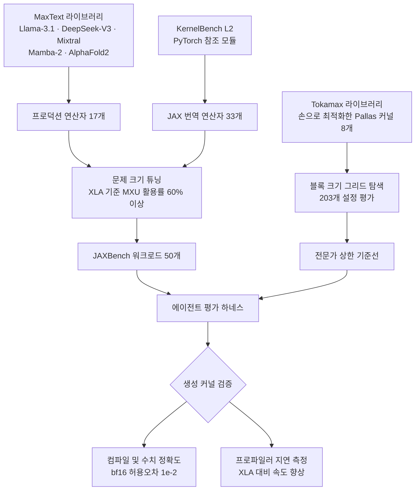

에이전트에게 사내 전용 API나 낯선 DSL을 다루게 해 보신 분이라면 익숙한 장면이 있습니다. 모델이 자신 있게 코드를 써 내려가는데 그 API가 존재하지 않습니다. 컴파일 에러를 돌려줘도 다음 시도에서 비슷한 환각이 반복됩니다. 이럴 때 흔히 내리는 처방은 더 좋은 모델로 갈아타는 것입니다. JAXBench(arXiv 2607.20466)는 그 처방이 대체로 틀렸다는 것을 TPU 커널 생성이라는 극단적인 사례에서 숫자로 보여 줍니다.

> 📄 **심층 리뷰 전문(DOCX)**: 이 논문의 상세 피어리뷰를 [Google Drive에서 다운로드](https://drive.google.com/file/d/1EU6jLRJLbmXHZvz5wvO8BTq7zcLMU6Z4/view)할 수 있습니다.

## 왜 읽어야 하나

이 글은 사내 도구나 자체 DSL 위에서 코딩 에이전트를 돌리려는 플랫폼 엔지니어와, 커널 수준 최적화로 추론 비용을 낮추려는 ML 시스템 담당자를 위해 썼습니다. 핵심 결론은 이렇습니다. 학습 데이터에 희소한 대상을 다룰 때 정확도의 병목은 추론 능력이 아니라 정보이며, 큐레이션된 문서를 컨텍스트에 넣는 편이 모델 등급을 올리는 것보다 더 크게 성능을 끌어올립니다. 논문의 측정값으로 말하면 문서 주입이 샘플당 정확도를 5.8퍼센트에서 37.3퍼센트로 올렸고, 이는 같은 조건에서 모델을 Flash에서 Pro로 올렸을 때의 상승 폭보다 컸습니다. 이 사실을 받아들이면 투자 순서가 바뀝니다. 모델 예산을 늘리기 전에 문서 코퍼스를 정리하는 쪽이 이깁니다.

## 개요

GPU 커널을 LLM으로 자동 생성하고 최적화하는 연구는 지난 몇 년 사이 빠르게 진전했습니다. KernelBench 같은 공통 목표가 생기면서 모두가 같은 언덕을 오르게 됐기 때문입니다. 반면 TPU에는 그런 벤치마크가 없었습니다.

JAXBench는 그 공백을 메우려는 시도입니다. 구글, 하버드, 버클리 소속 연구진 열 명이 참여했고 TPU v6e에서 동작하는 50개 JAX 워크로드로 구성됩니다. 논문은 벤치마크만 내놓는 데 그치지 않고 네 가지 커널 생성 방법을 같은 예산으로 돌려 비교했습니다. 그 비교에서 나온 결론이 이 글의 주제입니다.

TPU가 별도 벤치마크를 필요로 하는 이유부터 짚겠습니다. GPU가 대규모 병렬 SIMT 모델이라면 TPU는 넓은 SIMD 벡터 레지스터를 갖춘 순차 기계입니다. v6e 기준으로 32비트 값에 대해 8 곱하기 128 형태의 벡터 레지스터를 쓰고, 256 곱하기 256 시스톨릭 배열로 된 전용 행렬 곱셈 유닛을 갖습니다. 소프트웨어 스택도 다릅니다. JAX 프로그램은 XLA로 컴파일되고, 저수준 커널을 직접 쓰려면 Pallas를 거쳐 Mosaic 백엔드로 내려갑니다. Triton이 아닙니다.

문제는 여기서 발생합니다. Pallas 커널을 쓰려면 VMEM과 SMEM, HBM 사이의 메모리 계층, 프리페치 스케줄링을 포함한 소프트웨어 파이프라이닝, 블록 형태 제약, 그리고 Mosaic이 강제하는 사전식 그리드 순회 순서를 전부 고려해야 합니다. 그런데 Pallas는 CUDA는 물론 Triton과 비교해도 학습 데이터에 등장하는 빈도가 몇 자릿수 낮습니다. 그래서 GPU 커널을 유창하게 쓰는 모델이 Pallas에서는 존재하지 않는 API를 지어내고, 타입 검사를 통과하지 못하는 메모리 공간 어노테이션을 뱉고, 시스톨릭 타일링 제약을 위반합니다. 일반적인 컴파일 피드백으로는 해결되지 않는 종류의 실패입니다.

## 벤치마크는 어떻게 만들어졌나

JAXBench의 50개 워크로드는 두 갈래에서 왔습니다.

첫 갈래는 MaxText 라이브러리에서 추출한 프로덕션 연산자 17개입니다. Llama-3.1, DeepSeek-V3, Mixtral, Mamba-2, AlphaFold2 같은 실제 아키텍처에서 뽑았습니다. 둘째 갈래는 KernelBench에서 번역한 융합 연산자 33개입니다. Gemini에게 PyTorch 참조 모듈을 주고 관용적인 JAX 구현을 요청한 뒤, 원본과 생성본을 같은 bf16 입력으로 실행해 `jnp.allclose` 기준 허용오차 1e-2 안에서 일치하는지 확인했습니다. 통과하지 못한 워크로드는 재생성하거나 손으로 고쳤습니다.

문제 크기 설정이 특히 중요합니다. KernelBench 원본 크기는 TPU MXU를 채우기에 너무 작습니다. 256 곱하기 256 시스톨릭 배열은 행렬 차원이 커야 활용률이 올라가기 때문입니다. 연구진은 일괄 배율을 곱하는 대신 워크로드마다 자유 차원을 독립적으로 쓸면서, XLA 기준선이 MXU 활용률 60퍼센트 이상에 도달하는 가장 작은 설정을 골랐습니다. 행렬곱 융합 연산자의 경우 배치 4096에 특징 차원 8192 곱하기 8192 bf16 같은 크기가 나왔습니다. 이 작업을 건너뛰면 측정되는 속도 향상이 실제 스케줄링 개선이 아니라 실행 오버헤드 변화를 반영하게 됩니다. 논문은 같은 이유로 선행 연구인 MultiKernelBench를 비판합니다. TPU v2-8에서 너무 작은 문제 크기로 평가했다는 것입니다. 참고로 MultiKernelBench에서 가장 좋은 모델의 Pallas Pass@1은 8.4에서 10.5퍼센트 사이였습니다.

상한선도 마련했습니다. 17개 프로덕션 연산자 중 8개는 Tokamax 라이브러리에 손으로 최적화한 Pallas 구현이 있었습니다. 연구진은 이 커널들의 블록 크기를 TPU v6e에서 전수 탐색으로 튜닝했고, 총 203개 설정을 평가해 Pallas 기본 파라미터 대비 최대 2.79배까지 끌어올렸습니다. 이렇게 튜닝된 커널은 XLA 대비 최대 16.3배 속도 향상을 보였습니다. Ragged Paged Attention이 그 경우였습니다.

## 네 가지 방법과 측정 결과

비교 대상은 네 가지입니다. 첫째는 베스트 오브 N입니다. TPU v6e 프리앰블과 JAX 소스만 주고 독립적인 원샷 완성을 여러 번 받아 그중 맞는 것을 고릅니다. 둘째는 반복 개선으로, 컴파일 에러와 정확도 결과, 프로파일러 요약을 턴 사이에 피드백으로 돌려줍니다. 18개 체인에 체인당 8턴을 돌려 총 144샘플을 씁니다. 셋째는 반복 개선에 Autocomp의 에이전트 컨텍스트를 얹은 변형입니다. 하드웨어 아키텍처 요약, 벤치마크별로 선택된 Pallas API 레퍼런스, 선별된 코드 예제, 규칙 블록을 매 턴 프롬프트 앞에 붙입니다. 탐색 알고리즘은 그대로 두고 문서만 넣은 대조군입니다. 넷째는 Autocomp 자체로, 빔 크기 3에 빔 요소당 후보 6개를 두고 번역 단계 4회와 최적화 단계 4회로 나눈 빔 탐색을 돌립니다.

주 평가는 Gemini 3 Flash로 50개 벤치마크 전체에서 이뤄졌습니다.

| 방법 | XLA 대비 기하평균 | XLA를 이긴 비율 | 정확한 커널 |
|---|---|---|---|
| 베스트 오브 N | 사실상 향상 없음 | 50개 중 1개 | 13/50 |
| 반복 개선 | 1.18배 | 18% | 보고되지 않음 |
| 반복 개선 + 문서 | 1.28배 | 32% | 48/50 |
| Autocomp | 1.36배 | 76% | 45/50 |

이 표에서 가장 중요한 숫자는 속도 향상이 아니라 정확도입니다. 탐색 알고리즘을 전혀 바꾸지 않고 Autocomp의 문서 컨텍스트만 주입했을 때 샘플당 정확도가 5.8퍼센트에서 37.3퍼센트로 올랐습니다. 여섯 배가 넘는 차이입니다.

실패 유형을 보면 이유가 분명합니다. 컨텍스트가 없을 때 베스트 오브 N 샘플의 99.7퍼센트, 반복 개선 샘플의 93.8퍼센트가 컴파일 단계나 첫 실행에서 죽었습니다. Pallas API를 지어내거나 `pallas_call` 인자와 BlockSpec 타입을 잘못 쓴 경우입니다. 문서를 넣어도 API 오용은 여전히 반복 개선의 59.8퍼센트, Autocomp의 55.8퍼센트를 차지했지만, 절대적인 성공 샘플 수가 달라졌습니다.

모델 규모를 올리면 어떨까요. 연구진은 5개 커널 부분집합에서 Gemini 3.1 Pro로 같은 실험을 반복했습니다. 문서 없는 반복 개선은 Flash에서 1.07배였다가 Pro에서 2.43배로 뛰었습니다. 모델 규모의 효과는 분명히 존재합니다. 그런데 같은 5개 커널에서 반복 개선에 문서를 넣으면 Flash로도 1.59배가 나왔고 Pro에서는 3.82배까지 갔습니다. Autocomp는 Flash 2.35배, Pro 3.79배였습니다. 문서 없는 반복 개선은 Pro를 써도 샘플당 정확도가 16.9퍼센트에 머물렀습니다. Flash에서는 1.2퍼센트였습니다.

논문의 표현을 그대로 옮기면, 학습 데이터에 과소 대표된 언어에서 정확도의 병목은 추론이 아니라 정보이며 문서가 부족한 것의 대부분을 공급합니다. 사전식 그리드 순회, VMEM과 SMEM과 HBM 배치, 8 곱하기 128 블록 나누어떨어짐, 프리페치 스케줄링 같은 제약은 에러 메시지에 나타나지 않습니다. 피드백 루프가 반복할 대상 자체가 없는 것입니다.

정확도가 확보된 다음에는 다른 요인이 지배합니다. 문서만 넣은 반복 개선은 50개 중 48개를 풀어 Autocomp의 45개를 앞섰지만, 첫 정답 커널을 넘어 더 밀어붙이지 못해 1.28배에서 멈췄습니다. Autocomp는 번역 단계에 앞부분 예산을 쓰고 정답 씨앗이 생기면 남은 예산을 최적화에 몰아 1.36배에 도달했습니다. 정확도를 성능으로 바꾸는 것은 탐색 구조라는 뜻입니다. 다만 이 격차는 모델이 충분히 강해지면 좁아집니다. Pro에서는 두 방법이 3.82배와 3.79배로 사실상 같아졌습니다.

전문가 커널과의 비교도 있습니다. 손으로 튜닝한 Tokamax 커널 8개는 XLA 대비 기하평균 2.08배였습니다. Autocomp는 같은 8개에서 1.60배로 전문가 성능의 약 77퍼센트에 도달했고 2개 커널에서는 Tokamax를 넘어섰습니다. 다만 페이지드 어텐션과 래그드 어텐션에서는 정확한 커널을 만들지 못했습니다. 손으로 짠 스케줄링이 가장 크게 작용하는 지점입니다.

## ThakiCloud 제품 적용 시사점

이 논문은 저희에게 두 방향으로 읽힙니다.

먼저 ai-platform 관점입니다. ThakiCloud의 ai-platform은 쿠버네티스 위에서 고객 환경에 모델을 서빙하고 Kueue로 GPU를 큐잉합니다. JAXBench의 로프라인 분석에서 눈에 띄는 대목은 행렬곱 융합 커널과 선형 및 MoE 커널이 XLA 컴파일만으로도 이미 MXU 활용률 60에서 95퍼센트에 도달한다는 사실입니다. 컴파일러가 잘하는 영역에서는 손으로 커널을 짜도 남는 여유가 크지 않습니다. 반대로 남은 여유는 어텐션 계열, 특히 메모리 대역폭에 묶인 연산에 몰려 있습니다. 논문은 Llama-3.1-405B의 GQA 그룹 계수 16을 근거로 래그드 페이지드 어텐션의 연산 강도 상한이 16 FLOP/바이트이며 이는 v6e의 능선점인 약 560과 비교하면 한참 아래라고 정리합니다. 컨텍스트 길이를 아무리 늘려도 이 연산은 대역폭에 묶인다는 뜻입니다. 서빙 최적화 예산을 어디에 쓸지 판단할 때 이 구분은 그대로 쓸 수 있습니다. 컴파일러가 이미 채우고 있는 곳이 아니라, KV 캐시 재사용 구조가 상한을 만드는 곳을 봐야 합니다.

다음은 Paxis 관점입니다. Paxis는 ai-platform 위에서 도는 ThakiCloud의 Agent-Native Cloud 제어 평면으로, Skills와 Tools, Policies, Audit Logs를 일급 리소스로 다룹니다. 이 논문의 핵심 발견은 저희 스킬 하네스 설계의 근거와 정확히 같은 문장입니다. Paxis는 960개가 넘는 스킬을 BM25로 골라 격리 샌드박스에서 실행하는데, 스킬이란 결국 특정 작업에 필요한 절차와 제약, 실패 사례를 모아 둔 큐레이션된 문서입니다. 에이전트가 사내 API나 내부 DSL을 다룰 때 저희가 모델 등급을 올리는 대신 스킬을 다듬어 온 이유를 이 논문이 통제된 실험으로 뒷받침합니다. 특히 Autocomp가 문서를 하드웨어 요약, API 레퍼런스, 코드 예제, 규칙 블록의 네 조각으로 나눠 프롬프트 앞에 붙인다는 점은 시사적입니다. 문서를 통째로 밀어 넣는 것이 아니라 벤치마크마다 필요한 조각을 골라 붙였고, 그 선택을 캐시했습니다. 검색으로 스킬을 고르고 필요한 부분만 컨텍스트에 얹는 구조와 같은 발상입니다. 반대로 이 논문은 저희에게 숙제도 남깁니다. 문서만으로는 55에서 60퍼센트대의 API 오용이 남았고, 그것을 성능으로 바꾼 것은 탐색 구조였습니다. 스킬 품질과 별개로 반복 구조와 종료 게이트를 어떻게 설계하느냐가 남은 절반이라는 뜻입니다.

## 한계 및 반론

논문 스스로 밝히는 한계가 분명합니다. 50개 워크로드 전부가 TPU v6e 단일 칩에서 돌고 멀티 칩 샤딩과 집합 통신은 범위 밖입니다. 실제 프로덕션 학습과 추론은 거의 언제나 여러 칩에 걸쳐 있고, 그때 성능은 샤딩 전략과 집합 스케줄링, 통신과 연산의 중첩에 좌우됩니다. 문서와 탐색을 분리해서 본 이번 결론이 `shard_map`이나 `all_to_all` 같은 집합 원시 연산으로 일반화되는지는 아직 모릅니다. 오히려 이 영역은 Pallas보다도 사전 학습 데이터에 더 희소합니다.

모델 규모 실험의 범위도 작습니다. Gemini 3.1 Pro 평가는 5개 커널에 한정됐고 논문도 이를 주 결과가 아니라 통제된 대조 실험으로 제시합니다. 5개 커널에서 두 방법이 수렴했다는 관찰은 예비적입니다.

가장 강한 반론은 일반화 범위에 관한 것입니다. Pallas는 학습 데이터 희소성이 극단적인 사례입니다. 컨텍스트가 모델 규모를 이긴다는 결론이 파이썬이나 타입스크립트처럼 데이터가 풍부한 영역에서도 성립할 이유는 없습니다. 실제로 문서 없는 반복 개선이 Flash에서 Pro로 갈 때 1.07배에서 2.43배로 뛴 것은 모델 규모가 여전히 강력한 지렛대라는 증거이기도 합니다. 이 논문의 교훈은 컨텍스트가 언제나 이긴다가 아니라, 대상이 희소할수록 정보 격차가 지배적인 병목이 된다는 조건부 명제로 읽는 편이 정확합니다.

또 하나, 이 결과는 어디까지나 커널 생성이라는 특수한 작업에서 나왔습니다. 정답 판정이 컴파일과 수치 비교로 자동화되고 성능이 프로파일러로 측정되는, 피드백이 결정론적인 환경입니다. 판정이 모호한 작업에서 같은 방법론이 통할지는 별도 문제입니다.

## 정리

JAXBench가 남긴 숫자는 단순합니다. 탐색 알고리즘을 그대로 두고 큐레이션된 TPU 문서만 컨텍스트에 넣었더니 샘플당 정확도가 5.8퍼센트에서 37.3퍼센트가 됐고, 같은 조건에서 모델을 올렸을 때의 효과보다 컸습니다. 그리고 정확도가 확보된 다음에는 탐색 구조가 그것을 1.28배에서 1.36배로, 전문가 커널 대비 77퍼센트 수준으로 바꿔 놓았습니다.

사내 에이전트를 운영하는 입장에서 가져갈 행동은 명확합니다. 에이전트가 우리 API에서 헤맬 때 모델 예산을 올리기 전에 두 가지를 먼저 하십시오. 하나는 그 API의 제약과 실패 사례를 문서로 정리해 컨텍스트에 붙이는 일이고, 다른 하나는 정답이 나온 뒤 그것을 개선으로 밀어붙이는 반복 구조를 만드는 일입니다. 논문의 측정에 따르면 앞의 것이 정확도를, 뒤의 것이 성능을 담당합니다. 둘 다 모델을 바꾸는 것보다 싸고, 실험이 보여 준 효과는 더 컸습니다.

## 출처

- [JAXBench: Benchmarking Autonomous TPU Kernel Optimization (arXiv 2607.20466)](https://arxiv.org/abs/2607.20466)
- [Tokamax: A GPU and TPU kernel library (openxla/tokamax)](https://github.com/openxla/tokamax)
- [Autocomp: Optimize any AI kernel, anywhere (ucb-bar/autocomp)](https://github.com/ucb-bar/autocomp)

> 📄 **심층 리뷰 전문(DOCX)**: 이 논문의 상세 피어리뷰를 [Google Drive에서 다운로드](https://drive.google.com/file/d/1EU6jLRJLbmXHZvz5wvO8BTq7zcLMU6Z4/view)할 수 있습니다.
