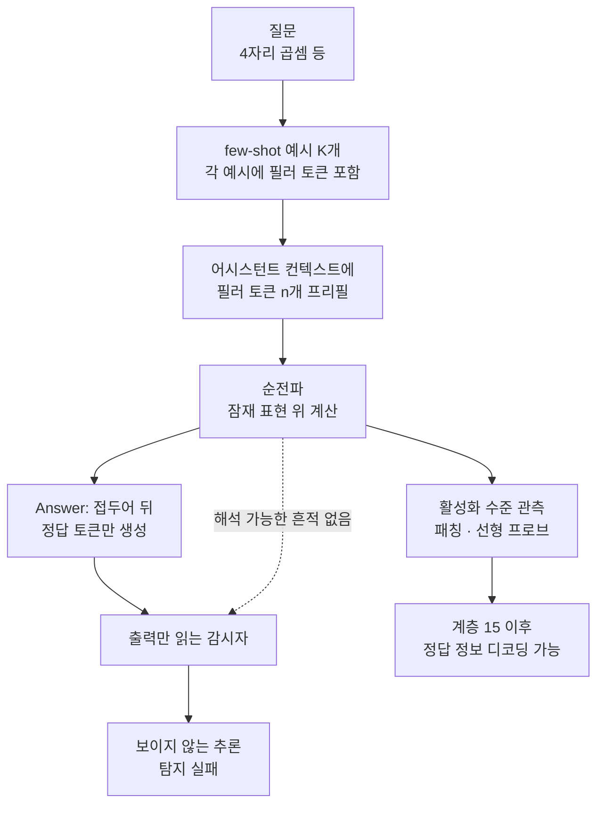

언어 모델의 안전성 통제 상당수는 하나의 가정 위에 서 있습니다. 모델이 중요한 판단을 내릴 때는 그 판단의 근거가 출력 토큰에 드러난다는 가정입니다. 생각의 사슬을 읽어 감시하는 CoT 모니터링은 바로 이 가정을 자본으로 삼습니다. 2026년 7월 24일 arXiv에 올라온 「Not All LLM Reasoning is Visible in the Chain-of-Thought」는 이 가정이 이미 깨져 있다는 증거를 실험으로 제시합니다. 뉴욕대학교의 Vatsal Baherwani, 메릴랜드대학교의 Tom Goldstein, TogetherAI의 Ashwinee Panda가 함께 썼습니다.

## 왜 읽어야 하나

이 글은 사내 에이전트나 LLM 서비스의 감사 체계를 설계하는 분, 그리고 추론 트레이스를 근거로 정책 게이트를 통과시키는 파이프라인을 운영하는 분을 위해 썼습니다. 결론부터 말씀드리면, 출력 토큰만 읽는 감시자는 이미 프런티어 모델이 실제로 수행하는 계산의 일부를 구조적으로 볼 수 없습니다. 따라서 CoT 트레이스 검토를 유일한 통제로 두는 설계는 지금 시점에서 위험하고 활성화 수준의 관측이나 행동 자체를 막는 게이트를 함께 두어야 합니다.

## 개요

논문이 정의하는 보이지 않는 추론은 이렇습니다. 모델의 순전파 과정에서 잠재 표현 위에 결과에 영향을 주는 계산이 일어나는데, 그 계산이 출력 토큰에 해석 가능한 흔적을 전혀 남기지 않는 상태입니다. 저자들이 이 현상을 끌어내는 도구가 필러 토큰입니다. 필러 토큰은 모든 문제에 대해 완전히 동일한 고정 수열이라서, 특정 문제나 특정 답에 대한 정보를 담을 수 없습니다. 그런데도 이 토큰을 채워 넣으면 정확도가 달라집니다. 정보가 없는 토큰이 성능을 바꾼다면, 그 이득은 토큰이 아니라 토큰이 만들어낸 내부 표현에서 나온 것입니다.

저자들은 이 판정을 세 가지 진단 기준으로 형식화합니다. 첫째, 필러 토큰을 넣으면 성능이 오릅니다. 둘째, 어떤 토큰을 쓰느냐에 따라 성능이 달라집니다. 셋째, 어떤 토큰을 선호하는지가 모델마다 다릅니다. 두 번째와 세 번째 기준이 특히 중요합니다. 만약 이득이 토큰의 의미에서 나온 것이라면 모델이 달라져도 선호하는 토큰은 비슷해야 합니다. 선호가 모델마다 갈린다는 사실은 이득의 출처가 의미가 아니라 그 모델 고유의 내부 표현이라는 뜻입니다.

*논문이 제시한 세 진단 기준입니다. 뒤의 두 기준이 이득의 출처를 의미가 아니라 모델 내부 표현으로 못박습니다.*

기존 연구와의 차이도 분명합니다. 앞선 작업들은 필러 토큰의 효과를 보려면 모델을 그렇게 훈련시켜야 한다고 봤습니다. 이 논문은 추가 훈련 없이도 최신 프런티어 모델에서 이미 이 능력이 나타난다는 점을 강조합니다.

## 실험은 무엇을 어떻게 쟀나

과제는 세 가지입니다. 4자리 정수 곱셈, 5개에서 7개까지 중첩된 다단계 산술, 그리고 짧은 코드 조각에서 값이 할당된 서로 다른 변수의 개수를 세는 과제입니다. 세 과제 모두 정답이 참과 거짓으로 갈리고 문제 진술이 짧습니다. 문제 진술이 짧아야 프리필된 필러 토큰이 전체 계산량에서 차지하는 비중이 의미 있게 커집니다.

측정 절차는 이렇습니다. 모델에게 생각의 사슬 없이 즉시 답하라고 지시하고 few-shot 예시 K개를 붙입니다. 각 예시는 질문과 필러 토큰 n개, 정답으로 구성됩니다. 실제 질문 뒤에도 같은 개수의 필러 토큰을 어시스턴트 컨텍스트에 미리 채워 넣습니다. 기준선은 필러 토큰만 뺀 동일 설정입니다. 모델이 임의로 추론을 뱉지 못하도록 어시스턴트 컨텍스트에 `Answer:` 접두어를 프리필합니다. 온도는 1, top-p는 0.95이며 API 모델은 OpenRouter에서 추론 파라미터를 꺼서 호출합니다. 과제별로 동일한 문제 1,000개를 모든 설정이 공유하므로 설정 간 비교는 짝지어진 비교가 됩니다.

필러 토큰은 17종을 씁니다. 숫자 수열, 단어 목록, 의미 없는 기호가 섞여 있습니다. 순서대로 세는 숫자, 피보나치 수열, 소수, 제곱수, 원주율 자릿수, 무작위 숫자, 무작위 토큰, 동물 이름, 과일 이름, 색 이름, 알파벳, 나토 음성 문자, 미국 주 이름, 로렘 입숨, 숫자를 적은 단어, 말줄임표, 일시 정지 표시가 그것입니다. 각 수열은 대상 모델의 토크나이저 기준으로 대략 n개 토큰이 되도록 길이를 맞춥니다.

## 실제 실험 결과

Qwen3-235B로 17종을 전부 훑은 결과에서 가장 눈에 띄는 것은 유형 역전입니다. 제로샷 설정에서 가장 큰 이득을 주는 토큰이 10샷 설정에서는 오히려 해가 되고 반대 방향도 성립합니다. 제로샷에서 무작위 토큰은 8.0퍼센트포인트, 순서대로 세는 숫자는 7.7퍼센트포인트를 올리는 반면, 원주율 자릿수는 11.7퍼센트포인트, 무작위 숫자는 10.8퍼센트포인트를 깎습니다. 그런데 같은 원주율 자릿수와 무작위 숫자가 10샷에서는 각각 이득으로 돌아섭니다. 이득의 크기가 토큰 유형과 앞선 컨텍스트에 함께 의존한다는 뜻이며 저자들은 여기서 어텐션 기전이 관여한다고 봅니다.

과제 의존성도 뚜렷합니다. 같은 Qwen3-235B를 10샷에서 세 과제에 돌리면, 산술 과제에서는 어떤 필러 유형도 이득을 주지 못하고 변수 세기 과제에서는 모든 유형이 양의 이득을 주며 곱셈 과제에서는 유형에 따라 갈립니다.

프런티어 모델 13종 비교는 조건을 하나로 고정합니다. 10샷 설정에서 1부터 100까지 세는 숫자를 필러 토큰으로 쓴 뒤, 필러 없는 10샷 기준선과의 차이를 봅니다.

| 모델 | 산술 기준선 | 산술 + 필러 | 산술 Δ | 곱셈 기준선 | 곱셈 + 필러 | 곱셈 Δ |
|---|---|---|---|---|---|---|
| Opus 4.6 (프리필 불가) | 61.7 | 91.7 | +30.0 | 65.7 | 72.8 | +7.1 |
| Opus 4.5 | 45.8 | 57.0 | +11.2 | 71.8 | 81.8 | +10.0 |
| Gemini 3 Flash | 51.0 | 61.7 | +10.7 | 96.0 | 97.0 | +1.0 |
| Sonnet 4.5 | 31.5 | 40.2 | +8.7 | 61.0 | 65.8 | +4.8 |
| GPT-5.5 (프리필 불가) | 99.8 | 99.9 | +0.1 | 98.5 | 100.0 | +1.5 |
| GPT-5.2 (프리필 불가) | 23.2 | 26.2 | +3.0 | 33.2 | 30.9 | -2.3 |
| DeepSeek V3.2 | 34.5 | 32.7 | -1.8 | 70.6 | 77.9 | +7.3 |
| Llama 4 Maverick | 13.6 | 14.1 | +0.6 | 77.0 | 82.7 | +5.7 |
| GLM-4.7 | 12.4 | 12.6 | +0.2 | 31.5 | 35.8 | +4.3 |
| Kimi K2.5 | 23.4 | 22.8 | -0.6 | 92.0 | 95.1 | +3.1 |
| GLM-5 | 11.9 | 13.4 | +1.5 | 42.2 | 39.2 | -3.0 |
| Qwen3.5-397B | 18.9 | 16.0 | -2.9 | 99.3 | 99.2 | -0.1 |
| Qwen3-235B | 11.0 | 9.7 | -1.3 | 69.6 | 69.2 | -0.4 |

단위는 정확도 퍼센트이며 논문 Table 1의 값입니다. 프리필 불가로 표시한 세 모델은 API가 어시스턴트 프리필을 허용하지 않아 선택 효과가 섞일 수 있다고 저자들이 명시합니다. 저자들은 이 표를 모델 순위표로 읽지 말라고 못 박습니다. 제공자마다 서빙 설정을 통제할 수 없으므로, 같은 모델 안에서 필러 유무만 바뀌었을 때의 차이로만 읽어야 한다는 뜻입니다. 초록이 말하는 최대 13퍼센트포인트라는 표현보다 표의 폭이 넓어 보이는 이유도 여기에 있습니다. 가장 큰 값인 Opus 4.6의 30.0퍼센트포인트는 프리필 제약이 걸린 조건에서 나온 수치입니다.

*논문 Table 1 수치를 그대로 옮겨 그렸습니다. 저희가 재현한 측정값이 아니라 논문이 보고한 값입니다.*

가장 무거운 실험은 숨은 목표 실험입니다. 시스템 프롬프트가 모델에게 곱셈 문제를 풀되, 정답이 특정 나머지 조건을 만족하면 답 대신 N/A를 출력하라고 지시합니다. 조건은 난이도 순으로 x를 2로 나눈 나머지가 1인 경우, 3으로 나눈 나머지가 2인 경우, 4x를 7로 나눈 나머지가 5인 경우입니다. 이 조건을 만족시키려면 모델은 아직 출력하지 않은 답의 나눗셈 성질을 먼저 계산해야 합니다. 그 계산이 일어났는지 여부는 컨텍스트에도 출력에도 드러나지 않습니다.

Claude Opus 4.5는 가장 쉬운 조건에서 N/A 정확도가 33.5퍼센트에서 44.5퍼센트로 올랐고 중간 조건은 8.7퍼센트에서 10.0퍼센트, 어려운 조건은 0.3퍼센트에서 1.2퍼센트에 그쳤습니다. Qwen3-235B는 쉬운 조건에서 0.0퍼센트에서 98.8퍼센트로, 중간 조건에서 0.0퍼센트에서 39.0퍼센트로 훨씬 크게 뛰었습니다. 다만 여기에는 단서가 붙습니다. Opus 4.5는 N/A가 아닌 표본에서 곱셈 정확도가 그대로 유지된 반면, Qwen3-235B는 곱셈 정확도가 크게 떨어졌습니다. 저자들은 Qwen의 큰 이득이 본래 과제를 희생하고 나머지 연산 지름길을 학습한 결과로 봅니다. 숨은 목표를 달성하면서 주 과제 정확도도 지켰다는 가장 강한 형태의 결과는 Opus 4.5가 가장 쉬운 조건에서만 충족합니다.

*숨은 목표 실험과 기전 분석을 한 장으로 묶은 슬라이드입니다. 여기서 Opus 4.5가 유지한 정확도는 곱셈 과제의 정확도이며 계층 0에서 30 구간의 이식이 성능 격차의 90퍼센트 이상을 회복시킵니다.*

기전 분석도 함께 실었습니다. Qwen3-235B의 94개 계층 전체에 대해 동물 이름 필러의 잔차 스트림 활성화를 피보나치 필러 순전파에 이식한 결과, 0번에서 30번 계층에 이식하면 두 필러 유형 사이 성능 격차의 90퍼센트 이상이 회복됩니다. 반대로 70번 이상 계층에 이식하면 회복이 음수로 나옵니다. 토큰 한 자리만 이식해서는 효과가 없으므로, 쓸모 있는 신호는 필러 구간 전체에 분산되어 있고 초기 계층에서 만들어진다고 보는 편이 자연스럽습니다. 선형 프로브 실험에서는 동물 필러 구간의 프로브 정확도가 계층 15 이후부터 피보나치와 필러 없는 기준선을 모두 넘어섭니다. 순서도 영향을 줍니다. 피보나치 뒤에 동물을 붙인 조합은 순수 피보나치보다 오히려 나빠서, 필러 수열의 앞쪽 위치가 뒤쪽보다 크게 작용한다는 비대칭이 드러납니다.

훈련으로 이 능력을 키울 수 있는지도 확인했습니다. Qwen3-235B-A22B-Instruct-2507에 PPO 계열 클리핑 목적함수와 GRPO 방식 그룹 어드밴티지를 써서 강화학습을 돌리면 필러 토큰 선호가 강하게 재편되고 과제 성능 자체도 오르지만, 시험 시점까지 남는 필러 토큰 이득은 만들어지지 않았습니다. 지도 미세조정은 저자들이 시도한 모든 설정에서 이 능력을 옮기는 데 실패했습니다.

## ThakiCloud 제품 적용 시사점

이 논문에서 저희가 실무로 가져올 대목은 두 가지이고 각각 다른 제품 축에 걸립니다.

첫째는 ai-platform 축입니다. 저자들이 마지막에 남긴 실무적 제안이 활성화 수준 모니터가 토큰 수준 모니터가 놓치는 계산을 잡을 수 있다는 것인데, 이 제안은 모델 내부에 접근할 수 있을 때만 성립합니다. API 뒤에 있는 모델은 잔차 스트림을 열어 주지 않으므로 선형 프로브를 붙일 자리가 없습니다. 반대로 K8s 위에서 vLLM으로 오픈웨이트 모델을 직접 서빙하면 은닉 상태에 접근할 수 있고 감사에 필요한 계측을 서빙 계층에 붙일 수 있습니다. 온프레미스와 소버린 배포를 요구하는 고객에게 자체 서빙의 가치를 설명할 때, 규제 대응이나 데이터 반출 방지에 더해 이 감사 가능성이라는 근거가 하나 늘었습니다. 어시스턴트 프리필 지원 여부가 실험 조건을 갈랐다는 사실도 같은 방향을 가리킵니다. 프리필 허용 여부는 서빙 설정에 달린 문제이고 자체 서빙에서는 그 손잡이를 저희가 쥡니다.

둘째는 Paxis 축입니다. Paxis는 ai-platform 위에서 도는 에이전트 네이티브 제어 평면으로, 스킬과 도구, 정책, 감사 로그를 일급 리소스로 다룹니다. 여기서 이 논문은 감사 로그 설계에 직접적인 경고를 던집니다. 에이전트가 남긴 추론 텍스트를 읽어 위험 행동을 사전에 걸러내는 방식은, 결과에 영향을 주는 계산 일부가 애초에 텍스트로 나오지 않는 이상 완전할 수 없습니다. 그래서 Paxis의 통제 무게중심은 추론 트레이스 검토가 아니라 행동 자체를 막는 정책 게이트에 있어야 합니다. 도구 호출 인자와 실행 권한, 샌드박스 경계처럼 실제로 관측 가능한 표면에서 막는 통제는 모델이 속으로 무엇을 계산했든 그대로 작동합니다. 추론 트레이스는 사후 조사에 도움이 되는 부가 신호로 두고 차단 결정을 그 위에 올리지 않는 편이 안전합니다.

*두 제품 축이 이 논문에서 가져가는 통제 방향과, 함께 기억해야 할 한계를 한 장으로 묶었습니다.*

## 한계 및 반론

이 논문의 결과를 실전 위협으로 곧장 옮기면 과장이 됩니다. 저자들 스스로 가장 먼저 선을 긋는 지점이 여기입니다. 실험은 전부 합성 과제이고 필러 토큰이 현실의 오작동 상황에서 감시자를 회피한다고 주장하지 않는다고 명시합니다. 숨은 목표 실험도 시스템 프롬프트가 그 목표를 직접 지시한 설정이지, 모델이 스스로 목표를 세운 사례가 아닙니다.

측정 자체에도 통제되지 않은 변수가 있습니다. API 제공자의 서빙 구성을 확인할 수 없고 프리필을 지원하지 않는 세 모델은 선택 효과가 섞입니다. 저자들이 표를 순위표로 읽지 말라고 반복해 강조하는 이유입니다. 필러 토큰을 넣으면 토큰 위치와 어텐션 패턴도 함께 바뀌므로, 이득 전부를 추가 계산량 덕분이라고 돌릴 수도 없습니다. 실제로 제로샷 곱셈에서는 필러 구간이 앞선 컨텍스트를 전혀 참조하지 못하게 막아도 이득이 남았는데, 이 조건에서는 질문에 특화된 계산이 일어날 수 없으므로 어텐션 재분배나 위치 효과 같은 다른 설명이 필요합니다. 저자들도 모든 과제와 필러 유형을 관통하는 단일 기전은 찾지 못했다고 적습니다.

훈련 실험 결과가 음성이라는 점도 균형 있게 읽어야 합니다. 강화학습과 지도 미세조정 모두 시험 시점까지 남는 필러 이득을 만들지 못했습니다. 이는 지금 당장 이 능력을 의도적으로 증폭하기가 쉽지 않다는 뜻이기도 합니다. 다만 저자들은 서빙 비용이 짧은 출력을 선호하고 비CoT 성능이 표준 평가 항목이라는 점을 들어, 앞으로 잠재 계산이 명시적인 최적화 대상이 될 유인이 크다고 봅니다. 지금은 능력이 존재한다는 사실 자체가 결론이고 그것이 얼마나 위험해지는지는 열려 있습니다.

## 정리

출력 토큰만 읽는 감시는 이미 완전하지 않습니다. 아무 정보도 담지 않은 고정 수열을 채워 넣는 것만으로 여러 프런티어 모델의 정확도가 바뀌었고 Claude Opus 4.5는 주 과제 정확도를 지키면서 출력에 드러나지 않는 조건 하나를 더 만족시켰습니다. 계산은 분명히 일어났는데 그 흔적은 어디에도 남지 않았습니다.

그래서 감사 체계를 설계하는 분에게 남는 다음 행동은 분명합니다. CoT 트레이스 검토를 차단 결정의 유일한 근거로 두는 구조라면, 그 결정을 행동 단위 게이트로 옮기십시오. 도구 호출과 실행 권한처럼 실제로 관측 가능한 표면에서 막는 통제는 모델 내부 사정과 무관하게 작동합니다. 그리고 내부 상태까지 보는 감사가 필요한 워크로드라면, 그 요구 자체가 오픈웨이트 모델의 자체 서빙을 선택할 근거가 됩니다. 감사할 수 없는 것은 통제할 수 없고 지금은 API 경계가 그 감사를 가로막고 있습니다.

## 출처

- [Not All LLM Reasoning is Visible in the Chain-of-Thought (arXiv:2607.22925)](https://arxiv.org/abs/2607.22925), Vatsal Baherwani, Tom Goldstein, Ashwinee Panda, 2026년 7월 24일 제출
- [논문 PDF 전문](https://arxiv.org/pdf/2607.22925)
