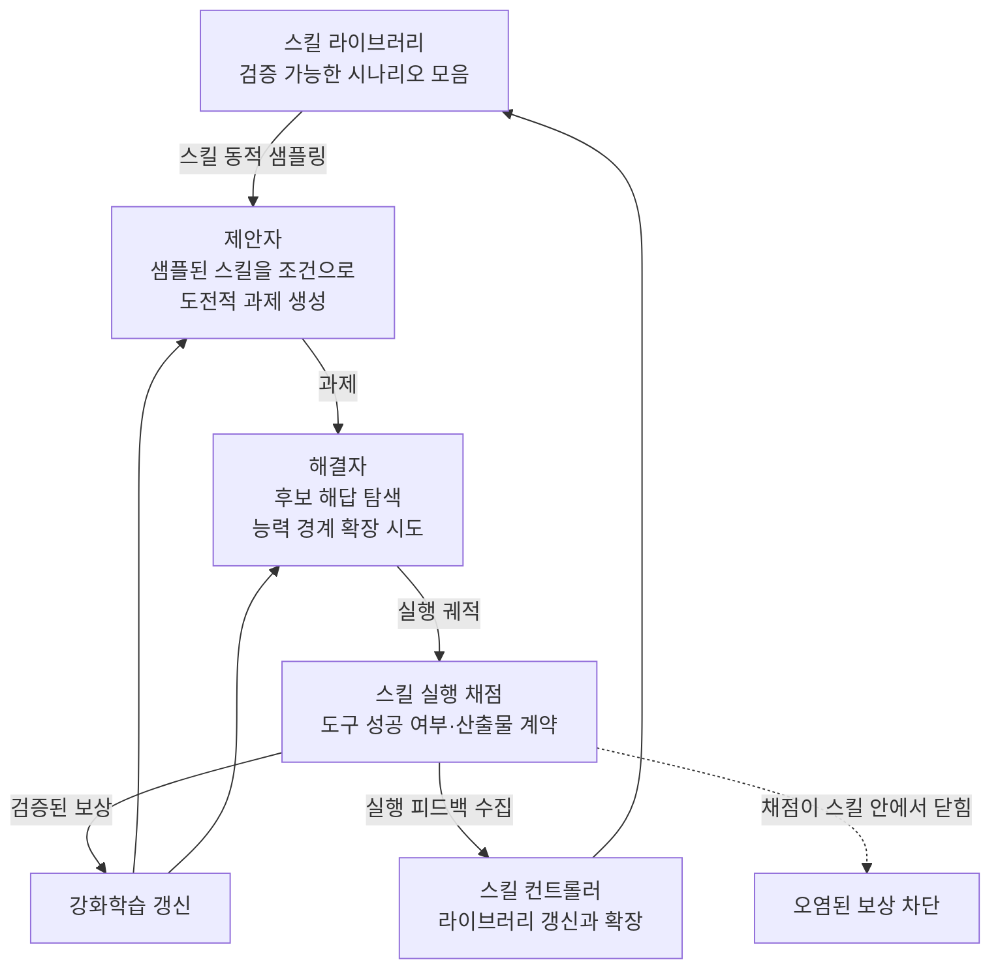

모델이 스스로 문제를 만들어 스스로 풀며 늘어나는 방식은 매력적이지만 오래된 약점이 하나 있습니다. 채점을 믿을 수 없다는 것입니다. 2026년 7월 24일에 arXiv에 올라온 Alibaba Qwen 팀의 논문은 이 약점을 정면으로 다루면서, 해법을 조금 예상 밖의 곳에서 가져옵니다. 에이전트 스킬입니다.

*글의 핵심 개념을 형상화했습니다.*

## 왜 읽어야 하나

이 글은 에이전트 학습 파이프라인을 설계하는 ML 엔지니어와, 사내 스킬 자산을 어떻게 자산으로 굴릴지 고민하는 플랫폼 담당자를 위해 썼습니다. 결론부터 말씀드리면, 이 논문의 기여는 새로운 자기대전 알고리즘이 아니라 스킬을 학습 신호의 단위로 재정의한 것입니다. 스킬 하나가 실행 가능한 좁은 시나리오를 정의하기 때문에 그 안에서는 채점이 신뢰할 만하고, 스킬 사이를 옮겨 다니면 과제는 계속 새로워집니다. 그 결과 자기진화 학습이 오래 감내해 온 다양성과 검증 사이의 교환 관계가 완화됩니다. 스킬을 이미 일급 자산으로 운용하는 조직이라면 이 논문은 그 자산이 런타임 도구를 넘어 학습 데이터 발생기로도 쓰일 수 있다는 신호로 읽으셔야 합니다.

<!-- nlm-visual -->

*NotebookLM이 소스를 종합해 생성한 인포그래픽입니다.*

## 개요

논문 제목은 `Skill Self-Play: Pushing the Frontier of LLM Capability with Co-Evolving Skills`이고 arXiv 식별자는 2607.22529입니다. 제안하는 프레임워크의 이름은 Skill Self-Play이며 줄여서 Skill-SP로 씁니다.

구성 요소는 셋입니다. 과제를 만드는 제안자, 그 과제를 푸는 해결자, 그리고 스킬 라이브러리를 관리하는 동적 스킬 컨트롤러입니다. 세 요소는 분리된 단계가 아니라 하나의 강화학습 자기대전 루프 안에서 함께 진화합니다. 논문의 표현을 그대로 옮기면 공진화입니다.

핵심 주장은 다음과 같습니다. 기존 자기진화 방법들은 과제 다양성과 검증 신뢰성 사이에서 근본적인 딜레마에 놓여 있고, 에이전트 스킬이 그 둘을 화해시키는 강력한 중간 지대가 된다는 것입니다.

## 이 연구가 푸는 문제

자기진화 학습을 구현하는 방식은 크게 두 갈래였습니다. 각 갈래가 하나씩 포기합니다.

첫째는 환경에 묶는 방식입니다. 코드 실행기나 수학 검증기, 게임 시뮬레이터처럼 정답을 기계적으로 판정할 수 있는 환경 안에 학습을 가둡니다. 피드백은 정확합니다. 컴파일이 되는지, 테스트가 통과하는지, 증명이 성립하는지가 명확하게 갈립니다. 대신 학습이 그 환경의 경계 안에 갇힙니다. 좁은 도메인에서만 늘어납니다.

둘째는 열린 자기생성 방식입니다. 모델이 자유롭게 과제를 만들어 냅니다. 과제 공간은 넓어집니다. 그런데 자유롭게 만든 과제의 정답을 누가 판정하느냐는 문제가 남습니다. 모델이 자기 답을 채점하면 오답을 정답으로 승인하는 일이 생기고, 그 잘못된 보상이 학습 루프 안으로 흘러 들어갑니다. 논문은 이것을 오해를 낳는 보상이 학습 루프를 오염시킨다고 표현합니다. 이 오염은 조용히 누적되기 때문에 특히 다루기 어렵습니다.

정리하면 정확한 채점을 얻으면 좁아지고, 넓은 과제를 얻으면 채점을 믿을 수 없게 됩니다. 이 교환 관계를 어느 쪽으로도 완전히 이기지 못한 것이 그동안의 상태였습니다.

두 갈래가 서로 반대쪽을 포기하는 구도입니다.

## 스킬이 왜 중간 지대인가

Skill-SP의 통찰은 이 딜레마가 과제의 문제가 아니라 과제를 담는 단위의 문제였다고 보는 것입니다.

에이전트 스킬 하나를 떠올려 보시면 됩니다. 스킬은 보통 특정 시나리오를 처리하는 절차입니다. 무엇을 입력으로 받고, 어떤 도구를 어떤 순서로 부르고, 무엇을 산출하는지가 정의되어 있습니다. 즉 스킬은 그 자체로 실행 가능한 좁은 환경입니다. 스킬 안에서 만들어진 과제는 그 스킬의 실행 결과로 채점할 수 있습니다. 도구가 성공했는지, 산출물이 계약을 만족하는지가 판정 가능합니다. 첫째 갈래의 장점인 검증 신뢰성이 여기서 확보됩니다.

동시에 스킬은 하나가 아닙니다. 라이브러리에 수십, 수백 개가 있고 서로 다른 도메인을 덮습니다. 학습 루프가 매번 다른 스킬을 뽑아 그 스킬을 조건으로 과제를 만들면, 과제 공간은 스킬 라이브러리의 폭만큼 넓어집니다. 둘째 갈래의 장점인 다양성이 여기서 확보됩니다.

논문의 문장을 옮기면 이렇습니다. 각 스킬은 특정 시나리오에서 깊고 검증 가능한 실행을 보장하고, 스킬을 넘나드는 동적 라우팅이 열린 과제 다양성을 유지합니다. 검증은 스킬 안에서, 다양성은 스킬 사이에서 얻습니다. 두 성질을 같은 축에서 맞바꾸지 않고 서로 다른 축에 배치한 것이 이 논문의 설계입니다.

같은 축에서의 줄다리기가 아니라 축을 분리한 배치라는 점이 이 그림에서 드러납니다.

## Skill-SP는 어떻게 도는가

세 구성 요소의 역할과 루프의 흐름은 다음과 같습니다.

제안자는 동적으로 샘플된 스킬을 조건으로 도전적인 과제를 만듭니다. 조건이 스킬이라는 점이 중요합니다. 아무 과제나 만드는 것이 아니라, 채점 가능한 시나리오 안에서 어려운 과제를 만듭니다.

해결자는 후보 해답을 탐색하며 자기 능력의 경계를 밀어 봅니다. 자기대전 구조에서 제안자와 해결자는 서로의 상대이므로, 해결자가 강해지면 제안자는 더 어려운 과제를 만들어야 하고 그 반대도 성립합니다. 난이도가 고정된 커리큘럼이 아니라 상대에 맞춰 따라 올라오는 커리큘럼이 여기서 생깁니다.

스킬 컨트롤러는 실행 피드백을 모아 스킬 라이브러리를 갱신하고 확장합니다. 이 부분이 이 프레임워크를 정적인 벤치마크와 구분해 줍니다. 라이브러리가 고정되어 있으면 과제 공간의 상한도 고정됩니다. 컨트롤러가 라이브러리를 키우면 과제 공간의 상한도 함께 올라갑니다. 그래서 논문은 스킬을 학습의 부산물이 아니라 공진화하는 당사자로 둡니다.

## 보고된 결과와 저희가 확인한 범위

논문은 도구 사용 벤치마크와 추론 벤치마크에서 평가했다고 밝히고, 두 가지 성격의 결과를 보고합니다. 하나는 이미 충분히 유능한 백본의 성능 상한을 일관되게 밀어 올렸다는 것이고, 다른 하나는 처음에 목표 행동과 잘 정렬되어 있지 않던 모델에서 두드러진 반전을 이끌어 냈다는 것입니다. 논문은 Skill-SP를 견고한 진화 엔진으로 표현합니다.

여기서 정직하게 범위를 밝히겠습니다. 이 글을 쓰는 시점에 저희는 논문 원문의 결과 표를 직접 열어 확인하지 못했습니다. 따라서 개별 벤치마크의 점수나 상승 폭 같은 구체적 수치는 이 글에 옮기지 않았습니다. 위 두 문장은 논문 요약이 서술하는 정성적 결과이며, 수치 검증이 필요하신 분은 원문의 실험 절을 직접 보셔야 합니다. 확인하지 못한 숫자를 그럴듯하게 채우는 것보다 비어 있는 채로 두는 편이 낫다고 판단했습니다.

두 결과의 성격 차이는 그래도 짚어 둘 만합니다. 유능한 백본의 상한을 올리는 것과 정렬이 어긋난 모델을 되돌리는 것은 다른 종류의 효과입니다. 후자가 사실이라면 Skill-SP는 능력을 더하는 장치라기보다 모델을 원하는 행동 분포로 끌어오는 장치에 가깝습니다. 스킬이 곧 원하는 행동의 명세이므로, 스킬 안에서 반복 채점을 받는 것이 정렬 작업으로 기능한다는 해석이 가능합니다.

## ThakiCloud 제품 적용 시사점

이 논문은 에이전트 스킬과 오케스트레이션 주제이므로 Paxis 렌즈로 읽는 것이 맞습니다. Paxis는 ThakiCloud의 Agent-Native Cloud 제어 평면이고, Skills와 Tools, Policies, Audit Logs를 일급 리소스로 다룹니다. 이 논문이 저희에게 의미 있는 이유는 그 일급 취급의 값을 학습 쪽에서 다시 매겨 주기 때문입니다.

지금까지 저희가 스킬을 일급으로 다뤄 온 이유는 런타임 쪽 이유였습니다. 스킬이 정의되어 있으면 라우터가 고를 수 있고, 격리 샌드박스에서 실행할 수 있고, 정책 게이트와 감사 로그를 통과시킬 수 있습니다. 이 논문은 여기에 한 항목을 더합니다. 스킬이 검증 가능한 실행 단위라면, 같은 스킬 라이브러리가 학습 시점의 커리큘럼 발생기로도 쓰일 수 있습니다. 런타임 자산과 학습 자산이 같은 저장소를 공유하게 됩니다.

구조적으로 맞물리는 지점이 세 곳 보입니다. 첫째, 스킬 라우팅입니다. 논문의 동적 스킬 샘플링은 Paxis의 스킬 선택 계층과 같은 문제를 다른 목적으로 푸는 것입니다. 런타임에서는 지금 과제에 맞는 스킬을 고르고, 학습에서는 다음 과제를 만들 스킬을 고릅니다. 선택기 하나를 두 목적에 쓸 수 있는지가 실무 질문이 됩니다.

둘째, 실행 채점입니다. 논문이 신뢰할 만한 보상을 얻는 근거는 스킬 실행 결과를 기계적으로 판정할 수 있다는 데 있습니다. 저희 스킬 계약이 이미 결정론적 게이트를 갖도록 설계되어 있다는 점이 여기에 그대로 대응합니다. 게이트가 산출물의 통과 여부를 코드로 판정하고 있다면, 그 게이트가 곧 학습 보상 함수의 후보입니다. 게이트를 사람이 읽는 품질 장치로만 써 온 관점을 넓힐 여지가 있습니다.

셋째, 스킬 진화입니다. 논문의 스킬 컨트롤러는 실행 피드백으로 라이브러리를 갱신하고 확장합니다. 저희도 스킬을 자가진화시키는 경로를 운용하고 있으므로 방향은 같습니다. 차이는 진화의 신호원입니다. 저희 경로는 주로 실패 회고와 사용 이력에서 신호를 받고, 논문은 자기대전 루프의 보상에서 받습니다. 후자를 붙이려면 스킬마다 자동 채점 가능한 과제 생성기가 필요하고, 그것이 없는 스킬에는 적용되지 않습니다.

주의할 점도 분명합니다. 논문의 루프는 강화학습 학습 루프이므로 GPU 예산이 듭니다. 저희가 스킬을 다루는 대부분의 작업은 추론 시점의 선택과 실행이고 여기에는 학습 비용이 들지 않습니다. 따라서 이 논문을 곧바로 채택 대상으로 볼 것이 아니라, 어떤 스킬군이 자동 채점 가능한지를 먼저 목록화하는 준비 작업의 근거로 보는 편이 맞습니다. 그 목록이 비어 있으면 이 프레임워크는 돌 자리가 없습니다.

## 한계 및 반론

가장 큰 의문은 스킬 라이브러리의 품질에 결과가 얼마나 종속되는가입니다. 스킬이 검증 가능한 시나리오를 제공한다는 전제가 이 프레임워크 전체를 받치고 있습니다. 그렇다면 좋은 스킬 라이브러리를 만드는 비용이 어디로 갔는지 물어야 합니다. 검증 문제를 스킬 설계 문제로 옮긴 것이라면, 사람이 스킬을 잘 정의해야 한다는 요구가 남습니다. 컨트롤러가 라이브러리를 확장한다고 해도 초기 시드는 필요합니다.

다양성 주장도 조건부로 읽어야 합니다. 스킬 사이를 옮겨 다니면 과제가 새로워지는 것은 맞지만, 그 다양성의 상한은 라이브러리가 덮는 도메인의 합입니다. 라이브러리에 없는 도메인은 열린 자기생성이 도달할 수 있었던 곳이라도 도달하지 못합니다. 즉 이 방법은 검증을 얻는 대가로 다양성의 상한을 라이브러리에 묶습니다. 무제한 다양성과 신뢰 가능한 검증을 동시에 얻은 것이 아니라, 교환 조건을 유리한 쪽으로 옮긴 것입니다. 논문이 중간 지대라고 표현한 것도 이 뜻으로 읽는 편이 정확합니다.

자기대전 구조에 흔한 실패 양식도 그대로 남습니다. 제안자와 해결자가 서로에게만 최적화되어 좁은 영역에서 맴도는 붕괴가 일어날 수 있습니다. 스킬 샘플링이 이 붕괴를 억제하는 장치로 기능할 것으로 보이지만, 컨트롤러가 성공률이 높은 스킬 쪽으로 라이브러리를 키우면 오히려 편향이 강화될 여지도 있습니다. 이 부분은 원문의 실험 설계를 확인해야 판단할 수 있습니다.

마지막으로 이 글의 한계를 다시 적어 둡니다. 저희는 요약 수준의 서술로 이 논문을 정리했고 원문 표와 코드를 열어 대조하지 못했습니다. 위 반론들은 프레임워크의 구조에서 도출한 것이며, 논문이 이미 실험으로 답해 둔 항목이 그중에 있을 수 있습니다.

## 정리

Skill Self-Play가 던지는 메시지는 자기진화 학습의 병목이 알고리즘이 아니라 학습 신호를 담는 단위였다는 것입니다. 환경에 묶으면 채점은 정확하지만 좁고, 열어 두면 넓지만 채점을 믿을 수 없었습니다. Qwen 팀은 그 사이에 에이전트 스킬을 놓았습니다. 스킬 안에서는 실행으로 채점하고, 스킬 사이에서는 라우팅으로 다양성을 얻습니다. 제안자와 해결자, 스킬 컨트롤러가 한 루프에서 함께 진화하며 커리큘럼이 상대의 실력에 맞춰 따라 올라옵니다.

스킬을 이미 자산으로 관리하고 있다면 이 논문에서 가져갈 실무 질문은 하나로 좁혀집니다. 우리 스킬 중 실행 결과를 코드로 채점할 수 있는 것이 몇 개인가입니다. 그 숫자가 곧 이 프레임워크를 적용할 수 있는 표면의 크기이고, 동시에 지금 당장 학습 없이도 신뢰 가능한 자동 검증을 붙일 수 있는 표면의 크기입니다. 저희가 다음으로 할 일은 학습 루프를 세우는 것이 아니라 그 목록을 만드는 것입니다. 논문을 읽고 나서 GPU를 켤 이유는 아직 없지만, 스킬 계약을 채점 가능한 형태로 다듬을 이유는 생겼습니다.

## 출처

- [Skill Self-Play: Pushing the Frontier of LLM Capability with Co-Evolving Skills, arXiv 2607.22529](https://arxiv.org/abs/2607.22529)
- [같은 논문의 Hugging Face 논문 페이지](https://huggingface.co/papers/2607.22529)
- [Skill Self-Play 해설, CCTest](https://cctest.ai/en/articles/skill-self-play-co-evolving-skills-for-stronger-llms)
