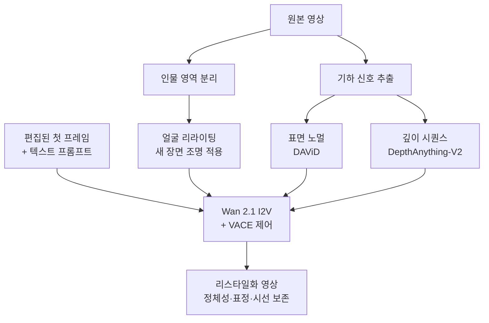

영상 한 편의 배경과 조명을 통째로 바꾸고 싶은데 등장 인물의 얼굴만은 손대고 싶지 않은 상황이 있습니다. 광고 소재를 계절별로 다시 만들거나, 교육 영상의 배경을 브랜드에 맞게 갈아 끼우거나, 촬영이 끝난 뒤 조명 설계를 바꾸는 경우입니다. 지금까지 이 작업은 재촬영이거나 프레임 단위 합성이었습니다. Eyeline Labs가 SIGGRAPH Asia 2026에 낸 ID-V2V는 편집된 첫 프레임 한 장으로 이 문제를 풀겠다고 제안합니다.

*형태는 잠기고 빛과 장면만 바뀝니다. 이 논문의 분해를 한 장으로 옮기면 이런 그림입니다.*

## 왜 읽어야 하나

이 글은 비디오 생성 모델을 실제 파이프라인에 얹어야 하는 ML 엔지니어와, 미디어 워크로드를 온프레미스 GPU 위에서 서빙할지 판단해야 하는 플랫폼 담당자를 위해 썼습니다. 결론을 먼저 말씀드리면, **ID-V2V의 진짜 기여는 새 생성 모델이 아니라 문제를 다시 정의한 방식에 있습니다. 얼굴 정체성 보존을 생성 문제가 아니라 조명 변화 문제로 강등시키고, 나머지 편집만 생성에 맡겼습니다.** 이 분해가 왜 실무적으로 중요한지, 그리고 이런 다중 제어 신호 구조가 서빙 비용과 파이프라인 설계에 어떤 부담을 주는지 함께 짚습니다.

<!-- nlm-visual -->

*NotebookLM이 소스를 종합해 생성한 인포그래픽입니다.*

## 개요

ID-V2V는 Eyeline Labs가 공개한 정체성 보존 비디오 리스타일화 연구입니다. arXiv 식별자는 [2607.22830](https://arxiv.org/abs/2607.22830)이고, 공식 구현은 [github.com/Eyeline-Labs/ID-V2V](https://github.com/Eyeline-Labs/ID-V2V)에, 가중치는 [Hugging Face](https://huggingface.co/Eyeline-Labs/ID-V2V)에 올라와 있습니다. SIGGRAPH Asia 2026 채택 논문의 공식 구현이라는 점이 저장소 설명에 명시되어 있습니다.

입력과 출력은 이렇습니다. 원본 영상과, 그 영상의 첫 프레임을 편집한 이미지 한 장을 넣습니다. 필요하면 추가 키프레임과 텍스트 프롬프트를 더 줄 수 있습니다. 그러면 편집된 키프레임이 지정한 장면과 조명, 스타일이 영상 전체에 전파되고, 그 과정에서 원본 인물의 정체성과 표정, 시선, 움직임은 유지됩니다. 립싱크처럼 미세한 얼굴 퍼포먼스까지 보존 대상에 포함한다는 점을 논문은 강조합니다.

*편집 지점은 첫 프레임 한 장이고, 나머지는 모델이 전파합니다.*

편집 지점이 첫 프레임 한 장이라는 설계는 실무적으로 의미가 큽니다. 아티스트가 이미 잘 쓰는 이미지 편집 도구로 한 장만 만들면 되고, 영상 전체에 일관된 스타일을 손으로 칠할 필요가 없어집니다.

## 이 기술은 무엇인가

핵심은 분해입니다. 논문은 원본에 근거한 정체성 보존과 편집에 이끌린 영상 합성을 원칙적으로 분리합니다.

출발점이 되는 관찰은 단순합니다. 장면과 스타일을 바꿔도 사람의 얼굴 생김새와 표정 자체는 변하면 안 됩니다. 변해도 되는 것은 그 얼굴에 떨어지는 빛입니다. 배경을 밤으로 바꾸면 얼굴도 밤의 조명을 받아야 자연스럽습니다. 그래서 논문은 정체성 보존을 **비디오 리라이팅 문제**로 세웁니다. 얼굴을 새로 만드는 것이 아니라, 원본 얼굴에 새 장면의 조명을 다시 입히는 작업으로 다루는 것입니다.

*생김새와 표정은 잠그고, 빛만 다시 입힙니다.*

나머지 절반, 그러니까 배경과 소품과 스타일 변화는 편집된 키프레임이 이끄는 조건부 영상 합성으로 처리합니다.

### 제어 신호 네 가지가 하는 일

구조를 뜯어보면 제어 신호가 역할별로 나뉘어 있습니다.

리라이팅된 얼굴 영역과 얼굴 노멀맵은 얼굴의 닮음과 퍼포먼스를 강하게 구속합니다. 표정과 시선, 입 모양이 흔들리지 않게 잡아 주는 축입니다. 반대로 편집된 키프레임과 깊이 시퀀스는 유연하면서도 시간적으로 일관된 생성을 가능하게 합니다. 장면이 프레임마다 튀지 않게 하는 축입니다.

*정체성 구속 축과 편집 자유도 축을 서로 다른 신호에 맡겼습니다.*

즉 한쪽은 조이고 한쪽은 푸는 이중 제어입니다. 정체성 보존과 편집 자유도라는 상충하는 두 목표를 하나의 손잡이로 조절하지 않고, 신호를 갈라 각각에 맞는 강도를 준 셈입니다.

### 백본과 두 가지 체크포인트

공개된 두 체크포인트는 같은 아키텍처를 공유합니다. Wan 2.1 이미지-투-비디오 모델에 VACE 제어를 얹은 구성입니다. 처음부터 새 비디오 생성 모델을 학습한 것이 아니라, 이미 검증된 오픈 백본 위에 제어 구조를 설계했다는 뜻입니다.

*백본은 새로 만들지 않고 제어 구조만 설계했습니다.*

기본 단일 조건 모델은 분리된 인물을 새 장면에 맞게 리라이팅해 보존하고, 프레임의 나머지는 프롬프트로부터 재생성합니다. 추가 모델은 원본 영상의 표면 노멀과 깊이를 함께 조건으로 받습니다. 노멀은 DAViD로, 깊이는 DepthAnything-V2로 뽑습니다. 기하 제약이 더 강해지므로 카메라 움직임이 크거나 신체 동작이 복잡한 장면에서 유리한 구성입니다.

여기서 실무자가 놓치면 안 되는 점은, 이 파이프라인이 단일 모델 호출이 아니라는 것입니다. 분할, 리라이팅, 노멀 추정, 깊이 추정이 모두 앞단에 붙습니다. 생성 모델 하나만 서빙하면 되는 구조가 아닙니다.

*앞단 전처리가 모두 성공해야 생성 단계가 동작합니다.*

## 기존 정체성 보존 연구와 무엇이 다른가

정체성 보존이라는 말은 최근 몇 년 동안 여러 갈래로 쓰였습니다. 다수는 참조 이미지 한 장을 주고 그 인물이 등장하는 영상을 새로 만드는 방향이었습니다. 텍스트에서 영상을 만들되 얼굴만 특정 인물로 고정하는 계열이 여기에 속합니다. 이 계열의 평가 기준은 대체로 생성된 얼굴이 참조 이미지의 인물과 얼마나 닮았는지입니다.

ID-V2V는 출발점이 다릅니다. 이미 촬영된 영상이 있고, 그 안의 퍼포먼스를 보존해야 합니다. 닮음뿐 아니라 그 사람이 그 순간에 지은 표정과 시선, 입 모양까지 그대로 남아야 합니다. 새로 만드는 것이 아니라 남기는 것이 목표이므로, 문제의 성격이 생성에서 편집으로 이동합니다.

이 차이가 방법 선택으로 이어집니다. 참조 이미지 기반 생성은 정체성 정보를 임베딩으로 압축해 주입하는 경로를 자주 택합니다. 압축 과정에서 미세한 표정은 대체로 소실됩니다. 반면 ID-V2V는 원본 픽셀을 최대한 유지한 채 조명만 바꾸는 경로를 택했으므로, 표정이 압축을 거치지 않습니다. 실무적으로는 이 지점이 광고나 방송 소재 재활용에서 결정적입니다. 배우의 연기를 다시 만드는 것이 아니라 그대로 살려야 하기 때문입니다.

물론 대가도 있습니다. 원본을 그대로 살리는 만큼 원본에 없는 각도나 동작은 만들 수 없습니다. 참조 이미지 기반 생성이 갖는 자유도를 이 방법은 갖지 않습니다. 두 계열은 대체재가 아니라 서로 다른 작업을 위한 도구입니다.

## 재현 시도에 대해

이번 글에서는 실제 추론을 돌려 수치를 캡처하지 않았습니다. 이 작업 실행 환경에서 외부 네트워크 접근과 GPU 자원이 제한되어 가중치를 내려받아 실행할 수 없었습니다. 그래서 이 글에는 자체 측정한 지연 시간이나 품질 점수가 없습니다. 논문과 저장소가 밝힌 구조적 사실만 다룹니다. 추론 비용과 화질에 대한 정량 비교는 실제로 돌려 본 뒤 별도 글로 정리하겠습니다.

## ThakiCloud 제품 적용 시사점

이 주제는 모델 추론과 인프라 쪽에 가까우므로 ai-platform 렌즈를 중심에 두고, 파이프라인 오케스트레이션 부분에서 Paxis 관점을 덧붙입니다.

**ai-platform 관점.** ID-V2V 같은 워크로드는 온프레미스 서빙의 필요성을 잘 보여 주는 사례입니다. 입력이 사람 얼굴이 담긴 원본 영상이기 때문입니다. 초상권과 계약이 걸린 촬영 소재를 외부 API에 올리는 선택은 광고, 방송, 교육 콘텐츠 업계에서 실제로 자주 막힙니다. 코드와 데이터가 고객 경계를 벗어나지 않아야 한다는 요구가 여기서도 그대로 나옵니다. ThakiCloud의 ai-platform은 K8s와 Kueue 기반 GPU 스케줄링 위에서 모델을 고객 환경 안에 두고 서빙하는 것을 전제로 설계되어 있어, 이런 유형의 미디어 워크로드와 요구 조건이 맞습니다.

*원본 소재가 경계를 넘지 못하는 업계에서는 온프레미스가 전제가 됩니다.*

두 번째로, 이 구조는 GPU 스케줄링 설계에 구체적인 숙제를 던집니다. 앞단의 분할과 노멀 추정, 깊이 추정은 상대적으로 가볍고 짧게 끝나는 반면, 비디오 디퓨전 본체는 무겁고 오래 잡습니다. 성격이 다른 두 종류의 작업을 같은 큐에 밀어 넣으면 짧은 작업이 긴 작업 뒤에 갇힙니다. Kueue의 큐 분리와 우선순위 클래스로 전처리 계열과 생성 계열을 나누는 편이 자원 효율에 유리합니다. 배치 성격의 영상 렌더링이므로 유휴 시간대에 몰아 돌리는 스케줄링과도 잘 맞습니다.

세 번째로, 오픈 백본 위에 제어를 얹는 이 논문의 접근 자체가 온프레미스 전략과 정합합니다. 폐쇄형 API에 종속되지 않고 Wan 2.1 계열 가중치를 자기 클러스터에 두면, 모델 버전을 고객이 직접 고정할 수 있고 비용도 시간당 GPU 단가로 예측됩니다. 낮은 서빙 비용에서 나오는 경쟁력이 이런 반복 생성 워크로드에서 특히 크게 벌어집니다.

**Paxis 관점.** 앞서 정리했듯 이 파이프라인은 모델 네 종류 이상이 순서와 의존 관계를 갖고 엮이는 DAG입니다. Paxis는 ThakiCloud의 Agent-Native Cloud로 Skills와 Tools를 일급 리소스로 다루고 DAG 형태의 멀티에이전트 실행을 지원합니다. 전처리 각 단계를 독립 스킬로 등록하고 격리 샌드박스에서 실행하면, 깊이 추정 모델을 교체하거나 리라이팅 단계를 다른 구현으로 바꿀 때 전체 파이프라인을 다시 짜지 않아도 됩니다. 실행 이력이 감사 로그로 남는 점은 인물이 등장하는 소재를 다룰 때 특히 값이 있습니다. 어떤 원본에 어떤 편집이 언제 적용되었는지가 기록으로 남기 때문입니다.

## 한계 및 반론

첫째, 적용 범위가 좁습니다. 이 방법은 사람 얼굴이 중심에 있는 영상을 전제로 합니다. 제어 신호 자체가 얼굴 노멀과 리라이팅된 얼굴 영역이기 때문입니다. 인물이 작게 나오거나 여러 명이 겹치거나 얼굴이 자주 가려지는 영상에서 같은 품질이 나올지는 별도 검증이 필요합니다.

둘째, 정체성 보존을 리라이팅으로 환원한 가정에는 경계가 있습니다. 편집이 조명 수준을 넘어 재질이나 얼굴 형태에 영향을 주는 방향으로 가면, 변해도 되는 것은 빛뿐이라는 전제가 깨집니다. 예를 들어 실사에서 애니메이션 스타일로 크게 바꾸는 경우가 그렇습니다.

셋째, 파이프라인 복잡도가 곧 운영 비용입니다. 분할, 리라이팅, 노멀, 깊이 네 단계가 앞에 붙는다는 것은 장애 지점이 네 개 늘어난다는 뜻이기도 합니다. 앞단 추정이 흔들리면 생성 결과가 조용히 나빠집니다. 어느 단계에서 품질이 무너졌는지 추적할 관측 수단이 없으면 운영이 어렵습니다.

넷째, 이 글은 자체 측정을 포함하지 않습니다. 위에서 밝혔듯 실행 환경 제약으로 추론을 돌리지 못했습니다. 도입을 검토한다면 대상 해상도와 길이에서의 VRAM 사용량과 프레임당 생성 시간을 직접 재 보시기를 권합니다.

다섯째, 윤리와 규제 축이 있습니다. 실제 인물의 얼굴과 표정을 보존한 채 장면을 바꾸는 기술은 합성 미디어 규제와 초상권 논의의 정중앙에 있습니다. 도입 시 동의 관리와 생성물 표시 정책을 기술 검토와 같은 급으로 다뤄야 합니다.

## 정리

ID-V2V가 남기는 교훈은 모델 크기를 키우는 것보다 문제를 잘 자르는 편이 낫다는 오래된 원칙의 최신 사례입니다. 얼굴은 조명만 바뀌면 되고 나머지는 생성하면 된다는 분해 하나로, 정체성 보존과 편집 자유도라는 상충 목표를 각각 다른 제어 신호에 맡길 수 있게 되었습니다. 백본을 새로 학습하지 않고 Wan 2.1과 VACE 위에 올렸다는 점도 재현 가능성 측면에서 반가운 선택입니다.

미디어 워크로드를 검토하고 계시다면 다음 순서를 권합니다. 먼저 대상 해상도와 길이에서 VRAM과 생성 시간을 직접 측정하고, 전처리 단계와 생성 단계의 GPU 큐를 분리한 뒤, 원본 소재가 외부로 나가도 되는지를 법무와 함께 확인하십시오. 세 번째 항목에서 걸린다면 온프레미스 서빙이 선택이 아니라 전제가 됩니다.

<!-- nlm-visual -->

*NotebookLM이 소스를 종합해 생성한 인포그래픽입니다.*

## 출처

- [ID-V2V: Identity-Preserving Video Restylization (arXiv 2607.22830)](https://arxiv.org/abs/2607.22830)
- [Eyeline-Labs/ID-V2V 공식 구현](https://github.com/Eyeline-Labs/ID-V2V)
- [Eyeline-Labs/ID-V2V 모델 카드](https://huggingface.co/Eyeline-Labs/ID-V2V)
