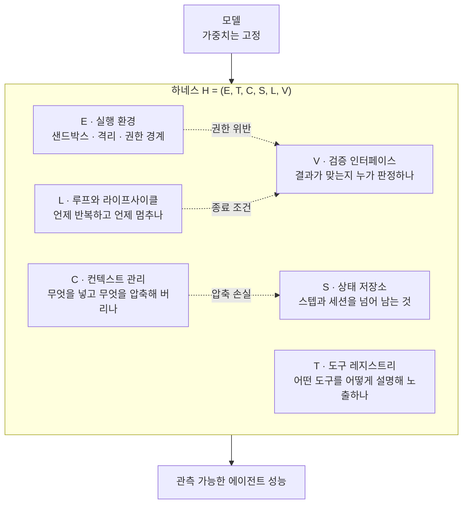

에이전트가 기대만큼 안 움직이면 대부분 모델부터 의심합니다. 등급을 올리고, 프롬프트를 다시 쓰고, 그래도 안 되면 다음 모델을 기다립니다. 그런데 2026년 들어 쌓인 보고들은 다른 곳을 가리킵니다. 같은 모델을 서로 다른 껍데기에 넣었더니 점수가 몇 배씩 벌어졌다는 관찰이 반복해서 나왔습니다. 그 껍데기를 부르는 이름이 하네스입니다. 이번에 정리된 서베이 한 편은 이 껍데기에 처음으로 형식과 부품 목록을 붙였습니다.


*가운데 자리는 비어 있어도 골격이 형태를 결정합니다. 하네스 논의를 한 장으로 옮기면 이런 그림입니다.*

## 왜 읽어야 하나

이 글은 에이전트를 데모가 아니라 프로덕션에 올려야 하는 플랫폼 엔지니어와, 성능이 안 나올 때 모델 등급을 올릴지 하네스를 고칠지 결정해야 하는 팀 리드를 위해 썼습니다. 결론을 먼저 말씀드리면, **이 서베이의 진짜 기여는 "하네스가 중요하다"는 주장이 아니라 하네스를 여섯 개 부품으로 쪼개서 무엇이 비었는지 셀 수 있게 만든 완전성 행렬입니다.** 주장은 이미 업계 상식에 가까웠고, 없던 것은 측정 도구였습니다. 이 글에서는 그 여섯 축이 무엇인지 짚고, 같은 자로 ThakiCloud가 실제로 돌리는 하네스를 재서 나온 숫자와 그 과정에서 발견한 구멍 두 곳까지 그대로 공개합니다.

<!-- nlm-visual -->

*NotebookLM이 소스를 종합해 생성한 인포그래픽입니다.*

## 개요

문제의 논문은 [Agent Harness for Large Language Model Agents: A Survey](https://github.com/Gloriaameng/Awesome-Agent-Harness)입니다. Qianyu Meng을 포함한 11명의 저자가 냈고, 논문 본체와 별개로 주석이 달린 논문 데이터셋과 시스템 비교표를 GitHub 저장소로 함께 공개했습니다. 프리프린트는 [preprints.org DOI 10.20944/preprints202604.0428](https://sciety.org/articles/activity/10.20944/preprints202604.0428.v3)로 등록되어 있습니다.

규모부터 보면 성격이 드러납니다. 논문과 블로그, 기술 보고서를 합쳐 110편이 넘는 자료를 모으고, 실제로 돌아가는 에이전트 시스템 23개를 같은 표 위에 올렸습니다. 그리고 아홉 개의 미해결 기술 과제를 남겼습니다. 새 기법을 하나 제안하는 논문이 아니라, 흩어져 있던 엔지니어링 관행에 좌표계를 씌우는 작업입니다.


*모델이 비슷해질수록 남는 변수는 그 바깥으로 이동합니다.*

왜 지금 이런 좌표계가 필요해졌는지도 같은 시기 문헌들이 설명합니다. [SemaClaw 논문(arXiv:2604.11548)](https://arxiv.org/abs/2604.11548)은 AI 엔지니어링의 무게중심이 프롬프트 엔지니어링에서 컨텍스트 엔지니어링을 거쳐 하네스 엔지니어링으로 옮겨가고 있다고 정리하면서, 모델 능력이 서로 수렴할수록 아키텍처 차별화가 일어나는 지점이 하네스 계층으로 이동한다고 봤습니다. 모델이 비슷해지면 남는 변수는 그 바깥이라는 이야기입니다.

숫자로도 뒷받침이 나옵니다. [하네스 설계와 사후 학습의 상호작용을 다룬 논문(arXiv:2606.25447)](https://arxiv.org/abs/2606.25447)은 하네스를 도구 노출 방식, 도구 설명 방식, 매 스텝 관측에 따라붙는 부가 정보의 조합으로 정의하고, 설계 노력을 최소화한 하네스에서는 도구 환경이 조금만 바뀌어도 사후 학습의 이득이 급격히 무너진다는 것을 보였습니다. 관련 문헌은 하네스만 바꿔도 정확도가 최대 6배 가까이 벌어진 사례를 인용합니다. 모델 세대 하나를 건너뛰는 것과 맞먹거나 그보다 큰 폭입니다.


*모델 세대 교체를 뛰어넘는 차이가 아키텍처 계층에서 발생합니다.*

여기서 따라오는 불편한 결론이 하나 있습니다. 하네스를 밝히지 않은 에이전트 벤치마크 비교는 신뢰하기 어렵다는 것입니다. [Stop Comparing LLM Agents Without Disclosing the Harness(arXiv:2605.23950)](https://arxiv.org/abs/2605.23950)가 정확히 이 문제를 제목으로 달고 나왔습니다. 리더보드 숫자를 볼 때 모델 이름만 보고 판단해 온 습관이 흔들립니다.

## 하네스를 여섯 개 부품으로 나눈다는 것

서베이의 핵심 장치는 하네스를 여섯 개짜리 튜플로 형식화한 것입니다. 하네스 H를 실행 환경 E, 도구 레지스트리 T, 컨텍스트 관리 C, 상태 저장소 S, 루프와 라이프사이클 L, 검증 인터페이스 V의 조합으로 씁니다.



부품 이름을 붙이는 것만으로는 논문이 되지 않습니다. 서베이가 한 걸음 더 나간 부분은 이 구조에 상태 전이 시스템 의미론을 얹어서 안전성과 활성을 구분한 지점입니다. 안전성은 나쁜 일이 절대 일어나지 않아야 한다는 성질이고, 활성은 좋은 일이 결국은 일어나야 한다는 성질입니다.

이 구분이 실무에서 왜 중요한지는 예를 들면 바로 보입니다. 에이전트가 승인 없이 배포를 실행하면 안 된다는 요구는 안전성입니다. 한 번 위반하면 그것으로 끝이고, 나중에 잘한다고 상쇄되지 않습니다. 반면 에이전트가 언젠가는 종료 조건에 도달해야 한다는 요구는 활성입니다. 무한 루프는 안전성 위반이 아니라 활성 위반이고, 둘을 같은 방식으로 방어하면 한쪽이 반드시 뚫립니다. 승인 게이트로 무한 루프를 막을 수 없고, 반복 상한으로 권한 이탈을 막을 수 없습니다. 하네스 설계 논의가 자주 겉도는 이유가 이 둘을 뭉뚱그려 "안정성"이라고 부르기 때문입니다.


*두 속성은 서로 다른 장치로 막아야 합니다. 한쪽 장치로 다른 쪽을 덮을 수 없습니다.*

여섯 부품 중에서 실제로 가장 자주 비어 있는 축은 V입니다. 도구를 붙이고 루프를 돌리는 것까지는 대부분 하지만, 그 결과가 맞는지를 판정하는 결정론적 인터페이스를 따로 두는 시스템은 훨씬 적습니다. 서베이가 아홉 개 미해결 과제 중 하나로 합성 검증을 꼽은 것도 같은 맥락입니다. 부품 각각이 검증되어도 조합된 하네스 전체가 검증되지는 않는다는 문제입니다.

## 완전성 행렬이 실제로 하는 일

서베이가 23개 시스템을 올린 표의 이름이 하네스 완전성 행렬입니다. 행에 시스템, 열에 여섯 부품을 놓고 각 칸이 채워졌는지를 표시합니다. 단순한 장치인데 효과는 분명합니다.

첫째, 빈칸이 보입니다. 우리 에이전트가 왜 특정 상황에서만 무너지는지 막연하던 것이, 여섯 칸 중 어느 칸이 비었는지를 묻는 질문으로 바뀝니다. 진단이 서술에서 열거로 내려옵니다.

둘째, 비교 가능성이 생깁니다. 두 시스템의 성능 차이를 이야기할 때 모델 이름 대신 어느 부품이 다른지를 지목할 수 있습니다. 앞서 언급한 하네스 미공개 비교 문제에 대한 실질적인 대응입니다.

셋째, 이 행렬은 자기 시스템에도 그대로 적용됩니다. 논문을 읽고 끝내지 않고 우리 하네스를 같은 표에 올려볼 수 있습니다. 그래서 그렇게 해봤습니다.

## 우리 하네스를 여섯 축으로 재봤습니다

서베이는 설치해서 돌릴 수 있는 도구가 아니라 개념 작업입니다. 그래서 이 글의 실험은 라이브러리 벤치마크가 아니라 자가 측정으로 잡았습니다. ThakiCloud가 실제로 운용 중인 에이전트 하네스 저장소를 여섯 축에 대고 세어봤습니다. 아래 숫자는 전부 실제 명령으로 캡처한 값이며 추정치가 아닙니다.

```bash
# T · 도구와 스킬 레지스트리
ls .claude/skills | wc -l          # 1914
ls .claude/agents/*.md | wc -l     # 80

# C · 컨텍스트에 상시 주입되는 규칙
ls .claude/rules/*.md | wc -l      # 60

# E · 실행 경계에 걸린 훅
ls .claude/hooks/*.py | wc -l      # 14

# L · 무인 루프 레지스트리
python3 scripts/loops/build_loop_registry.py --check
# loops=51 edges=12 missing_run_script=2 warnings=2
```


*여섯 축 중 다섯은 두껍고, 검증 축만 유독 얇습니다.*

축별로 옮기면 이렇습니다.

**T 도구 레지스트리**가 가장 두껍습니다. 스킬 1914개와 전문 에이전트 80개가 등록되어 있습니다. 다만 여기서 곧바로 자랑으로 넘어가면 안 됩니다. 서베이의 관점에서 T의 품질은 개수가 아니라 노출과 설명 방식이고, 실제로 개수가 늘어날수록 선택 정확도가 떨어지는 것이 이 축의 고질적인 실패 모드입니다. 그래서 우리 쪽 실질 지표는 1914라는 숫자가 아니라 검색 라우터의 회수율입니다.

**C 컨텍스트 관리**는 상시 적용 규칙 60개가 담당합니다. 매 턴 주입되는 계층과 요청 시점에만 로드되는 계층을 분리해 두었습니다. 이 축은 무엇을 넣느냐보다 무엇을 넣지 않느냐가 성능을 좌우합니다.

**E 실행 환경**은 훅 14개가 도구 호출 경계를 감시하는 형태입니다. 위험 작업 앞에 게이트를 걸고, 파괴적 배치 작업에는 별도 확인을 요구합니다. 안전성 성질을 담당하는 축입니다.

**L 루프와 라이프사이클**은 레지스트리에 51개 루프가 등록되어 있고 그중 12개의 신호 간선이 루프끼리를 잇습니다. 그런데 여기서 실제 구멍이 나왔습니다. 검증 명령이 `missing_run_script=2`를 반환했습니다. 레지스트리에 선언은 되어 있는데 실행 스크립트가 연결되지 않은 루프가 두 개 있다는 뜻입니다. 경고도 두 건 잡혔습니다. 여섯 축으로 재보지 않았다면 그냥 지나갔을 항목입니다.


*아무 증상도 내지 않던 구멍입니다. 진단 행렬을 대보고 나서야 드러났습니다.*

**V 검증 인터페이스**는 두 갈래로 나뉘어 있습니다. 코드 산출물은 종료 코드로 판정하는 게이트가, 콘텐츠와 판단 산출물은 다수결 반증으로 판정하는 게이트가 담당합니다. 모델이 스스로 "완료했습니다"라고 보고하는 것을 종료 조건으로 삼지 않는다는 원칙이 이 축에 걸려 있습니다.

**S 상태 저장소**는 세션 상주 브리프와 장기 지식 계층, 그리고 루프 상태 파일로 나뉩니다.

측정 결과를 한 문장으로 줄이면 이렇습니다. 부품은 여섯 개 다 있고 T와 L이 특히 두꺼운데, 정작 이번 측정에서 결함이 나온 곳도 가장 두꺼운 L이었습니다. 부품이 많을수록 완전성이 올라가는 것이 아니라 관리해야 할 표면이 넓어진다는 것을 그대로 보여줍니다.

## ThakiCloud 제품 적용 시사점

이 서베이의 여섯 축은 ThakiCloud가 제품을 나눠 온 방식과 꽤 정확히 겹칩니다.

**Paxis** 관점에서 보면 겹침이 더 뚜렷합니다. Paxis는 ai-platform 위에서 도는 Agent-Native Cloud 제어 평면으로, Skills와 Tools, Policies, Audit Logs를 일급 리소스로 다룹니다. 서베이의 용어로 옮기면 Skills와 Tools가 T축, Policies가 E축의 안전성 성질, Audit Logs가 V축의 사후 검증 근거에 해당합니다. 하네스 부품을 코드 안에 흩뿌려 두지 않고 플랫폼이 관리하는 리소스로 승격시킨 구조라고 볼 수 있습니다. 스킬을 BM25로 선택해 격리 샌드박스에서 실행하고 모든 행동을 정책 게이트와 감사 로그로 통과시키는 흐름은, 서베이가 말하는 완전성 행렬을 제품 기능으로 구현한 것에 가깝습니다.

**ai-platform** 관점에서는 E축이 핵심입니다. 에이전트를 실제로 격리해 실행하려면 결국 컨테이너와 스케줄러가 필요하고, 멀티테넌트 환경에서 권한 경계를 지키려면 K8s 수준의 격리가 필요합니다. 하네스 논의가 아무리 소프트웨어 아키텍처처럼 보여도, 안전성 성질을 실제로 강제하는 계층은 인프라입니다. 온프레미스와 소버린 요구가 있는 고객일수록 이 부분이 협상 대상이 아니라 전제 조건이 됩니다.

두 렌즈는 서로를 보완합니다. ai-platform이 E축의 물리적 경계를 제공하고, 그 위에서 Paxis가 T와 V축을 리소스로 관리합니다. 서베이가 지적한 합성 검증 문제, 즉 부품 각각이 아니라 조합을 검증해야 한다는 과제는 이 두 계층이 함께 붙어야 풀리는 종류의 문제입니다.

## 한계 및 반론

이 논문을 과대평가하지 않는 편이 좋습니다. 몇 가지 분명한 한계가 있습니다.

첫째, 서베이는 분류지 처방이 아닙니다. 여섯 부품이 무엇인지는 알려주지만 각 부품을 어떻게 설계해야 좋은지는 알려주지 않습니다. 완전성 행렬에서 여섯 칸을 모두 채웠다고 좋은 하네스가 되지는 않습니다. 빈칸을 찾는 도구이지 품질을 재는 도구가 아닙니다.

둘째, 여섯 축이 서로 직교하지 않습니다. 컨텍스트 압축은 C축의 문제처럼 보이지만 무엇을 버릴지는 S축이 무엇을 보관하는지에 달려 있고, 루프 종료 조건은 L축이지만 판정은 V축이 합니다. 실제 시스템에서는 한 축을 고치면 다른 축이 흔들립니다. 표가 깔끔한 만큼 현실은 얽혀 있습니다.


*품질 측정 도구가 아니라 진단 도구입니다. 축들은 서로 얽혀 있습니다.*

셋째, 개수 기반 자가 측정에는 함정이 있습니다. 위에서 스킬 1914개를 셌지만, 이 숫자가 커질수록 라우터가 엉뚱한 스킬을 고를 확률도 같이 올라갑니다. 부품 개수를 완전성으로 착각하면 오히려 나쁜 방향으로 최적화하게 됩니다. 이 축의 정직한 지표는 등록 개수가 아니라 선택 정확도입니다.

넷째, 하네스 우위 주장 자체가 반박 가능합니다. 하네스에 따라 성능이 크게 갈린다는 관찰은 뒤집으면 벤치마크가 하네스 세부에 과민하다는 뜻이기도 합니다. 실제 업무 성과가 아니라 벤치마크 점수의 민감도를 재고 있을 가능성을 배제하기 어렵습니다. 6배라는 격차가 실제 생산성 격차인지 측정 도구의 취약성인지는 아직 구분되지 않았습니다.

## 정리

에이전트가 안 될 때 모델 등급을 올리는 것은 가장 비싸면서 가장 자주 틀리는 처방입니다. 이 서베이는 그 반사를 멈추게 하는 도구를 줍니다. 하네스를 실행 환경, 도구, 컨텍스트, 상태, 루프, 검증의 여섯 부품으로 쪼개고, 어느 칸이 비었는지 세어보라는 것입니다.

서두에서 말씀드린 결론을 다시 확인하면, 이 논문의 값어치는 주장이 아니라 측정 도구에 있습니다. 실제로 우리도 같은 자를 대보고 나서야 루프 레지스트리에 실행 스크립트가 빠진 항목 두 개와 경고 두 건을 발견했습니다. 그 전까지 그 구멍은 아무 증상도 내지 않고 있었습니다.

다음에 에이전트 파이프라인이 기대만큼 안 나올 때, 모델 카탈로그를 열기 전에 여섯 축을 한 줄씩 적어보시길 권합니다. 어느 칸이 비었는지 세는 데는 오 분이면 충분하고, 그 오 분이 모델 등급 하나보다 더 큰 차이를 만드는 경우가 생각보다 많습니다.

<!-- nlm-visual -->

*NotebookLM이 소스를 종합해 생성한 인포그래픽입니다.*

## 출처

- [Agent Harness for Large Language Model Agents: A Survey (GitHub 저장소)](https://github.com/Gloriaameng/Awesome-Agent-Harness)
- [해당 서베이 프리프린트 기록 (DOI 10.20944/preprints202604.0428.v3)](https://sciety.org/articles/activity/10.20944/preprints202604.0428.v3)
- [SemaClaw: A Step Towards General-Purpose Personal AI Agents through Harness Engineering (arXiv:2604.11548)](https://arxiv.org/abs/2604.11548)
- [The Interplay of Harness Design and Post-Training in LLM Agents (arXiv:2606.25447)](https://arxiv.org/abs/2606.25447)
- [Stop Comparing LLM Agents Without Disclosing the Harness (arXiv:2605.23950)](https://arxiv.org/abs/2605.23950)
- [Architectural Design Decisions in AI Agent Harnesses (arXiv:2604.18071)](https://arxiv.org/abs/2604.18071)
- [Agentic Harness Engineering: Observability-Driven Automatic Evolution of Coding-Agent Harnesses (arXiv:2604.25850)](https://arxiv.org/abs/2604.25850)
- [Code as Agent Harness (arXiv:2605.18747)](https://arxiv.org/abs/2605.18747)
- [Co-Harness: Co-Evolving Harnesses and Model Weights for LLM Agents (arXiv:2607.22688)](https://arxiv.org/abs/2607.22688)
