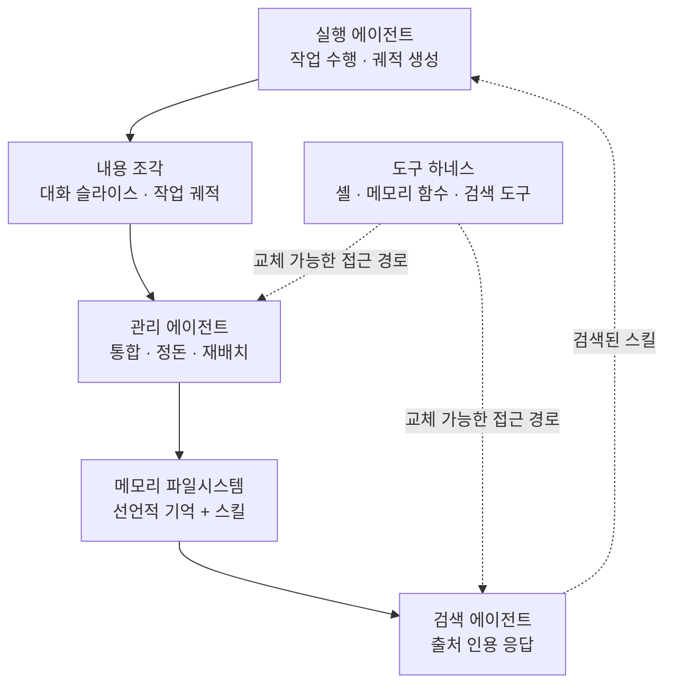

지금 실제로 돌아가는 LLM 에이전트의 장기 기억을 열어보면 대개 특별한 것이 없습니다. 마크다운 파일이 담긴 폴더 트리 하나입니다. 에이전트가 일반 파일 도구로 읽고 쓰고 가끔 스스로 재배치합니다. 벡터 데이터베이스도, 전용 메모리 엔진도 아닙니다. 그런데 이 기본값이 어떤 성질을 갖는지는 지금까지 거의 측정된 적이 없습니다.


*커지는 쪽과 정돈된 쪽이 같지 않다는 것이 이 연구의 출발점입니다.*

## 왜 읽어야 하나

이 글은 에이전트에게 장기 기억을 붙여 운영하는 플랫폼 엔지니어와, 메모리 계층에 돈과 시간을 얼마나 쓸지 결정해야 하는 팀 리드를 위해 썼습니다. 결론을 먼저 말씀드리면, **정리는 검색 비용을 확실히 사지만 정답률은 사지 못합니다.** 저장소를 폴더로 잘 정리해 두면 검색에 드는 비용이 자료가 많을수록 크게 줄어드는데, 정리 그 자체를 더 나은 답으로 바꾼 에이전트는 이 연구에서 하나도 관측되지 않았습니다. 이 글에서는 그 근거가 된 다섯 개 질문을 짚고 같은 자를 ThakiCloud가 실제로 굴리는 메모리 저장소에 대봤을 때 나온 숫자와 거기서 드러난 구조적 편중까지 그대로 공개합니다.

<!-- nlm-visual -->

*NotebookLM이 소스를 종합해 생성한 인포그래픽입니다.*

## 개요

문제의식은 단순합니다. 메모리를 파일시스템으로 두는 관행은 이미 업계 기본값인데, 그 기본값은 두 가지를 암묵적으로 가정하고 있습니다. 첫째, 에이전트가 커지는 저장소를 계속 정돈된 상태로 유지할 수 있다는 가정입니다. 둘째, 그렇게 정돈해 두면 값을 한다는 가정입니다. 기존 연구는 대부분 자체 설계한 메모리 표현을 만들고 그 위에서 검색 성능을 재왔기 때문에, 정작 모두가 쓰는 이 기본값의 두 가정은 검증되지 않은 채 남아 있었습니다.

일리노이대와 UC 샌디에이고, UC 머시드, Adobe 연구진이 공동으로 낸 논문 [Filesystem-Based Memory for LLM Agents: Organization, Evolution, and Sustainability](https://arxiv.org/abs/2607.26637)가 이 빈칸을 겨냥합니다. 2026년 7월 29일 공개됐고 본문 59쪽에 그림 12개, 표 18개가 붙은 규모입니다. 저자들은 이 작업을 파일시스템 메모리에 대한 첫 체계적 탐색이라고 표현합니다.

시간이 지나면 메모리는 그냥 쌓이지 않습니다. 중복이 생기고 서로 모순되는 기록이 남고 낡은 사실이 살아 있는 사실처럼 보이고 한 주제에 대한 내용이 여러 파일로 흩어집니다. 그래서 저장소는 갱신되고 조정되고 재배치돼야 합니다. 이 과정을 잘못 다루면 대가가 큽니다. 논문은 LLM으로 메모리 뱅크를 계속 다시 쓰다가 메모리를 아예 쓰지 않는 것보다 못한 상태로 떨어진 선행 관측을 인용합니다.

산업계는 이 문제를 대체로 에이전트 바깥에서 처리해 왔습니다. OpenAI의 드리밍은 백그라운드에서 평평한 요약을 합성하고 Anthropic의 Dreams는 과거 세션들로부터 저장소를 통째로 다시 만듭니다. 논문이 짚는 대목은 Dreams가 도입된 이유입니다. 작업 중인 에이전트 자신의 쓰기가 국소적이고 점진적인 데 그치기 때문에, 재구축과 재구축 사이에 저장소가 열화된다는 것입니다. 외부 청소는 증상을 다루는 처방입니다. 에이전트가 스스로 정돈을 유지할 수 있는지, 그 정돈이 비용을 회수하는지는 여전히 가정으로 남아 있었습니다.

## 이 연구는 무엇을 형식화했나

저자들은 상황을 하나의 메모리 파일시스템을 둘러싼 세 개의 역할로 정리합니다. 관리 에이전트는 들어오는 내용을 통합하고 저장소를 정돈된 상태로 유지합니다. 검색 에이전트는 질의에 답하되 근거가 된 출처를 인용해서 답합니다. 실행 에이전트는 실제 작업을 수행하며 그 작업 궤적이 스킬로 증류돼 같은 저장소에 들어갑니다. 선언적 기억과 스킬을 하나의 저장소로 통합했다는 점이 이 형식화의 특징입니다.



저장소의 정의도 최소한으로 잡혀 있습니다. 메모리 저장소는 경로 계층으로 조직된 파일들의 유한 집합이고 각 파일은 경로와 한 줄 설명, 그리고 본문이라는 세 요소로 이뤄집니다. 폴더는 경로들의 공통 접두사일 뿐 자체 내용을 갖지 않습니다. 폴더 구조와 파일명, 그리고 파일 안의 마크다운 제목이 함께 저장소의 분류 체계를 이룹니다. 이 체계는 파일 아래 중첩된 절까지 이어지는 하나의 라벨 트리이며 이름과 한 줄 설명이 유일한 이정표입니다.

이 정의를 처음 읽었을 때 낯설지 않았습니다. YAML 프론트매터의 이름과 설명이 목록과 검색에 가장 먼저 노출된다는 서술은, 스킬 파일을 다뤄본 사람이라면 그대로 자기 저장소 이야기로 읽힙니다.

실험은 네 가지를 변주합니다. 저장소를 어떻게 짓는지(정돈하는 에이전트, 원문 그대로 쌓기, 원문을 조각내 색인하는 검색 방식), 스트림의 규모, 에이전트가 저장소에 접근하는 도구 하네스, 그리고 저장소를 짓고 검색하는 모델의 성능입니다. 측정 대상은 정답 품질과 비용(라운드 수, 토큰, 읽은 분량), 그리고 시간에 따른 저장소 건강도입니다. 초기 기억이 이후의 진화를 견디고 살아남는지, 갱신이 제대로 반영되는지를 봅니다. 끝점보다 성장 곡선을 봤다는 점이 이 연구의 방법론적 핵심입니다.

## 다섯 개 질문에 대한 답

논문은 결과를 다섯 개 질문으로 정리하고 대화 메모리와 체화 작업 두 환경 모두에서 각각 답합니다.

**정리의 모양은 규모가 아니라 모델을 반영합니다.** 알아서 정돈하라고 두면 관리 에이전트들은 주제 기반 트리를 만듭니다. 그런데 그 모양은 자료가 늘어난 것에 대한 반응이라기보다 모델의 지문에 가깝습니다. 자료가 많아지면 저장소는 쪼개지는 대신 오히려 뭉치고 계층은 폴더와 파일과 파일 안 제목 사이를 옮겨 다닙니다. 가장 뚜렷한 퇴행 행동은 재정리 패스가 내용을 조용히 압축해 버리는 것인데, 보존 규칙 하나만 추가하면 막힙니다.


*같은 자료를 줘도 모델마다 다른 모양의 트리가 나옵니다.*

**어떤 모양도 정답률에서 항상 이기지는 못합니다.** 정리가 확실하게 사는 것은 검색 비용이고 그 이득은 자료가 많아질수록 커집니다. 논문의 표현으로는 자료가 클 때 정돈된 저장소가 검색 비용을 대략 절반으로 줄입니다. 스킬 환경에서는 승자가 아예 뒤집힙니다. 강한 실행 에이전트에게는 원문 그대로의 에피소드 로그가 가장 잘 맞고 약한 실행 에이전트에게는 증류된 지침이 낫습니다. 무엇을 저장할지가 소비자에 따라 갈린다는 뜻입니다.


*이 표 한 줄이 논문 전체의 요약입니다. 사는 것과 못 사는 것이 갈립니다.*

**모델 성능이 지불되는 자리는 검색 쪽입니다.** 대화 환경에서 관리 에이전트의 성능은 정리 스타일을 사지만 정답 품질을 사지는 못합니다. 반면 검색 에이전트의 성능은 곧바로 값을 합니다. 성능이 정답과 결합하는 경우도 있는데, 쓰기 자체가 실패할 때입니다. 한 벤치마크에서 관리 에이전트가 바뀐 선호를 날짜가 붙은 갱신으로 일관되게 기록하지 못했고 그 결과 낡은 사실이 현재 특성인 것처럼 남았습니다. 같은 지시를 더 강한 백본으로 실행하니 손실의 절반 정도가 회복됐습니다. 다만 저장소가 이미 검색 에이전트에게 제 역할을 하고 있던 경우에는 같은 업그레이드가 아무것도 바꾸지 못했습니다.


*모델 예산을 어디에 쓸지에 대한 답이기도 합니다.*

**저장소는 커질수록 유용해지지만 정리 규율은 무너집니다.** 측정된 구간 안에서 저장소는 커질수록 유용해졌고 누적된 경험이 실행 에이전트의 능력을 대신했습니다. 건강도 자체도 유지됐습니다. 대화 저장소는 파일 몇 개를 초기에 만들고 이후로는 편집만 할 뿐 삭제하지 않았습니다. 약한 쪽은 정리입니다. 분류 체계 계약에 대한 준수도는 대부분의 저장소가 커지면서 침식됐고 이 연구가 추적한 관리 에이전트 중 가장 강한 하나만이 그것을 지켜냈습니다. 규모에 따라 늘어나는 비용은 노력과 분량입니다. 큐레이션은 에피소드당 비용이 결코 싸지지 않고 저장소가 커질수록 커지는 유일한 부채는 원문 에피소드 로그의 모두 꺼내오는 검색입니다.

**도구를 바꾸면 저장소의 모양이 바뀝니다.** 도구를 하나 추가하는 것은 에이전트의 행동을 바꾸지만 결과를 바꾸지는 않았습니다. 반면 도구 집합을 통째로 교체하면 저장소 자체가 다시 빚어졌습니다. 긴 대화에서는 잘게 쪼개지며 성능이 비겼고 스킬 환경에서는 뭉치며 이겼습니다. 논문의 요약은 도구 하네스가 중립적 껍데기를 넘어 메모리 조직의 제어 손잡이라는 것입니다. 모델을 바꾸는 것만큼이나 도구를 바꾸는 것이 저장소를 바꿉니다.


*도구 집합을 바꾸는 것은 저장소 설계를 바꾸는 일과 같습니다.*

## 우리 저장소를 같은 자로 재보면

이 논문은 설치해서 돌릴 수 있는 도구라기보다 개념과 측정 작업입니다. 그래서 실험 대신 자가 측정으로 잡았습니다. 마침 ThakiCloud가 굴리는 에이전트 메모리가 정확히 이 논문이 다루는 형태입니다. 마크다운 파일 트리에 에이전트가 직접 읽고 쓰는 구조입니다. 아래 숫자는 전부 실제 명령으로 캡처한 값이며 추정치가 아닙니다.

```bash
# 메모리 저장소 전체 파일 수
find memory -type f -name '*.md' | wc -l     # 1878

# 계층별 분해
ls memory/sessions | wc -l                    # 1789  (원문 세션 로그)
ls memory/topics | wc -l                      # 10    (주제별 정돈 계층)
ls memory/skill-evolution | wc -l             # 30
ls memory/preferences | wc -l                 # 5
ls memory/archive/hot | wc -l                 # 8

# 세션마다 상주하는 핫 브리프 크기
wc -c memory/HOT_MEMORY.md                    # 4256
```


*로그 스케일이라 더 분명합니다. 정돈된 계층과 원문 로그의 격차가 두 자릿수입니다.*

숫자를 논문의 용어로 옮기면 그림이 선명해집니다. 파일 1878개 중 1789개, 그러니까 95퍼센트가 원문 세션 로그입니다. 논문이 말한 세 가지 저장 방식 중 원문 그대로 쌓기에 해당합니다. 에이전트가 실제로 정돈한 계층은 주제 파일 10개와 선호 5개, 스킬 진화 기록 30개를 합쳐 마흔다섯 개 남짓이고 여기에 세션마다 다시 조립되는 핫 브리프 하나가 얹혀 있습니다. 정돈된 비율로 따지면 5퍼센트가 채 되지 않습니다.


*커지는 쪽이 부채이고 멈춰 있는 쪽이 자산입니다.*

이 편중은 논문의 결론과 정확히 같은 방향을 가리킵니다. 저장소가 커질수록 커지는 유일한 부채가 원문 로그의 모두 꺼내오는 검색이라고 했는데, 우리 저장소에서 커지고 있는 것이 바로 그 부분입니다. 세션 로그는 계속 쌓이지만 주제 계층은 열 개에서 거의 늘지 않습니다. 분류 체계 준수도가 저장소 성장과 함께 침식된다는 관측을, 다른 각도에서 그대로 재현하고 있는 셈입니다.

동시에 이 측정은 우리 설계에서 이미 맞게 잡힌 부분도 보여줍니다. 핫 브리프를 4256바이트로 묶어 두고 매 세션 재조립하는 방식은, 논문이 말한 검색 경제성을 정면으로 노린 구조입니다. 원문 1789개를 매번 훑는 대신 정돈된 4킬로바이트를 상주시키는 것이기 때문입니다. 그리고 이 브리프의 재조립은 모델이 아니라 결정론적 코드가 소유합니다. 관리 에이전트의 성능이 정리 스타일만 사고 정답 품질은 사지 못한다는 논문의 관측을 생각하면, 정리 작업을 모델 판단에서 떼어낸 선택이 사후적으로 정당화되는 지점입니다.

한 가지는 정직하게 적어 두겠습니다. 위 숫자는 저장소의 모양을 재는 구조 지표이지 정답 품질 지표가 아닙니다. 논문이 한 것처럼 벤치마크 위에서 성장 곡선을 그리는 대신 특정 시점의 단면을 센 것입니다. 편중이 실제로 답변 품질을 얼마나 갉아먹고 있는지는 이 측정만으로는 말할 수 없습니다.

## ThakiCloud 제품 적용 시사점

이 논문의 결과는 **Paxis** 설계에 직접 걸립니다. Paxis는 ai-platform 위에서 도는 Agent-Native Cloud 제어 평면으로, Skills와 Tools, Policies, Audit Logs를 일급 리소스로 다룹니다. 논문의 형식화에 대입하면 Skills가 곧 메모리 저장소의 절반입니다. 선언적 기억과 스킬을 하나의 파일시스템으로 통합한다는 저자들의 설계는, 스킬을 별도 리소스보다 저장소의 한 형태로 보는 관점과 같습니다.

특히 두 가지가 실무 지침으로 바로 쓰입니다. 첫째, 도구 집합이 저장소 모양을 바꾼다는 결론은 스킬 하네스의 도구 표면을 함부로 늘리거나 줄이면 안 된다는 뜻입니다. 도구 하나 추가는 행동만 바꾸지만 집합 교체는 저장소를 다시 빚습니다. 둘째, 검색 에이전트의 성능이 곧바로 값을 한다는 결론은 모델 예산을 어디에 쓸지에 대한 답입니다. 정리하는 쪽보다 찾는 쪽에 좋은 모델을 붙이는 편이 낫습니다. 스킬을 BM25로 선택해 격리 샌드박스에서 실행하는 Paxis의 흐름에서, 선택 정확도가 병목이라는 기존 진단과도 일치합니다.

**ai-platform** 관점에서는 비용 축이 걸립니다. 정돈된 저장소가 검색 비용을 절반 가까이 줄인다는 것은, 에이전트를 대규모로 굴릴 때 그 차이가 그대로 추론 청구서로 나타난다는 뜻입니다. 멀티테넌트 환경에서 테넌트마다 메모리 저장소가 자라는 구조라면 이 절감은 곱하기로 들어옵니다. 온프레미스와 소버린 요구가 있는 고객일수록 토큰 예산이 고정돼 있기 때문에, 검색 경제성은 선택이라기보다 용량 계획의 일부가 됩니다.

두 렌즈는 서로를 보완합니다. ai-platform이 저장소를 실제로 담고 격리하는 계층을 제공하고 그 위에서 Paxis가 무엇을 정돈하고 무엇을 원문으로 둘지 결정하는 정책을 리소스로 관리합니다.

## 한계 및 반론

이 논문을 과대평가하지 않는 편이 좋습니다.

첫째, 측정 구간이 짧습니다. 저자들 스스로 남은 문제로 한 번의 대화를 넘어서는 시간 지평을 꼽습니다. 저장소가 커질수록 유용해졌다는 결론에는 측정된 구간 안에서라는 단서가 붙어 있습니다. 우리 쪽 세션 로그 1789개 같은 규모가 이 구간 안에 들어오는지는 별도 검증이 필요합니다.

둘째, 품질 벤치마크가 모양에 대해 거의 눈이 멀어 있다는 점을 논문 자신이 지적합니다. 정리가 정답률을 올리지 못했다는 결론은 정리가 무용하다는 뜻일 수도 있지만 현재 벤치마크가 정리의 효용을 잡아내지 못한다는 뜻일 수도 있습니다. 두 해석은 이 연구만으로 구분되지 않습니다.

셋째, 결론이 조건부입니다. 정리가 값을 하는지는 자료의 성격과 메모리를 소비하는 에이전트, 그리고 손에 쥔 도구에 달려 있다고 명시돼 있습니다. 스킬 환경에서 승자가 실행 에이전트의 강약에 따라 뒤집혔던 것이 그 예입니다. 그래서 이 결과를 우리 환경에 그대로 옮기려면 우리 소비자가 강한 쪽인지 약한 쪽인지부터 정해야 합니다.

넷째, 가장 강한 관리 에이전트 하나만이 분류 체계를 지켜냈다는 결과는 뒤집어 읽을 수 있습니다. 모델이 좋아지면 자연히 해결될 문제라면, 지금 큐레이션 파이프라인에 공을 들이는 것이 곧 사라질 문제에 투자하는 일일 수 있습니다. 반대로 저장소 규모가 모델 발전보다 빠르게 커진다면 영영 따라잡지 못합니다. 어느 쪽인지는 아직 데이터가 없습니다.

## 정리

에이전트 메모리를 폴더로 정리하는 일은 그동안 당연히 좋은 것으로 취급돼 왔습니다. 이 논문은 그 습관에 처음으로 계산서를 붙였습니다. 정리가 사는 것은 검색 비용이고 자료가 많을수록 그 절감은 커지며 정답률은 사지 못합니다. 그리고 저장소가 커지면 정리 규율 자체가 가장 먼저 무너집니다.

서두에서 말씀드린 결론을 다시 확인하면, 정리는 품질 투자가 아니라 비용 투자입니다. 우리 저장소를 재봤을 때도 같은 그림이 나왔습니다. 파일 1878개 중 1789개가 원문 로그였고 정돈된 계층은 5퍼센트가 되지 않았습니다. 커지는 쪽은 부채이고 멈춰 있는 쪽은 자산이었습니다.

다음에 에이전트 메모리 계층을 손볼 일이 생기면, 정리 알고리즘을 고치기 전에 두 가지를 먼저 정하시길 권합니다. 이 저장소를 읽는 것이 강한 에이전트인지 약한 에이전트인지, 그리고 지금 아픈 것이 정답률인지 검색 비용인지입니다. 이 논문에 따르면 후자만이 정리로 고쳐집니다.

<!-- nlm-visual -->

*NotebookLM이 소스를 종합해 생성한 인포그래픽입니다.*

## 출처

- [Filesystem-Based Memory for LLM Agents: Organization, Evolution, and Sustainability (arXiv:2607.26637)](https://arxiv.org/abs/2607.26637)
- [논문 HTML 전문](https://arxiv.org/html/2607.26637v1)
- [묘사가 아니라 결정을 기억하라: 에이전트 메모리를 율-왜곡 문제로 다시 푼 연구](https://thakicloud.com/tech-blog/ko/research/demem-agent-memory/)
- [모델이 아니라 껍데기가 성능을 정한다: 에이전트 하네스를 여섯 부품으로 쪼갠 서베이](https://thakicloud.com/tech-blog/ko/research/agent-harness-survey-six-components/)
