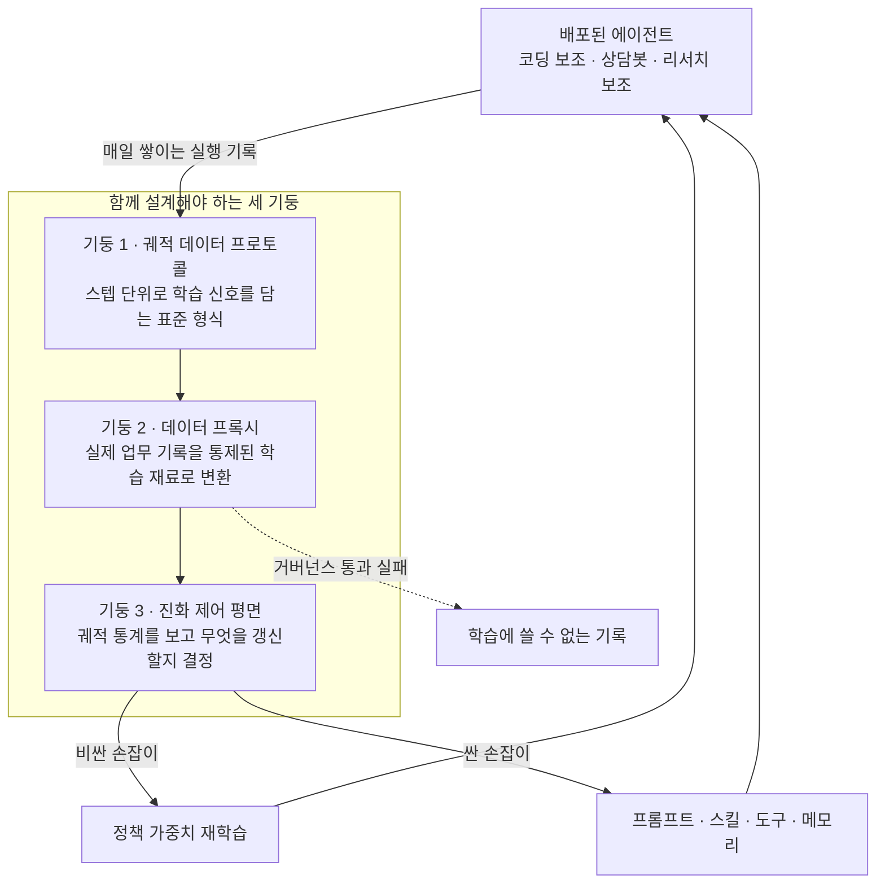

에이전트를 프로덕션에 올린 다음 날부터 이상한 일이 벌어집니다. 사용자는 매일 그 에이전트를 쓰고, 에이전트는 매일 수천 건의 작업을 처리하는데, 정작 에이전트는 배포된 첫날에서 한 발짝도 나아가지 않습니다. 가중치도 고정이고 시스템 프롬프트도 고정이고 도구 목록도 고정입니다. 쌓이는 것은 로그뿐이고 그 로그는 대개 관측 대시보드를 한 번 지나간 뒤 사라집니다. 2026년 7월 1일 arXiv에 올라온 논문 한 편은 이 정지 상태의 범인을 조금 뜻밖의 곳에서 지목합니다. 모델도 아니고 알고리즘도 아니고, 배관입니다.

*매일 쌓이지만 어디로도 흘러가지 않는 기록이 이 논문의 출발점입니다.*

## 왜 읽어야 하나

에이전트를 이미 배포했고 그 에이전트가 시간이 지나도 나아지지 않아 다음 모델 릴리스를 기다리고 계신 분을 위한 글입니다. 결론을 먼저 말씀드리면, 여러분이 기다려야 하는 것은 더 좋은 모델이 아니라 여러분이 아직 만들지 않은 데이터 배관입니다. 지금 에이전트가 매일 만들어 내는 실행 기록은 학습에 쓸 수 있는 형태가 아니고, 그것을 학습 가능한 형태로 바꾸는 일은 알고리즘 문제가 아니라 시스템 문제입니다.

## 개요

논문 제목은 「Next-Generation Agentic Reinforcement Learning Systems Enable Self-Evolving Agents」이고 arXiv 번호는 2607.01120입니다. 2026년 7월 1일에 올라왔고 다음 날 개정판이 나왔습니다. 저자들은 Ant Group과 홍콩과기대, 칭화대 소속입니다. 이름만 보면 또 하나의 RL 알고리즘 논문 같지만 내용은 그렇지 않습니다. 새 알고리즘을 제안하지 않고, 새 벤치마크 점수를 자랑하지도 않습니다. 대신 하나의 입장을 세웁니다.

논문의 입장은 이렇게 요약됩니다. 기업 규모에서 자기진화 에이전트를 가로막는 가장 큰 병목은 더 강력한 LLM의 부재도 아니고 더 효과적인 RL 알고리즘의 부재도 아니며, 배포된 에이전트의 경험을 통제 가능하고 크레딧 할당이 가능하며 재생 가능한 학습 재료로 바꿔 주는 시스템 기반의 부재라는 것입니다.

*논문이 세운 입장을 한 장으로 옮기면 이렇습니다.*

이 주장이 흥미로운 이유는 그것이 반증 가능한 형태로 서 있기 때문입니다. 만약 병목이 알고리즘이라면 더 좋은 알고리즘이 나올 때마다 배포된 에이전트가 나아져야 합니다. 그런데 현실은 그렇지 않습니다. 지난 이 년 동안 RL 알고리즘도 좋아지고 모델도 좋아졌지만, 기업에 배포된 에이전트 대부분은 여전히 사람이 로그를 눈으로 읽고 프롬프트를 손으로 고쳐서 다시 배포하는 방식으로만 개선됩니다. 논문은 그 느린 수동 루프가 게으름 때문이 아니라 배관이 없어서라고 말합니다.

## 논문이 짚은 세 가지 공백

논문은 현재의 agentic RL 시스템과 그 주변 관측 스택이 세 가지 측면에서 부족하다고 정리합니다. 이 세 가지가 논문의 뼈대이므로 하나씩 보겠습니다.

첫째, 이기종 에이전트 패러다임을 가로질러 스텝 단위로 RL 학습 신호를 실어 나를 수 있는 표준화된 에이전트 궤적 데이터 프로토콜이 없습니다. 여기서 중요한 단어는 스텝 단위입니다. 우리가 보통 남기는 로그는 요청과 응답 수준입니다. 그런데 에이전트가 열 번의 도구 호출 끝에 틀린 답을 냈을 때 학습에 필요한 정보는 결과가 틀렸다는 사실이 아니라 열 단계 중 어느 단계에서 어긋났는가입니다. 그 정보를 담을 그릇이 표준화되어 있지 않다는 지적입니다.

*학습에 필요한 정보는 실패했다는 사실이 아니라 어디에서 어긋났는가입니다.*

둘째, 실제 업무 부하를 통제된 학습 기질로 변환하는 기업급 데이터 프록시가 없습니다. 이 부분은 기술보다 거버넌스 이야기에 가깝습니다. 고객 데이터가 섞인 실행 기록을 그대로 학습에 쓸 수는 없습니다. 정제하고 권한을 확인하고 필요하면 재생할 수 있어야 하는데, 그 계층을 제품으로 갖춘 곳이 거의 없습니다.

셋째, 궤적 통계를 근거로 정책 가중치를 갱신할지 아니면 컨텍스트 하네스를 진화시킬지를 자동으로 판단하는 통합된 에이전트 진화 제어 평면이 없습니다. 이것이 세 공백 중 가장 실전적입니다. 에이전트가 잘 안 될 때 우리가 고를 수 있는 손잡이는 여러 개입니다. 프롬프트를 고칠 수도 있고 스킬을 추가할 수도 있고 메모리를 갱신할 수도 있고 모델을 다시 학습시킬 수도 있습니다. 각각 비용이 백 배 이상 차이 납니다. 그런데 어느 손잡이를 당길지 결정하는 일은 지금 거의 전부 사람의 감으로 이뤄집니다.

*손잡이마다 비용이 다릅니다. 슬라이드의 배수는 크기 차이를 보여 주기 위한 예시이며 논문이 제시한 측정값은 아닙니다.*

논문은 이 세 공백에 대응하는 세 기둥을 함께 설계해야 한다고 제안합니다. 표준화된 궤적 데이터 프로토콜, 기업급 데이터 프록시, 통합 진화 제어 평면입니다. 셋을 따로 만들면 안 되고 함께 설계해야 한다는 점을 강조합니다.

## 세 기둥은 어떻게 맞물리나

*세 기둥이 끊기면 기록은 대시보드를 지나 사라집니다. 이어지면 하나의 순환이 됩니다.*

이 그림에서 눈여겨볼 곳은 오른쪽 아래로 빠지는 점선입니다. 데이터 프록시가 거버넌스를 통과시키지 못하면 그 기록은 학습에 쓸 수 없습니다. 논문이 데이터 프록시를 별도 기둥으로 세운 이유가 여기 있습니다. 기술적으로 수집 가능한 데이터와 법적으로 학습에 쓸 수 있는 데이터는 다른 집합이고, 기업 환경에서 후자는 전자보다 훨씬 작습니다.

## 선행 구현으로 언급되는 AReaL

논문의 주장이 순수한 사고 실험만은 아닙니다. 같은 진영에서 나온 실제 시스템이 있습니다. Ant Research의 RL Lab과 칭화대 교차정보연구원이 함께 만든 AReaL이 그것이고, boba²라는 이름이 붙은 버전이 완전 비동기 RL 시스템을 표방합니다.

AReaL의 핵심 설계는 생성과 학습을 완전히 분리하는 것입니다. 전통적인 동기 방식 RL에서는 롤아웃을 모아 놓고 그다음에 학습을 돌리기 때문에 GPU가 번갈아 놀게 됩니다. 비동기로 떼어 놓으면 생성 쪽과 학습 쪽이 각자의 속도로 돌 수 있습니다. 프로젝트는 이 구조로 동기 방식 대비 약 2.77배의 학습 속도를 주장하며, LiveCodeBench와 Codeforces, CodeContests에서 당시 기준 최고 성능을 보고했습니다. 이 수치는 프로젝트 측의 자체 보고임을 감안해 읽으시는 편이 좋습니다.

실용적으로 더 중요한 부분은 따로 있습니다. AReaL은 데이터셋과 롤아웃 동작, 학습 알고리즘을 각각 독립적으로 바꿀 수 있게 만들었고, 그 과정에서 무거운 시스템 레벨 코드를 건드리지 않아도 되도록 경계를 그었습니다. 이것이 바로 논문이 말하는 기둥 하나의 구체적 형태입니다. 학습 재료의 형식과 시스템의 실행 방식을 분리해 두어야 재료를 바꿔 가며 진화시킬 수 있습니다. 8B와 14B, 32B 규모의 모델이 공개되어 있어 구조를 직접 열어 볼 수도 있습니다.

## 우리 정책 파일에 같은 자를 대보면

이 논문이 마음에 걸렸던 이유는 세 번째 기둥이 남 이야기가 아니었기 때문입니다. ThakiCloud의 자동화 스킬들은 이미 제어 평면 비슷한 것을 갖고 있습니다. `scripts/skills/skill_model_policy.json`이라는 파일이 스케줄 스킬 열여덟 개의 모델 등급을 관리하고, `skill_retro.py`가 매 실행 종료 시 결과를 기록해 정책을 갱신합니다.

규칙은 단순합니다. 스킬은 기본적으로 저렴한 등급에서 시작하고, 연속으로 나쁜 실행이 두 번 쌓이면 상위 등급으로 자동 승격되며, 깨끗한 실행이 나오면 연속 실패 카운터가 초기화됩니다. 자동 강등은 없습니다. 논문의 용어로 옮기면 이것은 궤적 통계를 근거로 갱신 대상을 결정하는 제어 평면의 축소판입니다. 현재 열여덟 개 중 열 개가 등급 고정 상태이고 여섯 개가 상위 등급에서 돌고 있습니다.

그런데 이 파일을 논문의 렌즈로 다시 읽으면 두 가지 실패가 눈에 들어옵니다. 둘 다 실제로 겪은 일이고 파일에 기록이 남아 있습니다.

첫 번째 실패는 궤적 통계의 품질 문제입니다. 정책 파일의 여러 항목에 계정 주간 사용량 한도로 인한 실패가 품질 실패로 잘못 집계되어 등급이 잘못 올라갔다는 기록이 남아 있습니다. 오케스트레이션 성격의 스킬 두 개가 그렇게 상위 등급으로 승격됐고, 나중에 원인을 파악한 뒤 수동으로 되돌렸습니다. 논문의 첫 번째 공백이 정확히 이 지점을 가리킵니다. 신호가 스텝 단위로 구분되지 않으면 실패의 종류를 구분할 수 없고, 종류를 구분하지 못하는 통계 위에서 내리는 결정은 틀립니다. 쿼터 소진과 품질 미달은 같은 종료 코드로 보이지만 처방은 정반대입니다.

두 번째 실패는 손잡이가 하나뿐이라는 문제입니다. 정책 파일의 한 항목은 2026년 7월 11일에 상위 등급으로 승격됐는데, 그 이후로도 연속 실패 카운터가 스물한까지 올라가 있습니다. 승격이 문제를 해결하지 못했다는 뜻입니다. 우리 제어 평면이 당길 수 있는 손잡이가 모델 등급 하나뿐이었기 때문에, 원인이 다른 곳에 있었을 때 할 수 있는 일이 없었습니다. 논문이 제어 평면을 정의하면서 가중치 갱신과 컨텍스트 하네스 진화를 나란히 놓은 이유가 여기 있습니다. 손잡이가 하나면 그것은 제어 평면이 아니라 자동 승격 스위치입니다.

*두 실패를 논문의 기둥에 대응시키면 무엇이 비어 있었는지가 드러납니다.*

## ThakiCloud 제품 적용 시사점

**Paxis 관점**에서 이 논문은 로드맵처럼 읽힙니다. Paxis는 ai-platform 위에서 도는 Agent-Native Cloud 제어 평면으로 Skills와 Tools, Policies, Audit Logs를 일급 리소스로 다룹니다. 이 네 가지를 논문의 세 기둥에 대응시키면 그림이 맞아떨어집니다. 감사 로그는 궤적 데이터가 태어나는 자리이고, 정책은 데이터 프록시가 통과 여부를 판정하는 규칙이며, 스킬과 도구는 제어 평면이 가중치 대신 당길 수 있는 싼 손잡이입니다.

이미 갖고 있는 것과 아직 없는 것을 구분하면 다음 작업이 분명해집니다. 감사 로그는 있지만 스텝 단위 학습 신호를 담는 형식은 아직 아닙니다. 정책 게이트는 있지만 그것이 실행 기록을 학습 재료로 승격시키는 통로로 이어지지는 않습니다. 스킬 실행 로그를 재생 가능한 궤적 형식으로 정의하는 일이 세 기둥 중 첫 번째에 해당하고, 나머지 둘은 그 위에서만 세울 수 있습니다. 순서가 정해져 있다는 점이 이 논문에서 얻는 가장 실용적인 것입니다.

**ai-platform 관점**에서는 두 번째 기둥이 곧 인프라 요구사항입니다. 실행 기록을 학습 재료로 바꾸려면 그 기록을 어딘가에 보관하고 정제하고 재생해야 하는데, 고객 데이터가 섞인 기록에서 이 작업은 데이터가 어느 물리적 경계 안에 머무는지의 문제가 됩니다. 온프레미스와 소버린 요구가 있는 고객에게 이것은 협상 대상이 아니라 전제 조건입니다. K8s 기반 멀티테넌트 격리와 Kueue GPU 스케줄링 위에 궤적 수집과 재생 파이프라인을 옵션 기능으로 얹을 수 있다면, 그것은 관측 기능이 아니라 자기진화의 전제 조건을 파는 일이 됩니다.

두 렌즈는 한 방향을 가리킵니다. ai-platform이 데이터가 머무는 경계를 물리적으로 보장하고, 그 안에서 Paxis가 궤적을 학습 재료로 승격시키는 정책을 집행합니다. 논문이 세 기둥을 따로 만들지 말라고 한 이유가 이 두 계층의 관계에서도 그대로 드러납니다.

*두 계층은 따로 설계할 수 없습니다. 아래가 경계를 보장해야 위가 정책을 집행할 수 있습니다.*

## 한계 및 반론

이 논문을 그대로 받아들이기 전에 짚어야 할 것이 몇 가지 있습니다.

첫째, 이것은 입장 논문이지 검증된 시스템 보고가 아닙니다. 세 기둥이 필요하다는 주장은 설득력 있지만, 세 기둥을 다 갖춘 시스템이 실제로 기업 규모에서 자기진화를 달성했다는 측정은 논문 안에 없습니다. 아키텍처 제안과 작동 증명 사이에는 큰 간격이 있고, 이 논문은 아직 앞쪽에 서 있습니다.

둘째, 표준 프로토콜이 크레딧 할당을 대신 풀어 주지는 않습니다. 스텝 단위로 신호를 담을 그릇을 만드는 일과 열 단계 중 어느 단계가 실패의 원인인지 판정하는 일은 다른 문제입니다. 뒤쪽이 원래 어려운 문제이고, 그릇이 생긴다고 저절로 풀리지 않습니다. 논문은 그릇의 부재를 강조하지만 그릇이 채워진 다음의 난이도는 상대적으로 적게 다룹니다.

셋째, 거버넌스 비용이 이득을 넘어설 수 있습니다. 실제 업무 기록을 학습 재료로 바꾸는 일은 곧 고객 데이터를 오래 보관한다는 뜻이고, 규제 산업에서는 그 자체가 협상하기 어려운 조건입니다. 데이터 프록시가 이 문제를 푸는 계층으로 제안되지만, 현실에서는 프록시를 만드는 비용보다 데이터를 아예 안 쓰기로 결정하는 편이 싼 경우가 많습니다.

넷째, 자동 갱신 결정 자체가 위험합니다. 우리 정책 파일의 두 사례가 보여 주듯, 잘못된 통계 위에서 자동으로 내려진 결정은 조용히 비용을 올리고 원인을 가립니다. 제어 평면이 똑똑해질수록 그 판단의 근거를 사람이 추적하기 어려워지는 방향으로 갑니다. 자동화의 이득과 추적 가능성의 손실을 함께 계산해야 합니다.

다섯째, AReaL의 성능 수치는 프로젝트 자체 보고입니다. 비동기 구조가 동기 대비 빠르다는 것은 구조적으로 납득 가능하지만, 2.77배라는 구체적 배수는 독립 재현이 아니라 개발 주체의 측정입니다. 인용할 때 출처를 함께 밝히는 편이 안전합니다.

## 정리

이 논문의 값어치는 새로운 기법이 아니라 문제의 재배치에 있습니다. 에이전트가 나아지지 않는 이유를 모델이나 알고리즘에서 찾던 시선을, 매일 쌓이지만 아무 데도 흘러가지 않는 실행 기록 쪽으로 돌려 놓습니다.

서두에서 말씀드린 결론이 이것이었습니다. 기다려야 하는 것은 더 좋은 모델이 아니라 아직 만들지 않은 데이터 배관입니다. 실제로 우리도 같은 자를 대보고 나서야, 갖고 있다고 생각했던 제어 평면이 사실은 손잡이 하나짜리 승격 스위치였고 그 스위치가 잘못된 신호 위에서 두 번 헛돌았다는 것을 확인했습니다. 그 전까지 그것은 잘 돌아가는 자동화처럼 보였습니다.

배포한 에이전트가 몇 달째 그대로라면, 다음 모델 릴리스 일정을 확인하기 전에 질문 하나를 먼저 던져 보시길 권합니다. 어제 그 에이전트가 만든 실행 기록은 지금 어디에 있고, 그것으로 무엇을 바꿀 수 있습니까. 답이 대시보드에서 끝난다면 병목은 모델이 아닙니다.

*질문 하나로 진단이 끝납니다. 답이 대시보드에서 멈추면 배관이 없는 것입니다.*

## 출처

- [Next-Generation Agentic Reinforcement Learning Systems Enable Self-Evolving Agents (arXiv:2607.01120)](https://arxiv.org/abs/2607.01120)
- [해당 논문 개정판 (arXiv:2607.01120v2)](https://arxiv.org/abs/2607.01120v2)
- [AReaL 오픈소스 저장소 (inclusionAI/AReaL)](https://github.com/inclusionAI/AReaL)
- [AReaL-boba-2-32B 모델 카드 (Hugging Face)](https://huggingface.co/inclusionAI/AReaL-boba-2-32B)
- [AReaL: A Large-Scale Asynchronous Reinforcement Learning System for Language Reasoning (arXiv:2505.24298)](https://arxiv.org/abs/2505.24298)
- [Ant Group과 칭화대의 AReaL-boba² 공개 보도 (DeepNewz)](https://deepnewz.com/china/ant-group-tsinghua-launch-open-source-areal-boba2-async-rl-system-2-77x-faster-24c514e7)
