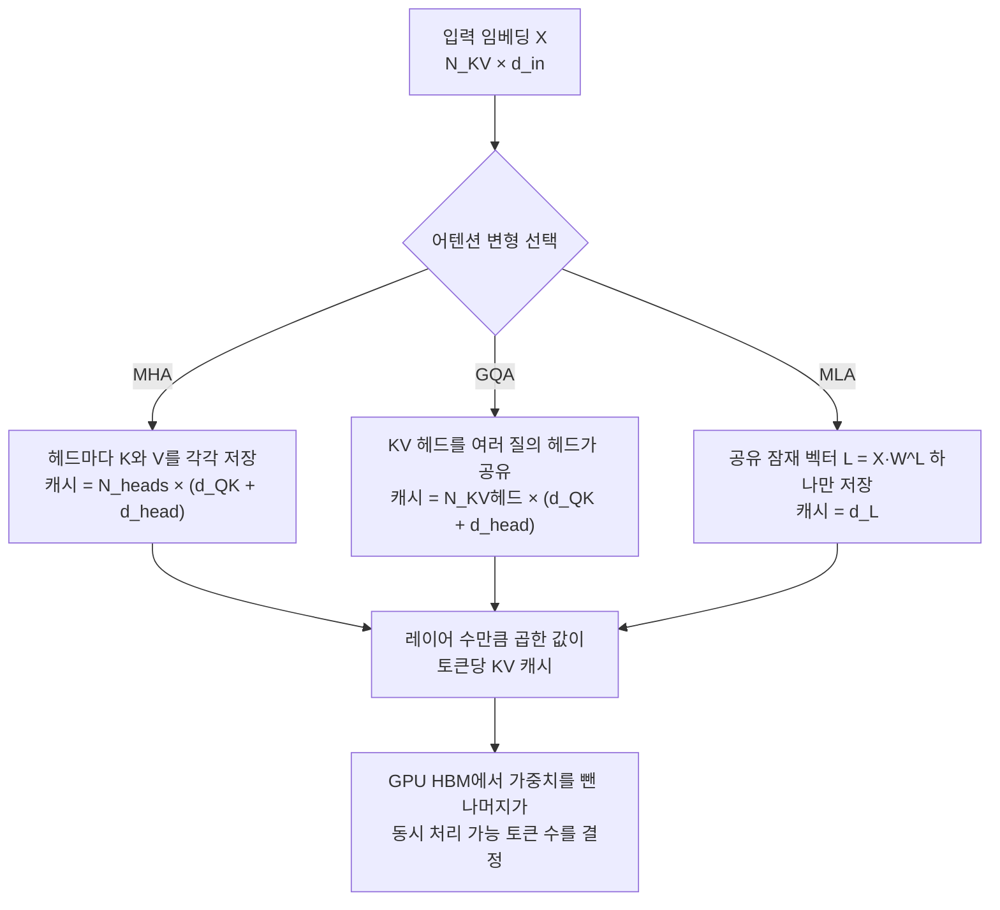

*여러 헤드가 각자 들고 있던 키·값 캐시가 하나의 공유 잠재 벡터로 압축되는 과정을 표현했습니다.*

## 왜 읽어야 하나

vLLM이나 SGLang으로 오픈웨이트 LLM을 서빙하면서 "이 모델을 우리 GPU 몇 장에 올릴 수 있나"를 산정해야 하는 인프라 엔지니어를 위한 글입니다. 결론을 먼저 말씀드리면, 토큰당 KV 캐시 용량은 모델의 파라미터 수와 거의 무관하며 레이어 수와 KV 헤드 수, 헤드 차원 세 가지만으로 결정됩니다. 그래서 27B 모델이 70B 모델보다 토큰당 캐시를 더 많이 쓰는 상황이 실제로 발생합니다.

이 글은 그 계산을 손으로 해봅니다. 근거는 2026년 4월 arXiv에 올라온 [Understanding Transformers and Attention Mechanisms: An Introduction for Applied Mathematicians](https://arxiv.org/abs/2604.00965)입니다. 스위스 폴 셰러 연구소(Paul Scherrer Institute)의 Michel Fabrice Serret가 쓴 13쪽짜리 입문 논문으로, IPAM의 "Randomized Numerical Linear Algebra" 워크숍에서 "Randomization in Transformer models" 프로젝트를 위한 발표 자료로 작성됐습니다. arXiv 분류도 머신러닝이 아니라 수치해석(math.NA)입니다.

## 개요

트랜스포머 해설 글은 이미 넘칩니다. 이 논문이 다른 점은 독자를 응용수학자로 상정했다는 데 있습니다. 비유나 그림으로 직관을 주는 대신, 각 구성 요소가 어떤 차원의 행렬이고 무엇을 메모리에 남기는지를 표로 못박습니다. 실무자에게 유용한 지점이 정확히 여기입니다. 서빙 용량 산정은 결국 "무엇이 몇 개의 float으로 메모리에 남는가"라는 질문이고, 논문의 표 1과 표 2가 그 답을 그대로 제공합니다.

논문은 텍스트를 벡터로 만드는 토큰화와 임베딩에서 출발해 어텐션을 데이터베이스 조회에 빗대어 정의합니다. 키와 값의 쌍으로 이루어진 데이터베이스에 질의를 던지면 값이 돌아오는 구조인데, 어텐션은 질의와 키가 정확히 일치할 때만이 아니라 유사도로 가중한 값들의 선형결합을 돌려줍니다. 이 기본형에서 멀티헤드 어텐션으로 넘어가고, 마지막 절에서 연산량과 메모리를 줄이는 세 가지 기법, 즉 KV 캐싱과 그룹 질의 어텐션(GQA), 잠재 어텐션(MLA)을 다룹니다. 이 글이 파고드는 부분이 그 마지막 절입니다.

## 어텐션은 무엇을 캐시하는가

자기회귀 생성에서 모델은 토큰을 하나씩 뱉습니다. 새 토큰을 만들 때마다 이전 토큰 전체의 키와 값 벡터가 필요한데, 매번 다시 계산하면 낭비이므로 메모리에 쌓아둡니다. 이것이 KV 캐시입니다. 논문은 이 덕분에 새 토큰 하나를 추가하는 비용이 토큰 수에 선형이 되고, 전체로는 `O(N_tokens² · d)` 복잡도가 된다고 정리합니다. 대신 대가가 따릅니다. 레이어마다, 헤드마다 키와 값 벡터를 들고 있어야 하므로 메모리 비용이 `2 · N_L · N_h · N_KV · d`에 float 하나의 비트 수를 곱한 만큼 발생합니다. 논문의 표현대로 "특히 긴 컨텍스트에서 이 비용은 금세 감당하기 어려워집니다".

이 병목을 줄이는 첫 번째 방법이 GQA입니다. 여러 질의 헤드가 키와 값 헤드를 공유하는 방식으로, 메모리에 남겨야 할 벡터 수를 질의 헤드 수가 아니라 KV 헤드 수로 낮춥니다. KV 헤드가 하나만 남는 극단이 멀티질의 어텐션(MQA)입니다. 여기서 중요한 사실은 캐시 크기를 정하는 것이 질의 헤드 수가 아니라 KV 헤드 수라는 점입니다. 파라미터 수와 캐시가 어긋나기 시작하는 지점이 바로 여기입니다.

두 번째가 DeepSeek이 도입한 잠재 어텐션입니다. 키와 값을 각각 저장하는 대신, 공유 저차원 잠재 공간으로 한 번 사영한 벡터 `L = X·W^L` 하나만 토큰당 남깁니다. 논문 표현대로 "모든 헤드가 공유하는 토큰당 단 하나의 캐시 벡터"입니다. 게다가 잠재 형식으로 쓰면 가중치 행렬을 합칠 수 있습니다. 잠재-질의 가중치와 잠재-키 가중치를 곱해 하나로 만들고, 잠재-값 가중치는 출력 가중치와 합쳐집니다. 결과적으로 추론 시점에 들고 있어야 할 행렬 자체가 줄어듭니다.



*논문 표 1과 표 2를 흐름으로 옮긴 것입니다. 세 갈래 모두 마지막에는 레이어 수를 곱한 값이 토큰당 캐시가 됩니다.*


*세 방식의 차이를 한 장으로 정리하면 이렇습니다. 헤드마다 키와 값을 들던 것을 공유로, 다시 토큰당 잠재 벡터 하나로 줄여 온 흐름입니다.*

## 논문 공식을 코드로 옮기기

논문의 표 1은 멀티헤드 어텐션이 메모리에 남기는 텐서를, 표 2는 잠재 어텐션의 텐서를 정리합니다. 캐시에 해당하는 항만 뽑으면 이렇게 됩니다. MHA와 GQA는 토큰당 레이어당 `N_KV헤드 × (d_QK + d_head)` 개의 float을, MLA는 `d_L` 개의 float을 남깁니다. 논문은 GQA에 대해 "캐시 항과 W^K, W^V의 `N_heads`를 KV 헤드 수로 바꾸면 된다"고 명시합니다.


*식에 등장하는 항은 세 개뿐이고, 파라미터 수는 어디에도 들어가지 않습니다.*

여기에 논문 표 3이 제시하는 세 모델의 스펙을 넣으면 바로 숫자가 나옵니다. 계산은 다음과 같이 짧은 스크립트로 옮겼습니다.

```python
BYTES_PER_FLOAT = 2  # fp16/bf16, 서빙 표준 dtype

def cache_floats_per_token(m):
    """토큰당 전체 레이어 합산 KV 캐시 float 개수."""
    if m.kind == "mla":
        return m.layers * m.d_head          # 헤드 공유 잠재 벡터 d_L 하나
    return m.layers * m.kv_heads * (m.d_head + m.d_head)   # K와 V, KV 헤드마다
```

논문 표 3의 값을 그대로 믿지 않고, 공개된 HuggingFace `config.json`과 대조하는 단계를 넣었습니다.

```python
url = f"https://huggingface.co/{repo}/raw/main/config.json"
# num_hidden_layers / num_attention_heads / num_key_value_heads(또는 kv_lora_rank) / hidden_size 비교
```

전체 스크립트는 저장소의 `scripts/blog/_kvcache_math_20260803.py`에 있고, 실행 결과는 `outputs/blog-impl/transformer-attention-kv-cache-math/run-1.log`에 그대로 남겼습니다.

## 실제 계산 결과

세 모델의 토큰당 KV 캐시는 이렇게 나왔습니다. 모두 fp16 기준이고 전체 레이어를 합산한 값입니다.

| 모델 | 어텐션 | 레이어 | KV 헤드 | 토큰당 캐시 | 128k 컨텍스트 |
|---|---|---|---|---|---|
| Gemma 3 27B | GQA | 62 | 16 | 496 KiB | 62 GiB |
| Llama 3 70B | GQA | 80 | 8 | 320 KiB | 40 GiB |
| DeepSeek V2 | MLA | 60 | 잠재 512 | 60 KiB | 7.5 GiB |


*논문 표 1·표 2의 공식에 표 3의 모델 스펙을 넣어 계산한 값입니다. 128k 컨텍스트는 모델 간 비교를 위해 통일한 가정값이며, 각 모델이 실제로 지원하는 최대 컨텍스트와는 다릅니다.*


*모델 크기 순서와 캐시 크기 순서가 뒤집히는 지점입니다.*

가장 눈에 띄는 결과는 Gemma 3 27B가 Llama 3 70B보다 토큰당 캐시를 1.55배 더 쓴다는 사실입니다. 파라미터로는 Llama 쪽이 2.6배 가까이 큰데도 그렇습니다. 이유는 공식에 그대로 드러납니다. 캐시를 정하는 것은 `레이어 수 × KV 헤드 수`이고, Gemma 3 27B는 62 × 16 = 992인 반면 Llama 3 70B는 80 × 8 = 640입니다. Llama 쪽이 레이어는 더 많지만 KV 헤드를 8개로 더 공격적으로 줄였고, 그 차이가 파라미터 수의 차이를 뒤집었습니다.

GQA가 실제로 얼마나 절약하는지도 같은 공식으로 확인됩니다. Llama 3 70B가 질의 헤드 64개마다 각자 키와 값을 들었다면 토큰당 2560 KiB가 필요했을 텐데, KV 헤드 8개를 공유해 320 KiB로 정확히 8배 줄었습니다. 질의 헤드 수를 KV 헤드 수로 나눈 값이 그대로 절감 배수가 됩니다. Gemma 3 27B는 32개 헤드에 KV 헤드 16개이므로 절감 배수가 2배에 그칩니다.

DeepSeek V2의 잠재 어텐션은 다른 층위의 결과를 보여줍니다. 토큰당 60 KiB로 Gemma 3 27B 대비 8.3배 적습니다. 헤드가 128개로 세 모델 중 가장 많은데도 그렇습니다. 헤드마다 캐시를 두지 않고 512차원 잠재 벡터 하나만 공유하기 때문입니다.

교차 검증 결과도 정직하게 적습니다. 세 저장소 중 인증 없이 `config.json`을 읽을 수 있었던 것은 `deepseek-ai/DeepSeek-V2` 하나였고, 여기서는 논문 표 3의 값과 완전히 일치했습니다. 레이어 60개, 헤드 128개, `kv_lora_rank` 512, `hidden_size` 5120이 모두 맞았습니다. Llama 3 70B와 Gemma 3 27B는 게이트가 걸린 저장소라 스크립트가 `unreachable`을 반환했고, 두 모델 값은 논문 표 3을 그대로 사용했습니다.

## ThakiCloud 제품 적용 시사점

이 계산은 다키클라우드 **ai-platform**의 용량 산정과 곧바로 맞물립니다. ai-platform은 쿠버네티스 위에서 Kueue로 GPU를 스케줄링하고 vLLM으로 모델을 서빙하는데, 멀티테넌트 환경에서 노드 하나에 동시에 몇 개의 세션을 태울 수 있느냐가 단가를 좌우합니다. 그 상한을 정하는 것이 정확히 이 KV 캐시 수치입니다.

H200 4장(HBM 합계 약 564GB) 노드를 예로 들어 보겠습니다. Llama 3 70B를 fp16으로 올리면 가중치가 약 140GB를 차지하고 420GB 남짓이 남습니다. 토큰당 320 KiB이므로 산술적으로는 약 130만 토큰분의 캐시가 들어가고, 128k 컨텍스트 세션으로 환산하면 열 개 안팎입니다. 실제로는 활성화 메모리와 페이지 단편화가 있어 이보다 줄지만, 자릿수를 잡는 데는 충분합니다. 같은 노드에 잠재 어텐션 계열 모델을 올리면 토큰당 캐시가 한 자릿수 배로 줄어 동시 세션이 그만큼 늘어납니다. 온프레미스나 소버린 환경처럼 GPU를 무한정 늘릴 수 없는 구축에서는 이 차이가 곧 도입 가능 여부입니다.

실무적으로 세 가지가 따라옵니다. 첫째, 모델 선정 시 파라미터 수만 보고 메모리를 가늠하면 안 됩니다. `config.json`의 `num_hidden_layers`와 `num_key_value_heads`를 직접 곱해봐야 합니다. 둘째, 긴 컨텍스트를 파는 서비스일수록 KV 헤드 구조가 원가에 직결됩니다. 셋째, vLLM의 `gpu_memory_utilization`과 `max_model_len`을 감으로 조정하기 전에 이 공식으로 이론 상한을 먼저 계산해 두면 튜닝 범위가 크게 좁아집니다.

**Paxis** 관점에서도 쓸모가 있습니다. Paxis는 ai-platform 위에서 도는 Agent-Native Cloud 제어 평면이고, 스킬 하네스가 매 턴 어떤 모델을 호출할지 고릅니다. 에이전트 워크로드는 긴 대화 이력과 도구 출력이 계속 누적되는 특성상 컨텍스트가 길어지기 쉬워, 모델 선택이 토큰 단가뿐 아니라 캐시 점유량에도 영향을 줍니다. 잠재 어텐션 계열 모델이 같은 노드에서 더 많은 동시 에이전트를 감당한다는 사실은 라우팅 정책에 반영할 만한 근거입니다.

## 한계 및 반론

이 글의 숫자는 측정값이 아니라 계산값입니다. 벤치마크를 돌려 얻은 것이 아니라 논문의 차원 표에 공개된 모델 스펙을 대입한 결과이므로, 실제 vLLM이 잡는 메모리와는 차이가 납니다. vLLM은 PagedAttention으로 블록 단위 할당을 하고 블록 내부 단편화가 생기며, 프리픽스 캐시 공유나 양자화된 KV 캐시를 쓰면 수치가 또 달라집니다.

논문 자체의 한계도 분명합니다. 13쪽짜리 워크숍 발표 자료이고 저자도 서두에서 "간단한 소개"라고 밝힙니다. 새로운 기법을 제안하지 않으며 실험도 없습니다. 표 3의 모델 세 개는 예시일 뿐 최신 모델을 망라하지 않고, Llama 3와 Gemma 3, DeepSeek V2 모두 2026년 8월 기준으로는 이미 여러 세대 뒤입니다. 다만 여기서 유용한 것은 특정 모델의 숫자가 아니라 공식이며, 공식은 새 모델의 `config.json`에도 그대로 적용됩니다.


*위치 인코딩이 개입하는 순간 잠재 어텐션의 수학적 등가성이 깨지고, 실제 구현은 절충안을 택합니다.*

잠재 어텐션이 언제나 우월하다는 결론도 성급합니다. 논문은 중요한 단서를 답니다. 위치 인코딩이 없으면 잠재 어텐션은 저랭크 분해를 통해 GQA나 MHA와 정확히 등가로 표현되지만, RoPE 같은 위치 인코딩을 적용하는 순간 그 등가성이 깨집니다. RoPE는 키를 만든 뒤에 적용되는데 잠재 형식에서는 그 순서 때문에 행렬 병합이 불가능해지고, 오히려 매 평가마다 위치 인코딩을 다시 계산하는 오버헤드가 생깁니다. 그래서 실제 구현은 키와 질의에 위치 인코딩을 적용할 "비잠재" 부분을 따로 이어붙이는 절충을 택합니다. 계산 이득은 지키지만 수학적 등가성은 포기하는 셈입니다. 캐시 크기만 보고 아키텍처를 고를 수 없는 이유입니다.

마지막으로 KV 캐시는 추론 메모리의 한 축일 뿐입니다. 가중치 자체가 여전히 가장 큰 덩어리이고, 배치 크기가 작으면 병목은 용량이 아니라 대역폭 쪽으로 옮겨갑니다.

## 정리

토큰당 KV 캐시는 `레이어 수 × KV 헤드 수 × (d_QK + d_head)`로 결정되고, 파라미터 수는 이 식에 등장하지 않습니다. 그래서 Gemma 3 27B가 Llama 3 70B보다 토큰당 1.55배 더 쓰고, 잠재 어텐션을 쓰는 DeepSeek V2는 8.3배 적게 씁니다. 서두에서 말씀드린 "캐시는 모델 크기를 따라가지 않는다"는 결론이 세 모델 모두에서 그대로 확인됐습니다.


*모델을 고르기 전에 거치면 좋은 세 단계입니다.*

다음에 서빙할 모델을 고르실 때 할 일은 간단합니다. `config.json`을 열어 `num_hidden_layers`와 `num_key_value_heads`, `head_dim`을 곱하고 2를 곱한 뒤 dtype 바이트 수를 곱하십시오. 그 값이 토큰당 캐시이고, 목표 컨텍스트 길이와 동시 세션 수를 곱하면 필요한 HBM이 나옵니다. GPU 견적을 뽑기 전에 5분이면 끝나는 계산이며, 이 논문은 그 5분이 왜 타당한지를 수식으로 설명해 줍니다.

## 출처

- 논문: [Understanding Transformers and Attention Mechanisms: An Introduction for Applied Mathematicians](https://arxiv.org/abs/2604.00965) (arXiv:2604.00965, math.NA, 2026년 4월 1일 등재, 13쪽)
- 저자: Michel Fabrice Serret, Center for Scientific Computing, Theory and Data, Paul Scherrer Institute
- 교차 검증: [deepseek-ai/DeepSeek-V2 config.json](https://huggingface.co/deepseek-ai/DeepSeek-V2/raw/main/config.json)
- 계산 스크립트와 원본 로그: `scripts/blog/_kvcache_math_20260803.py`, `outputs/blog-impl/transformer-attention-kv-cache-math/run-1.log`
