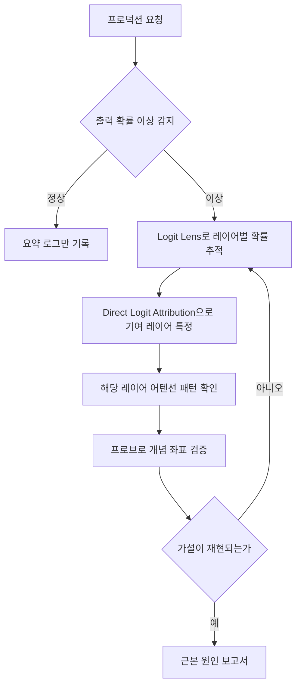

프로덕션에 올라간 모델이 특정 사용자군에게만 이상한 답을 내놓는데, 로그에는 최종 확률값 하나만 남아 있는 상황을 겪어본 적이 있으실 겁니다. 이 글은 그럴 때 "왜 그렇게 됐는가"를 모델 내부에서 직접 추적하려는 엔지니어를 위한 글입니다. 규제 대응이든 순수한 버그 재현이든, 결과 로그만으로는 답을 찾을 수 없는 순간에 무엇을 열어봐야 하는지를 다룹니다.

보통의 소프트웨어 디버깅은 스택 트레이스를 보고 변숫값을 확인하는 것으로 시작합니다. 그런데 트랜스포머 모델에서 입력은 고차원 벡터 공간의 한 점이고, 그 점은 레이어를 통과할 때마다 비선형 함수로 변형됩니다. 브레이크포인트를 놓을 자리가 마땅치 않습니다. 게다가 같은 입력이라도 배치 크기나 부동소수점 반올림에 따라 출력이 미묘하게 달라질 수 있어서, 지금 보는 이상 출력이 진짜 버그인지 그저 임의성인지부터 구별하기 어렵습니다. 금융, 의료, 채용처럼 위험도가 높은 영역에서 EU AI Act 같은 규제가 의사결정 설명 의무를 요구하는 이유도 여기에 있습니다. 모델이 정답을 맞혔다는 사실만으로는 충분하지 않고, 그 답에 도달한 근거를 추적할 수 있어야 합니다.

대부분의 프로덕션 시스템은 이 요구를 감당할 로그를 갖고 있지 않습니다. 남아 있는 것은 최종 토큰의 확률분포뿐이고, 그 값이 나오기까지 각 레이어에서 무슨 일이 벌어졌는지는 이미 지나가 버린 뒤라 사후에 복원할 수 없습니다. 그래서 이번 글에서 다루는 기법들은 전부 사고가 터진 뒤 급하게 배우는 것이 아니라, 문제가 생기기 전에 어떤 신호를 남겨둘지를 미리 설계하는 데 목적이 있습니다. 모델 내부를 들여다보는 방법은 크게 세 갈래로 나뉩니다. 어느 레이어가 답을 만들었는지 추적하는 메커니즘 관점, 모델이 형성한 의미 공간의 구조를 통계로 파악하는 표상 관점, 입력과 출력을 대량으로 대조해 행동 프로파일을 쌓는 관점입니다. 세 관점은 서로 배타적이지 않고, 메커니즘 추적이 표상 분석의 가설을 던져주면 행동 측정이 그 가설을 다시 검증하는 순환 구조를 이룹니다.

## 레이어를 통과하며 답이 여물어가는 과정을 들여다봅니다

가장 직관적인 진입점은 Logit Lens입니다. 트랜스포머의 각 레이어는 잔차 스트림이라 불리는 벡터를 다음 레이어로 전달하는데, 이 벡터에 최종 출력층인 lm_head의 가중치를 곱하면 그 시점에서 모델이 어떤 단어를 다음 토큰으로 선호하는지 알 수 있습니다. lm_head는 단순한 선형 변환이라서, 마지막 레이어뿐 아니라 중간 레이어의 벡터도 같은 방식으로 디코드할 수 있다는 점이 이 기법의 핵심입니다.

"The capital of France is"라는 문장을 넣고 각 레이어의 출력을 어휘로 디코드해 보면, 초반 레이어에서는 표면적인 단어들이 상위권을 차지하다가 레이어가 깊어질수록 정답인 "Paris"의 확률이 점진적으로 올라가는 모습을 확인할 수 있습니다. 정답이 어느 레이어부터 형성되기 시작하는지를 눈으로 보는 셈입니다.

```python
import torch
from transformers import AutoModel, AutoTokenizer

def logit_lens(model, tokenizer, prompt, top_k=5):
    inputs = tokenizer(prompt, return_tensors="pt")
    with torch.no_grad():
        output = model(**inputs, output_hidden_states=True)

    lm_head = model.lm_head.weight.T  # (hidden, vocab)
    results = {}
    for layer_idx, hidden in enumerate(output.hidden_states):
        last_token = hidden[0, -1, :]
        probs = torch.softmax(last_token @ lm_head, dim=-1)
        top = torch.topk(probs, k=top_k)
        results[layer_idx] = [
            (tokenizer.decode([idx]), round(p.item(), 3))
            for idx, p in zip(top.indices, top.values)
        ]
    return results
```

Logit Lens가 확률 분포 전체의 변화를 보여준다면, Direct Logit Attribution은 한 걸음 더 들어가서 특정 토큰이 선택된 이유를 레이어별 기여도로 분해합니다. 최종 로짓은 모든 레이어가 각각 lm_head에 기여한 값의 합이라는 사실에서 출발합니다. 각 레이어의 잔차 스트림 출력을 목표 토큰에 해당하는 lm_head 벡터와 내적하면, 그 레이어가 정답 토큰의 로짓을 얼마나 밀어 올렸는지 숫자로 얻을 수 있습니다.

```python
def direct_logit_attribution(model, tokenizer, prompt, target_token):
    inputs = tokenizer(prompt, return_tensors="pt")
    with torch.no_grad():
        output = model(**inputs, output_hidden_states=True)

    target_id = tokenizer.encode(target_token)[0]
    lm_col = model.lm_head.weight[target_id]  # (hidden,)

    contributions = {}
    for layer_idx, hidden in enumerate(output.hidden_states):
        last_token = hidden[0, -1, :]
        contributions[layer_idx] = torch.dot(last_token, lm_col).item()
    return contributions
```

이 방법은 "어느 레이어가 답을 결정지었는가"를 정량적으로 보여주지만 한계도 뚜렷합니다. 레이어 간 상호작용을 무시하고 기여를 선형으로 가정하기 때문에, 실제로는 레이어들이 서로 영향을 주고받는데도 그 부분이 계산에서 빠집니다. 그리고 이 숫자는 상관관계일 뿐 인과관계를 증명하지 않습니다. 특정 레이어의 기여도가 높다고 해서 그 레이어가 문제의 원인이라고 단정할 수는 없습니다. 후속 검증 없이 이 수치만으로 결론을 내리면 잘못된 레이어를 고치는 실수를 하게 됩니다.

## 어텐션과 활성값에서 오류의 자리를 찾습니다

Logit Lens가 "무엇이 선택됐는가"를 보여준다면, 어텐션 패턴은 "왜 그 토큰에 주목했는가"를 보여줍니다. HuggingFace Transformers에서는 `output_attentions=True`를 켜면 모든 레이어, 모든 헤드의 쿼리와 키 사이 소프트맥스 결과를 그대로 얻을 수 있습니다.

리뷰 요약 모델이 "배달이 빨랐어요"라는 긍정적인 문장을 부정적인 요약으로 바꿔버리는 상황을 예로 들어보겠습니다. 최종 로그만 봐서는 왜 이런 결과가 나왔는지 짐작조차 어렵습니다. 하지만 문제가 된 입력에 대해 레이어별 어텐션을 뽑아서 정상 입력의 분포와 비교해 보면, 특정 헤드가 "빨랐어요"라는 토큰에는 거의 주목하지 않고 근처에 있던 "배달"이라는 단어에만 과도하게 집중하고 있는 경우를 발견할 수 있습니다. 이런 패턴이 반복된다면, 훈련 데이터에서 "배달"이라는 단어가 부정적 맥락과 자주 함께 등장했을 가능성을 의심해 볼 수 있습니다.

```python
import numpy as np

def anomaly_score(anomaly_attn, normal_attn, eps=1e-10):
    """정상 어텐션 분포 대비 이상 정도를 KL divergence로 측정합니다"""
    p = normal_attn + eps
    q = anomaly_attn + eps
    return float(np.sum(p * np.log(p / q)))
```

이 정도의 진단으로 원인 후보를 좁혔다면, 다음 질문은 "그 방향을 실제로 조작하면 출력이 바뀌는가"입니다. 개념을 활성화하는 문장들과 그렇지 않은 문장들을 모아 특정 레이어의 은닉 상태 평균을 각각 구하고, 그 차이를 스티어링 벡터로 삼아 원래 입력에 더해보는 방법이 여기서 씁니다. 벡터를 더한 뒤 출력이 의도한 방향으로 실제로 움직인다면, 그 레이어의 그 방향이 해당 개념과 관련이 있다는 증거가 하나 더 쌓이는 셈입니다. 다만 벡터의 크기를 지나치게 키우면 문장 자체가 부자연스러워지므로 작은 스케일부터 조심스럽게 시험하는 편이 안전합니다. 이 실험은 상관관계를 인과관계에 조금 더 가깝게 만드는 확인 절차이지, 그 자체로 최종 증거는 아니라는 점을 기억해야 합니다.

같은 접근을 조금 다른 각도로 쓸 수도 있습니다. 모델이 겉으로는 무난한 답을 내놓으면서도 후반 레이어의 특정 방향에서 민감한 주제와 관련된 활성값이 평소보다 유독 높게 나타나는 경우가 있습니다. 정상 입력군과 의심되는 입력군 각각에 대해 레이어별 기여도 분포를 구하고 통계적으로 유의한 차이가 있는지 비교하면, 겉으로 드러난 출력과 내부에서 실제로 진행된 처리 사이에 괴리가 있는지를 가늠하는 단서로 삼을 수 있습니다. 다만 이 역시 통계적 신호일 뿐이므로, 유의한 차이가 나왔다고 해서 곧바로 결론을 내리기보다는 추가 조사가 필요한 후보로 다루는 편이 안전합니다.

## 의미 공간에 좌표를 매깁니다: 프로브와 그 한계

레이어 하나가 특정 개념을 얼마나 분명하게 표현하고 있는지 확인하는 가장 단순한 방법은 선형 프로브입니다. 모델의 은닉 상태를 입력으로 받아 특정 레이블을 예측하는 선형 분류기를 학습시키고, 그 정확도로 해당 레이어가 그 개념을 얼마나 선형적으로 분리해서 담고 있는지를 가늠합니다.

```python
from sklearn.linear_model import LogisticRegression
from sklearn.metrics import accuracy_score
import torch

def extract_layer_vectors(model, tokenizer, texts, layer):
    vectors = []
    for text in texts:
        inputs = tokenizer(text, return_tensors="pt", truncation=True, max_length=128)
        with torch.no_grad():
            output = model(**inputs, output_hidden_states=True)
        vectors.append(output.hidden_states[layer][0, -1].numpy())
    return vectors

def train_and_score(model, tokenizer, texts, labels, layer):
    X = extract_layer_vectors(model, tokenizer, texts, layer)
    probe = LogisticRegression(max_iter=1000).fit(X, labels)
    preds = probe.predict(X)
    return probe, accuracy_score(labels, preds)
```

여러 레이어에서 같은 개념의 프로브 정확도를 비교하면, 대략적인 경향을 관찰할 수 있습니다. 문법에 가까운 정보는 비교적 이른 레이어에서 잘 분리되고, 문장 전체의 의미론적 정보는 중반 레이어에서, 감성이나 어조처럼 더 추상적인 정보는 후반 레이어에서 잘 분리되는 경향이 보고됩니다. 이 정보를 조직 내부 지식으로 확장하면, 모델이 특정 사실을 어느 레이어에 저장하고 있는지 추적해서, 잘못된 정보를 학습했을 때 어느 지점을 살펴봐야 하는지 실마리를 얻을 수 있습니다.

여기서 정직하게 짚어야 할 한계가 있습니다. 프로브 정확도가 높다고 해서 그 개념이 실제로 그 레이어에서 독립적인 방향으로 분리되어 있다는 직접적인 증거는 아닙니다. 분류기가 여러 특징의 복잡한 조합을 학습했을 가능성도 충분히 있습니다. 또한 프로브가 찾아낸 좌표와 모델이 실제로 수행하는 계산 사이의 관계는 단정할 수 없습니다. 어떤 레이어에서 프로브 성능이 높게 나왔다고 해서 그 레이어가 해당 개념을 "처리"하고 있다고 말하기는 이릅니다. 다른 레이어에서 먼저 처리된 결과가 그저 그 레이어에 반영되었을 수도 있기 때문입니다. 이 기법들이 공통으로 갖는 한계는 결국 하나로 모입니다. 해석가능성 도구는 가설을 세우는 데는 강하지만, 그 가설을 확정하는 데는 개입 실험 같은 별도의 검증이 반드시 필요합니다.

이런 진단들을 매번 손으로 반복하기는 어렵습니다. 그래서 실무에서는 이상 신호가 감지된 요청에 한해 Logit Lens와 어텐션 분석, 프로브 검증을 순서대로 걸어보는 파이프라인을 구성합니다. 모든 요청의 내부 상태를 저장하면 비용이 감당하기 어려운 수준으로 커지므로, 평소에는 출력 확률 같은 가벼운 요약값만 남기고, 확률 분포가 평소와 크게 어긋나는 요청에 한해서만 어텐션과 은닉 상태를 상세히 기록하는 조건부 수집이 현실적인 절충안입니다.



이 파이프라인에서 진짜 관건은 임계값입니다. 임계값을 낮게 잡으면 알림이 많아지지만 그중 실제 문제인 비율은 낮아지고, 높게 잡으면 알림은 줄지만 진짜 이상을 놓칠 위험이 커집니다. 정답은 이론이 아니라 최소 몇 주간의 정상 동작 데이터를 먼저 모아 분포를 파악한 뒤, 그 분포에서 크게 벗어난 지점을 기준으로 조금씩 조여가는 방식으로만 찾을 수 있습니다.

## ThakiCloud 관점에서

저희는 고객사 온프렘 환경에 K8s 기반 AI 플랫폼을 직접 서빙합니다. 이 조건은 해석가능성 작업에서 뜻밖의 이점으로 작용합니다. 외부 API로 모델을 호출하는 구조에서는 이번 글에서 다룬 어텐션이나 은닉 상태 자체에 접근할 방법이 없습니다. 반면 저희처럼 모델 서빙 스택을 직접 운영하면 forward 패스 중간값을 추출하는 코드를 서빙 파이프라인에 바로 붙일 수 있고, 그 데이터를 외부로 내보내지 않고도 진단에 쓸 수 있습니다.

다만 이 이점이 저절로 실현되지는 않습니다. 모든 요청에 대해 전체 레이어의 활성값을 저장하는 방식은 스토리지와 지연 시간 모두에서 감당하기 어렵습니다. 그래서 저희 플랫폼에서는 출력 확률 분포 같은 가벼운 신호를 상시로 감시하다가, 이상 신호가 감지된 요청에 한해서만 상세 내부 상태를 조건부로 수집하는 구조를 우선으로 권합니다. 규제 대응이 목적이라면 이 로깅 범위를 처음부터 감사 요건에 맞춰 설계해야 하고, 순수 디버깅이 목적이라면 최근 요청 몇천 건 정도의 롤링 버퍼로도 충분한 경우가 많습니다. 목적에 따라 수집 범위를 다르게 잡는 것이 비용과 진단력 사이의 균형점입니다.

고객사마다 이 균형점이 다르게 잡힌다는 점도 실무에서는 중요합니다. 같은 K8s 클러스터 위에서도 채용 심사처럼 규제 대응이 앞서는 워크로드와, 사내 챗봇처럼 순수 디버깅 편의가 앞서는 워크로드가 함께 돌아갑니다. 로깅 정책을 플랫폼 공통 설정 하나로 통일하기보다는, GPU 스케줄링 계층에서 우선순위를 나누듯 워크로드별로 수집 강도를 다르게 정의할 수 있는 구조를 두는 편이 결국 운영 부담을 줄여줍니다.

## 정리

로그에 남은 최종 확률값 하나로는 모델이 "왜" 그렇게 답했는지 알 수 없습니다. Logit Lens는 레이어를 거치며 답이 만들어지는 과정을 보여주고, Direct Logit Attribution은 어느 레이어가 그 답에 가장 크게 기여했는지 숫자로 분해합니다. 어텐션 패턴은 모델이 무엇에 주목했는지를, 프로브는 그 레이어가 특정 개념을 얼마나 선형적으로 분리해서 담고 있는지를 보여줍니다. 이 도구들은 모두 강력한 가설 생성기이지만 그 자체로 인과관계를 증명하지는 못한다는 한계를 안고 있습니다. 개입 실험으로 가설을 검증하고, 이상 신호가 있을 때만 상세 데이터를 조건부로 수집하는 파이프라인으로 엮을 때 비로소 프로덕션에서 실제로 쓸 수 있는 진단 체계가 됩니다.

이 글의 내용은 저희가 정리한 전자책 『AI Interpretability Engineering: 프로덕션 모델의 Decision을 읽는 기술』의 일부를 블로그용으로 다시 쓴 것입니다.

## 챕터 삽화


