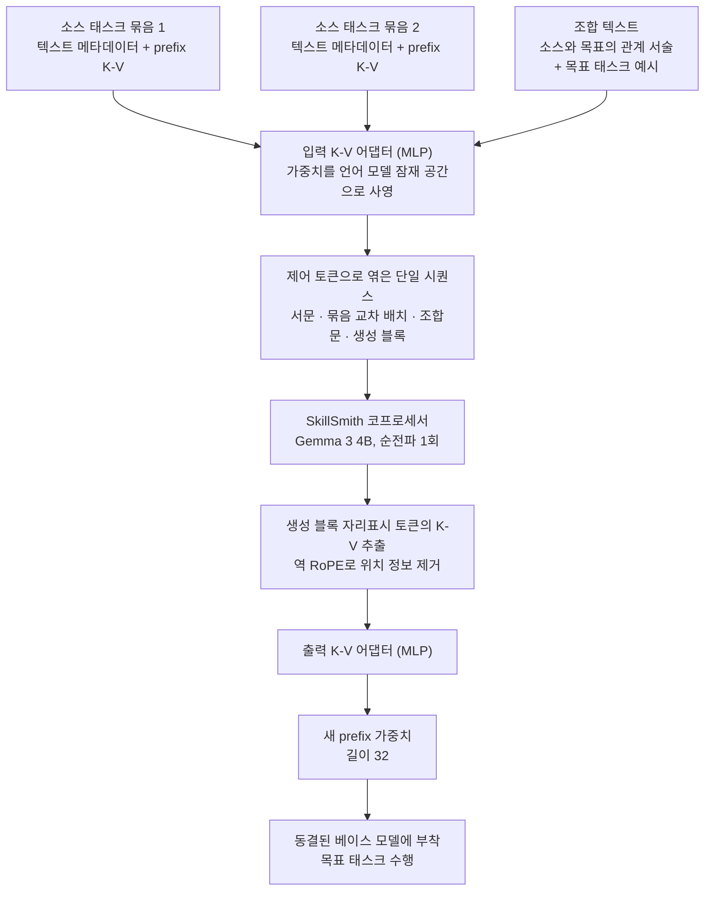

에이전트에 스킬을 붙이는 방법은 오랫동안 두 갈래였습니다. 하나는 글로 적어두는 쪽입니다. 태스크 설명과 예시 몇 개, 지난번에 실패한 이유를 적은 반성 노트를 문서로 남겨두고 필요할 때 컨텍스트에 얹습니다. 다른 하나는 가중치로 굽는 쪽입니다. 반복되는 하위 작업마다 LoRA나 prefix 모듈을 하나씩 학습해 어댑터 서랍에 넣어두고 꺼내 씁니다. 두 방식은 십수 년째 서로 다른 학회 세션에서 논의돼 왔고, 실무에서도 대체로 둘 중 하나를 고르는 문제로 취급됩니다. 2026년 7월 29일 arXiv에 올라온 구글 딥마인드 논문은 이 선택지 자체를 다시 봅니다.


*글로 적어둔 스킬과 가중치로 구워둔 스킬을 같은 화로에 넣으면 어떻게 되는가가 이 논문의 질문입니다.*

## 왜 읽어야 하나

에이전트에 스킬 라이브러리를 붙여 운영하시는 분, 그러니까 SKILL.md 같은 문서 스킬을 수백 개 쌓아두었거나 태스크별 LoRA 어댑터를 관리하고 계신 분을 위한 글입니다. 결론을 먼저 말씀드리면, 두 방식은 대체재가 아니라 서로를 못 채우는 보완재이며, 한 모델에 둘을 동시에 먹였을 때만 나오는 성능 구간이 실제로 존재합니다. 논문의 절단 실험에서 텍스트만 준 경우와 가중치만 준 경우 사이의 격차보다, 텍스트만 준 경우와 둘 다 준 경우 사이의 격차가 더 결정적이었습니다.

## 개요

논문 제목은 「SkillSmith: Learning to Compose Parametric Skills and Textual Knowledge」이고 arXiv 번호는 2607.27497입니다. Lucio M. Dery와 Benedict Aaron Tjandra가 공동 1저자이고 Adhiguna Kuncoro, Arthur Szlam 등 일곱 명이 참여했습니다. 분류는 cs.CL이고 저자들이 스스로 붙인 키워드는 model merging, kv-caches, continual learning, prefix tuning 네 개입니다.

논문이 지적하는 현재 상황은 이렇습니다. LLM 기반 에이전트가 과거 경험에서 배우는 경로는 크게 두 가지인데, 하나는 자기반성이나 구조화된 메모리, 프롬프트 최적화처럼 자연어로 지식을 합성하는 경로이고 다른 하나는 PEFT로 반복 작업의 행동을 모듈 가중치에 굳혀 두는 경로입니다. 그런데 이 둘을 잇는 다리가 없습니다. 텍스트 경로는 유연하지만 추론 시점의 컨텍스트 한계에 갇히고, 가중치 경로는 추론 효율은 좋지만 병합 연산이 평균이나 연결 같은 산술에 머물러 태스크 사이의 의미 관계를 전혀 못 씁니다.

논문이 드는 예가 직관적입니다. 어떤 에이전트가 한 세션에서 영어를 트위어로 번역하는 prefix 캐시를 학습했고, 다른 세션에서는 영문 법률 문서 분석에 관한 노트를 정리해 두었다고 합시다. 이제 트위어로 쓰인 법률 문서를 분석하라는 새 작업이 들어옵니다. 에이전트는 이 작업이 번역 능력과 트위어 언어 모델링, 법률 문서 분석의 조합이라는 것을 말로는 설명할 수 있습니다. 그런데 그 설명을 가지고 실제 가중치를 만들어낼 방법이 없습니다. 말로 아는 것과 가중치로 하는 것 사이가 끊겨 있는 것입니다.

## 이 기술은 무엇인가

SkillSmith의 발상은 한 문장으로 요약됩니다. 가중치를 LLM이 원래 읽을 줄 아는 또 하나의 모달리티로 취급하자는 것입니다.

구체적으로 파라메트릭 스킬을 prefix-tuning으로 구현합니다. LoRA가 아니라 prefix 방식을 고른 데는 분명한 이유가 있습니다. 텍스트 조각은 베이스 모델에 한 번 순전파를 태우면 그대로 K-V 캐시가 되므로, 텍스트에서 유래한 캐시와 학습으로 만든 캐시가 같은 공간에 놓입니다. 두 모달리티를 잇겠다는 목표에 이보다 자연스러운 표현은 없습니다.

SkillSmith는 소스 태스크 묶음을 받습니다. 각 묶음은 학습된 prefix K-V 캐시 하나와 그 태스크를 설명하는 텍스트 메타데이터 하나로 이루어집니다. 여기에 소스 태스크들이 목표 능력과 어떻게 연결되는지를 서술한 조합 텍스트가 더해집니다. 이 재료들을 제어 토큰으로 엮어 하나의 시퀀스로 만들고 코프로세서 LLM에 한 번 통과시킵니다.



시퀀스 구조에는 규칙이 있습니다. 맨 앞에 조합 목표를 설명하는 서문 텍스트가 오고, 그다음 소스 묶음마다 텍스트가 `<src_start>` 토큰으로 시작해 사영된 K-V가 `<kv_start>`와 `<kv_end>` 사이에 놓입니다. 묶음들이 끝나면 조합 텍스트가 붙고, `<gen_start>` 이후에 고정 길이의 자리표시 토큰들이 이어집니다. 순전파 뒤 이 자리표시 토큰 위치의 K-V만 뽑아내 역 RoPE로 위치 정보를 벗기고 출력 어댑터를 통과시키면 새 prefix 가중치가 나옵니다.

학습은 종단간입니다. 생성된 캐시를 동결된 베이스 모델에 붙여 목표 태스크의 교차 엔트로피 손실을 계산하고, 그 손실을 베이스 모델을 거쳐 SkillSmith 쪽으로 역전파합니다. 베이스 모델 가중치는 끝까지 고정입니다.

평가 설정도 눈여겨볼 만합니다. 소스 태스크의 prefix 길이는 32, 64, 128 중에서 무작위로 뽑아 다양성을 넣었고, 코프로세서와 다운스트림 모델 모두 Gemma 3 4B를 씁니다. 소스 태스크 개수는 두 개로 고정했습니다. 그리고 prefix K-V는 전역 어텐션 레이어에만 학습합니다. 지역 어텐션 레이어에 붙인 prefix는 슬라이딩 윈도가 지나가면 결국 컨텍스트 밖으로 밀려나기 때문입니다.

## 설치 및 통합

논문은 코드나 체크포인트를 공개하지 않았습니다. 그래서 SkillSmith 자체를 재현하지는 못했습니다. 대신 논문이 못 박아 둔 설정, 그러니까 Gemma 3 4B 베이스에 전역 레이어만, prefix 길이 32라는 조건에서 스킬 하나를 들고 다니는 비용이 실제로 얼마인지를 계산했습니다. 이 값은 운영 관점에서 논문의 Elo 수치보다 오히려 먼저 알아야 하는 숫자입니다.

Gemma 3 4B의 실제 설정값을 먼저 받아옵니다.

```bash
curl -s https://huggingface.co/unsloth/gemma-3-4b-it/raw/main/config.json | jq '.text_config'
# num_hidden_layers: 34, num_key_value_heads: 4, head_dim: 256,
# sliding_window_pattern: 6, torch_dtype: "bfloat16"
```

`sliding_window_pattern`이 6이므로 여섯 개 레이어마다 하나가 전역 어텐션입니다. 34개 레이어 중 전역은 다섯 개, 나머지 스물아홉 개는 지역입니다. 논문이 전역 레이어에만 prefix를 학습한다고 못 박았으니 실제로 학습되는 파라미터는 다섯 개 레이어 몫입니다.

계산 스크립트는 다키클라우드 저장소에 두었습니다.

```bash
.venv/bin/python scripts/experiments/skillsmith_prefix_budget.py
```

이 스크립트는 두 가지를 함께 잽니다. 하나는 위 설정에서 prefix K-V 하나의 파라미터 수와 바이트이고, 다른 하나는 로컬 스킬 코퍼스의 실제 크기입니다. 다키클라우드 워크스페이스에는 현재 `.claude/skills/` 아래에 SKILL.md가 1,911개 있습니다. 텍스트 스킬을 컨텍스트에 올리면 그 토큰들도 결국 K-V로 상주하므로, 두 방식을 같은 단위로 놓고 비교할 수 있습니다.

## 실제 실험 결과

먼저 우리가 계산한 예산입니다.

| 항목 | 값 |
|---|---|
| Gemma 3 4B 전역 레이어 수 | 5개 (전체 34개 중) |
| prefix 길이 32, 전역 레이어만 | 327,680 파라미터 |
| 같은 조건의 bf16 용량 | 640 KiB |
| 베이스 모델 대비 비중 | 0.0076 퍼센트 |
| prefix 길이 128일 때 | 1,310,720 파라미터 (2,560 KiB) |
| 참고: 34개 레이어 전부에 붙였다면 | 2,228,224 파라미터 (4,352 KiB) |

텍스트 쪽은 이렇습니다. 로컬 SKILL.md 1,911개의 중앙값은 6,173자이고 4자를 1토큰으로 보수적으로 환산하면 약 1,543토큰입니다. 이 분량을 Gemma 3 4B 컨텍스트에 상주시키면 전체 34개 레이어에 K-V가 잡히므로 약 205 MiB가 됩니다. 같은 스킬 하나를 파라메트릭으로 들고 있을 때의 640 KiB와 비교하면 328배 차이입니다. 시퀀스 위치 기준으로 봐도 1,543개 위치와 32개 위치이니 48배입니다.


*왼쪽은 논문 Table 1의 절단 실험이고 오른쪽은 위 스크립트가 계산한 상주 비용입니다.*

논문 쪽 수치도 정리해 두겠습니다. 저자들은 SkillSmith가 정말로 K-V 캐시를 쓰는지 확인하려고 입력을 하나씩 지워 봤습니다. Composite-SNI 메타평가 태스크에서 측정한 Elo는 다음과 같습니다.

| 입력 구성 | Elo |
|---|---|
| 입력 없음 | 1209 |
| K-V 캐시만 | 1455 |
| K-V 캐시를 뺀 나머지 전부 | 1622 |
| 전체 입력 | 1714 |

읽는 법이 중요합니다. 텍스트만 준 경우(1622)가 가중치만 준 경우(1455)보다 낫습니다. 텍스트가 더 풍부한 신호라는 뜻입니다. 그런데 둘 다 준 경우는 1714로, 텍스트만 준 경우보다 92점 더 높습니다. 가중치를 더해서 얻은 이 92점이 이 논문의 핵심 주장입니다. 저자들이 지적하듯 K-V 캐시만 쓰는 설정은 PEFT 모듈을 산술 대신 파라메트릭 함수로 합치는 기존 ATTEMPT 방식과 사실상 같습니다. 그러니 이 표는 기존 가중치 병합 계열이 어디까지 갈 수 있는지를 아래쪽에 깔아두고, 텍스트를 더했을 때의 상승 폭을 보여주는 셈입니다.

성능 상승이 단지 텍스트를 더 줘서 생긴 것 아니냐는 반론도 저자들이 직접 검증했습니다. SkillSmith에 들어간 소스 텍스트와 조합 텍스트를 전부 뽑아 목표 태스크 입력 앞에 그대로 붙이고 일반 prefix 캐시를 학습시켜 봤는데, 보조 텍스트가 기준선을 개선하기는 했지만 SkillSmith를 따라잡지는 못했습니다. 텍스트가 그냥 거기 있는 것과 가중치와 함께 합성되는 것은 다르다는 뜻입니다.

일반화 검증도 있습니다. 15개 메타평가 태스크를 부모 태스크가 메타학습에 전혀 등장하지 않은 경우, 하나만 등장한 경우, 둘 다 등장한 경우로 나눠 다시 재보니 세 구간 모두에서 SkillSmith가 앞섰습니다. 부모 태스크를 한 번도 못 본 구간에서도 큰 격차로 이겼다는 점이 특히 눈에 띕니다.

다만 모든 데이터셋에서 이긴 것은 아닙니다. 실제 SNI 데이터셋에서는 다운스트림 미세조정을 허용하자 상위 세 방법의 승률이 0.5로 수렴했습니다. 저자들은 SNI 태스크가 태스크당 인스턴스가 1,000개 수준으로 많고, 2022년에 만들어져 감성 분류나 문자 연결 같은 원시적 작업 위주라 요즘 모델에게는 너무 쉽기 때문이라고 봅니다. 반대로 태스크가 250개뿐이고 난도가 높은 MMLU-ProX에서는 격차가 다시 벌어졌습니다. 여기서 Composite-SNI 체크포인트로 부트스트랩하지 않고 MMLU-ProX만으로 학습한 변형은 제로샷 Elo 1736에 그쳤습니다.

## 다키클라우드 제품 적용 시사점

이 논문은 다키클라우드의 두 제품 모두에 걸칩니다.

**Paxis 관점**이 먼저입니다. Paxis는 다키클라우드의 Agent-Native Cloud 제어 평면으로, Skills와 Tools, Policies, Audit Logs를 일급 리소스로 다룹니다. 그 중심에 있는 Skill Harness는 현재 텍스트 스킬을 BM25로 골라 격리 샌드박스에서 실행하는 구조입니다. 이 논문이 정확히 그 구조의 비용 곡선을 건드립니다. 위에서 잰 328배라는 숫자가 그것입니다. 스킬을 텍스트로 들고 있는 한, 동시에 켤 수 있는 스킬 수는 컨텍스트 예산이 결정합니다. 그래서 라우터가 필요하고, 라우터가 틀리면 그 턴은 그냥 실패합니다.

파라메트릭 스킬은 이 제약을 다른 축으로 옮깁니다. 32개 위치짜리 prefix라면 여덟 개를 동시에 얹어도 256 위치, 5 MiB입니다. 다만 정직하게 말씀드리면 이것은 아직 교체가 아니라 보완입니다. 논문 자신의 절단 실험이 텍스트만 쓴 쪽이 가중치만 쓴 쪽보다 낫다고 말하고 있으니, 텍스트 스킬을 버리고 가중치로 옮기는 것은 논문이 지지하지 않는 방향입니다. 이 논문이 지지하는 것은 라우터가 고른 텍스트 스킬 옆에 그 스킬로 학습된 파라메트릭 대응물을 함께 놓는 구조입니다. Paxis의 자가진화 스킬 파이프라인이 이미 스킬을 만들고 고치고 평가하고 있으므로, 그 파이프라인의 산출물에 prefix 캐시를 하나 더 붙이는 것은 새 아키텍처가 아니라 기존 산출물 목록의 확장입니다.

**ai-platform 관점**은 서빙 쪽입니다. prefix 캐시는 요청마다 바뀌는 어댑터이지 모델이 아닙니다. 640 KiB짜리 객체를 테넌트별로 수천 개 보관하다가 요청이 오면 붙이는 일은 LoRA 멀티 어댑터 서빙과 형태가 같습니다. 다키클라우드의 ai-platform은 K8s와 Kueue 위에서 vLLM 서빙을 멀티테넌트로 운영하고 있으므로, 테넌트마다 다른 스킬 세트를 붙여 같은 베이스 모델을 공유하는 구성은 지금 구조에서 크게 벗어나지 않습니다. 온프렘이나 소버린 환경에서는 이 점이 특히 중요합니다. 고객사마다 별도 모델을 파인튜닝해 각각 GPU를 잡아먹는 대신, 베이스 모델 하나를 공유하고 고객사별 스킬만 KiB 단위 객체로 관리하면 GPU 점유가 고객사 수에 비례해 늘지 않습니다.

두 렌즈는 이어집니다. 스킬을 싸게 들고 다닐 수 있으면(ai-platform) 에이전트가 들고 다닐 수 있는 스킬 수가 늘고(Paxis), 스킬 수가 늘면 라우터가 틀렸을 때의 손해가 줄어듭니다.

## 한계 및 반론

가장 큰 제약은 재현 가능성입니다. 코드도 체크포인트도 공개되지 않았고, SkillSmith는 베이스 모델을 거쳐 역전파하는 종단간 메타학습을 요구합니다. 태스크별 prefix 라이브러리를 먼저 만들어야 하고, 조합 텍스트도 Gemini 2.5로 생성해야 합니다. 초기 합성 태스크가 35만 개 규모라는 서술을 보면 이 준비 과정 자체가 상당한 투자입니다. 그러니 이 결과를 자체 도메인에서 그대로 얻을 수 있으리라 기대하기는 이릅니다.

둘째로 실험 규모가 작습니다. 코프로세서와 다운스트림 모두 4B 모델 하나이고, 메타평가 태스크는 각각 15개, 10개, 6개입니다. Elo는 상대 비교 지표이므로 절대 성능을 말해 주지 않으며, 후보 집합이 바뀌면 값도 바뀝니다. 소스 태스크 개수도 두 개로 고정돼 있어 실제 에이전트가 마주하는 다중 스킬 조합으로 바로 확장되는지는 이 논문만으로 알 수 없습니다.

셋째로 SNI 결과가 보여준 수렴 현상은 적용 범위를 좁힙니다. 데이터가 넉넉하고 태스크가 쉬우면 그냥 직접 학습해도 같은 곳에 도달합니다. SkillSmith가 값어치를 하는 구간은 태스크가 어렵고 인스턴스가 적은 데이터 희소 환경입니다. 사내 도메인 작업 상당수가 여기 해당하기는 하지만, 모든 작업을 이 방식으로 처리할 이유는 없습니다.

마지막으로 위에서 계산한 328배는 저장과 상주 비용의 차이이지 성능의 차이가 아닙니다. 640 KiB짜리 prefix가 205 MiB짜리 텍스트 컨텍스트와 같은 일을 한다는 뜻이 절대 아닙니다. 논문의 절단 실험이 말하는 바가 정확히 그 반대이고, 이 글의 계산은 두 방식을 같은 자로 재보기 위한 것이지 교체를 정당화하기 위한 것이 아닙니다.

## 정리

에이전트에 스킬을 붙이는 문제에서 우리는 오랫동안 문서냐 가중치냐를 골라 왔습니다. 이 논문은 그 질문에 세 번째 답을 놓습니다. 가중치를 LLM이 읽을 수 있는 입력으로 만들어 두면, 문서로 적어둔 관계 서술이 실제 가중치를 만드는 지시문이 됩니다. 절단 실험의 92점은 그 지시문이 헛말이 아니었다는 증거입니다.

지금 스킬 라이브러리를 운영하고 계신다면, 다음 한 가지를 확인해 보시기를 권합니다. 여러분의 스킬 문서에 이 스킬이 다른 스킬과 어떻게 이어지는지를 서술한 문장이 있습니까. SkillSmith가 실제로 소비한 것은 태스크 설명이 아니라 태스크 사이의 관계 서술이었습니다. 그 문장이 없다면 나중에 파라메트릭 합성을 붙이려 할 때 가장 중요한 재료가 비어 있는 셈입니다. 반대로 그 문장이 이미 있다면, 스킬 파이프라인에 prefix 캐시를 하나 더 굽는 일은 생각보다 가까운 다음 단계입니다.

## 출처

- 논문: [SkillSmith: Learning to Compose Parametric Skills and Textual Knowledge (arXiv:2607.27497)](https://arxiv.org/abs/2607.27497)
- 저자: Lucio M. Dery, Benedict Aaron Tjandra, Siavash Samiei, Adhiguna Kuncoro, Zohar Yahav, Jiajun Shen, Arthur Szlam (Google DeepMind), 2026년 7월 29일 제출
- 베이스 모델 설정: [Gemma 3 4B config.json](https://huggingface.co/unsloth/gemma-3-4b-it/raw/main/config.json)
- 이 글의 계산 스크립트: `scripts/experiments/skillsmith_prefix_budget.py` (다키클라우드 내부 저장소)
