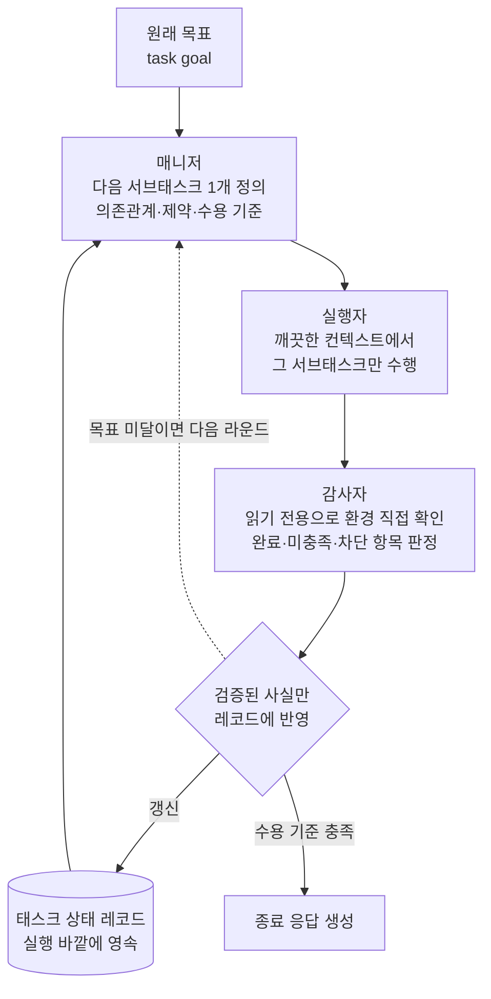

*실행은 사슬처럼 길게 이어지고, 상태는 그 사슬 바깥의 레코드에 남습니다. LongHorizon-Harness의 핵심 발상입니다.*

## 왜 읽어야 하나

에이전트를 30분이 아니라 몇 시간, 며칠 단위로 돌려야 하는 엔지니어라면 이 글이 도움이 됩니다. 특히 잘 돌던 에이전트가 20라운드쯤 지나면 앞에서 한 일을 잊거나, 이미 끝난 작업을 다시 하거나, 하지도 않은 일을 했다고 보고하는 상황을 겪어봤다면 더 그렇습니다.

결론부터 말씀드리면 이렇습니다. 장기 실행이 무너지는 주된 원인은 모델의 추론 능력이 아니라 **태스크 상태를 대화 컨텍스트 안에 두는 설계**입니다. 상태를 실행 바깥의 명시적 레코드로 빼내고, 그 레코드를 오직 환경에서 독립적으로 검증된 사실로만 갱신하면, 모델을 바꾸지 않고도 성능이 크게 오릅니다. arXiv에 올라온 LongHorizon-Harness(arXiv:2608.01964)가 그 주장을 벤치마크로 뒷받침했고, 2026년 8월 6일 오픈소스로 공개됐습니다. 저희는 이 도구를 격리된 샌드박스에 직접 설치해 CLI 표면과 설정 스키마, 그리고 논문이 말한 감사 규율이 실제로 코드에 박혀 있는지를 확인했습니다.

## 개요

지난 1년 동안 에이전트 하네스 논의는 대체로 두 방향으로 갈렸습니다. 하나는 더 좋은 모델을 쓰자는 쪽이고, 다른 하나는 컨텍스트 윈도우를 더 키우거나 요약해서 밀어 넣자는 쪽입니다. 두 방향 모두 같은 전제를 공유합니다. 에이전트가 지금까지 무엇을 했는지는 대화 히스토리에 들어 있다는 전제입니다.

LongHorizon-Harness는 그 전제를 문제로 봅니다. 대화 히스토리는 에이전트가 무엇을 했다고 **말했는지**를 담고 있을 뿐, 환경이 실제로 어떻게 바뀌었는지를 담고 있지 않습니다. 라운드가 쌓일수록 이 둘의 간격이 벌어지고, 어느 순간 에이전트는 자기가 만들어낸 서술 위에서 다음 판단을 내립니다. 컨텍스트를 아무리 키워도 잘못된 기록을 더 많이 보존할 뿐입니다.

그래서 이 연구는 장기 실행을 추론 문제가 아니라 **상태 관리 문제**로 다시 정의합니다. 태스크 상태를 실행 바깥에 명시적 레코드로 두고, 그 레코드는 환경에서 직접 확인된 사실로만 갱신하며, 다음에 할 일은 그 레코드와 원래 목표에서 다시 유도합니다. 논문이 보고한 수치는 이 재정의가 실제로 작동한다는 것을 보여줍니다. 같은 Qwen 3.7-Plus로 WeaveBench가 51.8%에서 80.7%로, Terminal-Bench 2.1이 69.7%에서 77.2%로, OSWorld 2.0이 2.8%에서 8.3%로 올랐습니다. Claude Opus 4.7도 OSWorld 2.0 부분집합에서 20.0%에서 34.3%로 올랐습니다.


*왼쪽은 논문(arXiv:2608.01964)이 보고한 수치이고 저희가 재현한 값이 아닙니다. 오른쪽은 저희가 로컬 샌드박스에서 직접 측정한 설치 풋프린트입니다.*

주목할 부분은 모델이 바뀌지 않았다는 점입니다. 하네스만 갈아 끼웠습니다.

## 이 기술은 무엇인가

핵심은 Manage-Execute-Audit(MEA) 루프입니다. 한 라운드에 세 개의 역할이 순서대로 돌고, 각 역할은 서로의 컨텍스트를 물려받지 않습니다.

**매니저**는 현재 태스크 상태 레코드를 읽고 다음 서브태스크를 하나만 정의합니다. 이때 의존관계와 제약, 그리고 무엇을 만족해야 완료로 볼지에 해당하는 수용 기준을 함께 명시합니다.

**실행자**는 그 서브태스크 하나만 수행합니다. 중요한 것은 **깨끗한 컨텍스트에서 시작한다**는 점입니다. 앞 라운드의 대화 기록을 물려받지 않기 때문에, 앞에서 쌓인 오해나 잘못된 자기 보고가 다음 라운드로 전파되지 않습니다.

**감사자**는 실행자가 무엇을 했다고 말했는지를 보지 않고, 환경을 직접 들여다봅니다. 무엇이 바뀌었고 무엇이 끝났으며 무엇이 남았는지를 스스로 판정합니다. 그리고 이 감사자는 읽기 전용입니다. 검증하는 쪽이 검증 대상을 바꿀 수 있으면 검증이 아니기 때문입니다.



*MEA 루프. 상태는 실행 바깥의 레코드에 남고, 그 레코드는 감사자가 환경에서 확인한 사실로만 갱신됩니다.*


*세 역할 사이에 놓인 두 개의 차단막이 이 설계의 핵심입니다. 왼쪽은 컨텍스트 단절이고 오른쪽은 자기 보고 차단입니다.*

기존 접근과의 차이는 여기서 갈립니다. 흔한 플랜-실행 루프는 실행자가 스스로 완료를 보고하고 플래너가 그 보고를 믿습니다. 자기 보고가 곧 상태가 됩니다. MEA 루프는 그 경로를 끊습니다. 실행자의 보고는 감사자가 환경에서 독립적으로 확인하기 전까지 상태에 반영되지 않습니다.

라운드 하나가 무엇을 들고 다니는지도 자료구조에 드러나 있습니다. `types.py`의 `ManagedRound`는 라운드 번호와 계획 텍스트, 실행자 출력, 감사자 보고를 담으면서 `task_state`와 `task_contract`를 별도 필드로 함께 나릅니다. 상태와 계약이 대화 히스토리에 섞여 흘러가는 것이 아니라 라운드 객체의 명시적 슬롯에 앉아 있는 것입니다. 계약이라는 개념이 따로 있다는 점도 흥미롭습니다. 감사자는 결과가 완료인지만 보는 것이 아니라 그 결과가 원래 합의된 계약과 어긋나지 않는지를 별도로 판정합니다.

실행자를 GUI용과 CLI용으로 나눈 것도 의도적입니다. 데스크톱 앱을 조작하는 서브태스크와 셸에서 끝나는 서브태스크는 실패 양상도 다르고 필요한 도구도 다릅니다. 감사자 역시 같은 축으로 갈라져 있어서, GUI 감사자는 화면과 스크린샷을 관찰하고 CLI 감사자는 파일 시스템과 읽기 전용 셸 명령으로 확인합니다.

## 설치 및 통합

설치는 놀랄 만큼 가볍습니다. 저희는 메인 워킹 트리를 오염시키지 않도록 격리된 git worktree 안에 임시 가상환경을 만들고 거기에 설치했습니다.

```bash
uv venv .expenv --python 3.12
VIRTUAL_ENV="$PWD/.expenv" uv pip install lh-harness
```

캐시를 비운 상태에서 실행한 결과입니다.

```
Resolved 2 packages in 139ms
Prepared 2 packages in 48ms
Installed 2 packages in 4ms
 + lh-harness==0.1.3
 + packaging==26.3
```

패키지가 두 개뿐입니다. 런타임 의존성이 `packaging` 하나입니다. 요즘 에이전트 프레임워크가 설치 한 번에 수백 메가바이트를 끌어오는 것과 비교하면 눈에 띄는 선택입니다. 이 도구는 자체 에이전트 런타임을 갖고 있지 않고, 이미 설치된 Claude Code나 Codex CLI 위에서 역할을 조율하는 얇은 층으로 설계됐기 때문입니다.

환경 점검 명령이 따로 있습니다.

```bash
lh-harness doctor
```

저희 맥북에서 나온 실제 출력입니다.

```
LongHorizon-Harness doctor (0.1.3)
Platform: macOS-26.5.2-arm64-arm-64bit
[OK  ] Python: 3.12.3
[SKIP] Project config: .lh-harness/config.toml does not exist
[OK  ] claude_code: 2.1.224 (/Users/hanhyojung/.local/bin/claude)
[WARN] codex: `codex` was not found on PATH
[OK  ] npm: 11.3.0
[OK  ] Node.js: 24.1.0
[SKIP] open-computer-use: not installed; run `lh-harness plugin install open-computer-use`
[SKIP] Computer use (claude_code): no plugin installed; GUI subtasks will have no computer-use server
[OK  ] Update: 0.1.3 is the latest version
Doctor result: ready with 1 warning(s)
```

설치된 Claude Code 버전까지 잡아내고, 없는 것은 없다고 정확히 말하며, 무엇을 설치하면 되는지까지 알려줍니다. GUI 서브태스크를 쓰려면 computer-use 플러그인을 따로 깔아야 한다는 점도 여기서 드러납니다.

프로젝트 기본값은 `lh-harness init`으로 생성합니다. 생성된 `.lh-harness/config.toml`에서 이 하네스의 설계 의도가 가장 선명하게 보입니다.

```toml
[run]
agent = "codex"
model = "gpt-5.6-sol"
max_rounds = 30

[run.timeouts]
manager = 600
gui_executor = 1800
cli_executor = 1800
auditor = 600

[run.roles.manager]
[run.roles.gui_executor]
[run.roles.cli_executor]
[run.roles.gui_auditor]
[run.roles.cli_auditor]
[run.roles.final_response]
```

역할 슬롯이 여덟 개이고, 각 슬롯마다 에이전트 구현과 모델을 따로 지정할 수 있습니다. 매니저는 Claude Code로, CLI 실행자는 Codex로, 감사자는 또 다른 모델로 돌리는 구성이 설정 파일 한 장으로 가능합니다. 타임아웃도 역할별입니다. 실행자에게는 30분을 주고 매니저와 감사자에게는 10분을 줍니다. 판단하는 역할과 일하는 역할의 시간 예산을 다르게 잡은 것입니다.

## 실제 실험 결과

먼저 분명히 해 둘 것이 있습니다. 저희는 이번에 **전체 태스크 에피소드를 끝까지 돌리지 않았습니다.** 실제 에이전트 토큰을 소비하고 computer-use 플러그인까지 설치해야 하는 작업이라 이번 회차 범위를 넘습니다. 대신 설치와 CLI 표면, 설정 스키마, 그리고 논문이 주장한 규율이 실제 코드에 강제돼 있는지를 확인했습니다. 아래 수치는 전부 저희가 로컬에서 직접 측정한 값입니다.

| 항목 | 실측값 |
|---|---|
| 콜드 설치 시간 (`--no-cache`) | 0.24초 |
| 설치 패키지 수 | 2개 (lh-harness 0.1.3 + packaging 26.3) |
| 런타임 의존성 | 1개 |
| 패키지 디스크 사용량 | 532 KiB |
| Python 소스 규모 | 8,956 LoC / 37개 파일 |
| CLI 콜드 스타트 | 733 ms |

가장 큰 파일은 `manager.py`(1,339줄), `cli.py`(1,147줄), `auditor_agent.py`(859줄)입니다. 감사자가 전체 코드베이스의 10분의 1을 차지한다는 사실 자체가 이 프로젝트의 우선순위를 보여줍니다.

그다음으로 확인한 것이 감사 결과의 자료구조입니다. `types.py`의 `AuditReport`는 이렇게 생겼습니다.

```python
@dataclass
class AuditReport:
    round_id: str
    status: Literal["complete", "incomplete", "blocked"]
    completed: list[dict[str, str]]
    missing: list[dict[str, Any]]
    blockers: list[dict[str, str]]
    integrity_status: Literal["clean", "suspect", "violation"] = "clean"
    contract_audit_status: Literal[
        "aligned", "unknown", "needs_revision", "invalid"
    ] = "unknown"
```

감사자가 산문으로 "잘 된 것 같습니다"라고 말할 자리가 없습니다. 상태는 고정된 열거형이고, 완료 항목과 미충족 항목과 차단 항목이 각각 별도 리스트로 분리됩니다. `integrity_status`에 `suspect`와 `violation`이 있다는 점이 특히 눈에 띕니다. 감사자는 결과를 판정할 뿐 아니라 그 결과가 조작됐을 가능성까지 별도 축으로 신고합니다.

읽기 전용 원칙이 프롬프트에만 적혀 있는 것인지도 확인했습니다. 세 겹으로 막혀 있었습니다.

첫째, 프롬프트에 명시돼 있습니다. `prompt_texts.py`의 감사자 프롬프트는 "클릭하거나 타이핑하거나 스크롤하거나 드래그하거나 태스크 파일을 수정하지 말라"고 지시하고, 조작된 산출물을 발견하더라도 고치거나 옮기거나 지우지 말고 신고만 하라고 덧붙입니다.

둘째, 도구 권한으로 막습니다. `adapters/claude_permissions.py`에 쓰기 도구 집합이 상수로 박혀 있습니다.

```python
_WRITE_TOOLS = ("Write", "Edit", "NotebookEdit")
```

역할별 거부 목록이 여기서 만들어지고, 감사자 정책에는 `workspace_read_only=True`가 붙습니다. 주석에 따르면 이 거부 규칙은 `--dangerously-skip-permissions` 아래에서도 계속 적용됩니다. 실행자 쪽에는 `Agent` 도구가 거부 목록에 들어 있어서 실행자가 또 다른 에이전트를 재귀적으로 띄우지 못합니다.

셋째, 사후에 탐지합니다. `auditor_agent.py`에는 `read_only_violation`이라는 진단 항목이 있고, 감사 중에 워크스페이스 파일이 바뀌면 이를 무결성 위반 증거로 기록합니다. 프롬프트가 무시되고 권한이 뚫렸을 경우까지 대비한 것입니다.


*읽기 전용이 세 겹으로 강제됩니다. 프롬프트만 믿지 않고 권한과 사후 탐지까지 겹쳐 두었습니다.*

컨텍스트 예산도 코드에 상수로 고정돼 있습니다. 감사자 출력은 24,000자, 역할별 검증된 컨텍스트는 60,000자, 히스토리는 100,000자에서 잘립니다. 컨텍스트를 무한정 늘리는 대신 상한을 명시하고, 그 안에 들어갈 내용을 감사자가 걸러내는 구조입니다. 컨텍스트 관리를 요약 품질에 맡기지 않고 문자 수 상한이라는 결정론적 규칙으로 처리한 셈입니다.

마지막으로 `lh-harness run --help`가 노출하는 플래그를 훑어봤습니다. `--manager-agent`, `--executor-agent`, `--gui-executor-model`, `--cli-auditor-model`처럼 역할과 모델을 교차로 지정하는 플래그가 열댓 개 있고, 지정하지 않으면 상위 기본값으로 단계적으로 내려가는 폴백 체계가 잡혀 있습니다. `--agent`만 주면 모든 역할이 그것을 쓰고, `--executor-agent`를 주면 GUI와 CLI 실행자가 함께 바뀌며, `--gui-executor-agent`까지 주면 그 역할만 따로 갈라집니다. 역할별 모델 배치를 설정 파일과 CLI 양쪽에서 같은 규칙으로 조정할 수 있게 만든 것입니다.

## ThakiCloud 제품 적용 시사점

저희가 이 논문을 흥미롭게 본 이유는 **Paxis**가 이미 같은 자리에 서 있기 때문입니다. Paxis는 ThakiCloud의 Enterprise Agent Platform으로, 스킬을 검색해 격리 샌드박스에서 실행하고 모든 행동을 정책 게이트와 감사 로그(Signum)로 통과시킵니다. MEA 루프의 감사자가 앉아 있는 위치가 정확히 Paxis의 감사 레이어입니다.

LongHorizon-Harness가 저희 설계에 주는 시사점은 세 가지입니다.

첫째, **감사자를 별도 역할로 분리하고 읽기 전용으로 강제하는 것**이 프롬프트 수준의 부탁이 아니라 권한 수준의 강제여야 한다는 점입니다. 저희는 이미 실행 결과를 결정론적 게이트로 검증하는 규율을 두고 있는데, 이 하네스는 거기서 한 걸음 더 나가 검증자의 쓰기 권한 자체를 도구 거부 목록으로 박아버립니다. 검증자가 대상을 고칠 수 있으면 통과율은 올라가지만 신뢰도는 떨어집니다. 이 방향은 Paxis의 정책 게이트에 그대로 옮길 수 있습니다.


*역할마다 필요한 능력이 다르므로 붙일 모델도 달라집니다. 업무 한 건의 비용은 모델 단가가 아니라 이 배분에서 결정됩니다.*

둘째, **역할별 모델 라우팅이 곧 토큰 경제성**이라는 점입니다. 설정 파일이 여덟 개 역할 슬롯을 각각 다른 모델로 채울 수 있게 열어둔 이유가 여기 있습니다. 실행자는 값싼 모델로 돌리고 매니저와 감사자만 비싼 모델로 두는 구성이 자연스럽게 나옵니다. **Metis**는 이 패턴을 Dedicated Endpoint와 Serverless로 흡수해 역할마다 다른 모델을 다른 비용으로 서빙합니다. 업무 한 건을 완주하는 데 드는 토큰 비용은 모델 단가가 아니라 어느 역할에 어느 모델을 붙였는지로 결정됩니다. 같은 워크로드를 Telox GPU 클러스터에서도, 고객 폐쇄망의 Aegis 위에서도 동일하게 돌릴 수 있다는 점이 여기에 붙습니다.

셋째, **감사 로그가 그 자체로 학습 데이터**라는 점입니다. `AuditReport`는 라운드마다 무엇이 완료됐고 무엇이 미충족이며 무엇이 막혔는지를 구조화된 형태로 남깁니다. 이 기록은 사람이 사후에 보기 위한 로그가 아니라 다음 라운드 판단의 입력입니다. **Maxis** 관점에서 보면 같은 기록이 파인튜닝과 증류의 재료가 됩니다. 실행 결과를 되먹여 고객 업무에 특화된 소형 모델로 옮겨 가는 경로가 여기서 열립니다.

정리하면 이 하네스는 저희가 이미 걸어가던 방향에 구체적인 구현 근거를 하나 더 얹어줍니다. 업무 자동화의 신뢰성은 더 똑똑한 모델이 아니라 상태를 어디에 두고 누가 그것을 갱신할 권한을 갖는지에서 나온다는 것입니다.

## 한계 및 반론

몇 가지는 분명히 짚어야 합니다.

**벤치마크 수치는 저자들이 보고한 값이고 저희가 재현하지 않았습니다.** 저희가 확인한 것은 설치와 코드 구조까지입니다. 독립 재현 결과가 나오기 전까지는 그대로 인용하되 재현값으로 취급하지 않는 것이 맞습니다.

**OSWorld 2.0의 절대 수치는 여전히 낮습니다.** 2.8%에서 8.3%는 상대적으로 세 배 가까운 상승이지만, 절대값으로는 열 번 중 한 번도 성공하지 못한다는 뜻입니다. GUI 환경의 장기 실행은 이 하네스로도 아직 풀리지 않았습니다. 상대 개선율만 보고 판단하면 과대평가하게 됩니다.

**버전이 0.1.3입니다.** 공개된 지 며칠 되지 않았고, 기본 설정이 Codex와 `gpt-5.6-sol`로 잡혀 있어서 Claude Code 중심 환경에서는 역할 슬롯을 손으로 채워야 합니다. computer-use 플러그인도 별도 설치가 필요합니다. 프로덕션에 바로 얹을 물건이라기보다 설계를 참고할 레퍼런스로 보는 편이 안전합니다.

**감사에는 비용이 붙습니다.** 라운드마다 실행자 외에 매니저와 감사자가 추가로 돌기 때문에 라운드당 호출 수가 늘어납니다. 짧은 작업에서는 이 오버헤드가 이득을 넘어섭니다. 30라운드짜리 작업에서는 상태 붕괴를 막는 값어치가 있지만, 세 라운드짜리 작업에 같은 구조를 씌우는 것은 낭비입니다.

**깨끗한 컨텍스트가 항상 이득인 것도 아닙니다.** 앞 라운드의 오해를 끊는다는 것은 앞 라운드에서 얻은 유용한 맥락도 함께 끊는다는 뜻입니다. 이 하네스는 그 손실을 태스크 상태 레코드의 품질로 메우는 도박을 합니다. 레코드가 부실하면 실행자는 매 라운드 백지에서 다시 시작하게 됩니다.


*도입을 검토한다면 이 세 가지를 함께 계산해야 합니다. 상대 개선율만 보면 판단을 그르칩니다.*

## 정리

장기 실행 에이전트를 운영하면서 라운드가 쌓일수록 품질이 떨어지는 문제를 겪고 있다면, 먼저 의심해야 할 것은 모델 등급이 아니라 상태를 어디에 두었는지입니다. LongHorizon-Harness는 상태를 실행 바깥으로 빼고 읽기 전용 감사자만 그것을 갱신하게 하는 것만으로 같은 모델에서 WeaveBench 51.8%를 80.7%로 끌어올렸다고 보고합니다.

저희가 직접 확인한 바로는 이 도구가 그 주장을 코드로 뒷받침하고 있었습니다. 감사자의 쓰기 권한은 프롬프트와 도구 거부 목록과 사후 탐지 세 겹으로 막혀 있었고, 감사 결과는 산문이 아니라 고정된 열거형으로 강제돼 있었으며, 설치는 런타임 의존성 하나에 532 KiB로 끝났습니다.

당장 해볼 만한 다음 행동은 두 가지입니다. 하나는 `pip install lh-harness && lh-harness doctor`로 지금 쓰는 에이전트 환경이 이 구조를 받을 준비가 됐는지 5분 안에 확인하는 것입니다. 다른 하나는 도구 도입과 별개로, 지금 운영 중인 파이프라인에서 **완료 판정을 내리는 주체가 그 결과를 수정할 수 있는지** 점검하는 것입니다. 그 답이 예라면 벤치마크 점수와 무관하게 고쳐야 할 부분이 이미 하나 있는 셈입니다.

## 출처

- 논문: [LongHorizon-Harness: Advancing Long-Horizon Agents for Real-World Tasks (arXiv:2608.01964)](https://arxiv.org/abs/2608.01964)
- 코드: [github.com/AMAP-ML/LongHorizon-Harness](https://github.com/AMAP-ML/LongHorizon-Harness)
- 프로젝트 페이지: [lh-harness.pages.dev](https://lh-harness.pages.dev/)
- Hugging Face 논문 페이지: [huggingface.co/papers/2608.01964](https://huggingface.co/papers/2608.01964)
- 로컬 실측 로그: 격리 샌드박스에서 캡처한 `lh-harness 0.1.3` 설치 및 CLI 출력 (macOS arm64 / Python 3.12.3)
