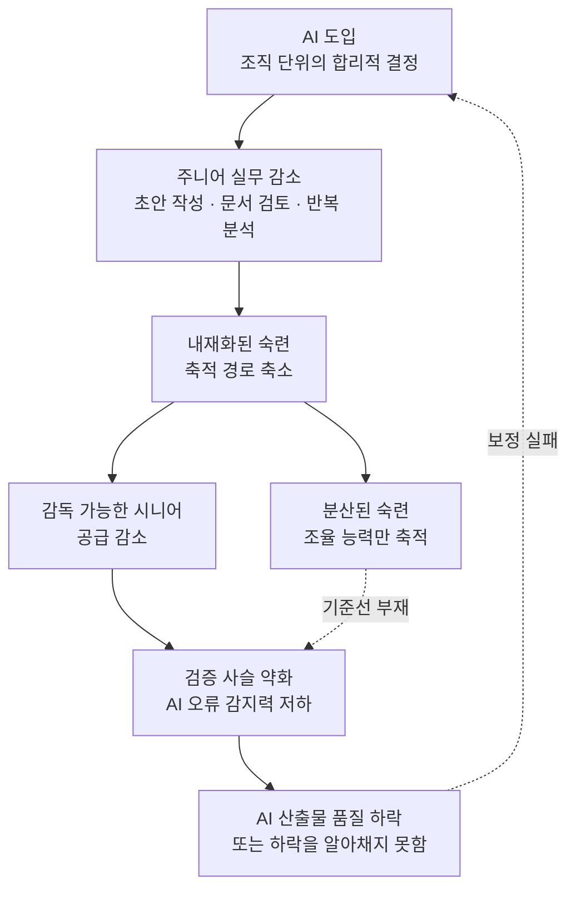

*각자의 합리적 선택이 모여 공유 저수지를 마르게 합니다.*

## 왜 읽어야 하나

에이전트 자동화를 도입하려는 기술 리더와, 주니어 채용 계획을 다시 짜고 있는 조직 책임자를 위한 글입니다. 결론부터 말씀드리면, AI 감독의 품질은 감독자의 전문성에 달려 있는데 그 전문성은 AI가 대신해주기 시작한 바로 그 업무를 직접 해보며 만들어졌습니다. 이 순환을 끊으면 몇 년 뒤 감독할 사람이 남지 않습니다. 그래서 도입 결정에는 생산성 계산만이 아니라 숙련 재생산 경로를 어떻게 보전할지가 함께 들어가야 합니다.

이 글은 저희에게도 편한 주제가 아닙니다. 저희가 파는 것이 정확히 그 주니어 업무를 흡수하는 플랫폼이기 때문입니다.

## 개요

지난주 X에서 한 논문이 돌았습니다. 자라 장루이가 소개하면서 이렇게 썼습니다. "이 논문은 여러분이 이미 몸으로 느끼고 있던 문제에 그럴듯한 이름을 붙여줍니다." 그 이름이 인지 공유지의 비극입니다.

논문은 놀런 러벳이 쓴 「The Tragedy of the Cognitive Commons: How AI Could Disrupt the Regeneration of Professional Expertise」로, 2026년 7월 arXiv에 올라왔고 SAGE 저널에도 게재됐습니다. 저자의 문제의식은 이렇습니다. 인적자원개발 연구는 AI로 인한 변화를 조직 차원의 교육 훈련 과제로 다뤄왔는데, 정작 전문성이 집단적으로 재생산되는 과정은 검토하지 않은 채 남겨뒀다는 것입니다.

익숙한 공유지의 비극 구조를 인지 영역으로 옮긴 셈입니다. 목초지에서는 각 목동이 소를 한 마리 더 놓는 것이 개인에게는 합리적이지만 모두가 그러면 풀밭이 죽습니다. 여기서 고갈되는 자원은 풀이 아니라 직군이 스스로를 갱신하는 데 필요한 공유 전문성 저장고입니다. 개별 조직이 AI를 도입해 주니어 업무를 줄이는 것은 그 조직 입장에서 완전히 합리적입니다. 문제는 그 합리적 선택들이 모여서 저장고를 마르게 한다는 점입니다.

이 흐름을 다루는 논문이 여러 갈래로 나오고 있습니다. 같은 달 마헤르 칼렐과 모하메드 엘 루아디가 같은 제목의 다른 논문을 arXiv에 올려 경제학 모형 쪽에서 접근했고, 그 이전 2026년 2월에는 대런 아세모글루를 포함한 MIT 연구진이 지식 붕괴를 다룬 논문을 냈습니다. 서로 다른 분야에서 같은 지점을 짚고 있다는 사실 자체가 신호로 읽힙니다.

## 핵심 개념 세 가지

### 내재화된 숙련과 분산된 숙련

러벳은 숙련을 두 종류로 나눕니다. 하나는 내재화된 숙련으로, 오랜 실무를 통해 몸에 붙은 깊은 도메인 지식입니다. 다른 하나는 분산된 숙련으로, 사람과 AI가 섞인 시스템을 조율하는 능력입니다.

둘은 대체재처럼 보이지만 그렇지 않습니다. 분산된 숙련은 내재화된 숙련 위에서만 제대로 작동합니다. 모델이 내놓은 답이 그럴듯한데 틀렸다는 것을 알아채려면, 그 답을 직접 만들어본 경험이 있어야 합니다. 조율만 배운 사람은 조율 대상이 헛소리를 할 때 그것을 감지할 기준선이 없습니다.

### 검증 사슬

여기서 논문의 핵심 개념이 나옵니다. 검증 사슬입니다. 효과적인 AI 감독은 AI 도입이 약화시키고 있는 바로 그 전문성에 의존한다는 명제입니다.

문장으로 쓰면 단순한데, 함의는 꽤 무겁습니다. AI 거버넌스 논의는 대부분 사람이 최종 판단을 한다는 전제 위에 서 있습니다. 휴먼 인 더 루프, 최종 승인권, 사람의 감독 같은 장치들이 그렇습니다. 검증 사슬은 그 전제가 시간에 따라 소모된다고 말합니다. 오늘의 감독자는 AI 이전 시대에 훈련받았지만, 십 년 뒤의 감독자는 AI가 이미 초안을 써주는 환경에서 자랐을 것입니다. 그 사람에게 같은 수준의 감독을 기대할 근거는 약합니다.

한 조직만 보면 이 고리는 보이지 않습니다. 각 기업은 이번 분기 생산성 개선을 보고, 몇 년 뒤 채용 시장에서 시니어를 못 구하는 것은 그때 가서 다른 문제로 인식하기 때문입니다. 외부효과가 시차를 두고 나타나는 전형적인 공유지 문제입니다.

### 사적 신호와 공적 신호

칼렐과 엘 루아디의 논문은 같은 문제를 경제 모형으로 다룹니다. 이들의 구분은 사적 신호와 공적 신호입니다. 각자가 일하며 만드는 맥락 특수적 지식이 사적 신호이고, 그것들이 모여 축적되는 얇은 공적 신호가 집단 지식 저장고입니다. 우리는 일을 하면서 두 가지에 동시에 기여합니다.

이들의 결론은 에이전트 AI가 사적 신호는 대체할 수 있지만 공적 신호를 다시 쌓지는 못한다는 것입니다. 여기에 사람의 노력이 충분히 탄력적이면, 즉 굳이 힘들여 배우지 않아도 되는 선택지가 있으면 사람들은 그 쪽을 고릅니다. 그렇게 낮은 지식 균형에 도달합니다. 균형이라는 표현이 중요합니다. 사고가 아니라 각자의 합리적 선택이 모여 안착하는 상태라는 뜻입니다.

## 증거는 어디까지 나와 있나

논문 자체는 개념 논문입니다. 저자도 인과관계를 입증했다고 주장하지 않습니다. AI 노출도가 높은 분야에서 숙련 재생산 경로에 교란이 있을 수 있다는 초기 노동시장 신호와 임상 근거를 제시하는 수준이고, 도입이 최근이라 가장 강한 신호도 선도 분야에 국한된다고 명시합니다.

이차 자료에서 자주 인용되는 수치가 하나 있습니다. 2018년부터 2024년 사이 AI 노출도가 높은 직군에서 경력 3년 이하를 요구하는 채용 공고 비중이 소프트웨어 개발은 43%에서 28%로, 데이터 분석은 35%에서 22%로, 컨설팅은 41%에서 26%로 떨어졌다는 것입니다. 다만 이 수치는 논문 초록에서 직접 확인한 것이 아니라 관련 논평 기사를 통해 접한 값이므로 원자료를 확인하기 전까지는 참고용으로만 보시는 것이 안전합니다. 법률 쪽에서는 자동 문서 검토가 1년차 어소시에이트가 하던 업무를 줄였고, 일부 대형 로펌에서 AI 교육을 필수로 지정하면서도 청구 가능 시간으로는 인정하지 않는다는 보도가 있었습니다.

한국 상황에 그대로 대입하기는 이릅니다. 다만 신입 개발자 채용 규모와 요구 경력 분포는 국내에서도 관찰 가능한 지표라, 같은 프레임으로 자체 데이터를 열어볼 가치는 충분합니다.

## ThakiCloud 제품 적용 시사점

이 논문을 소개하면서 저희 제품 자랑으로 넘어가면 앞뒤가 안 맞습니다. Paxis는 정확히 이 논문이 걱정하는 일을 합니다. 기업의 반복적인 디지털 업무를 에이전트로 흡수합니다. 그 업무 상당수가 지금까지 주니어가 하면서 배우던 것들입니다. 그래서 저희 입장에서 정직한 질문은 이것입니다. 우리 플랫폼을 감독할 사람은 어디서 만들어집니까.

**Paxis** 관점에서 저희가 실제로 하고 있는 대응은 실행 흔적을 남기는 쪽입니다. 에이전트가 어떤 스킬을 골라 어떤 순서로 실행했고 어디서 사람 승인을 받았는지가 트레이스로 남습니다. 이 트레이스는 비용 계산용 데이터이기도 하지만, 신입이 업무 흐름을 역추적하며 배우는 교재이기도 합니다. 블랙박스로 결과만 뱉는 자동화와 실행 경로가 열려 있는 자동화는 숙련 재생산 측면에서 완전히 다른 물건입니다. 검증 사슬을 유지하려면 후자여야 합니다.

휴먼 승인 게이트도 같은 맥락에서 다시 읽힙니다. 저희는 이 기능을 리스크 통제 장치로 만들었는데, 논문의 프레임으로 보면 이것은 사람이 판단을 연습하는 지점이기도 합니다. 승인 요청이 그냥 확인 버튼이 되면 통제도 학습도 둘 다 사라집니다. 승인 화면에 무엇을 근거로 보여줄지가 생각보다 중요한 설계 문제라는 뜻입니다.

**Maxis** 관점에서는 조심해야 할 지점이 있습니다. 실행 결과를 학습 데이터로 되먹여 소형 모델을 만드는 것은 저희 제품 전략의 축인데, 칼렐과 엘 루아디의 표현을 빌리면 이것은 사적 신호를 계속 소비하는 구조입니다. 공적 신호를 다시 쌓는 부분은 여전히 사람 쪽에 있습니다. 모델 성능 지표만 보고 이 순환이 자립한다고 착각하면 안 됩니다. 평가셋과 회귀 테스트를 사람이 계속 손보는 이유가 여기 있습니다.

**Signum** 관점에서는 감사 로그가 규제 대응 산출물을 넘어 조직 기억의 역할을 합니다. 누가 무엇을 승인했고 그때 무엇을 봤는지가 남으면, 나중에 들어온 사람이 판단의 맥락을 복원할 수 있습니다. 전문성 저장고를 얇게라도 유지하는 장치입니다.

정리하면 저희 결론은 자동화를 늦추자는 것이 아닙니다. 자동화하되 실행 경로를 열어두고, 승인 지점을 학습 지점으로 설계하고, 사람이 계속 손대야 하는 부분을 명확히 남겨두자는 쪽입니다.

## 한계 및 반론

가장 강한 반론은 이 걱정이 매번 반복돼왔다는 것입니다. 계산기가 나왔을 때 암산 능력을, 컴파일러가 나왔을 때 어셈블리를, 검색 엔진이 나왔을 때 기억력을 걱정했지만 직업은 사라지지 않고 추상화 층이 올라갔을 뿐입니다. 이 관점에서 보면 분산된 숙련은 내재화된 숙련의 손실이 아니라 다음 단계의 숙련입니다.

이 반론은 진지하게 다룰 가치가 있습니다. 러벳의 프레임이 이를 피해가는 지점은 감독의 비대칭성입니다. 컴파일러는 결정론적이라 틀리면 대체로 눈에 띄게 틀립니다. 언어 모델은 그럴듯하게 틀립니다. 그럴듯한 오류를 잡아내는 데 필요한 능력은 정답을 만들어본 경험과 같은 종류라, 추상화 층이 올라가도 아래층 경험이 계속 필요하다는 것이 논문의 주장입니다. 다만 이 비대칭성이 정말 질적으로 다른지는 아직 논쟁 중이고, 개념 논문 한 편으로 결론 낼 문제는 아닙니다.

두 번째 한계는 경험적 근거의 얇음입니다. 위에서 인용한 채용 공고 수치는 AI 때문인지 경기 순환 때문인지 분리하기 어렵습니다. 2022년 이후 기술 업계 채용 위축은 금리 환경만으로도 상당 부분 설명됩니다. 인과를 주장하려면 훨씬 정교한 식별 전략이 필요합니다.

세 번째로, 처방이 약합니다. 문제 구조는 선명한데 그래서 무엇을 하라는 부분은 다른 논문들도 비슷하게 추상적입니다. 칼렐과 엘 루아디는 인간 지식의 더 나은 집계를 해법으로 제시하지만 구체적인 메커니즘 설계는 연구 과제로 남겨뒀습니다. 공유지 문제의 고전적 해법인 규범과 제도로 가려면 직군 단위 조율이 필요한데, 개별 기업이 먼저 움직일 유인은 크지 않습니다.

## 정리

이 논문이 준 것은 답이 아니라 쓸 만한 어휘입니다.

내재화된 숙련과 분산된 숙련을 나눠 보면, AI 도입 논의에서 자주 뭉뚱그려지던 두 가지가 갈라집니다. 조율만 잘하면 된다는 말이 왜 부분적으로만 맞는지 설명됩니다.

검증 사슬은 AI 거버넌스 문서에 넣을 만한 개념입니다. 사람이 최종 판단을 한다는 문장 뒤에 그 사람의 판단력이 어디서 유지되는지를 한 줄 더 써야 한다는 뜻이기 때문입니다.

그리고 이것이 공유지 문제라는 진단은 왜 각 조직의 선의만으로 풀리지 않는지를 알려줍니다. 개별 합리성과 집단 결과가 어긋나는 구조에서는 개인의 결심이 아니라 설계가 바뀌어야 합니다.

에이전트 자동화를 검토 중이시라면 이번 도입 건에 한 줄만 추가해보시길 권합니다. 이 업무를 자동화한 뒤, 이 업무를 하면서 배우던 것은 어디서 배우게 됩니까. 답이 없으면 도입을 멈추라는 뜻이 아니라, 그 답을 설계에 포함시켜야 한다는 뜻입니다. 저희도 같은 질문을 저희 제품에 던지고 있습니다.

## 관련 슬라이드

본문 내용을 NotebookLM(`neo_swiss` 스타일)으로 요약한 슬라이드입니다.

## 출처

- [The Tragedy of the Cognitive Commons: How AI Could Disrupt the Regeneration of Professional Expertise](https://arxiv.org/abs/2607.29380) (Nolan Lovett, arXiv:2607.29380, 2026-07)
- [저널 게재본 (SAGE)](https://doi.org/10.1177/15344843261470602)
- [The tragedy of the cognitive commons: collective intelligence beyond AI-induced knowledge collapse](https://arxiv.org/html/2607.13272v1) (Maher Kallel, Mohamed El Louadi, arXiv:2607.13272, 2026-07-14)
- [AI, Human Cognition and Knowledge Collapse](https://economics.mit.edu/sites/default/files/2026-02/AI,%20Human%20Cognition%20and%20Knowledge%20Collapse%2002-20-26.pdf) (MIT, 2026-02)
- [The Apprenticeship Severance: How AI Is Breaking the Expertise Pipeline](https://smarterarticles.co.uk/the-apprenticeship-severance-how-ai-is-breaking-the-expertise-pipeline) (채용 공고 수치 인용 출처, 이차 자료)
- 원 트윗: [@zarazhangrui](https://x.com/hjguyhan/status/2086425750685782023) (2026-08-09)
