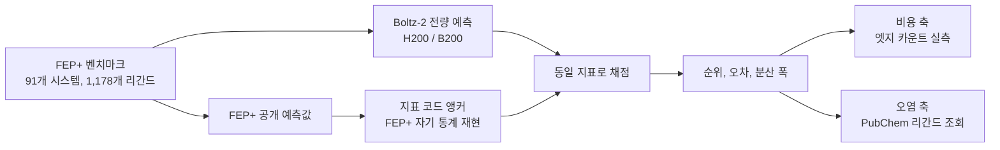

신약 스크리닝에 AI 결합 친화도 모델을 넣을지 검토 중인 연구자와, 그 워크로드를 어디서 돌릴지 정해야 하는 인프라 담당자를 위해 쓴 글입니다. 저희가 사내 H200과 B200 클러스터에서 리간드 1,178개를 전량 예측하고 물리 기반 표준과 나란히 채점한 결과, 그리고 그 과정에서 통상적인 벤치마크 읽기가 어디서 틀리는지를 정리했습니다.

결론은 셋입니다. 어느 화합물을 먼저 만들지 고르는 순위 작업에서 두 방법은 대등했습니다. 계산 비용은 최소 38배 차이가 났습니다. 그리고 흔히 인용되는 RMSE 우위는 정확도가 아니라 다른 데서 왔습니다.


*글의 핵심 개념을 형상화했습니다.*

## 무엇과 무엇을 비교했는가

먼저 용어를 정리하겠습니다.

신약 개발에서 화합물이 표적 단백질에 얼마나 세게 붙는지를 결합 친화도라고 부릅니다. 이 값을 계산으로 예측하는 표준 방법이 **자유에너지 섭동(FEP)**입니다. 화합물 A를 화합물 B로 조금씩 바꿔 가는 가상의 변환을 분자동역학으로 시뮬레이션하고, 그 과정의 에너지 차이를 적분해 "B가 A보다 얼마나 더 잘 붙는가"를 얻습니다. 물리 법칙에 기반하므로 신뢰도가 높고, 대신 변환 하나마다 수 시간의 GPU 계산이 듭니다. 상용 구현 중 가장 널리 쓰이는 것이 Schrödinger의 FEP+입니다.

반대편에 **co-folding 모델**이 있습니다. 단백질과 화합물의 구조를 함께 예측하는 신경망에 친화도 예측 헤드를 붙인 형태이고, MIT에서 공개한 Boltz-2가 대표적입니다. 시뮬레이션 없이 한 번의 순전파로 값을 내므로 비교가 안 될 만큼 빠릅니다. 문제는 그 값이 믿을 만한가입니다.

비교 기준으로는 Ross 등이 2023년에 공개한 FEP+ 벤치마크를 썼습니다. 이 데이터셋이 좋은 이유는 실험값만 있는 게 아니라 FEP+ 자신의 예측값도 같이 공개돼 있다는 점입니다. 덕분에 같은 리간드에 대해 두 방법을 나란히 놓을 수 있습니다. 저희는 이 중 91개 시스템 1,178개 리간드를 전량 처리했습니다.

<!-- nlm-visual -->

*NotebookLM이 소스를 종합해 생성한 인포그래픽입니다.*

## 어떻게 쟀는가

측정 자체보다 채점 방식에 함정이 많아서, 순서대로 설명드리겠습니다.



단위를 맞추는 일부터 시작했습니다. Boltz-2는 IC50의 로그값을 내놓고 실험 데이터는 결합 자유에너지(kcal/mol)로 돼 있어서 변환이 필요합니다. 그런데 IC50을 해리상수처럼 취급하는 이 변환에는 오차가 따라붙습니다. 다행히 그 오차는 한 계열 안에서 거의 일정한 상수만큼 전체를 밀어내는 형태라, 절대값 비교는 포기하고 계열 안에서의 상대 비교만 신뢰하기로 했습니다. 실무에서 필요한 것도 대개 상대값입니다.

지표 코드를 먼저 검증했습니다. 저희가 짠 채점 코드에 FEP+의 공개 예측값을 넣어, 논문이 발표한 FEP+ 자신의 통계가 재현되는지 확인한 다음에야 Boltz-2 숫자를 믿었습니다. 지표 구현이 조금만 달라도 이런 비교는 통째로 흔들리기 때문입니다. 이 단계를 건너뛴 비교는 사실상 두 코드의 차이를 재는 것에 가깝습니다.

계열별로 채점했습니다. 서로 다른 표적끼리 예측값을 한 통에 부어 놓고 상관을 재면 표적 간 차이가 신호를 만들어 냅니다. 실제 의사결정은 하나의 표적, 하나의 화합물 계열 안에서 이뤄지므로 채점도 그 단위로 했습니다.

## 결과 1: 순위는 대등했습니다

계열 안에서 어느 화합물이 더 센지 맞히는 능력을 순위 상관으로 재면 이렇습니다.

| 지표 | Boltz-2 | FEP+ (동일 리간드) |
|---|---|---|
| Spearman 순위 상관 | 0.676 | 0.684 |
| Kendall tau | 0.519 | 0.524 |

시스템별 중앙값 기준으로 사실상 구분되지 않습니다. 리드 최적화 단계에서 다음 라운드에 무엇을 합성할지 고르는 작업은 절대값이 아니라 순서로 이뤄지므로, 이 용도라면 두 방법이 같은 자리에 있다고 읽어도 됩니다.

## 결과 2: RMSE 우위는 정확도가 아닙니다

같은 데이터에서 흔히 인용되는 지표인 pairwise RMSE를 보면 Boltz-2가 1.062, FEP+가 1.156으로 Boltz-2가 앞섭니다. 오차가 더 작다는 뜻이니 좋은 소식처럼 보입니다.

그런데 같은 표에서 R²는 반대로 갑니다. Boltz-2가 0.528, FEP+가 0.580입니다. 오차는 작은데 설명하는 분산은 적다는 조합이고, 이 조합이 나오는 원인은 사실상 하나뿐입니다.

직관적으로 설명드리면 이렇습니다. 어떤 계열의 실제 활성이 -12에서 -8 kcal/mol까지 넓게 퍼져 있다고 하겠습니다. 모델이 자신이 없으면 전부 -10 근처로 몰아서 답합니다. 그러면 개별 오차는 작아집니다. 가장 센 것도 가장 약한 것도 크게 빗나가지 않기 때문입니다. 대신 "이게 저것보다 얼마나 센가"라는 정보는 사라집니다. 평균으로 헤지하는 예측기는 이런 식으로 오차 지표를 기계적으로 잘 받습니다.

이걸 확인하려면 예측 분포의 폭을 직접 재면 됩니다. 계열마다 예측값의 표준편차를 실험값의 표준편차로 나눕니다. 충실한 예측기라면 1.0 근처여야 합니다.


*66개 계열의 분포입니다. 점선이 실험과 같은 폭, 굵은 세로선이 각 방법의 중앙값입니다.*

Boltz-2의 중앙값은 0.639입니다. 실험이 보여주는 폭의 3분의 2만 예측한다는 뜻입니다. 66개 계열 중 28개는 0.6 미만, 즉 절반 수준까지 눌려 있습니다. 같은 리간드를 예측한 FEP+는 중앙값 1.147로 오히려 실험보다 약간 넓게 퍼지고, 0.6 미만인 계열은 하나뿐입니다.

한 가지가 더 있습니다. 계열의 실제 활성 폭이 넓을수록 이 축소가 심해집니다. 계열별 활성 범위와 폭 비율의 상관이 -0.378입니다. 설명할 것이 많은 계열일수록 모델이 더 몸을 사린다는 뜻이라, "원래 쉬운 계열이라 그렇게 보인 것"이라는 해석과는 방향이 반대입니다.

그래서 pairwise RMSE 하나로 이 두 방법을 비교하면 속습니다. 순위가 대등하다는 앞의 결론은 유지되지만, 그 근거로 RMSE를 인용해서는 안 됩니다.

## 결과 3: 비용은 자릿수가 다릅니다

비용을 비교하려면 단위부터 맞춰야 합니다. Boltz-2는 **리간드당** 비용이 듭니다. 화합물 하나를 한 번 돌리면 절대값이 나옵니다. FEP+는 **엣지당** 비용이 듭니다. 리간드 쌍 사이의 변환 하나가 상대값을 주고, 그것들을 이어 붙여 리간드별 값을 만듭니다.

"예측 하나당 비용"을 그냥 비교하면 두 단위가 같은 크기라고 조용히 가정하게 됩니다. 같지 않고, 그 비율은 추측할 수 있는 상수도 아닙니다. 저자들이 그린 변환 지도마다 다르기 때문입니다. 그래서 벤치마크의 엣지 파일을 직접 셌습니다. 87개 시스템에서 리간드 1,099개에 엣지 2,049개, 리간드당 1.864 엣지였습니다.

Boltz-2 쪽은 저희 실측입니다. H200 한 장에서 케이스당 15.6초, 1,099개 전량에 4.76 GPU-시간이 들었습니다. FEP+ 쪽은 저희가 돌린 값이 아니라 공개된 제3자 수치이고, 하나의 숫자가 아니라 범위입니다.

가장 방어하기 쉬운 숫자를 헤드라인으로 씁니다. 상용 엔진 중 스스로 가장 빠르다고 광고하는 설정, 리간드당 10분을 기준으로 하면 **38.5배**입니다. 널리 쓰이는 오픈소스 구현의 기본 설정(엣지당 3시간)으로 계산하면 1,291배까지 올라갑니다. 유리한 쪽을 고르지 않고 가장 낮은 배수를 택한 이유는 그쪽이 반박하기 어렵기 때문입니다.

다만 비용과 정확도는 분리되지 않습니다. 앞서 확인한 순위 대등은 Ross 등의 프로토콜과 비교한 결과이고, 그 설정은 통상 생산 환경의 네 배가량 되는 샘플링을 씁니다. 싼 FEP가 싼 이유 중 하나는 덜 뽑기 때문입니다. 그러니 38.5배와 순위 대등을 한 문장에 나란히 놓는 것은 정확하지 않습니다. 순위가 비긴 상대는 비싼 쪽입니다.

## 결과 4: 오염 반론을 실제로 재봤습니다

이런 결과에는 항상 따라오는 반론이 있습니다. 모델이 이 화합물들을 학습 때 이미 봤고, 그래서 답을 외운 것 아니냐는 것입니다.

저자들의 방어는 90퍼센트 이상 서열 동일성 필터와 2023년 6월 PDB 컷오프입니다. 그런데 둘 다 **단백질** 축입니다. 친화도 헤드가 학습하는 공개 생물활성 데이터의 단위는 리간드이고, 서열 필터는 벤치마크 리간드의 측정값이 학습셋에 들어가는 것을 막지 못합니다.

먼저 단백질 축을 확인했습니다. 92개 시스템의 참조 구조가 전부 컷오프 이전에 등록돼 있었고 가장 최신인 것이 2018년입니다. 단백질은 전부 봤다고 보는 편이 맞습니다. 그래서 남는 질문은 리간드 축 하나입니다.

리간드 1,085개를 PubChem에 조회해 세 갈래로 갈랐습니다.

| 상태 | 뜻 | 개수 |
|---|---|---|
| 공개값 있음 | 정확한 구조가 등록돼 있고 IC50/Ki/Kd 같은 결합값까지 공개 | 560 |
| 구조만 있음 | 구조는 등록돼 있으나 결합값은 없음 | 87 |
| 없음 | 정확한 구조가 PubChem에 없음 | 438 |

가운데 상태를 따로 둔 이유가 있습니다. 카탈로그에 실려 있는 것과 숫자가 공개된 것은 다르고, 외울 수 있는 대상은 숫자뿐이기 때문입니다.

계열 안에서 중심을 맞춘 오차로 비교하면 공개값이 있던 리간드가 0.432, 없던 리간드가 0.488입니다. 얼핏 공개 쪽이 낫습니다. 그런데 이 차이는 계열 난이도만으로도 만들어집니다. 제약사 독점 매크로사이클 계열은 PubChem에 없으면서 동시에 본질적으로 어렵습니다. 두 조건이 같이 움직이면 어느 쪽이 원인인지 알 수 없습니다.

그래서 두 종류를 모두 포함한 계열 안에서만 다시 비교했습니다. 같은 표적, 같은 어세이, 같은 화학형을 공유하는 자기 계열메이트끼리의 비교입니다.


*두 종류를 모두 포함한 17개 계열입니다. 왼쪽으로 뻗으면 공개 데이터가 있는 쪽이 더 정확하다는 뜻입니다.*

중앙값은 +0.005 kcal/mol이고 17개 계열 중 8개는 공개 쪽이, 9개는 비공개 쪽이 우세합니다. 부호 검정 p값이 1.0입니다. 신호가 없습니다.

그림에서 가장 긴 막대 두 개가 눈에 띄실 겁니다. 양쪽 극단은 표본이 가장 작은 계열들입니다. 왼쪽 끝은 공개 4개 대 비공개 2개, 오른쪽 끝은 2개 대 5개로 각각 여섯 일곱 개짜리입니다. 양쪽에 다섯 개 이상씩 있는 계열 여섯 개만 보면 전부 ±0.25 kcal/mol 안에 들어옵니다. 두 방법 모두 1.0 안팎의 오차를 내는 마당에 그 정도 차이는 논거가 되지 못합니다.

없는 신호를 만들어낼 수 있는 두 경로도 막았습니다. 첫째, 조회 실패를 "매치 없음"으로 세면 실패가 비공개 버킷을 채워 정확히 "오염 없음" 방향의 가짜 결론이 나옵니다. 실패는 별도 상태로 기록하고 분석에서 뺐습니다. 둘째, PubChem은 입체화학을 엄격히 맞추기 때문에 평면 구조는 공개인데 거울상만 없는 리간드가 비공개로 떨어질 수 있습니다. 이건 실재하는 신호를 희석하는 방향이라 저희 결론에 불리합니다. 표본으로 재보니 비공개 리간드의 약 2퍼센트였습니다.

이 결과가 오염 가능성을 지워 주지는 않습니다. 공개돼 있다는 것과 학습셋에 있다는 것은 다르고, Boltz-2의 학습 데이터 목록은 발표된 적이 없습니다. 다만 이제 "오염일 수도 있다"가 아니라 "오염이라면 공개 데이터 유무를 따라가야 하는데 따르지 않는다"고 말할 수 있습니다. 반증 가능한 형태로 바뀐 것입니다.

## ThakiCloud 관점에서 이 결과가 갖는 의미

저희가 이 실험을 한 이유는 co-folding 모델의 우열을 가리기 위해서가 아닙니다. 고객이 "이걸 우리 파이프라인에 넣어도 되느냐"고 물었을 때 근거를 갖고 답하기 위해서입니다. 위 결과는 그 답을 세 조각으로 나눠 줍니다.

첫째, 이건 배치 추론 문제가 됩니다. 리간드당 15.6초라는 숫자는 수만 개짜리 사내 화합물 라이브러리를 하루가 아니라 시간 단위로 훑을 수 있다는 뜻입니다. 저희 추론 플랫폼 **Metis**에서 고객이 실제로 하는 일이 이것입니다. 모델을 전용 엔드포인트로 올려 두고 라이브러리를 배치로 밀어 넣은 뒤 랭킹만 받아 갑니다. 상시 점유가 아니라 필요할 때만 GPU를 붙였다 떼는 형태라, 며칠짜리 시뮬레이션 큐를 유지하는 것과는 비용 구조가 다릅니다.

둘째, 축소는 고칠 여지가 있는 결함입니다. 이 글에서 가장 값나가는 발견은 모델이 자기 계열의 평균으로 헤지한다는 것이고, 축소 정도가 계열마다 크게 다르다는 점입니다. 뒤집어 말하면 자기 화합물 계열의 실측 데이터를 가진 고객은 그 계열에서 폭을 되찾을 여지가 있다는 뜻입니다. 사내에 쌓인 어세이 결과로 파인튜닝하거나 증류해 자기 도메인 전용 모델을 만드는 작업이 저희 학습 플랫폼 **Maxis**가 담당하는 영역입니다. 다만 정직하게 적습니다. 저희는 아직 이 교정을 실측하지 않았고, 이 글의 측정이 가리키는 다음 실험일 뿐입니다. 되찾을 수 있다고 단정하지 않겠습니다.

셋째, 구조식은 밖으로 나가면 안 됩니다. 제약과 바이오 고객에게 화합물 구조는 자산의 핵심입니다. 아직 출원하지 않은 계열의 SMILES를 외부 API에 던지는 선택지는 대개 존재하지 않습니다. 저희가 온프레미스 프라이빗 클라우드 **Aegis**를 별도 제품으로 두는 이유가 여기 있습니다. 폐쇄망 안에서 같은 스택을 그대로 돌리면 예측은 얻고 구조는 나가지 않습니다.

이 셋은 따로 노는 기능이 아니라 하나의 루프입니다. 라이브러리를 예측해 순위를 매기고, 상위 후보를 합성하고, 그 실측값을 다시 학습에 돌려 다음 라운드를 개선하는 흐름입니다. 사람이 매번 스크립트를 이어 붙이는 대신 이 루프 자체를 에이전트 워크플로로 묶는 것이 저희 **Paxis**가 하는 일이고, 실행 기반은 위의 제품들이 나눠 맡습니다. 어디서 돌리든 동작하고, 저희 위에서 돌릴 때 더 깊이 최적화된다는 원칙 그대로입니다.

마지막으로 이 글에서 실무자가 당장 가져갈 것 하나를 남깁니다. **결합 친화도 모델을 평가하고 계시다면 오차 지표 옆에 예측 분포의 폭을 같이 재보시기 바랍니다.** 한 줄이면 됩니다. 이 한 줄이 "이겼다"와 "몸을 사렸다"를 가릅니다.

## 재현

측정과 채점은 전부 결정론 스크립트로 분리해 두었습니다.

```bash
python score.py            # 지표 앵커 + 계열별 채점
python spread_check.py     # 분산 축소 측정
python cost.py             # 엣지 카운트 기반 비용 축
python corpus_proximity.py --fetch && python corpus_proximity.py --analyze
```

위 수치는 시뮬레이션 추정치가 아니라 저희 H200과 B200에서 실제로 돌린 1,178건의 측정값입니다.

<!-- nlm-visual -->

*NotebookLM이 소스를 종합해 생성한 인포그래픽입니다.*

## 참고 자료

- [The maximal and current accuracy of rigorous protein-ligand binding free energy calculations](https://pmc.ncbi.nlm.nih.gov/articles/PMC10576784/) (Ross 등, Communications Chemistry 2023. 이 글이 채점 대상으로 쓴 FEP+ 벤치마크의 원 논문입니다)
- [jwohlwend/boltz](https://github.com/jwohlwend/boltz) (Boltz-2 공식 저장소. MIT 라이선스이고 친화도 예측 사용법이 여기 있습니다)
- [Boltz-2: Towards Accurate and Efficient Binding Affinity Prediction](https://www.biorxiv.org/content/10.1101/2025.06.14.659707v1) (Boltz-2 프리프린트)
- [FEP+ | Schrödinger](https://www.schrodinger.com/platform/products/fep/) (본문에서 비교 대상으로 삼은 상용 FEP 구현)
- [PubChem](https://pubchem.ncbi.nlm.nih.gov/) (오염 반론을 검증할 때 리간드를 조회한 데이터베이스)

## 관련 슬라이드

본문 내용을 NotebookLM(`prismatic_tech` 스타일)으로 요약한 슬라이드입니다.


