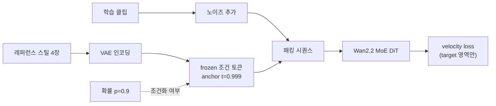
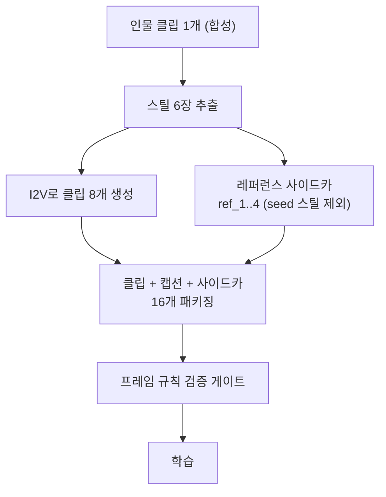

영상 생성 모델을 파인튜닝해 브랜드 마스코트나 가상 인물을 일관되게 등장시키고 싶은 엔지니어라면, 이 글에서 두 가지를 얻어 가실 수 있습니다. 상용 트레이너가 API 뒤에 감춰 둔 레퍼런스 조건 학습 레시피를 오픈 가중치 모델에 이식하는 구체적인 방법, 그리고 그 레시피가 identity를 얼마나 올리고 프롬프트 추종을 얼마나 깎는지에 대한 실측 곡선입니다.

*글의 핵심 개념을 형상화했습니다.*

## 왜 이 실험을 했는가

subject 일관성은 상업 영상 생성의 관문입니다. 광고 속 마스코트가 컷마다 다른 얼굴이면 쓸 수 없기 때문입니다. fal이 서비스하는 MiniMax H3 Ref2VA 트레이너는 이 문제를 잘 풉니다만, 학습 데이터를 외부 API로 보내야 합니다. 데이터 주권이 걸린 고객이라면 여기서 막힙니다. 그래서 질문을 뒤집었습니다. 같은 레시피를 고객이 통제하는 인프라 위에서, 오픈 가중치 모델로 재현할 수 있는가. 그리고 레시피의 어느 요소가 실제로 효과를 내는가.

레시피를 분해하면 다섯 요소가 나옵니다. 그중 이식의 핵심은 두 가지입니다. 레퍼런스 이미지를 VAE latent로 인코딩해 denoising 시퀀스 앞에 노이즈 없이 붙이고 loss에서 제외하는 것(M1), 그리고 매 샘플을 확률 p로만 조건화하고 나머지는 일반 학습으로 두는 것(M3)입니다. 대상 모델은 Diffusers 레이아웃의 Wan2.2 T2V A14B로 잡았습니다. 두 expert가 timestep 경계로 갈리는 MoE 구조입니다.

<!-- nlm-visual -->

*NotebookLM이 소스를 종합해 생성한 인포그래픽입니다.*

## 이식하며 발견한 계약 세 가지

문서에 없는 계약은 실제 아키텍처 클래스에서만 드러납니다. 저희는 GPU를 쓰기 전에 실제 config 클래스를 축소 인스턴스화한 스모크 하네스를 만들어 세 가지를 미리 잡았습니다.

첫째, Diffusers의 Wan transformer는 per-frame이 아니라 per-token timestep을 받습니다. 프레임당 하나가 아니라 patch 토큰당 하나, 그것도 frame-major 순서의 (batch, n_tokens) 텐서여야 합니다. 프레임 단위 텐서를 넣으면 조용히 기능 감지에 실패하고 broadcast로 떨어집니다. 둘째, bf16 체크포인트에서도 time_embedder와 scale_shift_table, norm 계층은 라이브러리 계약상 fp32로 남습니다. 일괄 bf16 강제는 modulation을 망가뜨립니다. 셋째, MoE 라우팅은 토큰이 아니라 스텝 단위입니다. 레퍼런스의 anchor timestep 0.999는 라우팅을 바꾸지 않고 timestep 임베딩의 태그로만 작동합니다. 대신 uniform 샘플링에서 high-noise expert가 전체 스텝의 12.5%만 받는 비대칭이 생깁니다. 단일 expert였던 원 레시피에는 없던 변수입니다.

## 데이터셋: 합성 인물로 초상권 없이

공개 가능한 실험을 위해 subject는 완전 합성 인물 두 명으로 만들었습니다. 생성 클립 하나에서 스틸 여섯 장을 뽑고, 그 스틸을 I2V로 애니메이션해 인물당 여덟 클립을 얻는 방식입니다. 전 과정이 사내 플랫폼 위에서 돌았고 실존 인물은 어디에도 없습니다. 학습 데이터 자체의 identity 자기유사도는 ArcFace 기준 0.712와 0.606으로, 이것이 학습이 도달할 수 있는 천장 참조값이 됩니다.

아래가 실제로 모델에 들어간 레퍼런스 스틸입니다. 뒤에 나오는 모든 생성 결과는 이 얼굴을 기준으로 비교하시면 됩니다.

*두 합성 인물의 레퍼런스 스틸. 학습과 추론 모두 이 이미지 4장을 조건으로 받습니다.*

## 결과: identity는 크게 얻고, 추종을 내준다

평가는 학습에 없던 낯선 맥락의 홀드아웃 프롬프트 20개로 했습니다. 해변, 도서관, 지하철 같은 새 배경에서 같은 인물이 유지되는지를 ArcFace로, 프롬프트를 따르는지를 CLIP-T로 쟀습니다. 게이트는 실험 전에 등록해 뒀습니다. identity가 베이스라인보다 0.10 이상 오를 것(G1), 프롬프트 추종 하락은 5% 이내일 것(G2)입니다.

레시피는 identity 약속을 지켰습니다. 본 실험(p=0.9, 800스텝)의 identity는 0.487로 베이스라인 0.286 대비 70% 상승했고, 사전 등록 기준의 두 배를 넘겼습니다. 프레임별 최악값도 마이너스에서 플러스로 올라왔습니다. 베이스라인은 가끔 인물을 아예 놓치지만 조건화 모델은 그러지 않습니다.

숫자보다 한 장이 빠릅니다. 아래는 레퍼런스 스틸(입력), 베이스라인 출력, 조건화 모델 출력을 같은 홀드아웃 프롬프트에서 나란히 놓은 것입니다.

*왼쪽이 학습에 들어간 레퍼런스, 가운데가 베이스라인, 오른쪽이 조건화 모델입니다. 베이스라인은 프롬프트(해변, 공원)는 잘 따르지만 얼굴이 다른 사람이 되고, 조건화 모델은 얼굴을 지키는 대신 배경이 학습 데이터 쪽으로 끌려갑니다. 아래에서 말할 트레이드오프가 이 한 장에 그대로 있습니다.*

영상으로도 확인하실 수 있습니다. 왼쪽이 베이스라인, 오른쪽이 레퍼런스 조건 모델입니다.

<video controls muted playsinline style="max-width:100%">
  <source src="{{ site.url }}{{ site.baseurl }}/assets/videos/posts/ref2va-compare-pa.mp4" type="video/mp4">
</video>

<video controls muted playsinline style="max-width:100%">
  <source src="{{ site.url }}{{ site.baseurl }}/assets/videos/posts/ref2va-compare-pb.mp4" type="video/mp4">
</video>

그러나 두 번째 게이트는 어느 운용점에서도 닫히지 않았습니다. identity 게이트를 통과한 모든 지점에서 CLIP-T가 11%에서 19% 떨어졌습니다. 추론 시 어댑터 강도를 1.0에서 0.7로 낮추면 추종이 일부 돌아오지만 identity도 함께 내려갑니다. 전선 위를 이동할 뿐 전선을 벗어나지 못한다는 뜻입니다.

p 스윕이 이 메커니즘의 성격을 알려 줍니다. 조건화를 100%로 올린 p=1.0에서는 오히려 identity가 무너지고 추종만 남았습니다. 원 레시피가 남겨 둔 10%의 무조건 학습이 장식이 아니라 레퍼런스 결합이 성립하기 위한 전제라는 것이 실측으로 확인된 셈입니다. identity 피크는 p=0.8에서 0.9 사이에 있습니다. 상용 서비스가 문서 한 줄로만 흘리던 권고의 근거 곡선을 이제 숫자로 갖게 됐습니다.

정리하면 이렇습니다. 16클립 규모의 합성 데이터셋에서 이 레시피는 대표 약속인 subject 일관성을 확실히 전달하고, 그 대가로 측정 가능한 프롬프트 추종 비용을 청구합니다. 그 거래가 수용 가능한지는 용도에 달렸고, 위 전선 그래프가 그 판단의 결정면입니다. 아직 안 해 본 완화책도 남아 있습니다. 텍스트 쪽 guidance 조정, p=0.85 재학습, expert 균형 학습 같은 것들이며 전부 미측정 상태로 명시해 둡니다.

## 어디에 쓰는 기술인가

이 기술의 수요처는 한 인물이나 캐릭터를 여러 클립에 걸쳐 계속 등장시켜야 하는 모든 곳입니다. 가장 뚜렷한 시장은 버추얼 인플루언서와 브랜드 마스코트입니다. 얼굴 스틸 십수 장으로 정체성을 학습해 두면 장면과 의상이 바뀌어도 같은 인물이 유지되어야 하는데, 실제로 버추얼 인플루언서 플랫폼들이 이 LoRA 학습 방식을 표준 워크플로로 문서화하고 있습니다. 캠페인 규모가 수십에서 수백 클립으로 커질수록 클립마다 정체성이 흔들리는 비용이 누적되므로, 학습으로 한 번 고정해 두는 가치가 커집니다.

에피소드형 콘텐츠도 같은 구조의 문제입니다. 웹툰이나 시리즈물을 영상화할 때 100화가 넘는 분량에서 캐릭터가 동일해야 하고, 이때 캐릭터 시트와 LoRA 앵커링을 결합하는 파이프라인이 쓰입니다. 얼굴이 아닌 대상에도 적용됩니다. 제품, 로고, 특정 아트 스타일, 나아가 캐릭터의 시그니처 동작까지 학습으로 바인딩할 수 있는데, 이 영역은 얼굴 임베딩에 특화된 zero-shot 방식이 상대적으로 약한 자리입니다. 그리고 실무적으로 무시할 수 없는 장점이 하나 더 있습니다. 학습을 마친 어댑터는 추론 때 레퍼런스 이미지가 필요 없습니다. 대량 생산 파이프라인에서 클립마다 레퍼런스 자산을 붙여 관리하는 오버헤드가 사라지고, 스타일 LoRA나 모션 LoRA와의 조합도 자유롭습니다.

## 학습 없이도 되는 시대에, 왜 학습인가

정직하게 말씀드리면, 2026년의 최신 영상 모델들은 학습 없이 레퍼런스 이미지만으로도 인물을 꽤 잘 유지합니다. Kling은 레퍼런스 정지 이미지를 넘어 짧은 레퍼런스 영상에서 얼굴과 몸을 추출하는 단계까지 왔고, Runway Gen-4의 References, Vidu의 reference-to-video도 같은 방향입니다. 오픈 가중치 쪽도 마찬가지여서 Wan 계열의 VACE, ByteDance의 Phantom과 MAGREF 같은 zero-shot 방법들이 공개 벤치마크(OpenS2V-Eval)에서 상용 중위권 모델과 대등한 점수를 냅니다. "학습 없이 레퍼런스로 계속 뽑아도 요즘은 인물이 잘 나온다"는 체감은 사실에 가깝습니다.

그래서 두 방식의 관계를 경쟁이 아니라 분업으로 읽는 것이 정확합니다. 일회성 클립, 빠른 반복, 학습할 시간이 없는 새 인물, 여러 인물이 한 장면에 나오는 멀티 subject 합성은 zero-shot이 편합니다. 반대로 한 정체성을 수백 클립 캠페인에 걸쳐 고정해야 할 때, 레퍼런스 한 장으로는 설명되지 않는 측면과 후면과 액션 포즈까지 커버해야 할 때, 대상이 얼굴이 아니라 제품이나 스타일이나 동작일 때, 그리고 추론 비용과 자산 관리를 대량 생산 기준으로 계산할 때는 학습이 남습니다. 참고로 라이선스도 변수입니다. 이 글의 출발점이었던 MiniMax H3와 Tencent Hunyuan 계열의 zero-shot 커스텀 모델은 커뮤니티 라이선스가 대한민국을 사용 지역에서 제외하고 있어, 국내에서 자가 호스팅 비교군이 되려면 Wan 계열처럼 Apache 라이선스인 모델이어야 합니다.

흥미로운 사실은 이 두 방식을 같은 베이스 모델, 같은 subject, 같은 평가로 통제 비교한 공개 연구가 아직 없다는 점입니다. 방법들끼리의 리더보드는 있어도 "학습이 zero-shot 대비 얼마를 더 주는가"를 직접 잰 곡선은 비어 있습니다. 마침 저희가 LoRA를 학습한 것과 정확히 같은 Wan2.2 베이스 위에 공식 zero-shot 레퍼런스 체크포인트(VACE)가 Apache 라이선스로 공개되어 있어서, 이 비교를 같은 하네스로 잴 수 있는 드문 위치에 있습니다.

## ThakiCloud 관점: 학습부터 서빙까지 데이터가 나가지 않는 파이프라인

이 실험이 회사 관점에서 증명한 것은 수치 하나가 아니라 경로 전체입니다. 데이터셋 생성(합성 인물 I2V), LoRA 학습(MoE 이식 계약 포함), 평가(ArcFace와 CLIP-T 게이트), 샘플 생성까지 전부 사내 GPU 클러스터의 잡으로 닫혔습니다. 고객의 subject 영상이 외부 API로 나갈 필요가 없다는 뜻입니다. Maxis가 이런 학습 파이프라인을 고객 데이터 주권 안에서 제공하는 계층이고, 학습된 어댑터를 얹어 서빙하는 자리가 Metis입니다. 상용 API의 편의성과 데이터 주권 사이에서 고르지 않아도 되는 선택지를 만드는 것, 그것이 이 재현 실험의 실용적인 결론입니다.

측정의 전 과정은 사전 등록 게이트와 결정론 평가 코드로 고정했고, 실패한 게이트도 그대로 보고했습니다. 다음 실험은 방금 말씀드린 그 비교입니다. 같은 Wan2.2 베이스에서 zero-shot 레퍼런스 조건화(VACE), 학습 LoRA, 그리고 같은 베이스라서 가능한 두 방식의 하이브리드를 동일한 홀드아웃 프롬프트와 동일한 게이트로 정면 비교해, "학습이 zero-shot 대비 얼마를 더 주는가"라는 비어 있는 곡선을 채울 예정입니다.

## 참고 자료

- [LoRA: Low-Rank Adaptation of Large Language Models](https://arxiv.org/abs/2106.09685) (이 실험이 재현한 어댑터 학습 방식의 원 논문)
- [Wan2.2: Open and Advanced Large-Scale Video Generative Models](https://github.com/Wan-Video/Wan2.2) (베이스로 쓴 T2V A14B와 timestep 경계로 갈리는 MoE 구조)
- [🤗 Diffusers](https://github.com/huggingface/diffusers) (per-token timestep을 받는 Wan transformer 구현. 이식 계약이 걸린 지점입니다)
- [VACE: All-in-One Video Creation and Editing](https://arxiv.org/abs/2503.07598) (Apache 라이선스로 공개된 zero-shot 레퍼런스 체크포인트)
- [MiniMax H3 Reference to Video LoRA Trainer on fal](https://fal.ai/models/minimax/h3/ref2va/trainer) (`reference_conditioning_p` 기본값 0.9. 저희 p 스윕의 기준점입니다)
- [Phantom: Subject-consistent video generation via cross-modal alignment](https://arxiv.org/abs/2502.11079) (본문에서 비교한 zero-shot 계열)
- [MAGREF: Masked Guidance for Any-Reference Video Generation with Subject Disentanglement](https://arxiv.org/abs/2505.23742) (같은 비교군)
- [OpenS2V-Nexus: A Detailed Benchmark and Million-Scale Dataset for Subject-to-Video Generation](https://arxiv.org/abs/2505.20292) (본문이 인용한 OpenS2V-Eval 벤치마크의 출처)
- [ArcFace: Additive Angular Margin Loss for Deep Face Recognition](https://arxiv.org/abs/1801.07698) (인물 유지 게이트에 쓴 지표)
- [Learning Transferable Visual Models From Natural Language Supervision](https://arxiv.org/abs/2103.00020) (CLIP 논문. 프롬프트 준수를 잰 CLIP-T의 출처)

<!-- nlm-visual -->

*NotebookLM이 소스를 종합해 생성한 인포그래픽입니다.*

## 관련 슬라이드

본문 내용을 NotebookLM(`doodle_collage` 스타일)으로 요약한 슬라이드입니다.

