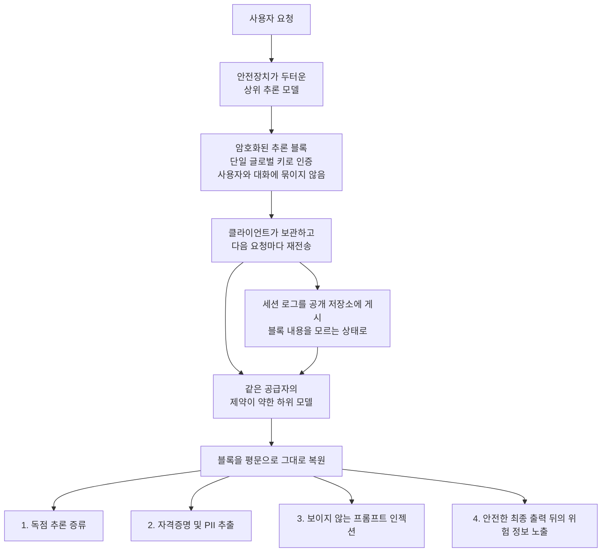

*봉인되어 있다는 것과 읽을 수 없다는 것은 같은 말이 아니었습니다.*

## 왜 읽어야 하나

LLM 에이전트를 운영하면서 세션 로그나 트레이스를 저장하거나 공개하는 팀, 그리고 그 로그의 보관 정책을 정해야 하는 보안 담당자를 위한 글입니다. 결론을 먼저 말씀드리면, API가 돌려주는 암호화된 추론 블록은 여러분의 통제 범위 밖에서 평문으로 복원될 수 있었고, 따라서 그 블록을 포함한 로그는 지금까지 암호문이 아니라 **지연된 평문**으로 취급했어야 합니다.

이 결함은 모델이 뚫린 것이 아니라 블록을 다루는 방식이 뚫린 것입니다. 그래서 프롬프트를 아무리 잘 짜도 막히지 않고, 반대로 로그 보관 정책 한 줄로 상당 부분이 막힙니다. 아래에서는 이 구조가 왜 그렇게 되어 있었는지, 그로부터 어떤 피해가 실제로 측정됐는지, 그리고 에이전트를 운영하는 팀이 오늘 무엇을 점검해야 하는지 정리합니다.

> 📄 **심층 리뷰 전문(DOCX)**: 이 논문의 상세 피어리뷰를 [Google Drive에서 다운로드](https://drive.google.com/file/d/1DCVHFJwh5UFaZYob2gZksfn9vK8Bm91y/view)할 수 있습니다.

## 개요

8월 10일 arXiv에 「Stealing Reasoning Traces from Proprietary LLM APIs」(arXiv:2608.09867)가 올라왔습니다. Alexander Panfilov, David Schmotz, Ilia Shumailov, Luca Beurer-Kellner, Joachim Schaeffer, Ameya Prabhu, Jonas Geiping, Maksym Andriushchenko 등 8명의 공저이고, 분류는 cs.CR과 cs.AI, cs.LG입니다.

배경은 이렇습니다. 프론티어 추론 모델은 최종 답변을 내기 전에 긴 내부 사고를 생성합니다. 공급자들은 이 사고 과정을 지식재산 보호와 정보 유출 방지를 이유로 사용자에게 감춥니다. 그런데 감추는 방식이 중요합니다. 서버에 저장해두고 식별자만 주는 대신, **암호화된 텍스트 블록으로 만들어 클라이언트에 돌려주고 클라이언트가 다음 요청마다 그대로 되돌려 보내게** 합니다. 상태를 서버에 두지 않아도 되니 확장성 측면에서 합리적인 선택입니다.

문제는 그 블록이 어디까지 통용되느냐입니다. 논문이 지적한 구조적 결함은 이 암호화 블록이 **세션과 사용자, 그리고 같은 공급자 생태계 안의 서로 다른 모델을 가로질러 완전히 호환되고 교체 가능하다**는 점입니다. 논문의 표현대로 공급자들은 모든 추론 블록을 암호화하고 인증하는 데 단일 글로벌 키를 쓰는 것으로 보입니다. 블록에 사용자 식별자나 대화 식별자가 묶여 있지 않다는 뜻입니다.

## 공격은 어떻게 작동하나

호환성이 곧 공격 표면이 됩니다. 강력하고 안전장치가 두터운 모델이 만든 블록을, 같은 공급자의 제약이 덜한 약한 모델에 밀어넣습니다. 그러면 그 약한 모델이 블록을 해독해 평문으로 그대로 출력합니다. 강한 모델을 직접 탈옥시키는 과정이 아예 없습니다. 논문은 이 방식이 Anthropic과 OpenAI, Google에서 모두 성립함을 보였습니다.

경제성도 짚어둘 만합니다. 논문은 Claude Haiku 4.5의 당시 표준 요금을 기준으로, 입력과 출력 창을 각각 1만 2천 토큰으로 잡고 트레이스 1만 건을 해독하면 명목 비용이 약 720달러라고 추산했습니다. 대규모 추출을 막는 것이 가격이 아니라는 뜻입니다.

*사용자나 세션에 묶이지 않은 단일 키가 이 모든 경로의 출발점입니다.*

## 네 가지 공격 경로

논문은 이 결함에서 네 갈래가 나온다고 정리합니다.

**첫째, 증류 방지 장치의 무력화입니다.** 공급자가 사고 과정을 감추는 주된 이유가 경쟁사의 증류를 막기 위해서인데, 이 경로는 그 목적을 정면으로 무너뜨립니다. 선행 연구가 대리 근사치를 복원해 Qwen2.5-7B-Instruct의 정확도를 68.4퍼센트에서 76.0퍼센트로 끌어올린 정도였다면, 이번에는 원본 사고를 그대로 회수합니다.

**둘째, 대규모 사생활 데이터 추출입니다.** 이 부분이 실무자에게 가장 직접적입니다. 개발자들은 디버깅이나 평가, 데이터셋 공개 목적으로 세션 로그를 자주 공개하는데, 그 안의 암호화 블록에 무엇이 들어 있는지는 보지 못합니다. 연구진이 공개 저장소에서 긁은 블록 315,320개를 해독하자 개인식별정보 367건과 자격증명 182건이 나왔습니다. 실제 사용자 세션에서만 추린 것으로 API 키 62개, 비밀번호 33개, 개인 이메일 30건이 포함됐습니다. 더 불편한 대목은 복원된 개인정보 일부가 **사용자 입력에 아예 없던 것**이었다는 점입니다. 모델의 메모리에서 사고 과정으로 흘러들어온 것입니다.

**셋째, 안전한 출력 뒤에 남는 위험 정보입니다.** 모델이 악의적 요청을 최종 답변에서 정상적으로 거절하더라도, 거절에 이르기까지의 사고 과정에는 그 내용이 남아 있을 수 있습니다. 사용자에게 보이는 출력만 검열하는 안전장치는 이 채널을 덮지 못합니다.

**넷째, 보이지 않는 프롬프트 인젝션입니다.** 악성 페이로드를 암호화 블록 안에 통째로 넣어두면, 그 블록을 이어받는 쪽에서는 육안으로 아무것도 보이지 않습니다. 공개된 에이전트 롤아웃을 오염시키는 경로가 됩니다. 트레이스를 공유해 재현성을 확보하는 관행이 그대로 공급망이 되는 셈입니다.

논문은 부수적으로 흥미로운 관찰도 남겼습니다. 해독한 Opus 4.8 사고 조각을 Kimi-K3와 GLM-5.2에 짧게 프리필하면 이후 사고와 최종 답변의 문체가 Opus 쪽으로 옮겨가는 반면, DeepSeek-V3.1과 Inkling에서는 비슷한 변화가 관찰되지 않았다는 내용입니다. 다만 저자들 스스로 이 결과를 "시사적이지만 결론을 내릴 수 없다"고 명시했습니다. 특정 모델이 특정 데이터로 학습됐다는 증거로 인용하기에는 이릅니다.

## 제안된 방어책

연구진은 주요 API 공급자와 Microsoft, Hugging Face에 사전 공유한 뒤 논문을 공개했고, 공급자들은 서버 측 완화 조치를 적용했습니다. 논문이 제안한 방향은 다섯 갈래입니다.

**구조 변경**은 가장 근본적입니다. 사고 과정을 서버에 저장하고 클라이언트에는 무작위 식별자만 넘기면 추출 페이로드 자체가 사라집니다. 대신 데이터베이스와 저장 비용이 늘고 API가 복잡해집니다.

**암호학적 컨텍스트 바인딩**은 무상태 구조를 유지하려는 경우의 선택지입니다. 사용자 식별자와 대화 식별자를 AEAD 페이로드 안에 직접 넣어 봉투를 원래 맥락에 묶는 방식입니다. 논문은 왜 이것이 처음부터 들어 있지 않았는지 의아하다는 논조로 적고 있습니다.

**공급자 측 폐기**는 이상 재생 패턴이 탐지되면 해당 서명이나 키를 무효화하는 운영적 방어입니다. 다만 이미 공개된 서명을 되돌리려면 서명 키 전체를 교체해야 하고, 그러면 정상적인 과거 세션의 이어하기도 함께 깨집니다. 기업 고객이 중단된 에이전트 워크플로를 재개해야 하는 현실을 고려해, 논문은 구형과 신형 봉투를 함께 받아주는 기간을 두고 일괄 재서명 엔드포인트를 제공하자고 제안합니다.

나머지 둘은 인프라 가드레일과 모델 수준 방어입니다.

## ThakiCloud 제품 적용 시사점

이 논문은 저희가 Paxis를 설계하며 세운 전제 하나를 정면으로 시험합니다.

**Paxis 관점**에서 보면, 이 사건의 본질은 에이전트의 실행 흔적이 곧 민감 자산이라는 것입니다. Paxis는 스킬과 도구, 정책, 감사 로그를 일급 리소스로 다루는 Agent-Native Cloud 제어 평면이고, 감사 로그를 남기는 일 자체가 설계의 중심에 있습니다. 그런데 이번 결함은 "남긴 로그를 누가 읽을 수 있는가"를 다시 묻게 합니다. 외부 API가 돌려준 불투명한 블록을 로그에 그대로 보존한다면, 그것은 우리 정책 게이트가 내용을 검사하지 못하는 데이터를 우리 저장소에 쌓는 일입니다. 실무적 함의는 분명합니다. 외부 공급자에서 온 불투명 블록은 별도 등급으로 분류해 보존 기간을 짧게 잡고, 트레이스를 외부와 공유하는 경로에서는 기본적으로 제거하는 편이 안전합니다. 정책 게이트가 통과시킬 수 없는 데이터는 정책 게이트가 막아야 할 데이터에 가깝습니다.

**Metis 관점**에서는 다른 각도가 보입니다. 이 취약점의 뿌리는 사고 과정을 클라이언트에 맡기는 무상태 설계였고, 그 설계를 택한 이유는 서버 상태 관리 비용이었습니다. 자체 호스팅 추론에서는 이 교환 조건 자체가 성립하지 않습니다. 모델과 추론 서버가 우리 경계 안에 있으면 사고 과정을 암호화해 외부로 내보낼 이유가 없고, 애초에 왕복시킬 필요도 없습니다. 온프레미스와 소버린 배포를 요구하는 고객이 자주 드는 근거가 데이터 주권인데, 이번 사례는 그 근거가 추상적 우려가 아니라 측정된 유출이었음을 보여줍니다. 통제 경계 안에서 도는 추론은 이런 유형의 공격 표면을 아예 만들지 않습니다.

*불투명 블록을 들여오는 경로와 애초에 내보내지 않는 경로의 차이입니다.*

두 관점이 만나는 지점은 하나입니다. 에이전트를 오래 돌릴수록 흔적이 쌓이고, 그 흔적을 어디에 두느냐가 곧 보안 설계입니다.

## 한계 및 반론

먼저 공급자들이 이미 대응했습니다. 책임 있는 공개 절차를 거쳤고 서버 측 완화가 적용됐으므로, 이 글을 읽고 같은 방식을 재현할 수 있다고 기대하시면 안 됩니다. 실무적으로 남는 위험은 앞으로의 공격이 아니라 **이미 공개되어 있는 과거 로그**입니다. 공개된 자료는 회수되지 않고, 소급 무효화는 정상 세션까지 함께 깨뜨립니다.

측정 범위에도 한계가 있습니다. 315,320개 블록은 공개 저장소에서 수집한 표본이고, 연구진 스스로 공개 트레이스보다 로컬 에이전트 기록이나 사내 서비스가 더 민감한 정보를 다룰 가능성이 높다고 적었습니다. 즉 공개 표본에서 나온 182건은 하한에 가깝습니다.

해독 품질도 균일하지 않았습니다. 논문은 GPT 계열에서 난독화된 사고가 상대적으로 자주 나타나고 해독 오류율이 높다고 보고합니다. 모든 블록이 깨끗한 평문으로 복원되는 것은 아닙니다.

마지막으로 반대편 논거도 짚어두겠습니다. 사고 과정을 아예 암호화하지 않고 공개하는 편이 낫다는 주장도 가능합니다. 감춰진 채널이 있기 때문에 안전 검열이 그 채널을 놓치는 것이고, 투명하게 노출하면 감시가 가능해집니다. 논문도 사고 과정을 암호화해야 하는지, 일회성으로 만들어야 하는지를 별도 절에서 논의합니다. 이 질문은 아직 열려 있습니다.

## 정리

암호화된 추론 블록은 여러분의 비밀이 아니었습니다. 봉투에 사용자와 대화가 묶여 있지 않아 공급자 생태계 안에서 자유롭게 옮겨 다녔고, 그래서 공개된 로그에 남은 블록은 언제든 평문으로 되돌아갈 수 있었습니다. 자격증명 182건은 그 결과였습니다.

당장 하실 일은 두 가지입니다. 하나, 조직이 공개했거나 커밋한 세션 로그와 평가 트레이스에 공급자 추론 블록이 들어 있는지 확인하십시오. 있다면 그 세션에서 다뤘던 키와 자격증명을 순환시키는 편이 안전합니다. 둘, 앞으로 트레이스를 저장하거나 공유하는 파이프라인에 불투명 블록 제거 단계를 넣으십시오. 이것은 공급자의 수정과 무관하게 우리 쪽에서 유지해야 하는 방어선입니다.

*소급 무효화가 불가능하므로 직접 교체가 유일한 대응입니다.*

더 넓게는 관점 하나를 바꿔둘 만합니다. 에이전트 로그는 디버깅 산출물이 아니라 민감 데이터입니다. 그렇게 분류해두면 다음에 비슷한 결함이 나와도 이미 대비가 되어 있습니다.

## 출처

- [Stealing Reasoning Traces from Proprietary LLM APIs (arXiv:2608.09867)](https://arxiv.org/abs/2608.09867)
- [논문 전문 HTML](https://arxiv.org/html/2608.09867v1)
- [HuggingFace Papers 페이지](https://huggingface.co/papers/2608.09867)
- [alphaXiv 토론 페이지](https://www.alphaxiv.org/abs/2608.09867)

본문의 수치와 인용은 2026년 8월 13일 arXiv API 메타데이터와 논문 전문에서 직접 확인한 값입니다.

> 📄 **심층 리뷰 전문(DOCX)**: 이 논문의 상세 피어리뷰를 [Google Drive에서 다운로드](https://drive.google.com/file/d/1DCVHFJwh5UFaZYob2gZksfn9vK8Bm91y/view)할 수 있습니다.
