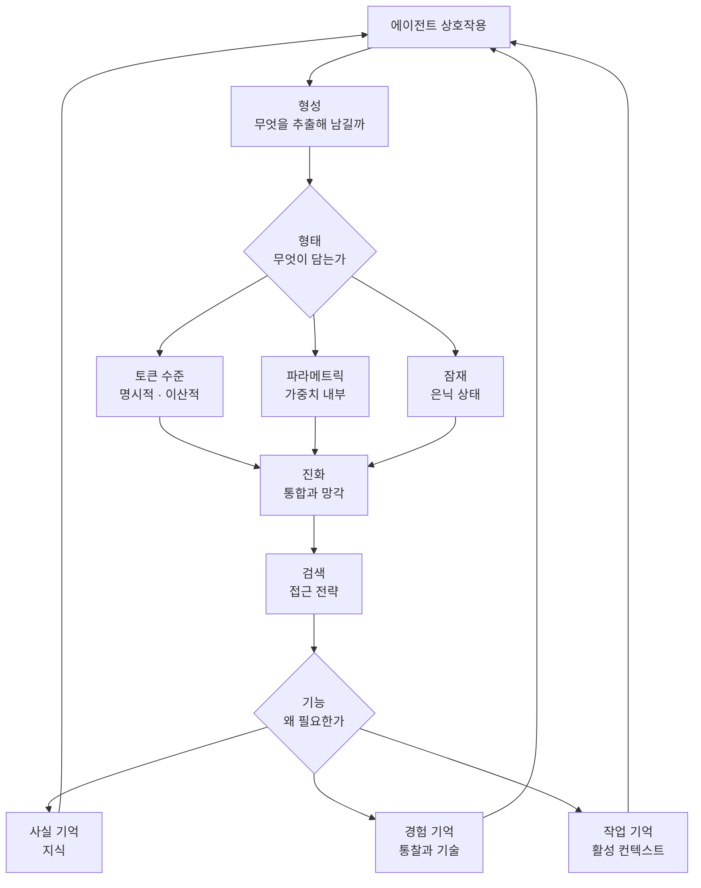

에이전트에 메모리를 붙이려는 엔지니어와 어떤 메모리 방식을 제품에 넣을지 정해야 하는 기술 의사결정자를 위한 글입니다. 이 글을 읽고 나면 에이전트 메모리 연구가 실제로 어디에 몰려 있고 어디가 비어 있는지, 그리고 그 분포가 지금 시스템을 설계할 때 무엇을 뜻하는지 알게 됩니다.

결론부터 말하겠습니다. 에이전트 메모리는 연구 주제가 넓어 보이지만 실제 논문 분포는 심하게 편중돼 있습니다. 공개된 목록 199편을 분류표에 올려 보니 72퍼센트가 토큰 수준이라는 한 칸에 몰려 있었고, 반대로 한 칸에는 논문이 단 한 편 있었습니다. 아래에서는 서베이가 제안한 분류 축을 설명하고, 그 축에 실제 논문을 집계한 결과를 근거로 이 편중이 무엇을 의미하는지 논증합니다.


*무엇을 남기고 무엇을 잊을지가 에이전트의 성능을 좌우하는 시대가 됐습니다.*

## 개요

에이전트 메모리를 다루는 대형 서베이가 최근 두 편 나왔습니다.

하나는 47명의 저자가 참여한 「Memory in the Age of AI Agents」입니다. 2025년 12월에 공개돼 Hugging Face 데일리 페이퍼 1위에 올랐고, 2026년 1월에 최근 연구를 반영한 개정판이 나왔습니다. 동반 저장소가 함께 운영되며 2026년 1월에 별 1천 개를 넘겼습니다.

다른 하나는 2026년 3월에 나온 「Memory for Autonomous LLM Agents」입니다. 2022년부터 2026년 초까지의 연구를 정리하면서 에이전트 메모리를 쓰기와 관리, 읽기가 지각 및 행동과 맞물려 도는 순환으로 정식화합니다.

두 서베이가 같은 문제의식에서 출발한다는 점이 흥미롭습니다. 연구가 폭발적으로 늘었는데 용어가 느슨하게 정의돼 분야가 파편화됐다는 진단입니다. 첫 번째 서베이는 장기 기억과 단기 기억이라는 전통적 분류가 오늘날의 다양성을 담기에 부족하다고 명시합니다. 실제로 같은 이름을 붙인 두 시스템이 전혀 다른 일을 하는 경우가 흔합니다.

그래서 이 글은 두 서베이가 제안한 분류를 소개하는 데서 그치지 않습니다. 분류표를 받아 실제 논문을 그 칸에 넣어 세어 봤습니다.

## 이 서베이는 무엇을 제안하는가

첫 번째 서베이는 먼저 범위를 긋습니다. 에이전트 메모리를 LLM 메모리, 검색 증강 생성, 컨텍스트 엔지니어링과 구분합니다. 이 구분이 실무에서 중요한 이유는 분명합니다. 벡터 데이터베이스를 붙였다고 에이전트에 메모리가 생기는 것은 아니기 때문입니다. 검색 증강 생성은 외부 지식을 질의 시점에 끌어오는 기법이고, 에이전트 메모리는 상호작용을 가로질러 무엇을 남기고 무엇을 버릴지를 스스로 관리하는 문제입니다.

그 위에서 세 가지 렌즈를 제시합니다.

형태는 무엇이 기억을 담느냐를 묻습니다. 토큰 수준은 명시적이고 이산적인 형태로, 텍스트나 구조화된 레코드로 저장합니다. 파라메트릭은 가중치 안에 암묵적으로 담는 방식입니다. 잠재는 은닉 상태에 담습니다.

기능은 에이전트가 왜 기억이 필요한지를 묻습니다. 사실 기억은 지식이고, 경험 기억은 통찰과 기술이며, 작업 기억은 활성 컨텍스트 관리입니다. 시간 길이로 나누던 관행에서 벗어나 목적으로 나눈 것이 이 축의 요점입니다.

동역학은 기억이 어떻게 변하는지를 봅니다. 형성은 추출이고, 진화는 통합과 망각이며, 검색은 접근 전략입니다.



두 번째 서베이는 축을 다르게 잡습니다. 시간 범위와 표현 기질, 제어 정책이라는 세 차원을 쓰고, 메커니즘을 다섯 계열로 나눠 깊이 다룹니다. 컨텍스트 상주 압축, 검색 증강 저장소, 반성적 자기 개선, 계층적 가상 컨텍스트, 정책 학습 관리입니다. 평가 쪽에서는 정적 회상 벤치마크에서 다중 세션 에이전트 시험으로 넘어가는 흐름을 짚으면서, 기억과 의사결정을 뒤섞어 시험하는 최근 벤치마크 네 개가 현재 시스템의 완고한 결함을 드러낸다고 지적합니다.

두 축을 나란히 놓으면 겹치는 부분과 갈리는 부분이 보입니다. 표현 기질과 형태는 사실상 같은 것을 다르게 부른 것이고, 제어 정책은 동역학의 진화와 검색에 대응합니다. 반면 두 번째 서베이의 시간 범위 축은 첫 번째 서베이가 의도적으로 버린 축입니다. 같은 해에 나온 두 정리가 이 지점에서 정면으로 갈린다는 사실 자체가 이 분야가 아직 합의에 이르지 못했다는 증거입니다.

## 분류표에 논문을 실제로 올려 봤습니다

분류가 유용한지 보려면 실제 연구를 그 칸에 넣어 보면 됩니다. 첫 번째 서베이의 동반 저장소는 논문 목록을 기능과 형태의 격자로 정리해 관리합니다. 이 목록을 받아 항목을 칸별로 셌습니다.

```python
FUNC_RE = re.compile(r"^###\s+(.+?)\s*$")     # 기능: 사실 / 경험 / 작업
FORM_RE = re.compile(r"^####\s+(.+?)\s*$")    # 형태: 토큰 / 파라메트릭 / 잠재
ENTRY_RE = re.compile(r"^\-\s*\[(\d{4})/(\d{2})\]")
```

2026년 8월 14일 기준 집계 결과는 다음과 같습니다. 총 199편입니다.

| 기능 | 토큰 수준 | 파라메트릭 | 잠재 | 합계 |
|---|---|---|---|---|
| 사실 기억 | 84 | 16 | 8 | 108 |
| 경험 기억 | 46 | 6 | 1 | 53 |
| 작업 기억 | 14 | 2 | 22 | 38 |
| 합계 | 144 | 24 | 31 | 199 |


*밝을수록 논문이 많은 칸입니다. 오른쪽 가운데 칸은 거의 비어 있습니다.*

세 가지가 눈에 띕니다.

첫째, 토큰 수준이 144편으로 전체의 72퍼센트입니다. 명시적 텍스트나 구조화된 레코드로 기억을 저장하는 방식이 압도적입니다. 이유는 짐작하기 어렵지 않습니다. 구현이 쉽고, 사람이 읽을 수 있어 디버깅이 되며, 기존 검색 스택을 그대로 재사용할 수 있습니다. 사실 기억과 토큰 수준이 만나는 칸 하나가 84편으로 전체의 42퍼센트를 차지합니다.

둘째, 작업 기억에서만 순서가 뒤집힙니다. 다른 두 기능에서는 토큰 수준이 압도적인데 작업 기억에서는 잠재가 22편으로 토큰 수준 14편을 앞섭니다. 활성 컨텍스트를 다루는 문제는 애초에 모델 내부 상태의 문제이기 때문일 것입니다. 컨텍스트 압축이나 KV 캐시 관리처럼 은닉 상태를 직접 건드리는 접근이 자연스러운 영역입니다.

셋째, 가장 흥미로운 것은 빈칸입니다. 경험 기억을 잠재 표현으로 다루는 연구가 199편 중 단 1편입니다. 에이전트가 겪은 일에서 얻은 통찰과 기술을 명시적 텍스트가 아니라 은닉 상태로 담는 방향이 거의 탐색되지 않았다는 뜻입니다. 파라메트릭까지 합쳐도 경험 기억의 비명시적 표현은 7편에 그칩니다.

시간 분포도 함께 봤습니다. 목록에 담긴 항목은 2025년 하반기에 집중돼 있으며 2025년 10월이 23편으로 가장 많습니다. 이 분야가 최근 1년 사이에 급격히 커졌다는 서베이의 진단과 맞습니다.

측정의 한계를 밝혀 둡니다. 이 집계는 서베이 본문이 아니라 동반 저장소 목록을 센 것이며, 목록은 커뮤니티 기여로 계속 갱신됩니다. 따라서 수치는 오늘 시점의 스냅숏이고 논문 본문의 분류와 완전히 일치한다고 보장할 수 없습니다. 다만 같은 팀이 같은 분류 체계로 관리하는 목록이므로 분포의 방향성을 읽기에는 충분합니다.

## ThakiCloud 제품 적용 시사점

이 분포는 에이전트 플랫폼을 만드는 입장에서 실질적인 함의를 갖습니다.

Paxis는 ThakiCloud의 Agent-Native Cloud 제어 평면으로 스킬과 도구, 정책, 감사 로그를 일급 리소스로 다룹니다. 그 구조에서 메모리는 별도 기능이 아니라 스킬 선택과 실행 이력이 쌓이는 층입니다. 위 집계를 우리 설계에 비추면 몇 가지가 정리됩니다.

토큰 수준이 압도적이라는 사실은 안심할 근거가 됩니다. 명시적이고 사람이 읽을 수 있는 메모리는 감사 가능성과 직결됩니다. 은닉 상태에 담긴 기억은 나중에 무엇이 왜 기억됐는지 설명하기 어렵습니다. 정책 게이트와 감사 로그를 전제로 하는 환경에서는 명시적 표현이 규제 대응 면에서 유리하며, 다행히 연구 다수가 그쪽에 있습니다.

작업 기억에서 잠재 표현이 우세하다는 점은 반대 방향의 신호입니다. 긴 컨텍스트를 다루는 부분은 애플리케이션 층이 아니라 추론 층에서 풀리는 문제일 가능성이 큽니다. 즉 컨텍스트 압축과 캐시 관리는 에이전트 프레임워크가 아니라 서빙 스택이 책임져야 할 영역에 가깝습니다. ai-platform이 vLLM 계열 서빙을 다루는 층에서 이 문제를 흡수하고, 그 위의 Paxis는 사실과 경험 기억에 집중하는 분업이 연구 분포와도 맞아떨어집니다.

경험 기억의 빈칸은 기회이자 경고입니다. 에이전트가 실패에서 배우고 그 교훈을 다음 실행에 반영하는 부분은 우리가 스킬 진화와 회고 루프로 다루는 영역인데, 연구 커뮤니티에서도 명시적 표현 46편 대 비명시적 7편으로 명시적 방식이 지배적입니다. 검증된 방법이 적다는 뜻이므로 지금 시점에 은닉 상태 기반 경험 축적을 제품에 넣는 것은 위험합니다. 텍스트로 남기고 코드가 관리하는 방식이 현재로서는 합리적인 선택입니다.

두 번째 서베이가 언급하는 엔지니어링 현실도 그대로 우리 문제입니다. 쓰기 경로 필터링과 모순 처리, 지연 시간 예산, 프라이버시 거버넌스를 꼽는데 네 가지 모두 멀티테넌트 환경에서 즉시 부딪히는 항목입니다. 특히 모순 처리는 오래 도는 에이전트에서 반드시 나타납니다. 어제 참이던 사실이 오늘 거짓이 됐을 때 무엇을 남길지에 관한 규칙이 없으면 메모리는 시간이 갈수록 신뢰도가 떨어집니다.

## 한계 및 반론

서베이를 읽는 방식 자체에 주의가 필요합니다.

분류표는 연구를 정리하는 도구이지 설계도가 아닙니다. 어떤 칸에 논문이 많다는 것이 그 방식이 우월하다는 뜻은 아닙니다. 앞서 적었듯 토큰 수준이 많은 이유에는 구현이 쉽다는 요인이 크게 작용합니다. 연구량은 난이도와 접근성의 함수이지 효과의 함수가 아닙니다. 마찬가지로 빈칸이 곧 기회라는 해석도 성급합니다. 그 방향이 어렵거나 잘 되지 않아서 비어 있을 수도 있습니다.

두 서베이가 축을 다르게 잡았다는 사실도 양날입니다. 이 글은 첫 번째 서베이의 격자로 집계했는데, 두 번째 서베이의 축으로 같은 논문을 분류하면 다른 그림이 나올 수 있습니다. 어느 분류가 옳은지 판정할 기준은 아직 없습니다.

그리고 서베이는 정의상 뒤를 봅니다. 두 편 모두 2026년 초까지의 연구를 담고 있으며, 목록의 항목도 2025년 하반기에 몰려 있습니다. 이 분야의 변화 속도를 생각하면 지금 가장 앞선 연구는 아직 어느 분류표에도 올라가 있지 않을 가능성이 높습니다.

마지막으로 두 서베이가 공통으로 지적하는 부분을 옮겨 둡니다. 평가가 아직 약합니다. 정적 회상 벤치마크는 메모리 시스템의 실제 가치를 재지 못하고, 다중 세션 에이전트 시험으로 넘어가면 현재 시스템의 결함이 드러납니다. 벤치마크 점수를 근거로 메모리 방식을 고르기에는 이른 시점입니다.

## 정리

에이전트 메모리는 이름이 하나지만 실제로는 서로 다른 여러 문제입니다. 두 서베이가 제안한 분류는 그 문제들을 갈라 보게 해 주고, 실제 논문 199편을 그 칸에 넣어 보면 연구가 어디에 몰려 있는지가 수치로 드러납니다. 토큰 수준에 72퍼센트, 사실 기억과 토큰 수준이 만나는 한 칸에만 42퍼센트가 있습니다.

그래서 지금 메모리를 붙이려는 팀이 취할 자세는 분명합니다. 검증된 방법이 많은 쪽, 즉 명시적 텍스트 기반 사실 기억부터 시작하는 것이 합리적입니다. 감사와 디버깅이 되고 연구 축적도 두텁습니다. 활성 컨텍스트 관리는 직접 만들기보다 서빙 스택이 제공하는 기능에 맡기는 편이 낫습니다. 경험 기억은 텍스트로 남기고 규칙은 코드가 소유하되, 은닉 상태로 옮기는 시도는 아직 실험으로만 두는 것이 안전합니다.

다음에 메모리 라이브러리를 고를 일이 생기면 기능 목록을 보기 전에 이 질문을 먼저 하십시오. 이 도구는 사실과 경험과 작업 기억 중 무엇을 다루며, 그것을 토큰과 파라메트릭과 잠재 중 무엇으로 담는가. 두 질문에 답하고 나면 비교할 대상이 훨씬 줄어듭니다.

## 출처

- [Memory in the Age of AI Agents (arXiv:2512.13564)](https://arxiv.org/abs/2512.13564)
- [Memory for Autonomous LLM Agents (arXiv:2603.07670)](https://arxiv.org/abs/2603.07670)
- [Agent-Memory-Paper-List 동반 저장소](https://github.com/Shichun-Liu/Agent-Memory-Paper-List)
- 집계 스크립트와 로그: `scripts/experiments/agent-memory-survey/`, `outputs/blog-impl/agent-memory-survey-2026/run-1.log`
